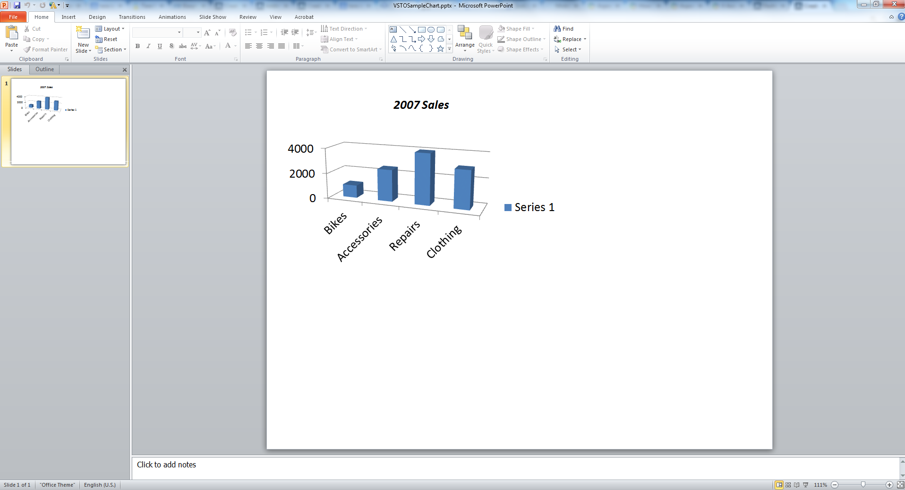
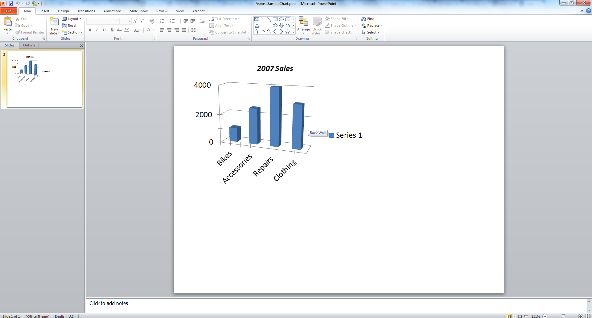

{} 

 Charts are visual representations of data that are widely used in presentations. This article shows the code for create a chart in Microsoft PowerPoint programmatically by using [VSTO](/slides/java/create-a-chart-in-a-microsoft-powerpoint-presentation/) and [Aspose.Slides for Java](/slides/java/create-a-chart-in-a-microsoft-powerpoint-presentation/).

{} 
## **Creating a Chart**
The code examples below describe the process of adding a simple 3D clustered column chart using VSTO. You create a presentation instance, add a default chart to it. Then use Microsoft Excel workbook to access and modify chart data along with setting chart properties. Lastly, save the presentation.
### **VSTO Example**
Using VSTO, the following steps are performed:

1. Create an instance of a Microsoft PowerPoint presentation.
1. Add a blank slide to the presentation.
1. Add a **3D clustered column** chart and access it.
1. Create a new Microsoft Excel Workbook instance and load chart data.
1. Access the chart data worksheet using Microsoft Excel Workbook instancefromworkbook.
1. Set the chart range in the worksheet and remove series 2 and 3 from the chart.
1. Modify the chart category data in the chart data worksheet.
1. Modify chart series 1 data in the chart data worksheet.
1. Now, access the chart title and setthefontrelatedproperties.
1. Access the chart value axis and set the major unit, minor units, max value and min values.
1. Access the chart depth or series axis and remove that as in this example, onlyoneserieisused.
1. Now, set the chart rotation angles in X and Y direction.
1. Save the presentation.
1. Close the instances of Microsoft Excel and PowerPoint.

**The output presentation, created with VSTO** 




### **Aspose.Slides for Java Example**
Using Aspose.Slides for Java, the following steps are performed:

1. Create an instance of a Microsoft PowerPoint presentation.
1. Add a blank slide to the presentation.
1. Add a **3D clustered column** chart and access that.
1. Access the chart data worksheet using a Microsoft Excel Workbook instancefromworkbook.
1. Remove unused series 2 and 3.
1. Access chart categories and modify the labels.
1. Accesseries1 and modify the series values.
1. Now, access the chart title and set the font properties.
1. Access the chart value axis and set the major unit, minor units, max value and min values.
1. Now, set the chart rotation angles in X and Y direction.
1. Save the presentation to PPTX format.

**The output presentation, created with Aspose.Slides** 



## **FAQ**

**Can I create other types of charts like pie, line, or bar charts with Aspose.Slides?**

Yes. Aspose.Slides supports a wide range of [chart types](/slides/java/create-chart/), including pie charts, line charts, bar charts, scatter plots, bubble charts, and more. You can specify the desired chart type using the [ChartType](https://reference.aspose.com/slides/java/com.aspose.slides/charttype/) class when adding a chart.

**Can I apply custom styles or themes to the chart?**

Yes. You can fully customize the chart’s appearance, including colors, fonts, fills, outlines, gridlines, and layout. However, applying Office themes exactly as seen in PowerPoint requires manually setting individual styles.

**Can I export the chart as an image separately from the slide?**

Yes, Aspose.Slides allows you to export any shape—including charts—as a separate image (e.g., PNG, JPEG) using the `getImage` method on the chart [shape](https://reference.aspose.com/slides/java/com.aspose.slides/shape/).
