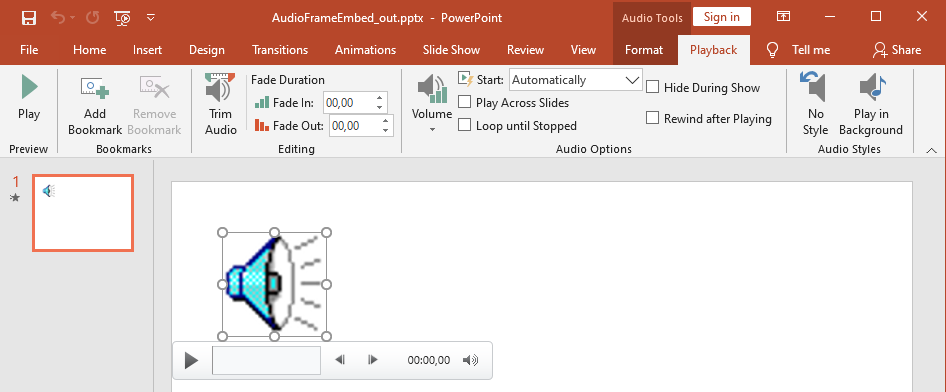

## **Create Audio Frames**

Aspose.Slides for Java allows you to add audio files to slides. The audio files are embedded in slides as audio frames. 

1. Create an instance of the [Presentation](https://reference.aspose.com/slides/java/com.aspose.slides/Presentation) class.
2. Get a slide's reference through its index.
3. Load the audio file stream you want to embed in the slide.
4. Add the embedded audio frame (containing the audio file) to the slide.
5. Set [PlayMode](https://reference.aspose.com/slides/java/com.aspose.slides/AudioPlayModePreset) and `Volume` exposed by the [IAudioFrame](https://reference.aspose.com/slides/java/com.aspose.slides/IAudioFrame) object.
6. Save the modified presentation.

This Java code shows you how to add an embedded audio frame to a slide:

```java
// Instantiates a Presentation class that represents a presentation file
Presentation pres = new Presentation();
try {
    // Gets the first slide
    ISlide sld = pres.getSlides().get_Item(0);

    // Loads the wav sound file to stream
    FileInputStream fstr = new FileInputStream(new File("audio.wav"));

    // Adds the Audio Frame
    IAudioFrame audioFrame = sld.getShapes().addAudioFrameEmbedded(50, 150, 100, 100, fstr);
    fstr.close();
    
    // Sets the Play Mode and Volume of the Audio
    audioFrame.setPlayMode(AudioPlayModePreset.Auto);
    audioFrame.setVolume(AudioVolumeMode.Loud);

    // Writes the PowerPoint file to disk
    pres.save("AudioFrameEmbed_out.pptx", SaveFormat.Pptx);
} catch(IOException e) {
} finally {
    if (pres != null) pres.dispose();
}
```

## **Change Audio Frame Thumbnail**

When you add an audio file to a presentation, the audio appears as a frame with a standard default image (see the image in the section below). You change the audio frame's preview image (set your preferred image).

This Java code shows you how to change an audio frame's thumbnail or preview image:

```java
Presentation presentation = new Presentation();
try {
    ISlide slide = presentation.getSlides().get_Item(0);

    // Adds an audio frame to the slide with a specified position and size.
    FileInputStream audioStream = new FileInputStream("sample2.mp3");
    IAudioFrame audioFrame = slide.getShapes().addAudioFrameEmbedded(150, 100, 50, 50, audioStream);
    audioStream.close();

    // Adds an image to presentation resources.
    IPPImage picture;
    IImage image = Images.fromFile("eagle.jpeg");
    try {
        picture = presentation.getImages().addImage(image);
    } finally {
        if (image != null) image.dispose();
    }

    // Sets the image for the audio frame.
    audioFrame.getPictureFormat().getPicture().setImage(picture); // <-----

    //Saves the modified presentation to disk
    presentation.save("example_out.pptx", SaveFormat.Pptx);
} catch(IOException e) {
} finally {
    if (presentation != null) presentation.dispose();
}
```

## **Change Audio Play Options**

Aspose.Slides for Java allows you to change options that control an audio's playback or properties. For example, you can adjust an audio's volume, set the audio to play looped, or even hide the audio icon.

The **Audio Options** pane in Microsoft PowerPoint:



PowerPoint **Audio Options** that correspond to Aspose.Slides [AudioFrame](https://reference.aspose.com/slides/java/com.aspose.slides/AudioFrame) properties:

- **Start** drop-down list matches the [AudioFrame.setPlayMode](https://reference.aspose.com/slides/java/com.aspose.slides/audioframe/#setPlayMode-int-) method
- **Volume** matches the [AudioFrame.setVolume](https://reference.aspose.com/slides/java/com.aspose.slides/audioframe/#setVolume-int-) method
- **Play Across Slides** matches the [AudioFrame.setPlayAcrossSlides](https://reference.aspose.com/slides/java/com.aspose.slides/audioframe/#setPlayAcrossSlides-boolean-) method
- **Loop until Stopped** matches the [AudioFrame.setPlayLoopMode](https://reference.aspose.com/slides/java/com.aspose.slides/audioframe/#setPlayLoopMode-boolean-) method
- **Hide During Show** matches the [AudioFrame.setHideAtShowing](https://reference.aspose.com/slides/java/com.aspose.slides/audioframe/#setHideAtShowing-boolean-) method
- **Rewind after Playing** matches the [AudioFrame.setRewindAudio](https://reference.aspose.com/slides/java/com.aspose.slides/audioframe/#setRewindAudio-boolean-) method

PowerPoint **Editing** options that correspond to Aspose.Slides [AudioFrame](https://reference.aspose.com/slides/java/com.aspose.slides/AudioFrame) properties:

- **Fade In** matches the [AudioFrame.setFadeInDuration](https://reference.aspose.com/slides/java/com.aspose.slides/audioframe/#setFadeInDuration-float-) method 
- **Fade Out** matches the [AudioFrame.setFadeOutDuration](https://reference.aspose.com/slides/java/com.aspose.slides/audioframe/#setFadeOutDuration-float-) method 
- **Trim Audio Start Time** matches the [AudioFrame.setTrimFromStart](https://reference.aspose.com/slides/java/com.aspose.slides/audioframe/#setTrimFromStart-float-) method 
- **Trim Audio End Time** value equals the audio duration minus the value of [AudioFrame.setTrimFromEnd](https://reference.aspose.com/slides/java/com.aspose.slides/audioframe/#setTrimFromEnd-float-) method

The PowerPoint **Volume controll** on the audio control panel corresponds to the [AudioFrame.setVolumeValue](https://reference.aspose.com/slides/java/com.aspose.slides/audioframe/#setVolumeValue-float-) method. It lets you change the audio volume as a percentage.

This is how you change the Audio Play options:

1. [Сreate](#create-audio-frame) or get the Audio Frame.
2. Set new values for the Audio Frame properties you want to adjust.
3. Save the modified PowerPoint file.

This Java code demonstrates an operation in which an audio's options are adjusted:

```java 
Presentation pres = new Presentation("AudioFrameEmbed_out.pptx");
try {
    // Gets the AudioFrame shape
    AudioFrame audioFrame = (AudioFrame)pres.getSlides().get_Item(0).getShapes().get_Item(0);

    // Sets the Play mode to play on click
    audioFrame.setPlayMode(AudioPlayModePreset.OnClick);

    // Sets the volume to Low
    audioFrame.setVolume(AudioVolumeMode.Low);

    // Sets the audio to play across slides
    audioFrame.setPlayAcrossSlides(true);

    // Disables loop for the audio
    audioFrame.setPlayLoopMode(false);

    // Hides the AudioFrame during the slide show
    audioFrame.setHideAtShowing(true);

    // Rewinds the audio to start after playing
    audioFrame.setRewindAudio(true);

    // Saves the PowerPoint file to disk
    pres.save("AudioFrameEmbed_changed.pptx", SaveFormat.Pptx);
} finally {
    if (pres != null) pres.dispose();
}
```

This Java example shows how to add a new audio frame with embedded audio, trim it, and set the fade durations:

```java
Presentation pres = new Presentation();
try {
    ISlide slide = pres.getSlides().get_Item(0);
    
    byte[] audioData = Files.readAllBytes(Paths.get("sampleaudio.mp3"));
    IAudio audio = pres.getAudios().addAudio(audioData);
    IAudioFrame audioFrame = slide.getShapes().addAudioFrameEmbedded(50, 50, 100, 100, audio);

    // Sets the trimming start offset to 1.5 seconds
    audioFrame.setTrimFromStart(1500f);
    // Sets the trimming end offset to 2 seconds
    audioFrame.setTrimFromEnd(2000f);

    // Sets the fade-in duration to 200 ms
    audioFrame.setFadeInDuration(200f);
    // Sets the fade-out duration to 500 ms
    audioFrame.setFadeOutDuration(500f);

    pres.save("AudioFrameTrimFade_out.pptx", SaveFormat.Pptx);
} finally {
    pres.dispose();
}
```

The following code sample shows how to retrieve an audio frame with embedded audio and set its volume to 85%:

```java
Presentation pres = new Presentation("AudioFrameEmbed_out.pptx");
try {
    ISlide slide = pres.getSlides().get_Item(0);

    // Gets an audio frame shape
    IAudioFrame audioFrame = (IAudioFrame)slide.getShapes().get_Item(0);

    // Sets the audio volume to 85%
    audioFrame.setVolumeValue(85f);

    pres.save("AudioFrameValue_out.pptx", SaveFormat.Pptx);
}
finally {
    pres.dispose();
}
```

## **Extract Audio**

Aspose.Slides for Java allows you to extract the sound used in slide show transitions. For example, you can extract the sound used in a specific slide.

1. Create an instance of the [Presentation](https://reference.aspose.com/slides/java/com.aspose.slides/Presentation) class and load the presentation containing the audio.
2. Get the relevant slide's reference through its index.
3. Access the [slideshow transitions](https://reference.aspose.com/slides/java/com.aspose.slides/IBaseSlide#getSlideShowTransition--) for the slide.
4. Extract the sound in byte data.

This code in Java shows you how to extract the audio used in a slide:

```java
// Instantiates a Presentation class that represents a presentation file
Presentation pres = new Presentation("AudioSlide.pptx");
try {
    // Accesses the desired slide
    ISlide slide = pres.getSlides().get_Item(0);
    
    // Gets the slideshow transition effects for the slide
    ISlideShowTransition transition = slide.getSlideShowTransition();
    
    //Extracts the sound in byte array
    byte[] audio = transition.getSound().getBinaryData();
    System.out.println("Length: " + audio.length);
} finally {
    if (pres != null) pres.dispose();
}
```
