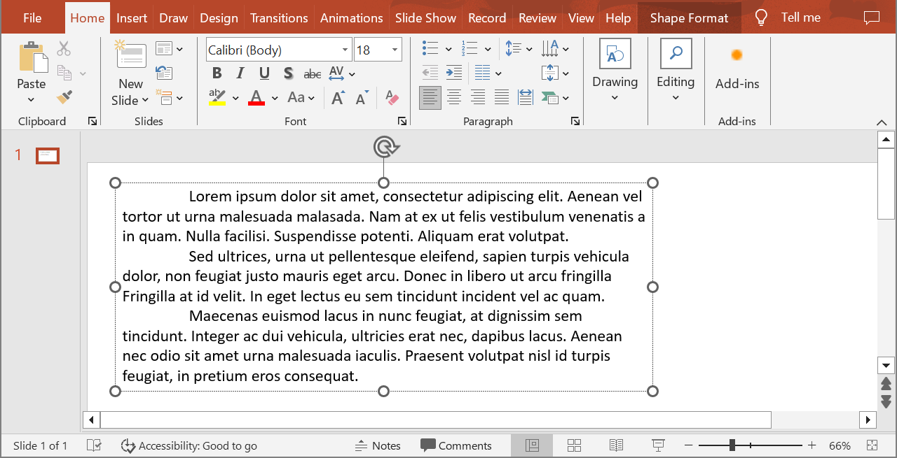
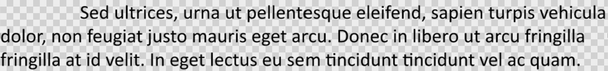

Aspose.Slides provides all the interfaces and classes you need to work with PowerPoint texts, paragraphs, and portions in Java.

* Aspose.Slides provides the [ITextFrame](https://reference.aspose.com/slides/java/com.aspose.slides/itextframe/) interface to allow you to add objects that represent a paragraph. An `ITextFame` object can have one or multiple paragraphs (each paragraph is created through a carriage return).
* Aspose.Slides provides the [IParagraph](https://reference.aspose.com/slides/java/com.aspose.slides/iparagraph/) interface to allow you to add objects that represent portions. An `IParagraph` object can have one or multiple portions (collection of iPortions objects).
* Aspose.Slides provides [IPortion](https://reference.aspose.com/slides/java/com.aspose.slides/iportion/) interface to allow you to add objects that represent texts and their formatting properties. 

An `IParagraph` object is capable of handling texts with different formatting properties through its underlying `IPortion` objects.

## **Add Multiple Paragraph Containing Multiple Portions**

These steps show you how to add a text frame containing 3 paragraphs and each paragraph containing 3 portions:

1. Create an instance of the [Presentation](https://reference.aspose.com/slides/java/com.aspose.slides/presentation/) class.
2. Access the relevant slide's reference through its index.
3. Add a Rectangle [IAutoShape](https://reference.aspose.com/slides/java/com.aspose.slides/iautoshape/) to the slide.
4. Get the ITextFrame associated with the [IAutoShape](https://reference.aspose.com/slides/java/com.aspose.slides/iautoshape/).
5. Create two [IParagraph](https://reference.aspose.com/slides/java/com.aspose.slides/iparagraph/) objects and add them to the `IParagraphs` collection of the [ITextFrame](https://reference.aspose.com/slides/java/com.aspose.slides/itextframe/).
6. Create three [IPortion](https://reference.aspose.com/slides/java/com.aspose.slides/iportion/) objects for each new `IParagraph` (two Portion objects for default Paragraph) and add each `IPortion` object to the IPortion collection of each `IParagraph`.
7. Set some text for each portion.
8. Apply your preferred formatting features to each portion using the formatting properties exposed by the `IPortion` object.
9. Save the modified presentation.

This Java code is an implementation of the steps for adding paragraphs containing portions:

```java
// Instantiate a Presentation class that represents a PPTX file
Presentation pres = new Presentation();
try {
    // Accessing first slide
    ISlide slide = pres.getSlides().get_Item(0);

    // Add an AutoShape of Rectangle type
    IAutoShape ashp = slide.getShapes().addAutoShape(ShapeType.Rectangle, 50, 150, 300, 150);

    // Access TextFrame of the AutoShape
    ITextFrame tf = ashp.getTextFrame();

    // Create Paragraphs and Portions with different text formats
    IParagraph para0 = tf.getParagraphs().get_Item(0);
    IPortion port01 = new Portion();
    IPortion port02 = new Portion();
    para0.getPortions().add(port01);
    para0.getPortions().add(port02);

    IParagraph para1 = new Paragraph();
    tf.getParagraphs().add(para1);
    IPortion port10 = new Portion();
    IPortion port11 = new Portion();
    IPortion port12 = new Portion();
    para1.getPortions().add(port10);
    para1.getPortions().add(port11);
    para1.getPortions().add(port12);

    IParagraph para2 = new Paragraph();
    tf.getParagraphs().add(para2);
    IPortion port20 = new Portion();
    IPortion port21 = new Portion();
    IPortion port22 = new Portion();
    para2.getPortions().add(port20);
    para2.getPortions().add(port21);
    para2.getPortions().add(port22);

    for (int i = 0; i < 3; i++) 
    {
        for (int j = 0; j < 3; j++) 
        {
            IPortion portion = tf.getParagraphs().get_Item(i).getPortions().get_Item(j); 
            portion.setText("Portion0" + j);
            if (j == 0) {
                portion.getPortionFormat().getFillFormat().setFillType(FillType.Solid);
                portion.getPortionFormat().getFillFormat().getSolidFillColor().setColor(Color.RED);
                portion.getPortionFormat().setFontBold(NullableBool.True);
                portion.getPortionFormat().setFontHeight(15);
            } else if (j == 1) {
                portion.getPortionFormat().getFillFormat().setFillType(FillType.Solid);
                portion.getPortionFormat().getFillFormat().getSolidFillColor().setColor(Color.BLUE);
                portion.getPortionFormat().setFontItalic(NullableBool.True);
                portion.getPortionFormat().setFontHeight(18);
            }
        }
    }

    //Write PPTX to Disk
    pres.save("multiParaPort_out.pptx", SaveFormat.Pptx);
} finally {
    if (pres != null) pres.dispose();
}
```


## **Manage Paragraph Bullets**

Bullet lists help you to organize and present information quickly and efficiently. Bulleted paragraphs are always easier to read and understand.

1. Create an instance of the [Presentation](https://reference.aspose.com/slides/java/com.aspose.slides/presentation/) class.
2. Access the relevant slide's reference through its index.
3. Add an [autoshape](https://reference.aspose.com/slides/java/com.aspose.slides/iautoshape/) to the selected slide.
4. Access the autoshape's [TextFrame](https://reference.aspose.com/slides/java/com.aspose.slides/itextframe/). 
5. Remove the default paragraph in the `TextFrame`.
6. Create the first paragraph instance using the [Paragraph](https://reference.aspose.com/slides/java/com.aspose.slides/paragraph/) class.
7. Set the bullet `Type` for the paragraph to `Symbol` and set the bullet character.
8. Set the paragraph `Text`.
9. Set the paragraph `Indent` for the bullet.
10. Set a color for the bullet.
11. Set a height of the bullet.
12. Add the new paragraph to the `TextFrame` paragraph collection.
13. Add the second paragraph and repeat the process given in steps 7 to 13.
14. Save the presentation.

This Java code shows you how to add a paragraph bullet:

```java
// Instantiates a Presentation class that represents a PPTX file
Presentation pres = new Presentation();
try {
    // Accesses the first slide
    ISlide slide = pres.getSlides().get_Item(0);
    
    // Adds and accesses Autoshape
    IAutoShape aShp = slide.getShapes().addAutoShape(ShapeType.Rectangle, 200, 200, 400, 200);

    // Accesses the autoshape text frame
    ITextFrame txtFrm = aShp.getTextFrame();

    // Removes the default paragraph
    txtFrm.getParagraphs().removeAt(0);

    // Creates a paragraph
    Paragraph para = new Paragraph();

    // Sets a paragraph bullet style and symbol
    para.getParagraphFormat().getBullet().setType(BulletType.Symbol);
    para.getParagraphFormat().getBullet().setChar((char)8226);

    // Sets a paragraph text
    para.setText("Welcome to Aspose.Slides");

    // Sets bullet indent
    para.getParagraphFormat().setIndent(25);

    // Sets bullet color
    para.getParagraphFormat().getBullet().getColor().setColorType(ColorType.RGB);
    para.getParagraphFormat().getBullet().getColor().setColor(Color.BLACK);
    para.getParagraphFormat().getBullet().setBulletHardColor(NullableBool.True); // set IsBulletHardColor to true to use own bullet color

    // Sets Bullet Height
    para.getParagraphFormat().getBullet().setHeight(100);

    // Adds Paragraph to text frame
    txtFrm.getParagraphs().add(para);

    // Creates second paragraph
    Paragraph para2 = new Paragraph();

    // Sets paragraph bullet type and style
    para2.getParagraphFormat().getBullet().setType(BulletType.Numbered);
    para2.getParagraphFormat().getBullet().setNumberedBulletStyle(NumberedBulletStyle.BulletCircleNumWDBlackPlain);

    // Adds paragraph text
    para2.setText("This is numbered bullet");

    // Sets bullet indent
    para2.getParagraphFormat().setIndent(25);

    para2.getParagraphFormat().getBullet().getColor().setColorType(ColorType.RGB);
    para2.getParagraphFormat().getBullet().getColor().setColor(Color.BLACK);
    para2.getParagraphFormat().getBullet().setBulletHardColor(NullableBool.True); // set IsBulletHardColor to true to use own bullet color

    // Sets Bullet Height
    para2.getParagraphFormat().getBullet().setHeight(100);

    // Adds Paragraph to text frame
    txtFrm.getParagraphs().add(para2);
    
    // Saves the modified presentation
    pres.save("Bullet_out.pptx", SaveFormat.Pptx);
} finally {
    if (pres != null) pres.dispose();
}
```


## **Manage Picture Bullets**

Bullet lists help you to organize and present information quickly and efficiently. Picture paragraphs are easy to read and understand.

1. Create an instance of the [Presentation](https://reference.aspose.com/slides/java/com.aspose.slides/presentation/) class.
2. Access the relevant slide's reference through its index.
3. Add an [autoshape](https://reference.aspose.com/slides/java/com.aspose.slides/iautoshape/) to the slide.
4. Access the autoshape's [TextFrame](https://reference.aspose.com/slides/java/com.aspose.slides/itextframe/). 
5. Remove the default paragraph in the `TextFrame`.
6. Create the first paragraph instance using the [Paragraph](https://reference.aspose.com/slides/java/com.aspose.slides/paragraph/) class.
7. Load the image in [IPPImage](https://reference.aspose.com/slides/java/com.aspose.slides/ippimage/).
8. Set the bullet type to [Picture](https://reference.aspose.com/slides/java/com.aspose.slides/ippimage/) and set the image.
9. Set the Paragraph `Text`.
10. Set the Paragraph `Indent` for the bullet.
11. Set a color for the bullet.
12. Set a height for the bullet.
13. Add the new paragraph to the `TextFrame` paragraph collection.
14. Add the second paragraph and repeat the process based on the previous steps.
15. Save the modified presentation.

This Java code shows you how to add and manage picture bullets:

```java
// Instantiates a Presentation class that represents a PPTX file
Presentation presentation = new Presentation();
try {
    // Accesses the first slide
    ISlide slide = presentation.getSlides().get_Item(0);

    // Instantiates the image for bullets
    IPPImage picture;
    IImage image = Images.fromFile("bullets.png");
    try {
        picture = presentation.getImages().addImage(image);
    } finally {
        if (image != null) image.dispose();
    }
    // Adds and accesses Autoshape
    IAutoShape autoShape = slide.getShapes().addAutoShape(ShapeType.Rectangle, 200, 200, 400, 200);

    // Accesses the autoshape textframe
    ITextFrame textFrame = autoShape.getTextFrame();

    // Removes the default paragraph
    textFrame.getParagraphs().removeAt(0);

    // Creates a new paragraph
    Paragraph paragraph = new Paragraph();
    paragraph.setText("Welcome to Aspose.Slides");

    // Sets paragraph bullet style and image
    paragraph.getParagraphFormat().getBullet().setType(BulletType.Picture);
    paragraph.getParagraphFormat().getBullet().getPicture().setImage(picture);

    // Sets bullet Height
    paragraph.getParagraphFormat().getBullet().setHeight(100);

    // Adds paragraph to text frame
    textFrame.getParagraphs().add(paragraph);

    // Writes the presentation as a PPTX file
    presentation.save("ParagraphPictureBulletsPPTX_out.pptx", SaveFormat.Pptx);

    // Writes the presentation as a PPT file
    presentation.save("ParagraphPictureBulletsPPT_out.ppt", SaveFormat.Ppt);
} catch (IOException e) {
} finally {
    if (presentation != null) presentation.dispose();
}
```


## **Manage Multilevel Bullets**

Bullet lists help you to organize and present information quickly and efficiently. Multilevel bullets are easy to read and understand.

1. Create an instance of the [Presentation](https://reference.aspose.com/slides/java/com.aspose.slides/presentation/) class.
2. Access the relevant slide's reference through its index.
3. Add an [autoshape](https://reference.aspose.com/slides/java/com.aspose.slides/iautoshape/) in the new slide.
4. Access the autoshape's [TextFrame](https://reference.aspose.com/slides/java/com.aspose.slides/itextframe/). 
5. Remove the default paragraph in the `TextFrame`.
6. Create the first paragraph instance through the [Paragraph](https://reference.aspose.com/slides/java/com.aspose.slides/paragraph/) class and set the depth to 0.
7. Create the second paragraph instance through the `Paragraph` class and set the depth set to 1.
8. Create the third paragraph instance through the `Paragraph` class and set the depth set to 2.
9. Create the fourth paragraph instance through the `Paragraph` class and set the depth set to 3.
10. Add the new paragraphs to the `TextFrame` paragraph collection.
11. Save the modified presentation.

This Java code shows you how to add and manage multilevel bullets:

```java
// Instantiates a Presentation class that represents a PPTX file
Presentation pres = new Presentation();
try {
    // Accesses the first slide
    ISlide slide = pres.getSlides().get_Item(0);

    // Adds and accesses Autoshape
    IAutoShape aShp = slide.getShapes().addAutoShape(ShapeType.Rectangle, 200, 200, 400, 200);

    // Accesses the text frame of created autoshape
    ITextFrame text = aShp.addTextFrame("");

    // Clears the default paragraph
    text.getParagraphs().clear();

    // Adds the first paragraph
    IParagraph para1 = new Paragraph();
    para1.setText("Content");
    para1.getParagraphFormat().getBullet().setType(BulletType.Symbol);
    para1.getParagraphFormat().getBullet().setChar((char)8226);
    para1.getParagraphFormat().getDefaultPortionFormat().getFillFormat().setFillType(FillType.Solid);
    para1.getParagraphFormat().getDefaultPortionFormat().getFillFormat().getSolidFillColor().setColor(Color.BLACK);
    // Sets the bullet level
    para1.getParagraphFormat().setDepth((short)0);

    // Adds the second paragraph
    IParagraph para2 = new Paragraph();
    para2.setText("Second Level");
    para2.getParagraphFormat().getBullet().setType(BulletType.Symbol);
    para2.getParagraphFormat().getBullet().setChar('-');
    para2.getParagraphFormat().getDefaultPortionFormat().getFillFormat().setFillType(FillType.Solid);
    para2.getParagraphFormat().getDefaultPortionFormat().getFillFormat().getSolidFillColor().setColor(Color.BLACK);
    // Sets the bullet level
    para2.getParagraphFormat().setDepth((short)1);

    // Adds the third paragraph
    IParagraph para3 = new Paragraph();
    para3.setText("Third Level");
    para3.getParagraphFormat().getBullet().setType(BulletType.Symbol);
    para3.getParagraphFormat().getBullet().setChar((char)8226);
    para3.getParagraphFormat().getDefaultPortionFormat().getFillFormat().setFillType(FillType.Solid);
    para3.getParagraphFormat().getDefaultPortionFormat().getFillFormat().getSolidFillColor().setColor(Color.BLACK);
    // Sets the bullet level
    para3.getParagraphFormat().setDepth((short)2);

    // Adds the fourth paragraph
    IParagraph para4 = new Paragraph();
    para4.setText("Fourth Level");
    para4.getParagraphFormat().getBullet().setType(BulletType.Symbol);
    para4.getParagraphFormat().getBullet().setChar('-');
    para4.getParagraphFormat().getDefaultPortionFormat().getFillFormat().setFillType(FillType.Solid);
    para4.getParagraphFormat().getDefaultPortionFormat().getFillFormat().getSolidFillColor().setColor(Color.BLACK);
    // Sets the bullet level
    para4.getParagraphFormat().setDepth((short)3);

    // Adds paragraphs to collection
    text.getParagraphs().add(para1);
    text.getParagraphs().add(para2);
    text.getParagraphs().add(para3);
    text.getParagraphs().add(para4);

    // Writes the presentation as a PPTX file
    pres.save("MultilevelBullet.pptx", SaveFormat.Pptx);
} finally {
    if (pres != null) pres.dispose();
}
```


## **Manage Paragraph with Custom Numbered List**

The [IBulletFormat](https://reference.aspose.com/slides/java/com.aspose.slides/ibulletformat/) interface provides the [NumberedBulletStartWith](https://reference.aspose.com/slides/java/com.aspose.slides/ibulletformat/#setNumberedBulletStartWith-short-) property and others that allow you to manage paragraphs with custom numbering or formatting. 

1. Create an instance of the [Presentation](https://reference.aspose.com/slides/java/com.aspose.slides/presentation/) class.
2. Access the slide containing the paragraph.
3. Add an [autoshape](https://reference.aspose.com/slides/java/com.aspose.slides/iautoshape/) to the slide.
4. Access the autoshape [TextFrame](https://reference.aspose.com/slides/java/com.aspose.slides/itextframe/).
5. Remove the default paragraph in the `TextFrame`.
6. Create the first paragraph instance through the [Paragraph](https://reference.aspose.com/slides/java/com.aspose.slides/paragraph/) class and set [NumberedBulletStartWith](https://reference.aspose.com/slides/java/com.aspose.slides/ibulletformat/#setNumberedBulletStartWith-short-) to 2.
7. Create the second paragraph instance through the `Paragraph` class and set `NumberedBulletStartWith` to 3.
8. Create the third paragraph instance through the `Paragraph` class and set `NumberedBulletStartWith` to 7.
9. Add the new paragraphs to the `TextFrame` paragraph collection.
10. Save the modified presentation.

This Java code shows you how to add and manage paragraphs with custom numbering or formatting:

```java
Presentation presentation = new Presentation();
try {
    IAutoShape shape = presentation.getSlides().get_Item(0).getShapes().addAutoShape(ShapeType.Rectangle, 200, 200, 400, 200);

    // Accesses the text frame of created autoshape
    ITextFrame textFrame = shape.getTextFrame();

    // Removes the default exisiting paragraph
    textFrame.getParagraphs().removeAt(0);

    // First list
    Paragraph paragraph1 = new Paragraph();
    paragraph1.setText("bullet 2");
    paragraph1.getParagraphFormat().setDepth((short)4);
    paragraph1.getParagraphFormat().getBullet().setNumberedBulletStartWith((short)2);
    paragraph1.getParagraphFormat().getBullet().setType(BulletType.Numbered);
    textFrame.getParagraphs().add(paragraph1);

    Paragraph paragraph2 = new Paragraph();
    paragraph2.setText("bullet 3");
    paragraph2.getParagraphFormat().setDepth((short)4);
    paragraph2.getParagraphFormat().getBullet().setNumberedBulletStartWith((short)3);
    paragraph2.getParagraphFormat().getBullet().setType(BulletType.Numbered);
    textFrame.getParagraphs().add(paragraph2);


    Paragraph paragraph5 = new Paragraph();
    paragraph5.setText("bullet 7");
    paragraph5.getParagraphFormat().setDepth((short)4);
    paragraph5.getParagraphFormat().getBullet().setNumberedBulletStartWith((short)7);
    paragraph5.getParagraphFormat().getBullet().setType(BulletType.Numbered);
    textFrame.getParagraphs().add(paragraph5);

    presentation.save("SetCustomBulletsNumber-slides.pptx", SaveFormat.Pptx);
} finally {
    if (presentation != null) presentation.dispose();
}
```


## **Set Paragraph Indent**

1. Create an instance of [Presentation](https://reference.aspose.com/slides/java/com.aspose.slides/presentation/) class.
1. Access the relevant slide's reference through its index.
1. Add a rectangle [autoshape](https://reference.aspose.com/slides/java/com.aspose.slides/iautoshape/) to the slide.
1. Add a [TextFrame](https://reference.aspose.com/slides/java/com.aspose.slides/itextframe/) with three paragraphs to the rectangle autoshape.
1. Hide the rectangle lines.
1. Set the indent for each [Paragraph](https://reference.aspose.com/slides/java/com.aspose.slides/paragraph/) through their BulletOffset property.
1. Write the modified presentation as a PPT file.

This Java code shows you how to set a paragraph indent:

```java
// Instantiate Presentation Class
Presentation pres = new Presentation();
try {
    // Get first slide
    ISlide sld = pres.getSlides().get_Item(0);
    
    // Add a Rectangle Shape
    IAutoShape rect = sld.getShapes().addAutoShape(ShapeType.Rectangle, 100, 100, 500, 150);
    
    // Add TextFrame to the Rectangle
    ITextFrame tf = rect.addTextFrame("This is first line \rThis is second line \rThis is third line");
    
    // Set the text to fit the shape
    tf.getTextFrameFormat().setAutofitType(TextAutofitType.Shape);
    
    // Hide the lines of the Rectangle
    rect.getLineFormat().getFillFormat().setFillType(FillType.Solid);
    
    // Get first Paragraph in the TextFrame and set its Indent
    IParagraph para1 = tf.getParagraphs().get_Item(0);
    // Setting paragraph bullet style and symbol
    para1.getParagraphFormat().getBullet().setType(BulletType.Symbol);
    para1.getParagraphFormat().getBullet().setChar((char)8226);
    para1.getParagraphFormat().setAlignment(TextAlignment.Left);
    
    para1.getParagraphFormat().setDepth((short)2);
    para1.getParagraphFormat().setIndent(30);
    
    // Get second Paragraph in the TextFrame and set its Indent
    IParagraph para2 = tf.getParagraphs().get_Item(1);
    para2.getParagraphFormat().getBullet().setType(BulletType.Symbol);
    para2.getParagraphFormat().getBullet().setChar((char)8226);
    para2.getParagraphFormat().setAlignment(TextAlignment.Left);
    para2.getParagraphFormat().setDepth((short)2);
    para2.getParagraphFormat().setIndent(40);
    
    // Get third Paragraph in the TextFrame and set its Indent
    IParagraph para3 = tf.getParagraphs().get_Item(2);
    para3.getParagraphFormat().getBullet().setType(BulletType.Symbol);
    para3.getParagraphFormat().getBullet().setChar((char)8226);
    para3.getParagraphFormat().setAlignment(TextAlignment.Left);
    para3.getParagraphFormat().setDepth((short)2);
    para3.getParagraphFormat().setIndent(50);
    
    //Write the Presentation to disk
    pres.save("InOutDent_out.pptx", SaveFormat.Pptx);
} finally {
    if (pres != null) pres.dispose();
}
```

## **Set Hanging Indent for Paragraph**

This Java code shows you how to set the hanging indent for a paragraph:

```java
Presentation pres = new Presentation();
try {
    IAutoShape autoShape = pres.getSlides().get_Item(0).getShapes().addAutoShape(ShapeType.Rectangle, 50, 250, 550, 150);

    Paragraph para1 = new Paragraph();
    para1.setText("Example");

    Paragraph para2 = new Paragraph();
    para2.setText("Set Hanging Indent for Paragraph");

    Paragraph para3 = new Paragraph();
    para3.setText("This code shows you how to set the hanging indent for a paragraph: ");

    para2.getParagraphFormat().setMarginLeft(10f);
    para3.getParagraphFormat().setMarginLeft(20f);

    autoShape.getTextFrame().getParagraphs().add(para1);
    autoShape.getTextFrame().getParagraphs().add(para2);
    autoShape.getTextFrame().getParagraphs().add(para3);

    pres.save("pres.pptx", SaveFormat.Pptx);
} finally {
    if (pres != null) pres.dispose();
}
```

## **Manage End Paragraph Run Properties for Paragraph**

1. Create an instance of [Presentation](https://reference.aspose.com/slides/java/com.aspose.slides/presentation/) class.
1. Get the reference for the slide containing the paragraph through its position.
1. Add a rectangle [autoshape](https://reference.aspose.com/slides/java/com.aspose.slides/iautoshape/) to the slide.
1. Add a [TextFrame](https://reference.aspose.com/slides/java/com.aspose.slides/itextframe/) with two paragraphs to the Rectangle.
1. Set the `FontHeight` and Font type for the paragraphs.
1. Set the End properties for the paragraphs.
1. Write the modified presentation as a PPTX file.

This Java code shows you how to set the End properties for paragraphs in PowerPoint: 

```java
Presentation pres = new Presentation();
try {
    IAutoShape shape = pres.getSlides().get_Item(0).getShapes().addAutoShape(ShapeType.Rectangle, 10, 10, 200, 250);

    Paragraph para1 = new Paragraph();
    para1.getPortions().add(new Portion("Sample text"));

    Paragraph para2 = new Paragraph();
    para2.getPortions().add(new Portion("Sample text 2"));

    PortionFormat portionFormat = new PortionFormat();
    portionFormat.setFontHeight(48);
    portionFormat.setLatinFont(new FontData("Times New Roman"));
    para2.setEndParagraphPortionFormat(portionFormat);

    shape.getTextFrame().getParagraphs().add(para1);
    shape.getTextFrame().getParagraphs().add(para2);

    pres.save(resourcesOutputPath+"pres.pptx", SaveFormat.Pptx);
} finally {
    if (pres != null) pres.dispose();
}
```


## **Import HTML Text into Paragraphs**

Aspose.Slides provides enhanced support for importing HTML text into paragraphs.

1. Create an instance of the [Presentation](https://reference.aspose.com/slides/java/com.aspose.slides/presentation/) class.
2. Access the relevant slide's reference through its index.
3. Add an [autoshape](https://reference.aspose.com/slides/java/com.aspose.slides/iautoshape/) to the slide.
4. Add and access `autoshape` [ITextFrame](https://reference.aspose.com/slides/java/com.aspose.slides/itextframe/).
5. Remove the default paragraph in the `ITextFrame`.
6. Read the source HTML file in a TextReader.
7. Create the first paragraph instance through the [Paragraph](https://reference.aspose.com/slides/java/com.aspose.slides/paragraph/) class.
8. Add the HTML file content in the read TextReader to the TextFrame's [ParagraphCollection](https://reference.aspose.com/slides/java/com.aspose.slides/paragraphcollection/).
9. Save the modified presentation.

This Java code is an implementation of the steps for importing HTML texts in paragraphs:

```java
// Create Empty presentation instance
Presentation pres = new Presentation();
try {
    // Acesss the default first slide of presentation
    ISlide slide = pres.getSlides().get_Item(0);

    // Adding the AutoShape to accomodate the HTML content
    IAutoShape ashape = slide.getShapes().addAutoShape(ShapeType.Rectangle, 10, 10,
            (float)pres.getSlideSize().getSize().getWidth() - 20, (float)pres.getSlideSize().getSize().getHeight() - 10);

    ashape.getFillFormat().setFillType(FillType.NoFill);

    // Adding text frame to the shape
    ashape.addTextFrame("");

    // Clearing all paragraphs in added text frame
    ashape.getTextFrame().getParagraphs().clear();

    // Loading the HTML file using stream reader
    TextReader tr = new StreamReader("file.html");

    // Adding text from HTML stream reader in text frame
    ashape.getTextFrame().getParagraphs().addFromHtml(tr.readToEnd());

    // Saving Presentation
    pres.save("output_out.pptx", SaveFormat.Pptx);
} finally {
    if (pres != null) pres.dispose();
}
```


## **Export Paragraphs Text to HTML**

Aspose.Slides provides enhanced support for exporting texts (contained in paragraphs) to HTML.

1. Create an instance of the [Presentation](https://reference.aspose.com/slides/java/com.aspose.slides/presentation/) class and load the desired presentation.
2. Access the relevant slide's reference through its index.
3. Access the shape containing the text that will be exported to HTML.
4. Access the shape [TextFrame](https://reference.aspose.com/slides/java/com.aspose.slides/textframe/).
5. Create an instance of `StreamWriter` and add the new HTML file.
6. Provide a starting index to StreamWriter and export your preferred paragraphs.

This Java code shows you how to export PowerPoint paragraph texts to HTML:

```java
// Load the presentation file
Presentation pres = new Presentation("ExportingHTMLText.pptx");
try {
    // Acesss the default first slide of presentation
    ISlide slide = pres.getSlides().get_Item(0);

    // Desired index
    int index = 0;

    // Accessing the added shape
    IAutoShape ashape = (IAutoShape) slide.getShapes().get_Item(index);

    // Creating output HTML file
    OutputStream os = new FileOutputStream("output.html");
    Writer writer = new OutputStreamWriter(os, "UTF-8");

    //Extracting first paragraph as HTML
    // Writing Paragraphs data to HTML by providing paragraph starting index, total paragraphs to be copied
    writer.write(ashape.getTextFrame().getParagraphs().exportToHtml(0, ashape.getTextFrame().getParagraphs().getCount(), null));
    writer.close();
} catch (IOException e) {
} finally {
    if (pres != null) pres.dispose();
}
```

## **Save a Paragraph as an Image**

In this section, we will explore two examples that demonstrate how to save a text paragraph, represented by the [IParagraph](https://reference.aspose.com/slides/java/com.aspose.slides/iparagraph/) interface, as an image. Both examples include obtaining the image of a shape containing the paragraph using the `getImage` methods from the [IShape](https://reference.aspose.com/slides/java/com.aspose.slides/ishape/) interface, calculating the bounds of the paragraph within the shape, and exporting it as a bitmap image. These approaches allow you to extract specific parts of the text from PowerPoint presentations and save them as separate images, which can be useful for further use in various scenarios.

Let's assume we have a presentation file called sample.pptx with one slide, where the first shape is a text box containing three paragraphs.



**Example 1**

In this example, we obtain the second paragraph as an image. To do this, we extract the image of the shape from the first slide of the presentation and then calculate the bounds of the second paragraph in the shape's text frame. The paragraph is then redrawn onto a new bitmap image, which is saved in PNG format. This method is especially useful when you need to save a specific paragraph as a separate image while preserving the exact dimensions and formatting of the text.

```java
Presentation presentation = new Presentation("sample.pptx");
try {
    IAutoShape firstShape = (IAutoShape) presentation.getSlides().get_Item(0).getShapes().get_Item(0);

    // Save the shape in memory as a bitmap.
    IImage shapeImage = firstShape.getImage();
    ByteArrayOutputStream shapeImageStream = new ByteArrayOutputStream();
    shapeImage.save(shapeImageStream, ImageFormat.Png);
    shapeImage.dispose();

    // Create a shape bitmap from memory.
    InputStream shapeImageInputStream = new ByteArrayInputStream(shapeImageStream.toByteArray());
    BufferedImage shapeBitmap = ImageIO.read(shapeImageInputStream);

    // Calculate the boundaries of the second paragraph.
    IParagraph secondParagraph = firstShape.getTextFrame().getParagraphs().get_Item(1);
    Rectangle2D paragraphRectangle = secondParagraph.getRect();

    // Calculate the coordinates and size for the output image (minimum size - 1x1 pixel).
    int imageX = (int) Math.floor(paragraphRectangle.getX());
    int imageY = (int) Math.floor(paragraphRectangle.getY());
    int imageWidth = Math.max(1, (int) Math.ceil(paragraphRectangle.getWidth()));
    int imageHeight = Math.max(1, (int) Math.ceil(paragraphRectangle.getHeight()));

    // Crop the shape bitmap to get the paragraph bitmap only.
    BufferedImage paragraphBitmap = shapeBitmap.getSubimage(imageX, imageY, imageWidth, imageHeight);

    ImageIO.write(paragraphBitmap, "png", new File("paragraph.png"));
} catch (IOException e) {
} finally {
    if (presentation != null) presentation.dispose();
}
```

The result:



**Example 2**

In this example, we extend the previous approach by adding scaling factors to the paragraph image. The shape is extracted from the presentation and saved as an image with a scaling factor of `2`. This allows for a higher resolution output when exporting the paragraph. The paragraph bounds are then calculated considering the scale. Scaling can be particularly useful when a more detailed image is needed, for example, for use in high-quality printed materials.

```java
float imageScaleX = 2f;
float imageScaleY = imageScaleX;

Presentation presentation = new Presentation("sample.pptx");
try {
    IAutoShape firstShape = (IAutoShape) presentation.getSlides().get_Item(0).getShapes().get_Item(0);

    // Save the shape in memory as a bitmap with scaling.
    IImage shapeImage = firstShape.getImage(ShapeThumbnailBounds.Shape, imageScaleX, imageScaleY);
    ByteArrayOutputStream shapeImageStream = new ByteArrayOutputStream();
    shapeImage.save(shapeImageStream, ImageFormat.Png);
    shapeImage.dispose();

    // Create a shape bitmap from memory.
    InputStream shapeImageInputStream = new ByteArrayInputStream(shapeImageStream.toByteArray());
    BufferedImage shapeBitmap = ImageIO.read(shapeImageInputStream);

    // Calculate the boundaries of the second paragraph.
    IParagraph secondParagraph = firstShape.getTextFrame().getParagraphs().get_Item(1);
    Rectangle2D paragraphRectangle = secondParagraph.getRect();
    paragraphRectangle.setRect(
            paragraphRectangle.getX() * imageScaleX,
            paragraphRectangle.getY() * imageScaleY,
            paragraphRectangle.getWidth() * imageScaleX,
            paragraphRectangle.getHeight() * imageScaleY
    );

    // Calculate the coordinates and size for the output image (minimum size - 1x1 pixel).
    int imageX = (int) Math.floor(paragraphRectangle.getX());
    int imageY = (int) Math.floor(paragraphRectangle.getY());
    int imageWidth = Math.max(1, (int) Math.ceil(paragraphRectangle.getWidth()));
    int imageHeight = Math.max(1, (int) Math.ceil(paragraphRectangle.getHeight()));

    // Crop the shape bitmap to get the paragraph bitmap only.
    BufferedImage paragraphBitmap = shapeBitmap.getSubimage(imageX, imageY, imageWidth, imageHeight);

    ImageIO.write(paragraphBitmap, "png", new File("paragraph.png"));
} catch (IOException e) {
} finally {
    if (presentation != null) presentation.dispose();
}
```
