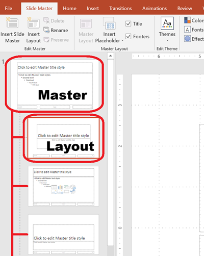

This article provides a series of examples that demonstrate how to work with slides using **Aspose.Slides for Java**. You’ll learn how to add, access, clone, reorder, and remove slides using the `Presentation` class.

Each example below includes a brief explanation followed by a code snippet in Java.

## **Add a Slide**

To add a new slide, you must first select a layout. In this example, we use the `Blank` layout and add an empty slide to the presentation.

```java
static void addSlide() {
    Presentation presentation = new Presentation();
    try {
        ILayoutSlide blankLayout = presentation.getLayoutSlides().getByType(SlideLayoutType.Blank);

        presentation.getSlides().addEmptySlide(blankLayout);
    } finally {
        presentation.dispose();
    }
}
```

> 💡 **Note:** Each slide layout is derived from a master slide, which defines the overall design and placeholder structure. The image below illustrates how master slides and their associated layouts are organized in PowerPoint.



## **Access Slides by Index**

You can access slides using their index, or find a slide’s index based on a reference. This is useful for iterating through or modifying specific slides.

```java
static void accessSlide() {
    Presentation presentation = new Presentation();
    try {
        // Add another empty slide.
        ILayoutSlide blankLayout = presentation.getLayoutSlides().getByType(SlideLayoutType.Blank);
        presentation.getSlides().addEmptySlide(blankLayout);

        // Access slides by index.
        ISlide firstSlide = presentation.getSlides().get_Item(0);
        ISlide secondSlide = presentation.getSlides().get_Item(1);

        // Get slide index from a reference, then access it by index.
        int secondSlideIndex = presentation.getSlides().indexOf(secondSlide);
        ISlide secondSlideByIndex = presentation.getSlides().get_Item(secondSlideIndex);
    } finally {
        presentation.dispose();
    }
}
```

## **Clone a Slide**

This example demonstrates how to clone an existing slide. The cloned slide is automatically added to the end of the slide collection.

```java
static void cloneSlide() {
    Presentation presentation = new Presentation();
    try {
        ISlide firstSlide = presentation.getSlides().get_Item(0);

        ISlide clonedSlide = presentation.getSlides().addClone(firstSlide);

        int clonedSlideIndex = presentation.getSlides().indexOf(clonedSlide);
    } finally {
        presentation.dispose();
    }
}
```

## **Reorder Slides**

You can change the order of slides by moving one to a new index. In this case, we move a cloned slide to the first position.

```java
static void reorderSlide() {
    Presentation presentation = new Presentation();
    try {
        ISlide firstSlide = presentation.getSlides().get_Item(0);

        ISlide clonedSlide = presentation.getSlides().addClone(firstSlide);

        presentation.getSlides().reorder(0, clonedSlide);
    } finally {
        presentation.dispose();
    }
}
```

## **Remove a Slide**

To remove a slide, simply reference it and call `remove`. This example adds a second slide and then removes the original, leaving only the new one.

```java
static void removeSlide() {
    Presentation presentation = new Presentation();
    try {
        ILayoutSlide blankLayout = presentation.getLayoutSlides().getByType(SlideLayoutType.Blank);
        ISlide secondSlide = presentation.getSlides().addEmptySlide(blankLayout);

        ISlide firstSlide = presentation.getSlides().get_Item(0);
        presentation.getSlides().remove(firstSlide);
    } finally {
        presentation.dispose();
    }
}
```
