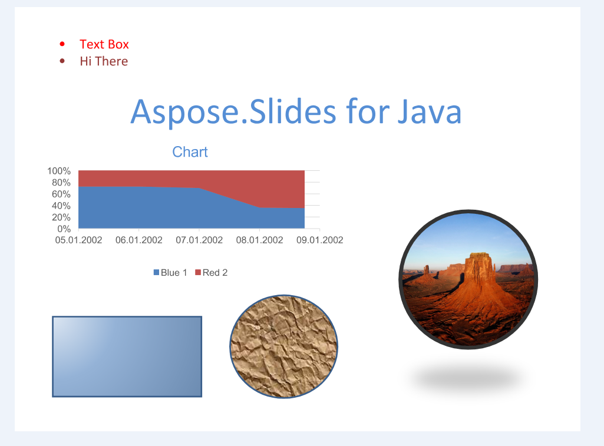

{}

This is a historical page, kept for existing links. It does not describe the current version of Aspose.Slides for Java. For the formats that Aspose.Slides for Java loads, imports, saves, and renders, and the API for each one, see [Supported File Formats](/slides/java/supported-file-formats/). For the current TIFF conversion guide, see [Convert PowerPoint Presentations to TIFF](/slides/java/convert-powerpoint-to-tiff/).

{}

## **About TIFF**

The [Tagged Image File Format](https://en.wikipedia.org/wiki/TIFF) which is known for storing multiple images in one document was originally created by Aldus. This format is widely supported by scanning, faxing and other image manipulation applications.

## **TIFF in Aspose.Slides for Java**

Any document that can be loaded in Aspose.Slides for Java can also be converted to TIFF document directly by Aspose.Slides for Java eliminating requirement of any third party component. Further, you can optionally define the size of the images in the resulting TIFF document. You can find information about exporting the presentation documents to TIFF documents through Aspose.Slides for Java in [Convert PowerPoint Presentations to TIFF](/slides/java/convert-powerpoint-to-tiff/).

**A Presentation Document Converted to TIFF Document through Aspose.Slides for Java**

 
