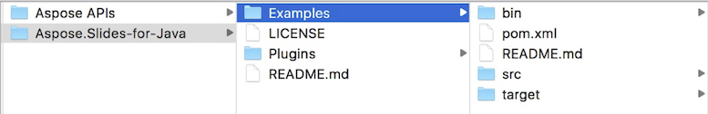
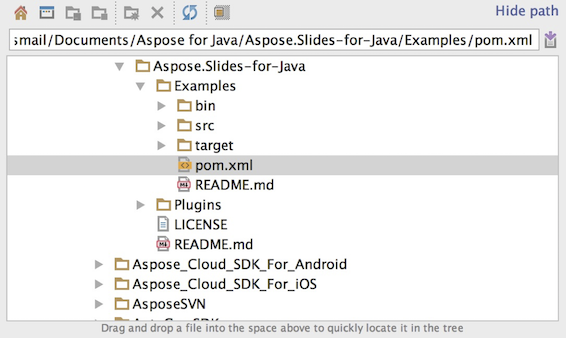
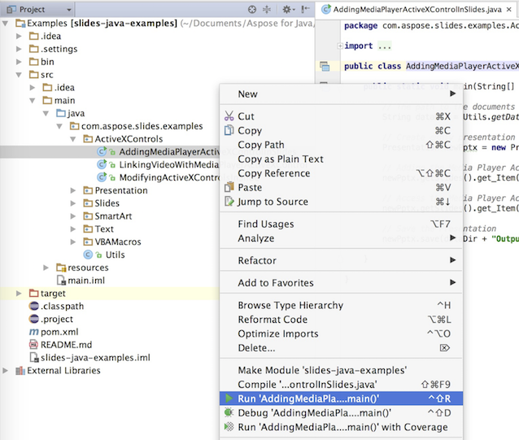
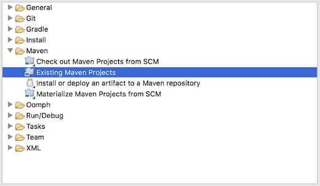
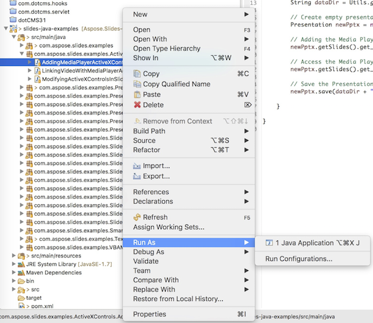
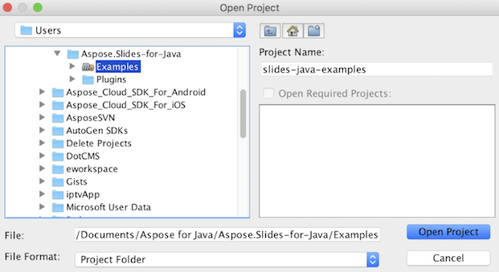
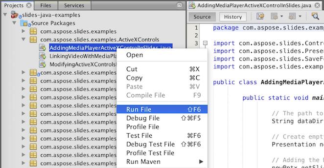

## **Download Aspose.Slides from GitHub**
All examples of Aspose.Slides for Java are hosted on [Github](https://github.com/aspose-slides/Aspose.Slides-for-Java). You can either clone the repository using your favorite Github client or download the ZIP file from [here](https://codeload.github.com/aspose-slides/Aspose.Slides-for-Java/zip/master).

Extract the contents of ZIP file to any folder on your computer. All examples are located in the **Examples** folder.



## **Import Examples into the IDE**
The project uses Maven build system. Any modern IDE can easily open or import the project and its dependencies. Below we show you how to use popular IDEs to build and run the examples.

### **IntelliJ IDEA**
Click on the **File** menu and choose **Open**. Browse to the project folder and select the **pom.xml** file.



It will open the project and download the dependencies automatically. From the Project tab, browse the examples in **src/main/java** folder. To run an example, just right click on the file and choose "Run ..", the example will be executed and the output will be shown in the built in console output window.



### **Eclipse**
Click on **File** menu and choose **Import**. Select **Maven** - Existing Maven Projects.



Browse to the folder that you cloned or downloaded from GitHub and select **pom.xml** file. It will open the project and download the dependencies automatically. From the Package Explorer tab, browse the examples in **src/main/java** folder. To run an example, just right click on the file and choose **Run As** - **Java Application**, the example will be executed and the output will be shown in the built in console output window.



### **NetBeans**
Click on the **File** menu and choose **Open Project**. Browse to the folder that you cloned or downloaded from GitHub. The icon of **Examples** folder will show that its a Maven project. Select Examples and open it.



It will open the project and download the dependencies automatically. From the Projects tab, browse the examples in **source packages**. To run an example, just right click on the file and choose **Run File**, the example will be executed and the output will be shown in the built in console output window.



## **Add Aspose.Slides Library into Maven Local Repository**
When you import **Aspose.Slides Examples** project into IDE, Maven automatically downloads aspose.slides JAR file from [Aspose Maven Repository](https://releases.aspose.com/java/repo/com/aspose/). In case you do not have access to internet, you can manually add JAR in your local repository.

### **mvn install**
Download the [aspose.slides](https://releases.aspose.com/java/repo/com/aspose/aspose-slides/), extract it and copy the aspose.slides-version.jar to somewhere else, for example, c drive. Issue following command:

```
mvn install:install-file
    -Dfile=c:\aspose.slides-version.jar
    -DgroupId=com.aspose
    -DartifactId=aspose-slides
    -Dversion={version}
    -Dpackaging=jar
```

Now, the **aspose.slides** jar is copied to your Maven local repository.

### **pom.xml**
After installed, just declares the **aspose.slides** coordinate in pom.xml. Add following repository in repositories tab and dependency in dependencies tab.

``` xml
<repository>
    <id>aspose-maven-repository</id>
    <url>http://repository.aspose.com/repo/</url>
</repository>

<dependency>
    <groupId>com.aspose</groupId>
    <artifactId>aspose-slides</artifactId>
    <version>18.6</version>
    <classifier>jdk16</classifier>
</dependency>
```

### **Done**
Build it, now the **aspose.slides** jar is able to retrieve from your Maven local repository.

## **Contribute**
If you like to add or improve an example, we encourage you to contribute to the project. All examples and showcase projects in this repository are open source and can be freely used in your own applications.

To contribute, you can fork the repository, edit the source code and can submit a Pull Request. We will review the changes and include it in the repository if found helpful.
