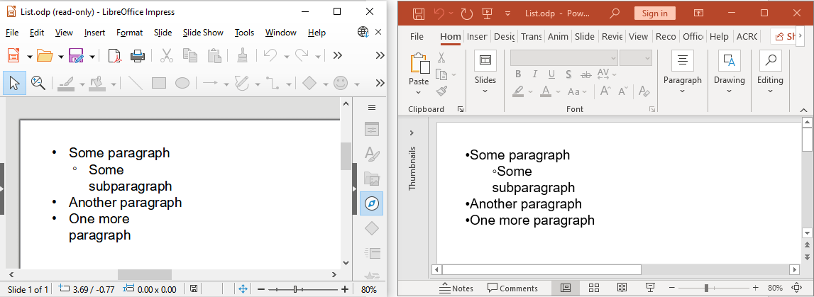

[**Aspose.Slides API**](https://products.aspose.com/slides/net/) allows you to convert OpenDocument (ODP) presentations to many formats (HTML, PDF, TIFF, SWF, XPS, etc.). The API used to convert ODP files to other document formats is the same as the one used for PowerPoint (PPT and PPTX) conversion operations.

For example, if you need to convert an ODP presentation to PDF, you can do it as follows:

```cs
using (Presentation presentation = new Presentation("presentation.odp"))
{
    presentation.Save("presentation.pdf", SaveFormat.Pdf);
}
```

## **OpenDocument Presentation in Different Applications**

When an OpenDocument presentation (ODP) file is opened in PowerPoint, it may not retain the original formatting from the application in which it was created. This happens because the OpenDocument presentation app and the PowerPoint app offer different features and rendering behaviors.

Here are some of the differences:

- In PowerPoint, tables are typically rendered last and may overlay other shapes, regardless of their order on the ODP slide.
- Picture fill for ODP tables is not supported in PowerPoint.
- Text vertical rotation (270°, stacked) and distributed alignment are not supported in LibreOffice/OpenOffice Impress.
- Picture fill, gradient fill, and pattern fill for text are not supported in LibreOffice/OpenOffice Impress.

MS PowerPoint and LibreOffice/OpenOffice Impress also handle lists differently. An ODP file created in PowerPoint may not display correctly in LibreOffice/OpenOffice Impress, and vice versa.

The image below shows how a list appears when created in LibreOffice Impress:



Aspose.Slides saves ODP lists in a way that ensures they are displayed correctly in LibreOffice/OpenOffice Impress.

[Learn more about the OpenDocument format and PowerPoint](https://support.microsoft.com/en-us/office/use-powerpoint-to-save-or-open-a-presentation-in-the-opendocument-presentation-odp-format-94805e84-1b09-4c98-a8b5-0da2a52242a0).

## **FAQ**

**What if the formatting of my ODP file changes after conversion?**

ODP and PowerPoint use different presentation models, and some elements—like tables, custom fonts, or fill styles—may not render exactly the same. It is recommended to review the output and adjust layout or formatting in code if needed.

**Do I need OpenOffice or LibreOffice installed to use ODP conversion?**

No, Aspose.Slides for .NET is a standalone library and does not require OpenOffice or LibreOffice to be installed on your system.

**Can I customize the output format during ODP conversion (e.g., set PDF options)?**

Yes, Aspose.Slides provides rich options for customizing the output. For example, when saving to PDF, you can control compression, image quality, text rendering, and more through the [PdfOptions](https://reference.aspose.com/slides/net/aspose.slides.export/pdfoptions/) class.

**Is Aspose.Slides suitable for server-side or cloud-based ODP processing?**

Absolutely. Aspose.Slides for .NET is designed to work in both desktop and server environments, including cloud-based platforms like Azure, AWS, and Docker containers, without any UI dependencies.
