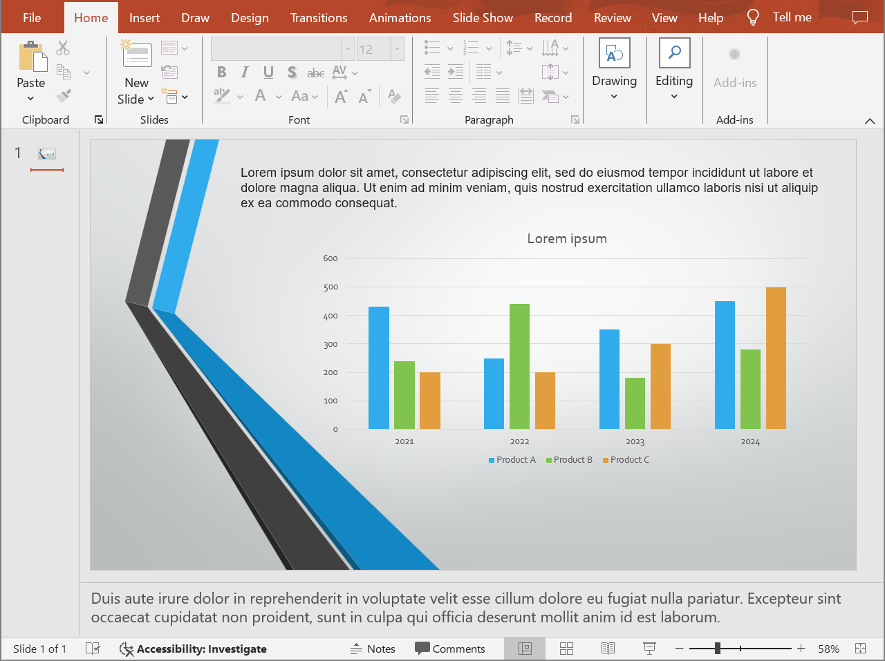
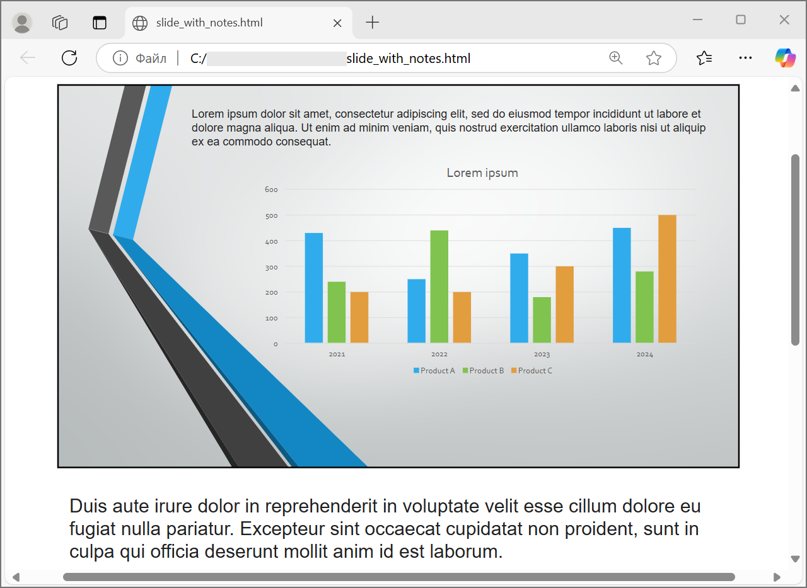
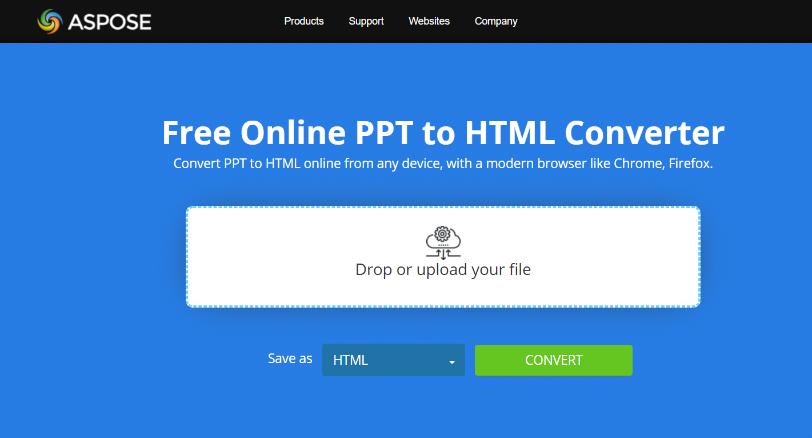

## **Overview**

Enhance your workflow by converting PowerPoint and OpenDocument presentations to HTML with Aspose.Slides for .NET. This guide offers detailed instructions, robust code examples, and tested methods to ensure a reliable and efficient conversion process optimized for web viewing.

Aspose.Slides provides many options—mostly from the [**HtmlOptions**](https://reference.aspose.com/slides/net/aspose.slides.export/htmloptions) class—that define the conversion process from PowerPoint (or OpenDocument) format to HTML:

* Convert an entire PowerPoint presentation to HTML.
* Convert a specific slide in a PowerPoint presentation to HTML.
* Convert presentation media (images, videos, etc.) to HTML.
* Convert a PowerPoint presentation to responsive HTML.
* Convert a PowerPoint presentation to HTML with speaker notes included or excluded.
* Convert a PowerPoint presentation to HTML with comments included or excluded.
* Convert a PowerPoint presentation to HTML with original or embedded fonts.
* Convert a PowerPoint presentation to HTML using the new CSS style.

## **Convert a Presentation to HTML**

Using Aspose.Slides, you can convert an entire PowerPoint or OpenDocument presentation to HTML as follows:

1. Create an instance of the [Presentation](https://reference.aspose.com/slides/net/aspose.slides/presentation) class.
1. Use the [Save](https://reference.aspose.com/slides/net/aspose.slides/presentation/methods/save) method to save the object as an HTML file.

This code shows you how to convert a PowerPoint presentation to HTML in C#:

```c#
// Instantiate the Presentation class that represents a presentation file (e.g., PPT, PPTX, ODP, etc.).
using (Presentation presentation = new Presentation("presentation.pptx"))
{
    // Save the presentation as HTML.
    presentation.Save("output.html", SaveFormat.Html);
}
```

## **Convert a Presentation to Responsive HTML**

Aspose.Slides provides the [ResponsiveHtmlController](https://reference.aspose.com/slides/net/aspose.slides.export/responsivehtmlcontroller) class that enables you to generate responsive HTML files. This code demonstrates how to convert a PowerPoint presentation to responsive HTML in C#:

```c#
// Instantiate the Presentation class that represents a presentation file.
using (Presentation presentation = new Presentation("presentation.pptx"))
{
    ResponsiveHtmlController controller = new ResponsiveHtmlController();

    HtmlOptions htmlOptions = new HtmlOptions 
    { 
        HtmlFormatter = HtmlFormatter.CreateCustomFormatter(controller) 
    };

    // Save the presentation as HTML.
    presentation.Save("responsive.html", SaveFormat.Html, htmlOptions);
}
```

## **Convert a Presentation to HTML with Speaker Notes**

When converting a PowerPoint or OpenDocument presentation to HTML with speaker notes, it is essential to capture the complete essence of the original document. This process ensures that not only are the visual elements of the slides accurately represented, but the accompanying speaker notes are also preserved, enriching the content with additional context and insights.

Let's say we have a PowerPoint presentation with the following slide:



This code demonstrates how to convert a PowerPoint presentation to HTML with speaker notes in C#:

```c#
using (Presentation presentation = new Presentation("presentation.pptx"))
{
    // Set options for speaker notes.
    NotesCommentsLayoutingOptions notesOptions = new NotesCommentsLayoutingOptions
    {
        NotesPosition = NotesPositions.BottomFull
    };

    // Set options for the output HTML document.
    HtmlOptions htmlOptions = new HtmlOptions
    {
        SlidesLayoutOptions = notesOptions
    };

    // Save the presentation as HTML with speaker notes.
    presentation.Save("slide_with_notes.html", SaveFormat.Html, htmlOptions);
}
```

The result:



## **Convert a Presentation to HTML with Original Fonts**

Aspose.Slides provides the [EmbedAllFontsHtmlController](https://reference.aspose.com/slides/net/aspose.slides.export/embedallfontshtmlcontroller) class that allows you to embed all the fonts in a presentation while converting it to HTML.

To prevent certain fonts from being embedded, you can pass an array of font names to a parameterized constructor of the [EmbedAllFontsHtmlController](https://reference.aspose.com/slides/net/aspose.slides.export/embedallfontshtmlcontroller) class. Popular fonts, such as Calibri or Arial, do not need to be embedded because most systems already include these fonts. Embedding them would unnecessarily increase the size of the resulting HTML document.

The [EmbedAllFontsHtmlController](https://reference.aspose.com/slides/net/aspose.slides.export/embedallfontshtmlcontroller) class supports inheritance and provides the [WriteFont](https://reference.aspose.com/slides/net/aspose.slides.export/embedallfontshtmlcontroller/methods/writefont) method, which is intended to be overridden.

```c#
using (Presentation presentation = new Presentation("input.pptx"))
{
    // Exclude the default presentation fonts.
    string[] excludeFonts = { "Calibri", "Arial" };

    EmbedAllFontsHtmlController fontController = new EmbedAllFontsHtmlController(excludeFonts);

    HtmlOptions htmlOptions = new HtmlOptions
    {
        HtmlFormatter = HtmlFormatter.CreateCustomFormatter(fontController)
    };

    presentation.Save("embedded_fonts.html", SaveFormat.Html, htmlOptions);
}
```

## **Convert a Presentation to HTML with High-Quality Images**

By default, when you convert a PowerPoint presentation to HTML, Aspose.Slides outputs a small HTML file with images at 72 DPI and removes cropped areas. To obtain HTML files with higher quality images, you must set the `PicturesCompression` property (from the `HtmlOptions` class) to 96 (i.e., `PicturesCompression.Dpi96`) or a higher value, as detailed in [this reference](https://reference.aspose.com/slides/net/aspose.slides.export/picturescompression).

This C# code demonstrates how to convert a PowerPoint presentation to HTML while obtaining high-quality images at 150 DPI (i.e., `PicturesCompression.Dpi150`):

```c#
using (Presentation presentation = new Presentation("input.pptx"))
{
    HtmlOptions htmlOptions = new HtmlOptions
    {
        PicturesCompression = PicturesCompression.Dpi150
    };

    presentation.Save("output_dpi_150.html", SaveFormat.Html, htmlOptions);
}
```

This C# code shows you how to convert a PowerPoint presentation to HTML without deleting cropped areas:

```c#
using (Presentation presentation = new Presentation("input.pptx"))
{
    HtmlOptions htmlOptions = new HtmlOptions
    {
        DeletePicturesCroppedAreas = false
    };

    presentation.Save("output_no_crop.html", SaveFormat.Html, htmlOptions);
}
```

## **Convert a Presentation Slide to HTML**

To convert a specific slide in a PowerPoint presentation to HTML, you need to instantiate the same [Presentation](https://reference.aspose.com/slides/net/aspose.slides/presentation) class (used for converting entire presentations to HTML) and then use the [Save](https://reference.aspose.com/slides/net/aspose.slides/presentation/methods/save) method to save the file as HTML. The [HtmlOptions](https://reference.aspose.com/slides/net/aspose.slides.export/htmloptions) class can be used to specify additional conversion options.

This C# code demonstrates how to convert a slide with speaker notes in a PowerPoint presentation to HTML:

```c#
public static void Run()
{
    using (Presentation presentation = new Presentation("sample.pptx"))
    {
        NotesCommentsLayoutingOptions notesOptions = new NotesCommentsLayoutingOptions
        {
            NotesPosition = NotesPositions.BottomFull
        };

        HtmlOptions htmlOptions = new HtmlOptions
        {
            SlidesLayoutOptions = notesOptions,
            HtmlFormatter = HtmlFormatter.CreateCustomFormatter(new CustomFormattingController())
        };

        for (int i = 0; i < presentation.Slides.Count; i++)
        {
            int slideIndex = i + 1;

            // Save the slide to an HTML file.
            string fileName = $"output_slide_{slideIndex}.html";
            presentation.Save(fileName, new[] { slideIndex }, SaveFormat.Html, htmlOptions);
        }
    }
}

public class CustomFormattingController : IHtmlFormattingController
{
    void IHtmlFormattingController.WriteDocumentStart(IHtmlGenerator generator, IPresentation presentation)
    {}

    void IHtmlFormattingController.WriteDocumentEnd(IHtmlGenerator generator, IPresentation presentation)
    {}

    void IHtmlFormattingController.WriteSlideStart(IHtmlGenerator generator, ISlide slide)
    {
        generator.AddHtml(string.Format(SlideHeader, generator.SlideIndex + 1));
    }

    void IHtmlFormattingController.WriteSlideEnd(IHtmlGenerator generator, ISlide slide)
    {
        generator.AddHtml(SlideFooter);
    }

    void IHtmlFormattingController.WriteShapeStart(IHtmlGenerator generator, IShape shape)
    {}

    void IHtmlFormattingController.WriteShapeEnd(IHtmlGenerator generator, IShape shape)
    {}

    private const string SlideHeader = "<div class=\"slide\" name=\"slide\" id=\"slide{0}\">";
    private const string SlideFooter = "</div>";
}
```

## **Save CSS and Images when Exporting to HTML**

Using new CSS style files, you can easily change the appearance of the HTML file generated from the PowerPoint-to-HTML conversion process.

The C# code in this example demonstrates how to use overridable methods to create a custom HTML document that includes a link to a CSS file:

```c#
using (Presentation presentation = new Presentation("pres.pptx"))
{
	CustomHeaderAndFontsController htmlController = new CustomHeaderAndFontsController("styles.css");

	HtmlOptions options = new HtmlOptions
	{
		HtmlFormatter = HtmlFormatter.CreateCustomFormatter(htmlController),
	};
	presentation.Save("pres.html", SaveFormat.Html, options);
}
```

```c#
public class CustomHeaderAndFontsController : EmbedAllFontsHtmlController
{
    // Custom header template.
    const string Header = "<!DOCTYPE html>\n" +
                            "<html>\n" +
                            "<head>\n" +
                            "<meta http-equiv=\"Content-Type\" content=\"text/html; charset=UTF-8\">\n" +
                            "<meta http-equiv=\"X-UA-Compatible\" content=\"IE=9\">\n" +
                            "<link rel=\"stylesheet\" type=\"text/css\" href=\"{0}\">\n" +
                            "</head>";

    private readonly string m_cssFileName;

    public CustomHeaderAndFontsController(string cssFileName)
    {
        m_cssFileName = cssFileName;
    }

    public override void WriteDocumentStart(IHtmlGenerator generator, IPresentation presentation)
    {
        generator.AddHtml(string.Format(Header, m_cssFileName));
        WriteAllFonts(generator, presentation);
    }

    public override void WriteAllFonts(IHtmlGenerator generator, IPresentation presentation)
    {
        generator.AddHtml("<!-- Embedded fonts -->");
        base.WriteAllFonts(generator, presentation);
    }
}
```

## **Link All Fonts when Converting a Presentation to HTML**

If you do not want to embed fonts (to avoid increasing the size of the resulting HTML), you can link all fonts by implementing your own `LinkAllFontsHtmlController` version.

This C# code shows you how to convert a PowerPoint presentation to HTML while linking all fonts and excluding "Calibri" and "Arial" (since they are already installed on the system):

```c#
using (Presentation presentation = new Presentation("pres.pptx"))
{
    // Exclude default presentation fonts.
    string[] fontNameExcludeList = { "Calibri", "Arial" };

    LinkAllFontsHtmlController linkcont = new LinkAllFontsHtmlController(fontNameExcludeList, @"C:\Windows\Fonts\");;

    HtmlOptions htmlOptionsEmbed = new HtmlOptions
    {
        HtmlFormatter = HtmlFormatter.CreateCustomFormatter(linkcont)
    };

    presentation.Save("pres.html", SaveFormat.Html, htmlOptionsEmbed);
}
```

This C# code shows you how the `LinkAllFontsHtmlController` is implemented:

```c#
public class LinkAllFontsHtmlController : EmbedAllFontsHtmlController
{
    private readonly string m_basePath;

    public LinkAllFontsHtmlController(string[] fontNameExcludeList, string basePath) : base(fontNameExcludeList)
    {
        m_basePath = basePath;
    }

    public override void WriteFont
    (
            IHtmlGenerator generator,
            IFontData originalFont,
            IFontData substitutedFont,
            string fontStyle,
            string fontWeight,
            byte[] fontData)
    {
        try
        {
            string fontName = substitutedFont == null ? originalFont.FontName : substitutedFont.FontName;
            string path = fontName + ".woff"; // Some path sanitaze may be needed.

            File.WriteAllBytes(Path.Combine(m_basePath, path), fontData);
            
            generator.AddHtml("<style>");
            generator.AddHtml("@font-face { ");
            generator.AddHtml("font-family: '" + fontName + "'; ");
            generator.AddHtml("src: url('" + path + "')");

            generator.AddHtml(" }");
            generator.AddHtml("</style>");
        }
        catch (Exception ex)
        {
            Console.WriteLine(ex.Message);
        }
    }
}
```

## **Convert a Presentation with SVG Images to Responsive HTML**

This C# code shows you how to convert a PowerPoint presentation to responsive HTML:

```c#
using (Presentation presentation = new Presentation("Presentation.pptx"))
{
    HtmlOptions saveOptions = new HtmlOptions
    {
        SvgResponsiveLayout = true
    };

    presentation.Save("SvgResponsiveLayout-out.html", SaveFormat.Html, saveOptions);
}
```

## **Export Media Files to HTML**

Using Aspose.Slides for .NET, you can export media files as follows:

1. Create an instance of the [Presentation](https://reference.aspose.com/slides/net/aspose.slides/presentation) class.
1. Get a reference to the slide.
1. Add a video to the slide.
1. Write the presentation as a HTML file.

This C# code shows you how to add a video to the presentation and then save it as HTML: 

```c#
// Create a new presentation.
using (Presentation presentation = new Presentation())
{
    string path = "C:/out/";
    const string fileName = "ExportMediaFiles_out.html";
    const string baseUri = "http://www.example.com/";

    using (FileStream fileStream = new FileStream("my_video.avi", FileMode.Open, FileAccess.Read))
    {
        IVideo video = presentation.Videos.AddVideo(fileStream, LoadingStreamBehavior.ReadStreamAndRelease);
        
        ISlide slide = presentation.Slides[0];
        slide.Shapes.AddVideoFrame(10, 10, 100, 100, video);
    }
        
    VideoPlayerHtmlController controller = new VideoPlayerHtmlController(path, fileName, baseUri);

    // Set HTML options.
    HtmlOptions htmlOptions = new HtmlOptions(controller);
    SVGOptions svgOptions = new SVGOptions(controller);

    htmlOptions.HtmlFormatter = HtmlFormatter.CreateCustomFormatter(controller);
    htmlOptions.SlideImageFormat = SlideImageFormat.Svg(svgOptions);

    // Save the presentation to an HTML file.
    presentation.Save(Path.Combine(path, fileName), SaveFormat.Html, htmlOptions);
}
```

{} 

Aspose developed free [presentation to HTML](https://products.aspose.app/slides/conversion/powerpoint-to-html) converters: [PPT to HTML](https://products.aspose.app/slides/conversion/ppt-to-html), [PPTX to HTML](https://products.aspose.app/slides/conversion/pptx-to-html), [ODP to HTML](https://products.aspose.app/slides/conversion/odp-to-html), etc. 

[](https://products.aspose.app/slides/conversion/ppt-to-html)

Check out other [free converters from Aspose](https://products.aspose.app/slides/conversion).

{}

{} 

Besides the conversion processes described here, Aspose.Slides also supports these conversion operations involving the HTML format: 

* [HTML to image](https://products.aspose.com/slides/net/conversion/html-to-image/)
* [HTML to JPG](https://products.aspose.com/slides/net/conversion/html-to-jpg/)
* [HTML to XML](https://products.aspose.com/slides/net/conversion/html-to-xml/)
* [HTML to TIFF](https://products.aspose.com/slides/net/conversion/html-to-tiff/)

{}

## **FAQ**

**What is the performance of Aspose.Slides when converting multiple presentations to HTML?**

Performance depends on the size and complexity of presentations. Aspose.Slides is highly efficient and scalable for batch operations. To achieve optimal performance when converting many presentations, it’s recommended to use multithreading or parallel processing whenever possible.

**Does Aspose.Slides support exporting hyperlinks to HTML?**

Yes, Aspose.Slides fully supports exporting embedded hyperlinks to HTML. When you convert presentations to HTML format, hyperlinks are preserved automatically and remain clickable.

**Is there any limit on the number of slides when converting presentations to HTML?**

There is no limit on the number of slides when using Aspose.Slides. You can convert presentations of any size. However, for presentations containing a very large number of slides, performance may depend on the available resources of your server or system.
