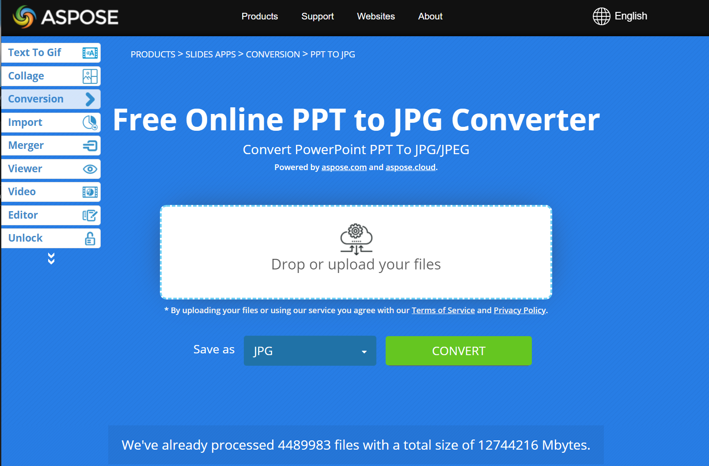

## **Overview**

Converting PowerPoint and OpenDocument presentations to JPG images helps with sharing slides, optimizing performance, and embedding content into websites or applications. Aspose.Slides for .NET allows you to transform PPTX, PPT, and ODP files into high-quality JPEG images. This guide explains different methods for conversion, including setting custom resolution, selecting specific slides, and adjusting image quality to match your needs.

With these features, it's easy to implement your own presentation viewer and create a thumbnail for every slide. This may be useful if you want to protect presentation slides from copying or demonstrate the presentation in read-only mode. Aspose.Slides allows you to convert the whole presentation or a specific slide into image formats.

## **Convert PPT/PPTX/ODP to JPG**

Here are the steps to convert a PPT/PPTX/ODP file to JPG:

1. Create an instance of the [Presentation](https://reference.aspose.com/slides/net/aspose.slides/presentation) class.
1. Get the slide object of the [ISlide](https://reference.aspose.com/slides/net/aspose.slides/islide) type from the [Presentation.Slides](https://reference.aspose.com/slides/net/aspose.slides/presentation/properties/slides) collection.
1. Create an image of the slide using the [ISlide.GetImage(float, float)](https://reference.aspose.com/slides/net/aspose.slides/islide/getimage/#getimage_5) method.
1. Call the [IImage.Save(string, ImageFormat)](https://reference.aspose.com/slides/net/aspose.slides/iimage/save/#save_3) method on the image object. Pass the output file name and image format as arguments.

{} 

**Note:** PPT/PPTX/ODP to JPG conversion differs from conversion to other formats in the Aspose.Slides .NET API. For other formats, you typically use the [IPresentation.Save(String, SaveFormat, ISaveOptions)](https://reference.aspose.com/slides/net/aspose.slides/ipresentation/save/#save_5) method. However, for JPG conversion, you need to use the [IImage.Save(string, ImageFormat)](https://reference.aspose.com/slides/net/aspose.slides/iimage/save/#save_3) method.

{} 

```c#
int scaleX = 1;
int scaleY = scaleX;

using (Presentation presentation = new Presentation("PowerPoint_Presentation.ppt"))
{
    foreach (ISlide slide in presentation.Slides)
    {
        // Create a slide image of the specified scale.
        using (IImage thumbnail = slide.GetImage(scaleX, scaleY))
        {
            // Save the image to disk in JPEG format.
            string imageFileName = $"Slide_{slide.SlideNumber}.jpg";
            thumbnail.Save(imageFileName, ImageFormat.Jpeg);
        }
    }
}
```

## **Convert PPT/PPTX/ODP to JPG with Customized Dimensions**

To change the dimension of the resulting thumbnail and JPG image, you can set the *ScaleX* and *ScaleY* values by passing them into the [**ISlide.GetImage(float scaleX, float scaleY)**](https://reference.aspose.com/slides/net/aspose.slides/islide/getimage/#getimage_5) method:

```c#
Size imageSize = new Size(1200, 800);

using (Presentation presentation = new Presentation("PowerPoint_Presentation.pptx"))
{
    foreach (ISlide slide in presentation.Slides)
    {
        // Create a slide image of the specified size.
        using (IImage thumbnail = slide.GetImage(imageSize))
        {
            // Save the image to disk in JPEG format.
            string imageFileName = $"Slide_{slide.SlideNumber}.jpg";
            thumbnail.Save(imageFileName, ImageFormat.Jpeg);
        }
    }
}
```


## **Render Comments when saving Presentation into Image**
Aspose.Slides for .NET provides a facility that allows you to render comments in a presentation's slides when you are converting those slides into images. This C# code demonstrates the operation:

```c#
using (Presentation presentation = new Presentation("test.pptx"))
{
    IRenderingOptions options = new RenderingOptions
    {
        SlidesLayoutOptions = new NotesCommentsLayoutingOptions
        {
            NotesPosition = NotesPositions.BottomTruncated,
            CommentsAreaColor = Color.Red,
            CommentsAreaWidth = 200,
            CommentsPosition = CommentsPositions.Right
        }
    };

    using (IImage image = presentation.Slides[0].GetImage(options))
    {
        image.Save("OutPresBitmap.png", ImageFormat.Png);
    }

    System.Diagnostics.Process.Start("OutPresBitmap.png");
}
```

{}

Aspose provides a [FREE Collage web app](https://products.aspose.app/slides/collage). Using this online service, you can merge [JPG to JPG](https://products.aspose.app/slides/collage/jpg) or PNG to PNG images, create [photo grids](https://products.aspose.app/slides/collage/photo-grid), and so on. 

Using the same principles described in this article, you can convert images from one format to another. For more information, see these pages: convert [image to JPG](https://products.aspose.com/slides/net/conversion/image-to-jpg/); convert [JPG to image](https://products.aspose.com/slides/net/conversion/jpg-to-image/); convert [JPG to PNG](https://products.aspose.com/slides/net/conversion/jpg-to-png/), convert [PNG to JPG](https://products.aspose.com/slides/net/conversion/png-to-jpg/); convert [PNG to SVG](https://products.aspose.com/slides/net/conversion/png-to-svg/), convert [SVG to PNG](https://products.aspose.com/slides/net/conversion/svg-to-png/).

{}

## **See also**

See other options to convert PPT/PPTX into image like:

- [PPT/PPTX to SVG conversion](/slides/net/render-a-slide-as-an-svg-image/)
- [C# PowerPoint to PNG](/slides/net/convert-powerpoint-to-png/)
- [C# PowerPoint to TIFF](/slides/net/convert-powerpoint-to-tiff/)
- [C# PowerPoint to SVG](/slides/net/render-a-slide-as-an-svg-image/)

{} 

To see how Aspose.Slides converts PowerPoint to JPG images, you may want to try these free online converters: PowerPoint [PPTX to JPG](https://products.aspose.app/slides/conversion/pptx-to-jpg) and [PPT to JPG](https://products.aspose.app/slides/conversion/ppt-to-jpg). 

{} 


