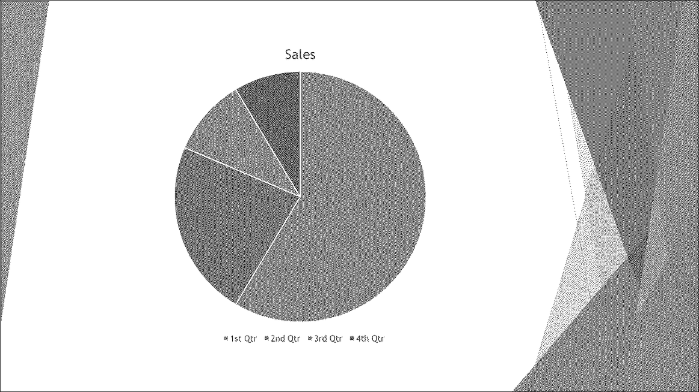

## **Overview**

TIFF (**Tagged Image File Format**) is a widely-used, lossless raster image format known for its exceptional quality and detailed preservation of graphics. Designers, photographers, and desktop publishers often choose TIFF to maintain layers, color accuracy, and original settings in their images.

Using Aspose.Slides, you can effortlessly convert your PowerPoint slides (PPT, PPTX) and OpenDocument slides (ODP) directly into high-quality TIFF images, ensuring your presentations retain maximum visual fidelity. 

## **Convert a Presentation to TIFF**

Using the [Save](https://reference.aspose.com/slides/net/aspose.slides/presentation/save/) method provided by the [Presentation](https://reference.aspose.com/slides/net/aspose.slides/presentation/) class, you can quickly convert an entire PowerPoint presentation to TIFF. The resulting TIFF images correspond to the default slide size.

This C# code demonstrates how to convert a PowerPoint presentation to TIFF:

```cs
// Instantiate the Presentation class that represents a presentation file (PPT, PPTX, ODP, etc.).
using (Presentation presentation = new Presentation("Demo_File.pptx"))
{
    // Save the presentation as TIFF.
    presentation.Save("Output.tiff", SaveFormat.Tiff);
}
```

## **Convert a Presentation to Black-and-White TIFF**

The property [BwConversionMode](https://reference.aspose.com/slides/net/aspose.slides.export/tiffoptions/bwconversionmode/) in the [TiffOptions](https://reference.aspose.com/slides/net/aspose.slides.export/tiffoptions/) class allows you to specify the algorithm used when converting a colored slide or image to a black-and-white TIFF. Note that this setting applies only when the [CompressionType](https://reference.aspose.com/slides/net/aspose.slides.export/tiffoptions/compressiontype/) property is set to `CCITT4` or `CCITT3`.

Let's say we have a "sample.pptx" file with the following slide:


This C# code demonstrates how to convert the colored slide to a black-and-white TIFF:

```cs
TiffOptions tiffOptions = new TiffOptions
{
    CompressionType = TiffCompressionTypes.CCITT4,
    BwConversionMode = BlackWhiteConversionMode.Dithering
};

using (Presentation presentation = new Presentation("sample.pptx"))
{
    presentation.Save("output.tiff", SaveFormat.Tiff, tiffOptions);
}
```

The result:



## **Convert a Presentation to TIFF with Custom Size**

If you require a TIFF image with specific dimensions, you can set your desired values using properties available in [TiffOptions](https://reference.aspose.com/slides/net/aspose.slides.export/tiffoptions/). For instance, the [ImageSize](https://reference.aspose.com/slides/net/aspose.slides.export/tiffoptions/imagesize/) property allows you to define the size of the resulting image.

This C# code demonstrates how to convert a PowerPoint presentation to TIFF images with a custom size:

```cs
// Instantiate the Presentation class that represents a presentation file (PPT, PPTX, ODP, etc.).
using (Presentation presentation = new Presentation("sample.pptx"))
{
    TiffOptions tiffOptions = new TiffOptions();

    // Set the compression type.
    tiffOptions.CompressionType = TiffCompressionTypes.Default;
    /* 
    Compression types:
        Default - Specifies the default compression scheme (LZW).
        None - Specifies no compression.
        CCITT3
        CCITT4
        LZW
        RLE
    */

    // The depth depends on the compression type and cannot be set manually.

    // Set the image DPI.
    tiffOptions.DpiX = 200;
    tiffOptions.DpiY = 200;

    // Set the image size.
    tiffOptions.ImageSize = new Size(1728, 1078);

    tiffOptions.SlidesLayoutOptions = new NotesCommentsLayoutingOptions
    {
        NotesPosition = NotesPositions.BottomFull
    };

    // Save the presentation as TIFF with the specified size.
    presentation.Save("custom_size.tiff", SaveFormat.Tiff, tiffOptions);
}
```

## **Convert a Presentation to TIFF with Custom Image Pixel Format**

Using the [PixelFormat](https://reference.aspose.com/slides/net/aspose.slides.export/tiffoptions/pixelformat/) property from the [TiffOptions](https://reference.aspose.com/slides/net/aspose.slides.export/tiffoptions) class, you can specify your preferred pixel format for the resulting TIFF image.

This C# code demonstrates how to convert a PowerPoint presentation to a TIFF image with a custom pixel format:

```cs
// Instantiate the Presentation class that represents a presentation file (PPT, PPTX, ODP, etc.).
using (Presentation presentation = new Presentation("Demo_File.pptx"))
{
    TiffOptions tiffOptions = new TiffOptions();
   
    tiffOptions.PixelFormat = ImagePixelFormat.Format8bppIndexed;
    /*
    ImagePixelFormat contains the following values (as stated in the documentation):
        Format1bppIndexed - 1 bit per pixel, indexed.
        Format4bppIndexed - 4 bits per pixel, indexed.
        Format8bppIndexed - 8 bits per pixel, indexed.
        Format24bppRgb    - 24 bits per pixel, RGB.
        Format32bppArgb   - 32 bits per pixel, ARGB.
    */

    // Save the presentation as TIFF with the specified image size.
    presentation.Save("Custom_Image_Pixel_Format.tiff", SaveFormat.Tiff, tiffOptions);
}
```

{}

Check out Aspose's [FREE PowerPoint to Poster converter](https://products.aspose.app/slides/conversion/convert-ppt-to-poster-online).

{}

## **FAQ**

**Can I convert an individual slide instead of entire PowerPoint presentation to TIFF?**

Yes. Aspose.Slides allows you to convert individual slides from PowerPoint and OpenDocument presentations into TIFF images separately.

**Is there any limit to the number of slides when converting a presentation to TIFF?**

No, Aspose.Slides does not impose any restrictions on the number of slides. You can convert presentations of any size into TIFF format.

**Are PowerPoint animations and transition effects preserved when converting slides to TIFF?**

No, TIFF is a static image format. Therefore, animations and transition effects are not preserved; only static snapshots of slides are exported.
