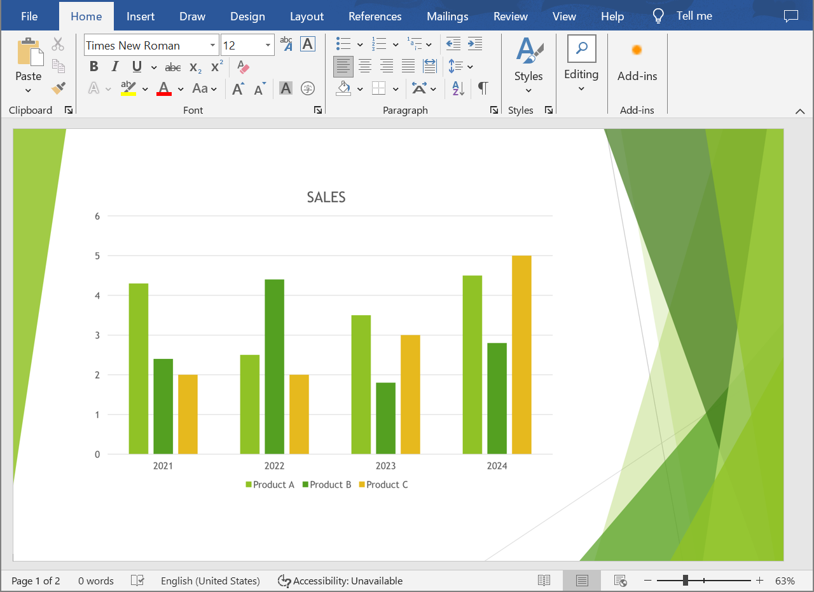

## **Overview**

This article provides a solution for developers on converting PowerPoint and OpenDocument presentations to Word documents using Aspose.Slides for .NET and Aspose.Words for .NET. The step-by-step guide walks you through every stage of the conversion process.

## **Convert a Presentation to a Word Document**

Follow the instructions below to convert a PowerPoint or OpenDocument presentation to a Word document:

1. Instantiate the [Presentation](https://reference.aspose.com/slides/net/aspose.slides/presentation/) class and load a presentation file.
2. Instantiate the [Document](https://reference.aspose.com/words/net/aspose.words/document/) and [DocumentBuilder](https://reference.aspose.com/words/net/aspose.words/documentbuilder/) classes to generate a Word document.
3. Set the page size for the Word document to match that of the presentation using the [DocumentBuilder.PageSetup](https://reference.aspose.com/words/net/aspose.words/documentbuilder/pagesetup/) property.
4. Set margins in the Word document using the [DocumentBuilder.PageSetup](https://reference.aspose.com/words/net/aspose.words/documentbuilder/pagesetup/) property.
5. Go through all the presentation slides using the [Presentation.Slides](https://reference.aspose.com/slides/net/aspose.slides/presentation/slides/) property.
    - Generate a slide image using the `GetImage` method from the [ISlide](https://reference.aspose.com/slides/net/aspose.slides/islide/) interface and save it to a memory stream.
    - Add the slide image to the Word document using the `InsertImage` method from the [DocumentBuilder](https://reference.aspose.com/words/net/aspose.words/documentbuilder/) class.
6. Save the Word document to a file.

Let's say we have a presentation "sample.pptx" that looks like this:


The following C# code example demonstrates how to convert a PowerPoint presentation to a Word document:

```cs
// Load a presentation file.
using var presentation = new Presentation("sample.pptx");

// Create Document and DocumentBuilder objects.
var document = new Document();
var builder = new DocumentBuilder(document);

// Set the page size in the Word document.
var slideSize = presentation.SlideSize.Size;
builder.PageSetup.PageWidth = slideSize.Width;
builder.PageSetup.PageHeight = slideSize.Height;

// Set margins in the Word document.
builder.PageSetup.LeftMargin = 0;
builder.PageSetup.RightMargin = 0;
builder.PageSetup.TopMargin = 0;
builder.PageSetup.BottomMargin = 0;

const float scaleX = 2, scaleY = 2;

// Go through all the presentation slides.
foreach (var slide in presentation.Slides)
{
    // Generate a slide image and save it to a memory stream.
    using var image = slide.GetImage(scaleX, scaleY);
    using var imageStream = new MemoryStream();
    image.Save(imageStream, ImageFormat.Png);

    // Add the slide image to the Word document.
    imageStream.Seek(0, SeekOrigin.Begin);
    builder.InsertImage(imageStream.ToArray(), builder.PageSetup.PageWidth, builder.PageSetup.PageHeight);

    builder.InsertBreak(BreakType.PageBreak);
}

// Save the Word document to a file.
document.Save("output.docx");
```

The result:



{} 

Try our [**Online PPT to Word Converter**](https://products.aspose.app/slides/conversion/ppt-to-word) to see what you could gain from converting PowerPoint and OpenDocument presentations to Word documents. 

{}

## **FAQs**

**What components need to be installed to convert PowerPoint and OpenDocument presentations to Word documents?**

You only need to add the respective NuGet packages for [Aspose.Slides for .NET](https://www.nuget.org/packages/Aspose.Slides.NET) and [Aspose.Words for .NET](https://www.nuget.org/packages/Aspose.Words/) to your C# project. Both libraries operate as standalone APIs, and there is no requirement for Microsoft Office to be installed.

**Are all PowerPoint and OpenDocument presentation formats supported?**

Aspose.Slides for .NET [supports all presentation formats](https://docs.aspose.com/slides/net/supported-file-formats/), including PPT, PPTX, ODP, and other common file types. This ensures that you can work with presentations created in various versions of Microsoft PowerPoint.
