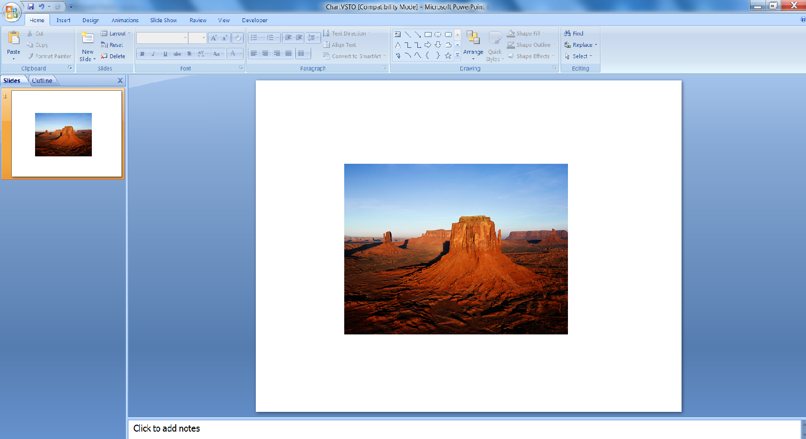
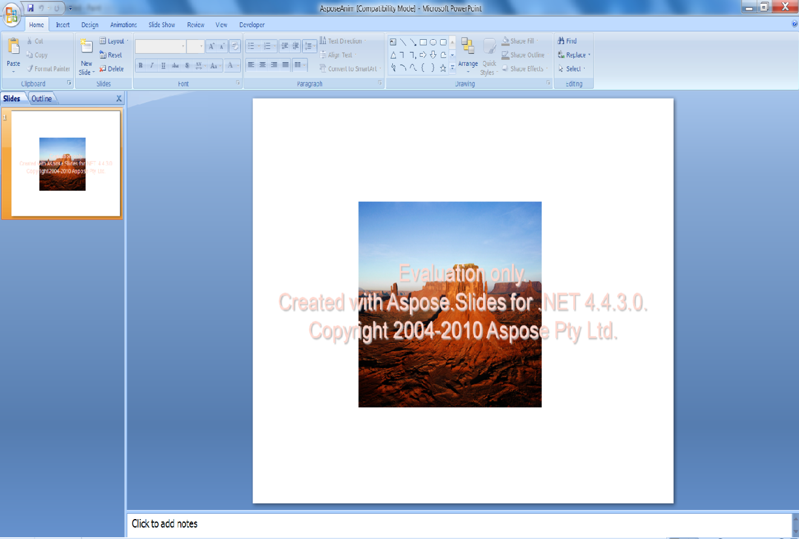

{} 

Picture frames are applied to shapes or images in Microsoft PowerPoint to frame images in a presentation. This article shows how to create a picture frame and apply animation on it programmatically using first [VSTO 2008](/slides/net/adding-picture-frame-with-animation/) and then [Aspose.Slides for .NET](/slides/net/adding-picture-frame-with-animation/). First, we show you how to apply a frame and animation using VSTO 2008. We then show you how to perform the same steps using Aspose.Slides for .NET.

{} 
## **Adding Picture Frames with Animation**
The code samples below create a presentation with a slide, add an image with a picture frame and applies animation to it.
### **VSTO 2008 Example**
Using VSTO 2008, take the following steps:

1. Create a presentation.
1. Add an empty slide.
1. Add a picture shape to the slide.
1. Apply animation to the picture.
1. Write the presentation to disk.

**The output presentation, created with VSTO** 




```c#
//Creating empty presentation
PowerPoint.Presentation pres = Globals.ThisAddIn.Application.Presentations.Add(Microsoft.Office.Core.MsoTriState.msoFalse);

//Add a blank slide
PowerPoint.Slide sld = pres.Slides.Add(1, PowerPoint.PpSlideLayout.ppLayoutBlank);

//Add Picture Frame
PowerPoint.Shape PicFrame = sld.Shapes.AddPicture(@"D:\Aspose Data\Desert.jpg",
Microsoft.Office.Core.MsoTriState.msoTriStateMixed,
Microsoft.Office.Core.MsoTriState.msoTriStateMixed, 150, 100, 400, 300);

//Applying animation on picture frame
PicFrame.AnimationSettings.EntryEffect = Microsoft.Office.Interop.PowerPoint.PpEntryEffect.ppEffectBoxIn;

//Saving Presentation
pres.SaveAs("d:\\ VSTOAnim.ppt", PowerPoint.PpSaveAsFileType.ppSaveAsPresentation,
Microsoft.Office.Core.MsoTriState.msoFalse);
```


### **Aspose.Slides for .NET Example**
Using Aspose.Slides for .NET, perform the following steps:

1. Create a presentation.
1. Access the first slide.
1. Add an image to a picture collection.
1. Add a picture shape to the slide.
1. Apply animation to the picture.
1. Write the presentation to disk.

**The output presentation, created with Aspose.Slides** 




```c#
// Create an empty presentation
using (Presentation pres = new Presentation())
{
    // Access the first slide
    ISlide slide = pres.Slides[0];

    // Add an image to the image collection of the presentation
    IImage image = Images.FromFile("aspose.jpg");
    IPPImage ppImage = pres.Images.AddImage(image);
    image.Dispose();

    // Add a picture frame whose height and width match the height and width of the image
    IPictureFrame pictureFrame = slide.Shapes.AddPictureFrame(ShapeType.Rectangle, 50, 150, ppImage.Width, ppImage.Height, ppImage);

    // Get the main animation sequence of the slide
    ISequence sequence = pres.Slides[0].Timeline.MainSequence;

    // Add the Fly from Left animation effect to the picture frame
    IEffect effect = sequence.AddEffect(pictureFrame, EffectType.Fly, EffectSubtype.Left, EffectTriggerType.OnClick);

    // Save the presentation
    pres.Save("AsposeAnim.ppt", SaveFormat.Ppt);
}
```

