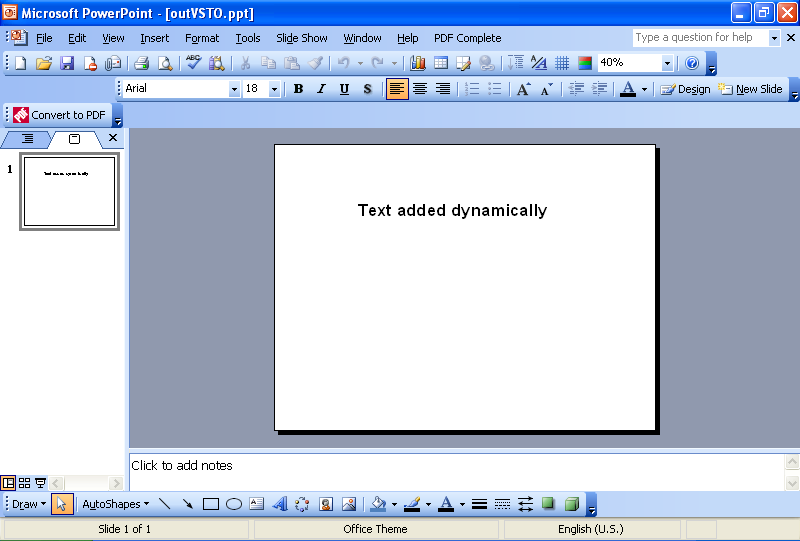
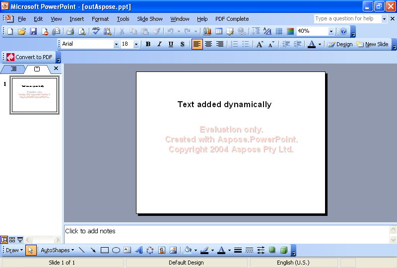

{} 

A common task that developers are developers to accomplish is adding text to slides dynamically. This article shows code examples for adding text dynamically using [VSTO](/slides/net/adding-text-dynamically-using-vsto-and-aspose-slides-for-net/) and [Aspose.Slides for .NET](/slides/net/adding-text-dynamically-using-vsto-and-aspose-slides-for-net/).

{} 
## **Adding Text Dynamically**
Both methods follow these steps:

1. Create a presentation.
1. Add a blank slide.
1. Add a text box.
1. Set some text.
1. Write the presentation.
## **VSTO Code Example**
The code snippets below results in a presentation with a plain slide and a string of text on it.

**The presentation as created in VSTO** 



```c#
//Note: PowerPoint is a namespace which has been defined above like this
//using PowerPoint = Microsoft.Office.Interop.PowerPoint;

//Create a presentation
PowerPoint.Presentation pres = Globals.ThisAddIn.Application
	.Presentations.Add(Microsoft.Office.Core.MsoTriState.msoFalse);

//Get the blank slide layout
PowerPoint.CustomLayout layout = pres.SlideMaster.
	CustomLayouts[7];

//Add a blank slide
PowerPoint.Slide sld = pres.Slides.AddSlide(1, layout);

//Add a text
PowerPoint.Shape shp = sld.Shapes.AddTextbox(Microsoft.Office.Core.MsoTextOrientation.msoTextOrientationHorizontal, 150, 100, 400, 100);

//Set a text
PowerPoint.TextRange txtRange = shp.TextFrame.TextRange;
txtRange.Text = "Text added dynamically";
txtRange.Font.Name = "Arial";
txtRange.Font.Bold = Microsoft.Office.Core.MsoTriState.msoTrue;
txtRange.Font.Size = 32;

//Write the output to disk
pres.SaveAs("c:\\outVSTO.ppt",
	PowerPoint.PpSaveAsFileType.ppSaveAsPresentation,
	Microsoft.Office.Core.MsoTriState.msoFalse);

```


## **Aspose.Slides for .NET Example**
The code snippets below use Aspose.Slides to create a presentation with a plain slide and a string of text on it.

**The presentation as created using Aspose.Slides for .NET** 



```c#
//Create a presentation
Presentation pres = new Presentation();

//Blank slide is added by default, when you create
//presentation from default constructor
//So, we don't need to add any blank slide
ISlide sld = pres.Slides[1];

//Add a textbox
//To add it, we will first add a rectangle
IShape shp = sld.Shapes.AddAutoShape(ShapeType.Rectangle, 1200, 800, 3200, 370);

//Hide its line
shp.LineFormat.Style = LineStyle.NotDefined;

//Then add a textframe inside it
ITextFrame tf = ((IAutoShape)shp).TextFrame;

//Set a text
tf.Text = "Text added dynamically";
IPortion port = tf.Paragraphs[0].Portions[0];

port.PortionFormat.FontBold = NullableBool.True;
port.PortionFormat.FontHeight = 32;

//Write the output to disk
pres.Save("c:\\outAspose.ppt", SaveFormat.Ppt);
```


