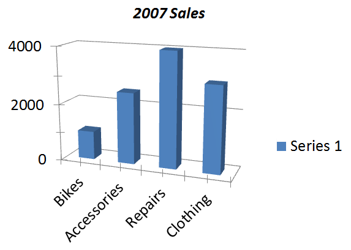

## **Overview**

This article demonstrates how to create and customize charts in Microsoft PowerPoint presentations programmatically using C#. With Aspose.Slides for .NET, you can automate the generation of professional, data-driven charts without relying on Microsoft Office or Interop libraries. The API provides a rich set of features for building column charts, pie charts, line charts, and more — all with full control over appearance, data, and layout. Whether you're generating reports, dashboards, or business presentations, Aspose.Slides helps you deliver high-quality visualizations directly from your .NET applications.

## **VSTO Example**

This section demonstrates how to create a chart in a Microsoft PowerPoint presentation using **VSTO (Visual Studio Tools for Office)**. With VSTO, you can programmatically generate and customize charts by combining PowerPoint and Excel automation. The example provided shows how to add a **3D clustered column chart**, populate it with data from an Excel worksheet, adjust formatting and layout, and save the final presentation — all from within a .NET application.

1. Create an instance of a Microsoft PowerPoint presentation.
1. Add a blank slide to the presentation.
1. Add a 3D clustered column chart and access it.
1. Create a new Microsoft Excel workbook instance and load the chart data.
1. Access the chart data worksheet using the Excel workbook instance.
1. Set the chart range in the worksheet and remove series 2 and 3 from the chart.
1. Modify the chart category data in the chart data worksheet.
1. Modify the series 1 data in the chart data worksheet.
1. Access the chart title and set its font-related properties.
1. Access the value axis of the chart and set the major unit, minor unit, maximum value, and minimum value.
1. Access the chart’s depth (series) axis and remove it—only one series is used in this example.
1. Set the chart’s rotation angles in the X and Y directions.
1. Save the presentation.
1. Close the Microsoft Excel and PowerPoint instances.

```c#
EnsurePowerPointIsRunning(true, true);

// Instantiate a slide object.
Microsoft.Office.Interop.PowerPoint.Slide objSlide = null;

// Access the first presentation slide.
objSlide = objPres.Slides[1];

// Select the first slide and set its layout.
objSlide.Select();
objSlide.Layout = Microsoft.Office.Interop.PowerPoint.PpSlideLayout.ppLayoutBlank;

// Add a default chart to the slide.
objSlide.Shapes.AddChart(Microsoft.Office.Core.XlChartType.xl3DColumn, 20, 30, 400, 300);

// Access the added chart.
Microsoft.Office.Interop.PowerPoint.Chart ppChart = objSlide.Shapes[1].Chart;

// Access the chart data.
Microsoft.Office.Interop.PowerPoint.ChartData chartData = ppChart.ChartData;

// Create an instance of the Excel workbook to work with the chart data.
Microsoft.Office.Interop.Excel.Workbook dataWorkbook = (Microsoft.Office.Interop.Excel.Workbook)chartData.Workbook;

// Access the data worksheet for the chart.
Microsoft.Office.Interop.Excel.Worksheet dataSheet = dataWorkbook.Worksheets[1];

// Set the data range for the chart.
Microsoft.Office.Interop.Excel.Range tRange = dataSheet.Cells.get_Range("A1", "B5");

// Apply the specified range to the chart data table.
Microsoft.Office.Interop.Excel.ListObject tbl1 = dataSheet.ListObjects["Table1"];
tbl1.Resize(tRange);

// Set values for categories and respective series data.
((Microsoft.Office.Interop.Excel.Range)(dataSheet.Cells.get_Range("A2"))).FormulaR1C1 = "Bikes";
((Microsoft.Office.Interop.Excel.Range)(dataSheet.Cells.get_Range("A3"))).FormulaR1C1 = "Accessories";
((Microsoft.Office.Interop.Excel.Range)(dataSheet.Cells.get_Range("A4"))).FormulaR1C1 = "Repairs";
((Microsoft.Office.Interop.Excel.Range)(dataSheet.Cells.get_Range("A5"))).FormulaR1C1 = "Clothing";
((Microsoft.Office.Interop.Excel.Range)(dataSheet.Cells.get_Range("B2"))).FormulaR1C1 = "1000";
((Microsoft.Office.Interop.Excel.Range)(dataSheet.Cells.get_Range("B3"))).FormulaR1C1 = "2500";
((Microsoft.Office.Interop.Excel.Range)(dataSheet.Cells.get_Range("B4"))).FormulaR1C1 = "4000";
((Microsoft.Office.Interop.Excel.Range)(dataSheet.Cells.get_Range("B5"))).FormulaR1C1 = "3000";

// Set the chart title.
ppChart.ChartTitle.Font.Italic = true;
ppChart.ChartTitle.Text = "2007 Sales";
ppChart.ChartTitle.Font.Size = 18;
ppChart.ChartTitle.Font.Color = Color.Black.ToArgb();
ppChart.ChartTitle.Format.Line.Visible = Microsoft.Office.Core.MsoTriState.msoTrue;
ppChart.ChartTitle.Format.Line.ForeColor.RGB = Color.Black.ToArgb();

// Access the chart value axis.
Microsoft.Office.Interop.PowerPoint.Axis valaxis = ppChart.Axes(Microsoft.Office.Interop.PowerPoint.XlAxisType.xlValue, Microsoft.Office.Interop.PowerPoint.XlAxisGroup.xlPrimary);

// Set the values for the axis units.
valaxis.MajorUnit = 2000.0F;
valaxis.MinorUnit = 1000.0F;
valaxis.MinimumScale = 0.0F;
valaxis.MaximumScale = 4000.0F;

// Access the chart depth axis.
Microsoft.Office.Interop.PowerPoint.Axis Depthaxis = ppChart.Axes(Microsoft.Office.Interop.PowerPoint.XlAxisType.xlSeriesAxis, Microsoft.Office.Interop.PowerPoint.XlAxisGroup.xlPrimary);
Depthaxis.Delete();

// Set the chart rotation.
ppChart.Rotation = 20;   // Y-Value
ppChart.Elevation = 15;  // X-Value
ppChart.RightAngleAxes = false;

// Save the presentation as a PPTX file.
objPres.SaveAs("VSTO_Sample_Chart.pptx", Microsoft.Office.Interop.PowerPoint.PpSaveAsFileType.ppSaveAsDefault, MsoTriState.msoTrue);

// Close the workbook and presentation.
dataWorkbook.Application.Quit();
objPres.Application.Quit();
```

```c#
public static void EnsurePowerPointIsRunning(bool blnAddPresentation)
{
    EnsurePowerPointIsRunning(blnAddPresentation, false);
}

public static void EnsurePowerPointIsRunning()
{
    EnsurePowerPointIsRunning(false, false);
}

public static void EnsurePowerPointIsRunning(bool blnAddPresentation, bool blnAddSlide)
{
    string strName = null;

    // Try accessing the Name property. If it throws an exception, start a new instance of PowerPoint.
    try
    {
        strName = objPPT.Name;
    }
    catch (Exception ex)
    {
        StartPowerPoint();
    }

    // blnAddPresentation is used to ensure that a presentation is loaded.
    if (blnAddPresentation == true)
    {
        try
        {
            strName = objPres.Name;
        }
        catch (Exception ex)
        {
            objPres = objPPT.Presentations.Add(MsoTriState.msoTrue);
        }
    }

    // blnAddSlide is used to ensure that there is at least one slide in the presentation.
    if (blnAddSlide)
    {
        try
        {
            strName = objPres.Slides[1].Name;
        }
        catch (Exception ex)
        {
            Microsoft.Office.Interop.PowerPoint.Slide objSlide = null;
            Microsoft.Office.Interop.PowerPoint.CustomLayout objCustomLayout = null;
            objCustomLayout = objPres.SlideMaster.CustomLayouts[1];
            objSlide = objPres.Slides.AddSlide(1, objCustomLayout);
            objSlide.Layout = Microsoft.Office.Interop.PowerPoint.PpSlideLayout.ppLayoutText;
            objCustomLayout = null;
            objSlide = null;
        }
    }
}
```

The result:


## **Aspose.Slides for .NET Example**

The following example shows how to create a simple chart in a PowerPoint presentation using Aspose.Slides for .NET. This code demonstrates how to add a **3D clustered column chart**, populate it with sample data, and customize its appearance. With just a few lines of code, you can generate charts dynamically and integrate them into your presentations without using Microsoft Office.

1. Create an instance of the [Presentation](https://reference.aspose.com/slides/net/aspose.slides/presentation/) class.
1. Get a reference to the first slide.
1. Add a 3D clustered column chart and access it.
1. Access the chart data.
1. Remove the unused Series 2 and Series 3.
1. Modify the chart categories by updating the labels.
1. Update the values of Series 1.
1. Access the chart title and set its font properties.
1. Configure the chart's value axis, including major unit, minor unit, maximum, and minimum values.
1. Set the chart rotation angles on the X and Y axes.
1. Save the presentation in PPTX format.

```cs
// Create an empty presentation.
using (Presentation presentation = new Presentation())
{
    // Access the first slide.
    ISlide slide = presentation.Slides[0];

    // Add a default chart.
    IChart chart = slide.Shapes.AddChart(ChartType.ClusteredColumn3D, 20, 30, 400, 300);

    // Get the chart data.
    IChartData chartData = chart.ChartData;

    // Remove the extra default series.
    chartData.Series.RemoveAt(1);
    chartData.Series.RemoveAt(1);

    // Modify the chart category names.
    chartData.Categories[0].AsCell.Value = "Bikes";
    chartData.Categories[1].AsCell.Value = "Accessories";
    chartData.Categories[2].AsCell.Value = "Repairs";
    chartData.Categories[3].AsCell.Value = "Clothing";

    // Set the index of the chart data worksheet.
    int worksheetIndex = 0;

    // Get the chart data workbook.
    IChartDataWorkbook workbook = chart.ChartData.ChartDataWorkbook;

    // Modify the chart series values.
    chartData.Series[0].DataPoints.AddDataPointForBarSeries(workbook.GetCell(worksheetIndex, 1, 1, 1000));
    chartData.Series[0].DataPoints.AddDataPointForBarSeries(workbook.GetCell(worksheetIndex, 2, 1, 2500));
    chartData.Series[0].DataPoints.AddDataPointForBarSeries(workbook.GetCell(worksheetIndex, 3, 1, 4000));
    chartData.Series[0].DataPoints.AddDataPointForBarSeries(workbook.GetCell(worksheetIndex, 4, 1, 3000));

    // Set the chart title.
    chart.HasTitle = true;
    chart.ChartTitle.AddTextFrameForOverriding("2007 Sales");
    IPortionFormat format = chart.ChartTitle.TextFrameForOverriding.Paragraphs[0].Portions[0].PortionFormat;
    format.FontItalic = NullableBool.True;
    format.FontHeight = 18;
    format.FillFormat.FillType = FillType.Solid;
    format.FillFormat.SolidFillColor.Color = Color.Black;

    // Set the axis options.
    chart.Axes.VerticalAxis.IsAutomaticMaxValue = false;
    chart.Axes.VerticalAxis.IsAutomaticMinValue = false;
    chart.Axes.VerticalAxis.IsAutomaticMajorUnit = false;
    chart.Axes.VerticalAxis.IsAutomaticMinorUnit = false;

    chart.Axes.VerticalAxis.MaxValue = 4000.0F;
    chart.Axes.VerticalAxis.MinValue = 0.0F;
    chart.Axes.VerticalAxis.MajorUnit = 2000.0F;
    chart.Axes.VerticalAxis.MinorUnit = 1000.0F;
    chart.Axes.VerticalAxis.TickLabelPosition = TickLabelPositionType.NextTo;

    // Set the chart rotation.
    chart.Rotation3D.RotationX = 15;
    chart.Rotation3D.RotationY = 20;

    // Save the presentation as a PPTX file.
    presentation.Save("Aspose_Sample_Chart.pptx", SaveFormat.Pptx);
}
```

The result:



## **FAQs**

**Can I create other types of charts like pie, line, or bar charts with Aspose.Slides?**

Yes. Aspose.Slides for .NET supports a wide range of [chart types](https://docs.aspose.com/slides/net/create-chart/), including pie charts, line charts, bar charts, scatter plots, bubble charts, and more. You can specify the desired chart type using the [ChartType](https://reference.aspose.com/slides/net/aspose.slides.charts/charttype/) enumeration when adding a chart.

**Can I apply custom styles or themes to the chart?**

Yes. You can fully customize the chart’s appearance, including colors, fonts, fills, outlines, gridlines, and layout. However, applying Office themes exactly as seen in PowerPoint requires manually setting individual styles.

**Can I export the chart as an image separately from the slide?**

Yes, Aspose.Slides allows you to export any shape—including charts—as a separate image (e.g., PNG, JPEG) using the `GetImage` method on the chart [shape](https://reference.aspose.com/slides/net/aspose.slides/ishape/).
