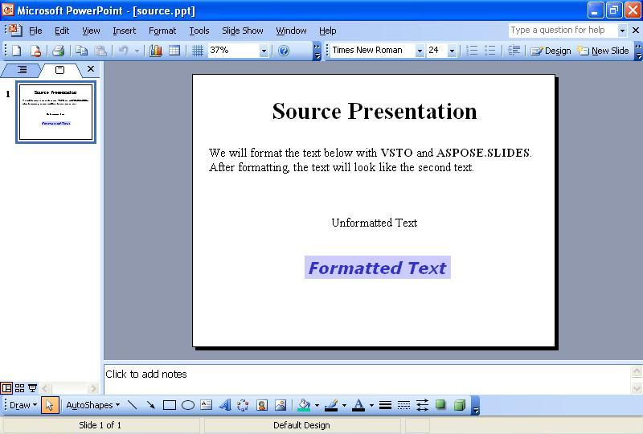
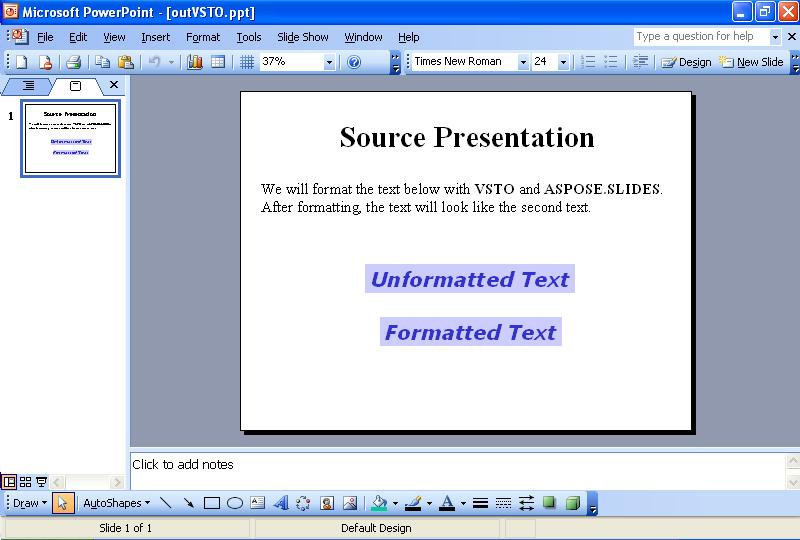
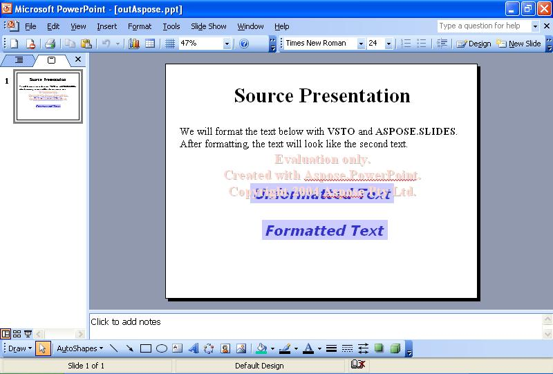

{} 

Sometimes, you need to format the text on slides programmatically. This article shows how to read a sample presentation with some text on the first slide using either [VSTO](/slides/net/format-text-using-vsto-and-aspose-slides-and-net/) and [Aspose.Slides for .NET](/slides/net/format-text-using-vsto-and-aspose-slides-and-net/). The code formats the text in the third textbox on the slide to look like the text in the last textbox.

{} 
## **Formatting Text**
Both the VSTO and Aspose.Slides methods take the following steps:

1. Open the source presentation.
1. Access the first slide.
1. Access the third text box.
1. Change the formatting of the text in the third text box.
1. Save the presentation to disk.

The screenshots below show the sample slide before and after the execution of the VSTO and Aspose.Slides for .NET code.

**The input presentation** 


### **VSTO Code Example**
The code below shows how to reformat text on a slide using VSTO.

**The text reformatted with VSTO** 




```c#
//Note: PowerPoint is a namespace which has been defined above like this
//using PowerPoint = Microsoft.Office.Interop.PowerPoint;
PowerPoint.Presentation pres = null;

//Open the presentation
pres = Globals.ThisAddIn.Application.Presentations.Open("c:\\source.ppt",
	Microsoft.Office.Core.MsoTriState.msoFalse,
	Microsoft.Office.Core.MsoTriState.msoFalse,
	Microsoft.Office.Core.MsoTriState.msoTrue);

//Access the first slide
PowerPoint.Slide slide = pres.Slides[1];

//Access the third shape
PowerPoint.Shape shp = slide.Shapes[3];

//Change its text's font to Verdana and height to 32
PowerPoint.TextRange txtRange = shp.TextFrame.TextRange;
txtRange.Font.Name = "Verdana";
txtRange.Font.Size = 32;

//Bolden it
txtRange.Font.Bold = Microsoft.Office.Core.MsoTriState.msoCTrue;

//Italicize it
txtRange.Font.Italic = Microsoft.Office.Core.MsoTriState.msoCTrue;

//Change text color
txtRange.Font.Color.RGB = 0x00CC3333;

//Change shape background color
shp.Fill.ForeColor.RGB = 0x00FFCCCC;

//Reposition it horizontally
shp.Left -= 70;

//Write the output to disk
pres.SaveAs("c:\\outVSTO.ppt",
	PowerPoint.PpSaveAsFileType.ppSaveAsPresentation,
	Microsoft.Office.Core.MsoTriState.msoFalse);
```


### **Aspose.Slides for .NET Example**
To format text with Aspose.Slides, add the font before formatting the text.

**The output presentation created with Aspose.Slides** 




```c#
 //Open the presentation
Presentation pres = new Presentation("c:\\source.ppt");

//Access the first slide
ISlide slide = pres.Slides[0];

//Access the third shape
IShape shp = slide.Shapes[2];

//Change its text's font to Verdana and height to 32
ITextFrame tf = ((IAutoShape)shp).TextFrame;
IParagraph para = tf.Paragraphs[0];
IPortion port = para.Portions[0];
port.PortionFormat.LatinFont = new FontData("Verdana");

port.PortionFormat.FontHeight = 32;

//Bolden it
port.PortionFormat.FontBold = NullableBool.True;

//Italicize it
port.PortionFormat.FontItalic = NullableBool.True;

//Change text color
//Set font color
port.PortionFormat.FillFormat.FillType = FillType.Solid;
port.PortionFormat.FillFormat.SolidFillColor.Color = Color.FromArgb(0x33, 0x33, 0xCC);

//Change shape background color
shp.FillFormat.FillType = FillType.Solid;
shp.FillFormat.SolidFillColor.Color = Color.FromArgb(0xCC, 0xCC, 0xFF);

//Write the output to disk
pres.Save("c:\\outAspose.ppt", SaveFormat.Ppt);
```

