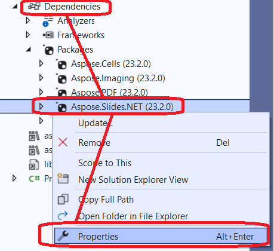
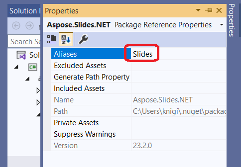

## Introduction

Starting in [Aspose.Slides 23.2](https://www.nuget.org/packages/Aspose.Slides.NET/23.2.0), support for.NET6 was implemented. The peculiarity of this support is that .NET6 no longer supports System.Drawing.Common for Linux ([breaking change](https://learn.microsoft.com/en-us/dotnet/core/compatibility/core-libraries/6.0/system-drawing-common-windows-only)) and Slides implements this graphical subsystem itself as a C++ component.

Aspose.Slides for .NET now work without dependencies on GDI/libgdiplus on:
* Windows
* Linux

_MacOS_ support is in progress.

## Using Slides for .NET6 on AWS and Azure

.NET6 is the preferred version for Aspose.Slides used on the cloud (AWS, Azure, or other cloud solutions).

Previously, when Aspose.Slides was used on a Linux host, additional dependencies (libgdiplus) had to be installed and this was often inconvenient or impractical (for example, when using [AWS Lambda](https://aws.amazon.com/lambda)). With Slides for .NET6, those dependencies are no longer needed, so deployment is much easier.

Another consideration is problems that occurred when Aspose.Slides was used on a cloud solution with a Windows host. For example, [Azure Functions](https://learn.microsoft.com/en-us/azure/azure-functions/functions-overview) have limitations for the process and results in problems during a PDF export operation (see [this](https://github.com/projectkudu/kudu/wiki/Azure-Web-App-sandbox#unsupported-frameworks)). The usage of Aspose.Slides for .NET6 resolves this issue.

## Using the System.Drawing.Common package and Slides for .NET6 classes (CS0433: The type exists in both Slides and System.Drawing.Common error)

Sometimes, both System.Drawing and Slides for .NET6 dependencies have to be used in a project (for example, when the .NET6 project depends on other packages, which in turn depend on System.Drawing). This may cause complication errors like these:

* CS0433: The type 'Image' exists in both 'Aspose.Slides, Version=23.2.0.0, Culture=neutral, PublicKeyToken=716fcc553a201e56' and 'System.Drawing.Common, Version=6.0.0.0
* CS0433: The type 'Graphics' exists in both 'Aspose.Slides, Version=23.2.0.0, Culture=neutral, PublicKeyToken=716fcc553a201e56' and 'System.Drawing.Common, Version=6.0.0.0

In this case, you can use [extern alias](https://learn.microsoft.com/en-us/dotnet/csharp/language-reference/keywords/extern-alias) for Aspose.Slides (version less than 24.8):
1) Select Aspose.Slides assembly from the project's dependencies and then click **Properties**.
  
2) Set an alias (for example, "Slides").
  

Now, the types from System.Drawing.Common will be used by default. External assembly alias should be specified where Aspose.Slides types are needed.

```c#
extern alias Slides;
using Slides::Aspose.Slides;
```

Full example:

```c#
extern alias Slides;
using Slides::Aspose.Slides;

static Slides::System.Drawing.Image GetThumbnail(Presentation pres)
{
    return pres.Slides[0].GetThumbnail();
}
```

Starting with version 24.8, the deprecated public API with dependencies on System.Drawing has been removed. Regarding the code example above, you can get the slide image as below.

```cs
static Aspose.Slides.IImage GetThumbnail(Presentation presentation)
{
    return presentation.Slides[0].GetImage();
}
```
The new API is described in more detail in [Modern API](/net/modern-api/).
