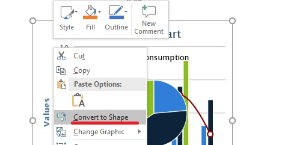

## **Images in Slides In Presentations**

Images make presentations more engaging and interesting. In Microsoft PowerPoint, you can insert pictures from a file, the internet, or other locations onto slides. Similarly, Aspose.Slides allows you to add images to slides in your presentations through different procedures.

{} 

Aspose provides free converters—[JPEG to PowerPoint](https://products.aspose.app/slides/import/jpg-to-ppt) and [PNG to PowerPoint](https://products.aspose.app/slides/import/png-to-ppt)—that allow people to create presentations quickly from images. 

{} 

{}

If you want to add an image as a frame object—especially if you plan to use standard formatting options on it to change its size, add effects, and so on—see [Picture Frame](https://docs.aspose.com/slides/net/picture-frame/). 

{} 

{}

You can manipulate input/output operations involving images and PowerPoint presentations to convert an image from one format to another. See these pages: convert [image to JPG](https://products.aspose.com/slides/net/conversion/image-to-jpg/); convert [JPG to image](https://products.aspose.com/slides/net/conversion/jpg-to-image/); convert [JPG to PNG](https://products.aspose.com/slides/net/conversion/jpg-to-png/), convert [PNG to JPG](https://products.aspose.com/slides/net/conversion/png-to-jpg/); convert [PNG to SVG](https://products.aspose.com/slides/net/conversion/png-to-svg/), convert [SVG to PNG](https://products.aspose.com/slides/net/conversion/svg-to-png/).

{}

Aspose.Slides supports operations with images in these popular formats: JPEG, PNG, BMP, GIF, and others. 

## **Adding Images Stored Locally to Slides**

You can add one or several images on your computer onto a slide in a presentation. This sample code in C# shows you how to add an image to a slide:

```c#
using (Presentation pres = new Presentation())
{
    ISlide slide = pres.Slides[0];
    IPPImage image = pres.Images.AddImage(File.ReadAllBytes("image.png"));
    slide.Shapes.AddPictureFrame(ShapeType.Rectangle, 10, 10, 100, 100, image);
    
    pres.Save("pres.pptx", SaveFormat.Pptx);
}
```

## **Adding Images From the Web to Slides**

If the image you want to add to a slide is unavailable on your computer, you can add the image directly from the web. 

This sample code shows you how to add an image from the web to a slide in C#:

```c#
using (Presentation pres = new Presentation())
{
    ISlide slide = pres.Slides[0];

    byte[] imageData;
    using (WebClient webClient = new WebClient()) 
    {
        imageData = webClient.DownloadData(new Uri("[REPLACE WITH URL]"));
    }
    
    IPPImage image = pres.Images.AddImage(imageData);
    slide.Shapes.AddPictureFrame(ShapeType.Rectangle, 10, 10, 100, 100, image);
    
    pres.Save("pres.pptx", SaveFormat.Pptx);
}
```

## **Adding Images to Slide Masters**

A slide master is the top slide that stores and controls information (theme, layout, etc.) about all slides under it. So, when you add an image to a slide master, that image appears on every slide under that slide master. 

This C# sample code shows you how to add an image to a slide master:

```c#
using (Presentation pres = new Presentation())
{
    ISlide slide = pres.Slides[0];
    IMasterSlide masterSlide = slide.LayoutSlide.MasterSlide;
    
    IPPImage image = pres.Images.AddImage(File.ReadAllBytes("image.png"));
    masterSlide.Shapes.AddPictureFrame(ShapeType.Rectangle, 10, 10, 100, 100, image);
    
    pres.Save("pres.pptx", SaveFormat.Pptx);
}
```

## **Adding Images as Slide Background**

You may decide to use a picture as the background for a specific slide or several slides. In that case, you have to see *[Setting Images as Backgrounds for Slides](https://docs.aspose.com/slides/net/presentation-background/#setting-images-as-background-for-slides)*.

## **Adding SVG to Presentations**
You can add or insert any image into a presentation by using the [AddPictureFrame](https://reference.aspose.com/slides/net/aspose.slides/ishapecollection/methods/addpictureframe) method that belongs to the [IShapeCollection](https://reference.aspose.com/slides/net/aspose.slides/ishapecollection) interface.

To create an image object based on SVG image, you can do it this way:

1. Create SvgImage object to insert it to ImageShapeCollection
2. Create PPImage object from ISvgImage
3. Create PictureFrame object using IPPImage interface

This sample code shows you how to implement the steps above to add an SVG image into a presentation:
``` csharp 
// The path to the documents directory
string dataDir = @"D:\Documents\";

// Source SVG file name
string svgFileName = dataDir + "sample.svg";

// Output presentation file name
string outPptxPath = dataDir + "presentation.pptx";

// Create new presentation
using (var p = new Presentation())
{
    // Read SVG file content
    string svgContent = File.ReadAllText(svgFileName);

    // Create SvgImage object
    ISvgImage svgImage = new SvgImage(svgContent);

    // Create PPImage object
    IPPImage ppImage = p.Images.AddImage(svgImage);

    // Creates a new PictureFrame 
    p.Slides[0].Shapes.AddPictureFrame(ShapeType.Rectangle, 200, 100, ppImage.Width, ppImage.Height, ppImage);

    // Save presentation in PPTX format
    p.Save(outPptxPath, SaveFormat.Pptx);
}
```

## **Converting SVG to a Set of Shapes**
Aspose.Slides' conversion of SVG to a set of shapes is similar to the PowerPoint functionality used to work with SVG images:




The functionality is provided by one of the overloads of the [AddGroupShape](https://reference.aspose.com/slides/net/aspose.slides.ishapecollection/addgroupshape/methods/1) method of the [IShapeCollection](https://reference.aspose.com/slides/net/aspose.slides/ishapecollection) interface that takes an [ISvgImage](https://reference.aspose.com/slides/net/aspose.slides/isvgimage) object as the first argument.

This sample code shows you how to use the described method to convert an SVG file to a set of shapes:

``` csharp 
// The path to the documents directory
string dataDir = @"D:\Documents\";

// Source SVG file name
string svgFileName = dataDir + "sample.svg";

// Output presentation file name
string outPptxPath = dataDir + "presentation.pptx";

// Create new presentation
using (IPresentation presentation = new Presentation())
{
    // Read SVG file content
    string svgContent = File.ReadAllText(svgFileName);

    // Create SvgImage object
    ISvgImage svgImage = new SvgImage(svgContent);

    // Get slide size
    SizeF slideSize = presentation.SlideSize.Size;

    // Convert SVG image to group of shapes scaling it to slide size
    presentation.Slides[0].Shapes.AddGroupShape(svgImage, 0f, 0f, slideSize.Width, slideSize.Height);

    // Save presentation in PPTX format
    presentation.Save(outPptxPath, SaveFormat.Pptx);
}
```

## **Adding Images as EMF in Slides**
Aspose.Slides for .NET allows you to generate EMF images from excel sheets and add the images as EMF in slides with Aspose.Cells. 

This sample code shows you how to perform the described task:

``` csharp 
using (Workbook book = new Workbook(dataDir + "chart.xlsx"))
{
    Worksheet sheet = book.Worksheets[0];
    ImageOrPrintOptions options = new ImageOrPrintOptions();
    options.HorizontalResolution = 200;
    options.VerticalResolution = 200;
    options.ImageFormat = System.Drawing.Imaging.ImageFormat.Emf;

    //Save the workbook to stream
    SheetRender sr = new SheetRender(sheet, options);
    using (Presentation pres = new Presentation())
    {
        pres.Slides.RemoveAt(0);

        String EmfSheetName = "";
        for (int j = 0; j < sr.PageCount; j++)
        {
            EmfSheetName = dataDir + "test" + sheet.Name + " Page" + (j + 1) + ".out.emf";
            sr.ToImage(j, EmfSheetName);

            var bytes = File.ReadAllBytes(EmfSheetName);
            var emfImage = pres.Images.AddImage(bytes);
            ISlide slide = pres.Slides.AddEmptySlide(pres.LayoutSlides.GetByType(SlideLayoutType.Blank));
            slide.Shapes.AddPictureFrame(ShapeType.Rectangle, 0, 0, pres.SlideSize.Size.Width, pres.SlideSize.Size.Height, emfImage);
        }

        pres.Save(dataDir + "Saved.pptx", Aspose.Slides.Export.SaveFormat.Pptx);
    }
}
```

## **Replacing Images in the Image Collection**

Aspose.Slides lets you replace images stored in a presentation’s image collection (including those used by slide shapes). This section shows several approaches to updating images in the collection. The API provides straightforward methods to replace an image using raw byte data, an [IImage](https://reference.aspose.com/slides/net/aspose.slides/iimage/) instance, or another image that already exists in the collection.

Follow the steps below:

1. Load the presentation file that contains images using the [Presentation](https://reference.aspose.com/slides/net/aspose.slides/presentation/) class.
1. Load a new image from a file into a byte array.
1. Replace the target image with the new image using the byte array.
1. In the second approach, load the image into an [IImage](https://reference.aspose.com/slides/net/aspose.slides/iimage/) object and replace the target image with that object.
1. In the third approach, replace the target image with an image that already exists in the presentation’s image collection.
1. Write the modified presentation as a PPTX file.

```cs
// Instantiate the Presentation class that represents a presentation file.
using Presentation presentation = new Presentation("sample.pptx");

// The first way.
byte[] imageData = File.ReadAllBytes("image0.jpeg");
IPPImage oldImage = presentation.Images[0];
oldImage.ReplaceImage(imageData);

// The second way.
using IImage newImage = Images.FromFile("image1.png");
oldImage = presentation.Images[1];
oldImage.ReplaceImage(newImage);

// The third way.
oldImage = presentation.Images[2];
oldImage.ReplaceImage(presentation.Images[3]);

// Save the presentation to a file.
presentation.Save("output.pptx", SaveFormat.Pptx);
```

{}

Using Aspose FREE [Text to GIF](https://products.aspose.app/slides/text-to-gif) converter, you can easily animate texts, create GIFs from texts, etc. 

{}

## **FAQ**

**Does the original image resolution remain intact after insertion?**

Yes. The source pixels are preserved, but the final appearance depends on how the [picture](/slides/net/picture-frame/) is scaled on the slide and any compression applied on save.

**What’s the best way to replace the same logo across dozens of slides at once?**

Place the logo on the master slide or a layout and replace it in the presentation’s image collection—updates will propagate to all elements that use that resource.

**Can an inserted SVG be converted into editable shapes?**

Yes. You can convert an SVG into a group of shapes, after which individual parts become editable with standard shape properties.

**How can I set a picture as the background for multiple slides at once?**

[Assign the image as the background](/slides/net/presentation-background/) on the master slide or the relevant layout—any slides using that master/layout will inherit the background.

**How do I prevent the presentation from "ballooning" in size because of many pictures?**

Reuse a single image resource instead of duplicates, choose reasonable resolutions, apply compression on save, and keep repeated graphics on the master where appropriate.
