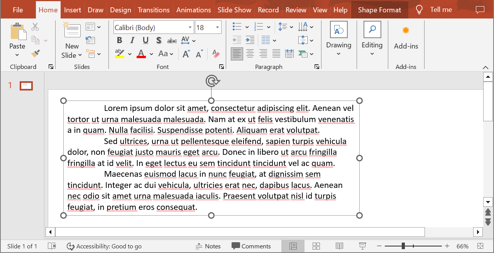

Aspose.Slides provides all the interfaces and classes you need to work with PowerPoint texts, paragraphs, and portions in C#.

* Aspose.Slides provides the [ITextFrame](https://reference.aspose.com/slides/net/aspose.slides/itextframe/) interface to allow you to add objects that represent a paragraph. An `ITextFame` object can have one or multiple paragraphs (each paragraph is created through a carriage return).
* Aspose.Slides provides the [IParagraph](https://reference.aspose.com/slides/net/aspose.slides/iparagraph/) interface to allow you to add objects that represent portions. An `IParagraph` object can have one or multiple portions (collection of iPortions objects).
* Aspose.Slides provides [IPortion](https://reference.aspose.com/slides/net/aspose.slides/iportion/) interface to allow you to add objects that represent texts and their formatting properties. 

An `IParagraph` object is capable of handling texts with different formatting properties through its underlying `IPortion` objects.

## **Add Multiple Paragraph Containing Multiple Portions**

These steps show you how to add a text frame containing 3 paragraphs and each paragraph containing 3 portions:

1. Create an instance of the [Presentation](https://reference.aspose.com/slides/net/aspose.slides/presentation) class.
2. Access the relevant slide's reference through its index.
3. Add a Rectangle [IAutoShape](https://reference.aspose.com/slides/net/aspose.slides/iautoshape/) to the slide.
4. Get the ITextFrame associated with the [IAutoShape](https://reference.aspose.com/slides/net/aspose.slides/iautoshape/).
5. Create two [IParagraph](https://reference.aspose.com/slides/net/aspose.slides/iparagraph/) objects and add them to the `IParagraphs` collection of the [ITextFrame](https://reference.aspose.com/slides/net/aspose.slides/iautoshape/).
6. Create three [IPortion](https://reference.aspose.com/slides/net/aspose.slides/iportion/) objects for each new `IParagraph` (two Portion objects for default Paragraph) and add each `IPortion` object to the IPortion collection of each `IParagraph`.
7. Set some text for each portion.
8. Apply your preferred formatting features to each portion using the formatting properties exposed by the `IPortion` object.
9. Save the modified presentation.

This C# code is an implementation of the steps for adding paragraphs containing portions:

```c#
// Instantiates a Presentation class that represents a PPTX file
using (Presentation pres = new Presentation())
{
    // Accesses the first slide
    ISlide slide = pres.Slides[0];

    // Adds a Rectangle IAutoShape
    IAutoShape ashp = slide.Shapes.AddAutoShape(ShapeType.Rectangle, 50, 150, 300, 150);

    // Accesses the AutoShape TextFrame
    ITextFrame tf = ashp.TextFrame;

    // Creates Paragraphs and Portions with different text formats
    IParagraph para0 = tf.Paragraphs[0];
    IPortion port01 = new Portion();
    IPortion port02 = new Portion();
    para0.Portions.Add(port01);
    para0.Portions.Add(port02);

    IParagraph para1 = new Paragraph();
    tf.Paragraphs.Add(para1);
    IPortion port10 = new Portion();
    IPortion port11 = new Portion();
    IPortion port12 = new Portion();
    para1.Portions.Add(port10);
    para1.Portions.Add(port11);
    para1.Portions.Add(port12);

    IParagraph para2 = new Paragraph();
    tf.Paragraphs.Add(para2);
    IPortion port20 = new Portion();
    IPortion port21 = new Portion();
    IPortion port22 = new Portion();
    para2.Portions.Add(port20);
    para2.Portions.Add(port21);
    para2.Portions.Add(port22);

    for (int i = 0; i < 3; i++)
        for (int j = 0; j < 3; j++)
        {
            tf.Paragraphs[i].Portions[j].Text = "Portion0" + j.ToString();
            if (j == 0)
            {
                tf.Paragraphs[i].Portions[j].PortionFormat.FillFormat.FillType = FillType.Solid;
                tf.Paragraphs[i].Portions[j].PortionFormat.FillFormat.SolidFillColor.Color = Color.Red;
                tf.Paragraphs[i].Portions[j].PortionFormat.FontBold = NullableBool.True;
                tf.Paragraphs[i].Portions[j].PortionFormat.FontHeight = 15;
            }
            else if (j == 1)
            {
                tf.Paragraphs[i].Portions[j].PortionFormat.FillFormat.FillType = FillType.Solid;
                tf.Paragraphs[i].Portions[j].PortionFormat.FillFormat.SolidFillColor.Color = Color.Blue;
                tf.Paragraphs[i].Portions[j].PortionFormat.FontItalic = NullableBool.True;
                tf.Paragraphs[i].Portions[j].PortionFormat.FontHeight = 18;
            }
        }
    // Saves the modified presentation
    pres.Save("multiParaPort_out.pptx", SaveFormat.Pptx);

```


## **Manage Paragraph Bullets**
Bullet lists help you to organize and present information quickly and efficiently. Bulleted paragraphs are always easier to read and understand.

1. Create an instance of the [Presentation](https://reference.aspose.com/slides/net/aspose.slides/presentation) class.
2. Access the relevant slide's reference through its index.
3. Add an [autoshape](https://reference.aspose.com/slides/net/aspose.slides/iautoshape/) to the selected slide.
4. Access the autoshape's [TextFrame](https://reference.aspose.com/slides/net/aspose.slides/itextframe/). 
5. Remove the default paragraph in the `TextFrame`.
6. Create the first paragraph instance using the [Paragraph](https://reference.aspose.com/slides/net/aspose.slides/paragraph/) class.
8. Set the bullet `Type` for the paragraph to `Symbol` and set the bullet character.
9. Set the paragraph `Text`.
10. Set the paragraph `Indent` for the bullet.
11. Set a color for the bullet.
12. Set a height of the bullet.
13. Add the new paragraph to the `TextFrame` paragraph collection.
14. Add the second paragraph and repeat the process given in steps 7 to 13.
15. Save the presentation.

This C# code shows you how to add a paragraph bullet:

```c#
// Instantiates a Presentation class that represents a PPTX file
using (Presentation pres = new Presentation())
{

    // Accesses the first slide
    ISlide slide = pres.Slides[0];


    // Adds and accesses Autoshape
    IAutoShape aShp = slide.Shapes.AddAutoShape(ShapeType.Rectangle, 200, 200, 400, 200);

    // Accesses the autoshape text frame
    ITextFrame txtFrm = aShp.TextFrame;

    // Removes the default paragraph
    txtFrm.Paragraphs.RemoveAt(0);

    // Creates a paragraph
    Paragraph para = new Paragraph();

    // Sets a paragraph bullet style and symbol
    para.ParagraphFormat.Bullet.Type = BulletType.Symbol;
    para.ParagraphFormat.Bullet.Char = Convert.ToChar(8226);

    // Sets a paragraph text
    para.Text = "Welcome to Aspose.Slides";

    // Sets bullet indent
    para.ParagraphFormat.Indent = 25;

    // Sets bullet color
    para.ParagraphFormat.Bullet.Color.ColorType = ColorType.RGB;
    para.ParagraphFormat.Bullet.Color.Color = Color.Black;
    para.ParagraphFormat.Bullet.IsBulletHardColor = NullableBool.True; // set IsBulletHardColor to true to use own bullet color

    // Sets Bullet Height
    para.ParagraphFormat.Bullet.Height = 100;

    // Adds Paragraph to text frame
    txtFrm.Paragraphs.Add(para);

    // Creates second paragraph
    Paragraph para2 = new Paragraph();

    // Sets paragraph bullet type and style
    para2.ParagraphFormat.Bullet.Type = BulletType.Numbered;
    para2.ParagraphFormat.Bullet.NumberedBulletStyle = NumberedBulletStyle.BulletCircleNumWDBlackPlain;

    // Adds paragraph text
    para2.Text = "This is numbered bullet";

    // Sets bullet indent
    para2.ParagraphFormat.Indent = 25;

    para2.ParagraphFormat.Bullet.Color.ColorType = ColorType.RGB;
    para2.ParagraphFormat.Bullet.Color.Color = Color.Black;
    para2.ParagraphFormat.Bullet.IsBulletHardColor = NullableBool.True; // set IsBulletHardColor to true to use own bullet color

    // Sets Bullet Height
    para2.ParagraphFormat.Bullet.Height = 100;

    // Adds Paragraph to text frame
    txtFrm.Paragraphs.Add(para2);


    // Saves the modified presentation
    pres.Save("Bullet_out.pptx", SaveFormat.Pptx);

}
```


## **Manage Picture Bullets**
Bullet lists help you to organize and present information quickly and efficiently. Picture paragraphs are easy to read and understand.

1. Create an instance of the [Presentation](https://reference.aspose.com/slides/net/aspose.slides/presentation) class.
2. Access the relevant slide's reference through its index.
3. Add an [autoshape](https://reference.aspose.com/slides/net/aspose.slides/iautoshape/) to the slide.
4. Access the autoshape's [TextFrame](https://reference.aspose.com/slides/net/aspose.slides/textframe/).
5. Remove the default paragraph in the `TextFrame`.
6. Create the first paragraph instance using the [Paragraph](https://reference.aspose.com/slides/net/aspose.slides/paragraph/) class.
7. Load the image in [IPPImage](https://reference.aspose.com/slides/net/aspose.slides/ippimage/).
8. Set the bullet type to [Picture](https://reference.aspose.com/slides/net/aspose.slides/ippimage/) and set the image.
9. Set the Paragraph `Text`.
10. Set the Paragraph `Indent` for the bullet.
11. Set a color for the bullet.
12. Set a height for the bullet.
13. Add the new paragraph to the `TextFrame` paragraph collection.
14. Add the second paragraph and repeat the process based on the previous steps.
15. Save the modified presentation.

This C# code shows you how to add and manage picture bullets:

```c#
// Instantiates a Presentation class that represents a PPTX file
Presentation presentation = new Presentation();

// Accesses the first slide
ISlide slide = presentation.Slides[0];

// Instantiates the image for bullets
IImage image = Images.FromFile("bullets.png");
IPPImage ippxImage = presentation.Images.AddImage(image);
image.Dispose();

// Adds and accesses Autoshape
IAutoShape autoShape = slide.Shapes.AddAutoShape(ShapeType.Rectangle, 200, 200, 400, 200);

// Accesses the autoshape textframe
ITextFrame textFrame = autoShape.TextFrame;

// Removes the default paragraph
textFrame.Paragraphs.RemoveAt(0);

// Creates a new paragraph
Paragraph paragraph = new Paragraph();
paragraph.Text = "Welcome to Aspose.Slides";

// Sets paragraph bullet style and image
paragraph.ParagraphFormat.Bullet.Type = BulletType.Picture;
paragraph.ParagraphFormat.Bullet.Picture.Image = ippxImage;

// Sets bullet Height
paragraph.ParagraphFormat.Bullet.Height = 100;

// Adds paragraph to text frame
textFrame.Paragraphs.Add(paragraph);

// Writes the presentation as a PPTX file
presentation.Save("ParagraphPictureBulletsPPTX_out.pptx", SaveFormat.Pptx);

// Writes the presentation as a PPT file
presentation.Save("ParagraphPictureBulletsPPT_out.ppt", SaveFormat.Ppt);
```


## **Manage Multilevel Bullets**
Bullet lists help you to organize and present information quickly and efficiently. Multilevel bullets are easy to read and understand.

1. Create an instance of the [Presentation ](https://reference.aspose.com/slides/net/aspose.slides/presentation)class.
2. Access the relevant slide's reference through its index.
3. Add an [autoshape](https://reference.aspose.com/slides/net/aspose.slides/iautoshape/) in the new slide.
4. Access the autoshape's [TextFrame](https://reference.aspose.com/slides/net/aspose.slides/textframe/).
5. Remove the default paragraph in the `TextFrame`.
6. Create the first paragraph instance through the [Paragraph](https://reference.aspose.com/slides/net/aspose.slides/paragraph/) class and set the depth to 0.
7. Create the second paragraph instance through the `Paragraph` class and set the depth set to 1.
8. Create the third paragraph instance through the `Paragraph` class and set the depth set to 2.
9. Create the fourth paragraph instance through the `Paragraph` class and set the depth set to 3.
10. Add the new paragraphs to the `TextFrame` paragraph collection.
11. Save the modified presentation.

This C# code shows you how to add and manage multilevel bullets:

```c#
// Instantiates a Presentation class that represents a PPTX file
using (Presentation pres = new Presentation())
{

    // Accesses the first slide
    ISlide slide = pres.Slides[0];
    
    // Adds and accesses Autoshape
    IAutoShape aShp = slide.Shapes.AddAutoShape(ShapeType.Rectangle, 200, 200, 400, 200);

    // Accesses the text frame of created autoshape
    ITextFrame text = aShp.AddTextFrame("");
    
    // Clears the default paragraph
    text.Paragraphs.Clear();

    // Adds the first paragraph
    IParagraph para1 = new Paragraph();
    para1.Text = "Content";
    para1.ParagraphFormat.Bullet.Type = BulletType.Symbol;
    para1.ParagraphFormat.Bullet.Char = Convert.ToChar(8226);
    para1.ParagraphFormat.DefaultPortionFormat.FillFormat.FillType = FillType.Solid;
    para1.ParagraphFormat.DefaultPortionFormat.FillFormat.SolidFillColor.Color = Color.Black;
    // Sets the bullet level
    para1.ParagraphFormat.Depth = 0;

    // Adds the second paragraph
    IParagraph para2 = new Paragraph();
    para2.Text = "Second Level";
    para2.ParagraphFormat.Bullet.Type = BulletType.Symbol;
    para2.ParagraphFormat.Bullet.Char = '-';
    para2.ParagraphFormat.DefaultPortionFormat.FillFormat.FillType = FillType.Solid;
    para2.ParagraphFormat.DefaultPortionFormat.FillFormat.SolidFillColor.Color = Color.Black;
    // Sets the bullet level
    para2.ParagraphFormat.Depth = 1;

    // Adds the third paragraph
    IParagraph para3 = new Paragraph();
    para3.Text = "Third Level";
    para3.ParagraphFormat.Bullet.Type = BulletType.Symbol;
    para3.ParagraphFormat.Bullet.Char = Convert.ToChar(8226);
    para3.ParagraphFormat.DefaultPortionFormat.FillFormat.FillType = FillType.Solid;
    para3.ParagraphFormat.DefaultPortionFormat.FillFormat.SolidFillColor.Color = Color.Black;
    // Sets the bullet level
    para3.ParagraphFormat.Depth = 2;

    // Adds the fourth paragraph
    IParagraph para4 = new Paragraph();
    para4.Text = "Fourth Level";
    para4.ParagraphFormat.Bullet.Type = BulletType.Symbol;
    para4.ParagraphFormat.Bullet.Char = '-';
    para4.ParagraphFormat.DefaultPortionFormat.FillFormat.FillType = FillType.Solid;
    para4.ParagraphFormat.DefaultPortionFormat.FillFormat.SolidFillColor.Color = Color.Black;
    // Sets the bullet level
    para4.ParagraphFormat.Depth = 3;

    // Adds paragraphs to collection
    text.Paragraphs.Add(para1);
    text.Paragraphs.Add(para2);
    text.Paragraphs.Add(para3);
    text.Paragraphs.Add(para4);

    // Writes the presentation as a PPTX file
    pres.Save("MultilevelBullet.pptx", Aspose.Slides.Export.SaveFormat.Pptx);
}
```


## **Manage Paragraph with Custom Numbered List**
The [IBulletFormat](https://reference.aspose.com/slides/net/aspose.slides/ibulletformat/) interface provides the [NumberedBulletStartWith](https://reference.aspose.com/slides/net/aspose.slides/ibulletformat/numberedbulletstartwith) property and others that allow you to manage paragraphs with custom numbering or formatting. 

1. Create an instance of the [Presentation ](https://reference.aspose.com/slides/net/aspose.slides/presentation)class.
2. Access the slide containing the paragraph.
3. Add an [autoshape](https://reference.aspose.com/slides/net/aspose.slides/iautoshape/) to the slide.
4. Access the autoshape [TextFrame](https://reference.aspose.com/slides/net/aspose.slides/textframe/).
5. Remove the default paragraph in the `TextFrame`.
6. Create the first paragraph instance through the [Paragraph](https://reference.aspose.com/slides/net/aspose.slides/paragraph/) class and set [NumberedBulletStartWith](https://reference.aspose.com/slides/net/aspose.slides/ibulletformat/numberedbulletstartwith) to 2.
7. Create the second paragraph instance through the `Paragraph` class and set `NumberedBulletStartWith` to 3.
8. Create the third paragraph instance through the `Paragraph` class and set `NumberedBulletStartWith` to 7.
9. Add the new paragraphs to the `TextFrame` paragraph collection.
10. Save the modified presentation.

This C# code shows you how to add and manage paragraphs with custom numbering or formatting:

```c#
using (var presentation = new Presentation())
{
	var shape = presentation.Slides[0].Shapes.AddAutoShape(ShapeType.Rectangle, 200, 200, 400, 200);

	// Accesses the text frame of created autoshape
	ITextFrame textFrame = shape.TextFrame;

	// Removes the default exisiting paragraph
	textFrame.Paragraphs.RemoveAt(0);

	// First list
	var paragraph1 = new Paragraph { Text = "bullet 2" };
	paragraph1.ParagraphFormat.Depth = 4; 
	paragraph1.ParagraphFormat.Bullet.NumberedBulletStartWith = 2;
	paragraph1.ParagraphFormat.Bullet.Type = BulletType.Numbered;
	textFrame.Paragraphs.Add(paragraph1);

	var paragraph2 = new Paragraph { Text = "bullet 3" };
	paragraph2.ParagraphFormat.Depth = 4;
	paragraph2.ParagraphFormat.Bullet.NumberedBulletStartWith = 3; 
	paragraph2.ParagraphFormat.Bullet.Type = BulletType.Numbered;  
	textFrame.Paragraphs.Add(paragraph2);

	
	var paragraph5 = new Paragraph { Text = "bullet 7" };
	paragraph5.ParagraphFormat.Depth = 4;
	paragraph5.ParagraphFormat.Bullet.NumberedBulletStartWith = 7;
	paragraph5.ParagraphFormat.Bullet.Type = BulletType.Numbered;
	textFrame.Paragraphs.Add(paragraph5);

	presentation.Save("SetCustomBulletsNumber-slides.pptx", SaveFormat.Pptx);
}
```


## **Set Paragraph Indent**
1. Create an instance of [Presentation](https://reference.aspose.com/slides/net/aspose.slides/presentation) class.
1. Access the relevant slide's reference through its index.
1. Add a rectangle [autoshape](https://reference.aspose.com/slides/net/aspose.slides/iautoshape/) to the slide.
1. Add a [TextFrame](https://reference.aspose.com/slides/net/aspose.slides/textframe/) with three paragraphs to the rectangle autoshape.
1. Hide the rectangle lines.
1. Set the indent for each [Paragraph](https://reference.aspose.com/slides/net/aspose.slides/paragraph/) through their BulletOffset property.
1. Write the modified presentation as a PPT file.

This C# code shows you how to set a paragraph indent:

```c#
// Instantiate Presentation Class
Presentation pres = new Presentation();

// Gets the first slide
ISlide sld = pres.Slides[0];

// Adds a Rectangle Shape
IAutoShape rect = sld.Shapes.AddAutoShape(ShapeType.Rectangle, 100, 100, 500, 150);

// Adds TextFrame to the Rectangle
ITextFrame tf = rect.AddTextFrame("This is first line \rThis is second line \rThis is third line");

// Sets the text to fit the shape
tf.TextFrameFormat.AutofitType = TextAutofitType.Shape;

// Hides the lines of the Rectangle
rect.LineFormat.FillFormat.FillType = FillType.Solid;

// Gets the first Paragraph in the TextFrame and set its Indent
IParagraph para1 = tf.Paragraphs[0];

// Sets paragraph bullet style and symbol
para1.ParagraphFormat.Bullet.Type = BulletType.Symbol;
para1.ParagraphFormat.Bullet.Char = Convert.ToChar(8226);
para1.ParagraphFormat.Alignment = TextAlignment.Left;

para1.ParagraphFormat.Depth = 2;
para1.ParagraphFormat.Indent = 30;

// Gets second Paragraph in the TextFrame and set its Indent
IParagraph para2 = tf.Paragraphs[1];
para2.ParagraphFormat.Bullet.Type = BulletType.Symbol;
para2.ParagraphFormat.Bullet.Char = Convert.ToChar(8226);
para2.ParagraphFormat.Alignment = TextAlignment.Left;
para2.ParagraphFormat.Depth = 2;
para2.ParagraphFormat.Indent = 40;

// Gets third Paragraph in the TextFrame and sets its Indent
IParagraph para3 = tf.Paragraphs[2];
para3.ParagraphFormat.Bullet.Type = BulletType.Symbol;
para3.ParagraphFormat.Bullet.Char = Convert.ToChar(8226);
para3.ParagraphFormat.Alignment = TextAlignment.Left;
para3.ParagraphFormat.Depth = 2;
para3.ParagraphFormat.Indent = 50;

// Writes the Presentation to disk
pres.Save("InOutDent_out.pptx", SaveFormat.Pptx);
```

## **Set Hanging Indent for Paragraph**

This C# code shows you how to set the hanging indent for a paragraph:  

```c#
using (Presentation pres = new Presentation())
{
    var autoShape = pres.Slides[0].Shapes.AddAutoShape(ShapeType.Rectangle, 50, 250, 550, 150);

    Paragraph para1 = new Paragraph
    {
        Text = "Example"
    };
    Paragraph para2 = new Paragraph
    {
        Text = "Set Hanging Indent for Paragraph"
    };
    Paragraph para3 = new Paragraph
    {
        Text = "This C# code shows you how to set the hanging indent for a paragraph: "
    };

    para2.ParagraphFormat.MarginLeft = 10f;
    para3.ParagraphFormat.MarginLeft = 20f;
    
    autoShape.TextFrame.Paragraphs.Add(para1);
    autoShape.TextFrame.Paragraphs.Add(para2);
    autoShape.TextFrame.Paragraphs.Add(para3);
    
    pres.Save("pres.pptx", SaveFormat.Pptx);
}
```

## **Manage End Paragraph Run Properties for Paragraph**

1. Create an instance of [Presentation](https://reference.aspose.com/slides/net/aspose.slides/presentation) class.
1. Get the reference for the slide containing the paragraph through its position.
1. Add a rectangle [autoshape](https://reference.aspose.com/slides/net/aspose.slides/autoshape/) to the slide.
1. Add a [TextFrame](https://reference.aspose.com/slides/net/aspose.slides/textframe/) with two paragraphs to the Rectangle.
1. Set the `FontHeight` and Font type for the paragraphs.
1. Set the End properties for the paragraphs.
1. Write the modified presentation as a PPTX file.

This C# code shows you how to set the End properties for paragraphs in PowerPoint:

```c#
using (Presentation pres = new Presentation("Test.pptx"))
{
	IAutoShape shape = pres.Slides[0].Shapes.AddAutoShape(ShapeType.Rectangle, 10, 10, 200, 250);

	Paragraph para1 = new Paragraph();
	para1.Portions.Add(new Portion("Sample text"));

	Paragraph para2 = new Paragraph();
	para2.Portions.Add(new Portion("Sample text 2"));
	PortionFormat endParagraphPortionFormat = new PortionFormat();
	endParagraphPortionFormat.FontHeight = 48;
	endParagraphPortionFormat.LatinFont = new FontData("Times New Roman");
	para2.EndParagraphPortionFormat = endParagraphPortionFormat;

	shape.TextFrame.Paragraphs.Add(para1);
	shape.TextFrame.Paragraphs.Add(para2);

	pres.Save("pres.pptx", SaveFormat.Pptx);
}
```


## **Import HTML Text into Paragraphs**
Aspose.Slides provides enhanced support for importing HTML text into paragraphs.

1. Create an instance of the [Presentation](https://reference.aspose.com/slides/net/aspose.slides/presentation) class.
2. Access the relevant slide's reference through its index.
3. Add an [autoshape](https://reference.aspose.com/slides/net/aspose.slides/autoshape/) to the slide.
4. Add and access `autoshape` [ITextFrame](https://reference.aspose.com/slides/net/aspose.slides/itextframe/).
5. Remove the default paragraph in the `ITextFrame`.
6. Read the source HTML file in a TextReader.
7. Create the first paragraph instance through the [Paragraph](https://reference.aspose.com/slides/net/aspose.slides/paragraph/) class.
8. Add the HTML file content in the read TextReader to the TextFrame's [ParagraphCollection](https://reference.aspose.com/slides/net/aspose.slides/paragraphcollection/).
9. Save the modified presentation.

This C# code is an implementation of the steps for importing HTML texts in paragraphs:

```c#
// Creates Empty presentation instance
using (Presentation pres = new Presentation())
{
    // Acessses the default first slide of presentation
    ISlide slide = pres.Slides[0];

    // Adds the AutoShape to house the HTML content
    IAutoShape ashape = slide.Shapes.AddAutoShape(ShapeType.Rectangle, 10, 10, pres.SlideSize.Size.Width - 20, pres.SlideSize.Size.Height - 10);

    ashape.FillFormat.FillType = FillType.NoFill;

    // Adds text frame to the shape
    ashape.AddTextFrame("");

    // Clears all paragraphs in the added text frame
    ashape.TextFrame.Paragraphs.Clear();

    // Loads the HTML file using stream reader
    TextReader tr = new StreamReader("file.html");

    // Adds the text from HTML stream reader in text frame
    ashape.TextFrame.Paragraphs.AddFromHtml(tr.ReadToEnd());

    // Saves Presentation
    pres.Save("output_out.pptx", Aspose.Slides.Export.SaveFormat.Pptx);
}
```


## **Export Paragraphs Text to HTML**
Aspose.Slides provides enhanced support for exporting texts (contained in paragraphs) to HTML.

1. Create an instance of the [Presentation](https://reference.aspose.com/slides/net/aspose.slides/presentation) class and load the desired presentation.
2. Access the relevant slide's reference through its index.
3. Access the shape containing the text that will be exported to HTML.
4. Access the shape [TextFrame](https://reference.aspose.com/slides/net/aspose.slides/textframe/).
5. Create an instance of `StreamWriter` and add the new HTML file.
6. Provide a starting index to StreamWriter and export your preferred paragraphs.

This C# code shows you how to export PowerPoint paragraph texts to HTML:

```c#
// Loads the presentation file
using (Presentation pres = new Presentation("ExportingHTMLText.pptx"))
{

    // Acessses the default first slide of presentation
    ISlide slide = pres.Slides[0];

    // Accesses the required  index
    int index = 0;

    // Accesses the added shape
    IAutoShape ashape = (IAutoShape)slide.Shapes[index];

    StreamWriter sw = new StreamWriter("output_out.html", false, Encoding.UTF8);

    // Writes paragraphs data to HTML by specifying paragraph starting index and number of paragraphs to be copied
    sw.Write(ashape.TextFrame.Paragraphs.ExportToHtml(0, ashape.TextFrame.Paragraphs.Count, null));

    sw.Close();
}
```

## **Save a Paragraph as an Image**

In this section, we will explore two examples that demonstrate how to save a text paragraph, represented by the [IParagraph](https://reference.aspose.com/slides/net/aspose.slides/iparagraph/) interface, as an image. Both examples include obtaining the image of a shape containing the paragraph using the `GetImage` methods from the [IShape](https://reference.aspose.com/slides/net/aspose.slides/ishape/) interface, calculating the bounds of the paragraph within the shape, and exporting it as a bitmap image. These approaches allow you to extract specific parts of the text from PowerPoint presentations and save them as separate images, which can be useful for further use in various scenarios.

Let's assume we have a presentation file called sample.pptx with one slide, where the first shape is a text box containing three paragraphs.



**Example 1**

In this example, we obtain the second paragraph as an image. To do this, we extract the image of the shape from the first slide of the presentation and then calculate the bounds of the second paragraph in the shape's text frame. The paragraph is then redrawn onto a new bitmap image, which is saved in PNG format. This method is especially useful when you need to save a specific paragraph as a separate image while preserving the exact dimensions and formatting of the text.

```csharp
using var presentation = new Presentation("sample.pptx");
var firstShape = presentation.Slides[0].Shapes[0] as IAutoShape;

// Save the shape in memory as a bitmap.
using var shapeImage = firstShape.GetImage();
using var shapeImageStream = new MemoryStream();
shapeImage.Save(shapeImageStream, ImageFormat.Png);

// Create a shape bitmap from memory.
shapeImageStream.Seek(0, SeekOrigin.Begin);
using var shapeBitmap = Image.FromStream(shapeImageStream);

// Calculate the boundaries of the second paragraph.
var secondParagraph = firstShape.TextFrame.Paragraphs[1];
var paragraphRectangle = secondParagraph.GetRect();

// Calculate the size for the output image (minimum size - 1x1 pixel).
var imageWidth = Math.Max(1, (int)Math.Ceiling(paragraphRectangle.Width));
var imageHeight = Math.Max(1, (int)Math.Ceiling(paragraphRectangle.Height));

// Prepare a bitmap for the paragraph.
using var paragraphBitmap = new Bitmap(imageWidth, imageHeight);

// Redraw the paragraph from the shape bitmap to the paragraph bitmap.
using var imageGraphics = Graphics.FromImage(paragraphBitmap);
var drawingRectangle = new RectangleF(0, 0, paragraphRectangle.Width, paragraphRectangle.Height);
imageGraphics.DrawImage(shapeBitmap, drawingRectangle, paragraphRectangle, GraphicsUnit.Pixel);

paragraphBitmap.Save("paragraph.png", System.Drawing.Imaging.ImageFormat.Png);
```

The result:


**Example 2**

In this example, we extend the previous approach by adding scaling factors to the paragraph image. The shape is extracted from the presentation and saved as an image with a scaling factor of `2`. This allows for a higher resolution output when exporting the paragraph. The paragraph bounds are then calculated considering the scale. Scaling can be particularly useful when a more detailed image is needed, for example, for use in high-quality printed materials.

```csharp
var imageScaleX = 2f;
var imageScaleY = imageScaleX;

using var presentation = new Presentation("sample.pptx");
var firstShape = presentation.Slides[0].Shapes[0] as IAutoShape;

// Save the shape in memory as a bitmap with scaling.
using var shapeImage = firstShape.GetImage(ShapeThumbnailBounds.Shape, imageScaleX, imageScaleY);
using var shapeImageStream = new MemoryStream();
shapeImage.Save(shapeImageStream, ImageFormat.Png);

// Create a shape bitmap from memory.
shapeImageStream.Seek(0, SeekOrigin.Begin);
using var shapeBitmap = Image.FromStream(shapeImageStream);

// Calculate the boundaries of the second paragraph.
var secondParagraph = firstShape.TextFrame.Paragraphs[1];
var paragraphRectangle = secondParagraph.GetRect();
paragraphRectangle.X *= imageScaleX;
paragraphRectangle.Y *= imageScaleY;
paragraphRectangle.Width *= imageScaleX;
paragraphRectangle.Height *= imageScaleY;

// Calculate the size for the output image (minimum size - 1x1 pixel).
var imageWidth = Math.Max(1, (int)Math.Ceiling(paragraphRectangle.Width));
var imageHeight = Math.Max(1, (int)Math.Ceiling(paragraphRectangle.Height));

// Prepare a bitmap for the paragraph.
using var paragraphBitmap = new Bitmap(imageWidth, imageHeight);

// Redraw the paragraph from the shape bitmap to the paragraph bitmap.
using var imageGraphics = Graphics.FromImage(paragraphBitmap);
var drawingRectangle = new RectangleF(0, 0, paragraphRectangle.Width, paragraphRectangle.Height);
imageGraphics.DrawImage(shapeBitmap, drawingRectangle, paragraphRectangle, GraphicsUnit.Pixel);

paragraphBitmap.Save("paragraph.png", System.Drawing.Imaging.ImageFormat.Png);
```

## **FAQ**

**Can I completely disable line wrapping inside a text frame?**

Yes. Use the text frame’s wrapping setting ([WrapText](https://reference.aspose.com/slides/net/aspose.slides/textframeformat/wraptext/)) to turn wrapping off so lines won’t break at the frame’s edges.

**How can I get the exact on-slide bounds of a specific paragraph?**

You can retrieve the paragraph’s (and even a single portion’s) bounding rectangle to know its precise position and size on the slide.

**Where is paragraph alignment (left/right/center/justify) controlled?**

[Alignment](https://reference.aspose.com/slides/net/aspose.slides/paragraphformat/alignment/) is a paragraph-level setting in [ParagraphFormat](https://reference.aspose.com/slides/net/aspose.slides/paragraphformat/); it applies to the whole paragraph regardless of individual portion formatting.

**Can I set a spell-check language for just part of a paragraph (e.g., one word)?**

Yes. The language is set at the portion level ([PortionFormat.LanguageId](https://reference.aspose.com/slides/net/aspose.slides/baseportionformat/languageid/)), so multiple languages can coexist within a single paragraph.
