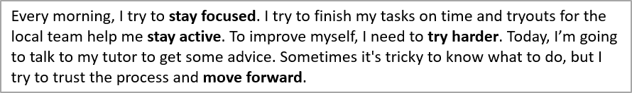

## **Overview**

Aspose.Slides for .NET can search, highlight, and replace text in an individual text frame or across an entire presentation. Each operation can also notify an application about every match through a result callback. This makes it possible to update a presentation and simultaneously build an audit trail containing the matched text, its context, position, text frame, and slide number.

These capabilities are useful for review, redaction, terminology checks, template cleanup, and automated reporting workflows.

In the first examples below, we use a file named "sample.pptx", which contains a single text box on the first slide with the following text:



## **Choose the Search Scope**

Use methods on [ITextFrame](https://reference.aspose.com/slides/net/aspose.slides/itextframe/) to limit an operation to one text frame. Use methods on [Presentation](https://reference.aspose.com/slides/net/aspose.slides/presentation/) to process all applicable text in the presentation.

| Operation | One text frame | Entire presentation |
|---|---|---|
| Highlight literal text | [ITextFrame.HighlightText](https://reference.aspose.com/slides/net/aspose.slides/itextframe/highlighttext/) | [Presentation.HighlightText](https://reference.aspose.com/slides/net/aspose.slides/presentation/highlighttext/) |
| Highlight regular-expression matches | [ITextFrame.HighlightRegex](https://reference.aspose.com/slides/net/aspose.slides/itextframe/highlightregex/) | [Presentation.HighlightRegex](https://reference.aspose.com/slides/net/aspose.slides/presentation/highlightregex/) |
| Replace literal text | [ITextFrame.ReplaceText](https://reference.aspose.com/slides/net/aspose.slides/itextframe/replacetext/) | [Presentation.ReplaceText](https://reference.aspose.com/slides/net/aspose.slides/presentation/replacetext/) |
| Replace regular-expression matches | [ITextFrame.ReplaceRegex](https://reference.aspose.com/slides/net/aspose.slides/itextframe/replaceregex/) | [Presentation.ReplaceRegex](https://reference.aspose.com/slides/net/aspose.slides/presentation/replaceregex/) |

## **Configure Text Matching**

For literal-text operations, use [TextSearchOptions](https://reference.aspose.com/slides/net/aspose.slides/textsearchoptions/) to control matching:

- [TextSearchOptions.WholeWordsOnly](https://reference.aspose.com/slides/net/aspose.slides/textsearchoptions/wholewordsonly/) limits matches to complete words.
- [TextSearchOptions.CaseSensitive](https://reference.aspose.com/slides/net/aspose.slides/textsearchoptions/casesensitive/) controls whether character case must match.
- [TextSearchOptions.IncludeNotes](https://reference.aspose.com/slides/net/aspose.slides/textsearchoptions/includenotes/) includes slide notes in presentation-level search, replacement, and highlighting operations.

Regular-expression operations use a .NET `Regex`, so matching rules such as case sensitivity and word boundaries are defined by the expression and its options.

## **Identify the Owner of a Text Frame**

Generic text-processing workflows often receive an [ITextFrame](https://reference.aspose.com/slides/net/aspose.slides/itextframe/) while searching, replacing, validating, or exporting text. Use [ITextFrame.ParentShape](https://reference.aspose.com/slides/net/aspose.slides/itextframe/parentshape/) and [ITextFrame.ParentCell](https://reference.aspose.com/slides/net/aspose.slides/itextframe/parentcell/) to determine which presentation object owns the text frame.

The expected values depend on the owner:

| Text frame owner | `ParentShape` | `ParentCell` |
|---|---|---|
| An AutoShape or another text-containing shape | The owning [IShape](https://reference.aspose.com/slides/net/aspose.slides/ishape/) | `null` |
| A table cell | `null` | The owning [ICell](https://reference.aspose.com/slides/net/aspose.slides/icell/) |

Both properties are read-only navigation properties. Reading them does not move the text frame or change its owner. Generic code should check both values for `null` and handle the possibility that neither owner is available.

The following example uses [SlideUtil.GetAllTextFrames](https://reference.aspose.com/slides/net/aspose.slides.util/slideutil/getalltextframes/) to iterate through the text frames in a presentation. For shapes, it reports the shape name, shape type, and containing slide. For table cells, it reports the zero-based column and row coordinates and the containing slide.

```cs
using System;
using Aspose.Slides;
using Aspose.Slides.Util;

using var presentation = new Presentation("presentation.pptx");

var textFrames = SlideUtil.GetAllTextFrames(presentation, false);

foreach (var textFrame in textFrames)
{
    var ownerShape = textFrame.ParentShape;
    if (ownerShape != null)
    {
        var shapeName = string.IsNullOrEmpty(ownerShape.Name) ? "(unnamed)" : ownerShape.Name;
        var shapeType = GetShapeType(ownerShape);
        var slideLabel = GetSlideLabel(ownerShape.Slide);
        Console.WriteLine($"Shape: {shapeName}; type: {shapeType}; {slideLabel}");

        continue;
    }

    var ownerCell = textFrame.ParentCell;
    if (ownerCell != null)
    {
        var slideLabel = GetSlideLabel(ownerCell.Slide);
        Console.WriteLine($"Table cell: column {ownerCell.FirstColumnIndex}, row {ownerCell.FirstRowIndex}; {slideLabel}");
        continue;
    }

    Console.WriteLine("The text frame owner is not available as a shape or table cell.");
}

static string GetShapeType(IShape shape)
{
    if (shape is IGeometryShape geometryShape)
    {
        return geometryShape.ShapeType.ToString();
    }

    return shape.GetType().Name;
}

static string GetSlideLabel(IBaseSlide baseSlide)
{
    if (baseSlide is ISlide slide)
    {
        return $"slide {slide.SlideNumber}";
    }

    if (baseSlide is INotesSlide notesSlide)
    {
        return $"notes for slide {notesSlide.ParentSlide.SlideNumber}";
    }

    return baseSlide.GetType().Name;
}
```

For SmartArt content, iterate through the shapes in [ISmartArtNode.Shapes](https://reference.aspose.com/slides/net/aspose.slides.smartart/ismartartnode/shapes/) and access each [ISmartArtShape.TextFrame](https://reference.aspose.com/slides/net/aspose.slides.smartart/ismartartshape/textframe/). The text frame can be traced to its associated shape through [ITextFrame.ParentShape](https://reference.aspose.com/slides/net/aspose.slides/itextframe/parentshape/), while [ITextFrame.ParentCell](https://reference.aspose.com/slides/net/aspose.slides/itextframe/parentcell/) is `null`. Therefore, the shape branch in the example also handles text from SmartArt nodes.

## **Collect Match Information with a Callback**

Implement [IFindResultCallback](https://reference.aspose.com/slides/net/aspose.slides/ifindresultcallback/) to receive a notification for every match. Its [IFindResultCallback.FoundResult](https://reference.aspose.com/slides/net/aspose.slides/ifindresultcallback/foundresult/) method provides the related text frame, the source text, the matched text, and the match position.

The callback does not receive a slide number directly. The implementation below derives it from the parent slide and also handles text found in slide notes. A nullable slide number allows the same result model to represent text associated with other slide types.

```cs
using System.Collections.Generic;
using Aspose.Slides;

public sealed class TextMatch
{
    public TextMatch(ITextFrame textFrame, string sourceText, string foundText, int textPosition, int? slideNumber)
    {
        TextFrame = textFrame;
        SourceText = sourceText;
        FoundText = foundText;
        TextPosition = textPosition;
        SlideNumber = slideNumber;
    }

    public ITextFrame TextFrame { get; }
    public string SourceText { get; }
    public string FoundText { get; }
    public int TextPosition { get; }
    public int? SlideNumber { get; }
}

public sealed class TextSearchCallback : IFindResultCallback
{
    public List<TextMatch> Results { get; } = new();

    public void FoundResult(ITextFrame textFrame, string sourceText, string foundText, int textPosition)
    {
        var slideNumber = GetSlideNumber(textFrame);
        var result = new TextMatch(textFrame, sourceText, foundText, textPosition, slideNumber);

        Results.Add(result);
    }

    private static int? GetSlideNumber(ITextFrame textFrame)
    {
        var parentSlide = textFrame.ParentShape?.Slide ?? textFrame.ParentCell?.Slide ?? textFrame.Slide;

        if (parentSlide is ISlide slide)
        {
            return slide.SlideNumber;
        }

        if (parentSlide is INotesSlide notesSlide)
        {
            return notesSlide.ParentSlide.SlideNumber;
        }

        return null;
    }
}
```

For replacement operations, `FoundText` contains the original matched text, so the callback can record exactly which terms were replaced.

## **Highlight Text**

Use the [ITextFrame.HighlightText](https://reference.aspose.com/slides/net/aspose.slides/itextframe/highlighttext/) method to highlight literal-text matches in a text frame. Pass [TextSearchOptions](https://reference.aspose.com/slides/net/aspose.slides/textsearchoptions/) to control the search and a callback to collect match details.

The code example below highlights all occurrences of the characters **"try"** and then highlights only the complete word **"to"**. Both searches report their matches to the same callback.

```cs
using System;
using System.Drawing;
using Aspose.Slides;
using Aspose.Slides.Export;

using var presentation = new Presentation("sample.pptx");

// Get the first shape from the first slide.
var shape = (IAutoShape)presentation.Slides[0].Shapes[0];
var callback = new TextSearchCallback();

var substringSearchOptions = new TextSearchOptions
{
    CaseSensitive = false
};

// Highlight every occurrence of "try" in the text frame.
shape.TextFrame.HighlightText("try", Color.LightBlue, substringSearchOptions, callback);

var wholeWordSearchOptions = new TextSearchOptions
{
    WholeWordsOnly = true,
    CaseSensitive = false
};

// Highlight only the complete word "to".
shape.TextFrame.HighlightText("to", Color.Violet, wholeWordSearchOptions, callback);

foreach (var result in callback.Results)
{
    Console.WriteLine($"Found '{result.FoundText}' at position {result.TextPosition} on slide {result.SlideNumber}.");
}

presentation.Save("highlighted_text.pptx", SaveFormat.Pptx);
```

The result:


## **Highlight Text Using Regular Expressions**

The [ITextFrame.HighlightRegex](https://reference.aspose.com/slides/net/aspose.slides/itextframe/highlightregex/) method highlights text matches found by a regular expression in a text frame.

The following code highlights all words containing seven or more characters and collects each match:

```cs
using System.Drawing;
using System.Text.RegularExpressions;
using Aspose.Slides;
using Aspose.Slides.Export;

using var presentation = new Presentation("sample.pptx");

var shape = (IAutoShape)presentation.Slides[0].Shapes[0];
var callback = new TextSearchCallback();
var regex = new Regex(@"\b[^\s]{7,}\b");

shape.TextFrame.HighlightRegex(regex, Color.Yellow, callback);

presentation.Save("highlighted_text_using_regex.pptx", SaveFormat.Pptx);
```

The result:


## **Highlight Text Across a Presentation**

Use [Presentation.HighlightText](https://reference.aspose.com/slides/net/aspose.slides/presentation/highlighttext/) and [Presentation.HighlightRegex](https://reference.aspose.com/slides/net/aspose.slides/presentation/highlightregex/) to search all applicable text frames in a presentation. The following example highlights a literal term and all email addresses while keeping separate result collections for the two searches.

```cs
using System.Drawing;
using System.Text.RegularExpressions;
using Aspose.Slides;
using Aspose.Slides.Export;

using var presentation = new Presentation("presentation.pptx");

var termCallback = new TextSearchCallback();
var searchOptions = new TextSearchOptions
{
    WholeWordsOnly = true,
    CaseSensitive = false
};

presentation.HighlightText("confidential", Color.Orange, searchOptions, termCallback);

var emailCallback = new TextSearchCallback();
var emailRegex = new Regex(@"\b[A-Z0-9._%+-]+@[A-Z0-9.-]+\.[A-Z]{2,}\b", RegexOptions.IgnoreCase);

presentation.HighlightRegex(emailRegex, Color.Yellow, emailCallback);

presentation.Save("highlighted_presentation.pptx", SaveFormat.Pptx);
```

## **Replace Text in a Text Frame**

Use [ITextFrame.ReplaceText](https://reference.aspose.com/slides/net/aspose.slides/itextframe/replacetext/) for literal text and [ITextFrame.ReplaceRegex](https://reference.aspose.com/slides/net/aspose.slides/itextframe/replaceregex/) for pattern-based replacement. These methods update matched text within the existing text frame, which retains the surrounding portion formatting instead of rebuilding the text frame from a plain string.

The following example standardizes a spelling variant and then replaces version labels. The same callback records the original terms matched by both operations.

```cs
using System.Text.RegularExpressions;
using Aspose.Slides;
using Aspose.Slides.Export;

using var presentation = new Presentation("presentation.pptx");

var shape = (IAutoShape)presentation.Slides[0].Shapes[0];
var callback = new TextSearchCallback();
var searchOptions = new TextSearchOptions
{
    WholeWordsOnly = true,
    CaseSensitive = false
};

shape.TextFrame.ReplaceText("colour", "color", searchOptions, callback);

var versionRegex = new Regex(@"\bv\d+(?:\.\d+)*\b", RegexOptions.IgnoreCase);
shape.TextFrame.ReplaceRegex(versionRegex, "current version", callback);

presentation.Save("updated_text_frame.pptx", SaveFormat.Pptx);
```

If one match spans portions with different formatting, review the output to confirm which formatting should apply to the replacement text.

## **Replace Text Across a Presentation**

Use [Presentation.ReplaceText](https://reference.aspose.com/slides/net/aspose.slides/presentation/replacetext/) and [Presentation.ReplaceRegex](https://reference.aspose.com/slides/net/aspose.slides/presentation/replaceregex/) to apply the same operations across the presentation. This is useful for template cleanup, terminology updates, and redaction.

```cs
using System.Text.RegularExpressions;
using Aspose.Slides;
using Aspose.Slides.Export;

using var presentation = new Presentation("presentation.pptx");

var callback = new TextSearchCallback();
var searchOptions = new TextSearchOptions
{
    WholeWordsOnly = true,
    CaseSensitive = true
};

presentation.ReplaceText("Contoso", "Example Corp", searchOptions, callback);

var accountNumberRegex = new Regex(@"\bACCT-\d{6}\b");
presentation.ReplaceRegex(accountNumberRegex, "ACCT-REDACTED", callback);

presentation.Save("updated_presentation.pptx", SaveFormat.Pptx);
```

## **Group Matches for Reporting**

Because every result stores its slide number and text frame, applications can group matches for audit, reporting, or review workflows. The following example groups the collected results first by slide and then by text frame:

```cs
using System;
using System.Linq;

var matchesBySlide = callback.Results.GroupBy(result => result.SlideNumber);

foreach (var slideGroup in matchesBySlide)
{
    var slideLabel = slideGroup.Key.HasValue ? slideGroup.Key.Value.ToString() : "Other";
    Console.WriteLine($"Slide: {slideLabel}");

    var matchesByTextFrame = slideGroup.GroupBy(result => result.TextFrame);
    foreach (var textFrameGroup in matchesByTextFrame)
    {
        Console.WriteLine($"  Text frame: {textFrameGroup.Key.Text}");

        foreach (var result in textFrameGroup)
        {
            Console.WriteLine($"    '{result.FoundText}' at position {result.TextPosition}; context: '{result.SourceText}'");
        }
    }
}
```

## **FAQ**

**How can I search only one text box instead of the entire presentation?**

Get the shape's text frame and call [ITextFrame.HighlightText](https://reference.aspose.com/slides/net/aspose.slides/itextframe/highlighttext/), [ITextFrame.HighlightRegex](https://reference.aspose.com/slides/net/aspose.slides/itextframe/highlightregex/), [ITextFrame.ReplaceText](https://reference.aspose.com/slides/net/aspose.slides/itextframe/replacetext/), or [ITextFrame.ReplaceRegex](https://reference.aspose.com/slides/net/aspose.slides/itextframe/replaceregex/) on that text frame. Presentation-level methods process all applicable text frames instead.

**How can I match complete words with the correct capitalization?**

Set [TextSearchOptions.WholeWordsOnly](https://reference.aspose.com/slides/net/aspose.slides/textsearchoptions/wholewordsonly/) and [TextSearchOptions.CaseSensitive](https://reference.aspose.com/slides/net/aspose.slides/textsearchoptions/casesensitive/) to `true`, and pass the options to a literal-text highlighting or replacement method. For regular expressions, define word boundaries and case sensitivity in the .NET `Regex` itself.

**Can search and replacement include text in slide notes?**

Yes. Set [TextSearchOptions.IncludeNotes](https://reference.aspose.com/slides/net/aspose.slides/textsearchoptions/includenotes/) to `true` when using a presentation-level literal-text operation. The callback implementation shown above maps a match in a notes slide back to its parent slide number.

**How can I create a report without scanning the presentation a second time?**

Pass an [IFindResultCallback](https://reference.aspose.com/slides/net/aspose.slides/ifindresultcallback/) implementation to the highlighting or replacement operation. The callback receives every match while the operation runs, so the application can store the source text, matched text, position, text frame, and derived slide number for later grouping or export.

**Does replacing text preserve its formatting?**

[ITextFrame.ReplaceText](https://reference.aspose.com/slides/net/aspose.slides/itextframe/replacetext/) and [ITextFrame.ReplaceRegex](https://reference.aspose.com/slides/net/aspose.slides/itextframe/replaceregex/) modify matched text within the existing text frame and retain the surrounding portion formatting. If a match spans portions with different formatting, inspect the result to ensure the replacement uses the desired style.
