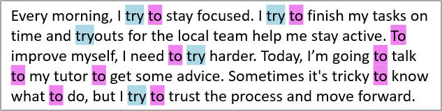
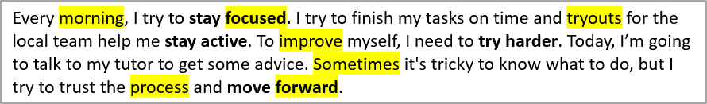

## **Overview**

This article shows how to format text in PowerPoint and OpenDocument presentations using Aspose.Slides for .NET. It covers highlighting, background colors, transparency, character spacing, font properties, rotation, paragraph spacing, autofit behavior, text anchoring, tab stops, and language settings.

In the examples below, we’ll use a file named "sample.pptx", which contains a single text box on the first slide with the following text:


## **Highlight Text**

Use the [ITextFrame.HighlightText](https://reference.aspose.com/slides/net/aspose.slides/itextframe/highlighttext/) method when you need to highlight text that matches a specific sample within a text frame. The method applies a highlight color to matching text fragments and can be used with [TextSearchOptions](https://reference.aspose.com/slides/net/aspose.slides/textsearchoptions/) to control how the search is performed, for example, to match only whole words.

The code example below highlights all occurrences of the characters **"try"** and then highlights only the full word **"to"**.

```cs
using (var presentation = new Presentation("sample.pptx"))
{
    // Get the first shape from the first slide.
    var shape = (IAutoShape)presentation.Slides[0].Shapes[0];

    // Highlight the word "try" in the shape.
    shape.TextFrame.HighlightText("try", Color.LightBlue);

    var searchOptions = new TextSearchOptions()
    {
        WholeWordsOnly = true
    };

    // Highlight the word "to" in the shape.
    shape.TextFrame.HighlightText("to", Color.Violet, searchOptions, null);

    presentation.Save("highlighted_text.pptx", SaveFormat.Pptx);
}
```

The result:



## **Highlight Text Using Regular Expressions**

The [ITextFrame.HighlightRegex](https://reference.aspose.com/slides/net/aspose.slides/itextframe/highlightregex/) method highlights text matches found by a regular expression. In .NET, this API is exposed on [ITextFrame](https://reference.aspose.com/slides/net/aspose.slides/itextframe/).

The code example below highlights all words that contain **seven or more characters**:

```cs
using (var presentation = new Presentation(folderPath + "sample.pptx"))
{
    var shape = (IAutoShape)presentation.Slides[0].Shapes[0];

    var regex = new Regex(@"\b[^\s]{7,}\b");

    // Highlight all words with seven or more characters.
    shape.TextFrame.HighlightRegex(regex, Color.Yellow, null);

    presentation.Save(folderPath + "highlighted_text_using_regex.pptx", SaveFormat.Pptx);
}
```

The result:



## **Set Text Background Color**

Use [IParagraphFormat.DefaultPortionFormat](https://reference.aspose.com/slides/net/aspose.slides/iparagraphformat/defaultportionformat/) to set the default highlight color for a paragraph, or use [IPortionFormat.HighlightColor](https://reference.aspose.com/slides/net/aspose.slides/iportionformat/highlightcolor/) for individual text portions.

The following code example shows how to set the background color for the **entire paragraph**: 

```cs
using (var presentation = new Presentation("sample.pptx"))
{
    var autoShape = (IAutoShape)presentation.Slides[0].Shapes[0];
    var paragraph = autoShape.TextFrame.Paragraphs[0];

    // Set the highlight color for the entire paragraph.
    paragraph.ParagraphFormat.DefaultPortionFormat.HighlightColor.Color = Color.LightGray;

    presentation.Save("gray_paragraph.pptx", SaveFormat.Pptx);
}
```

The result:


The code example below demonstrates how to set the background color for **text portions with a bold font**:

```cs
using (var presentation = new Presentation("sample.pptx"))
{
    var autoShape = (IAutoShape)presentation.Slides[0].Shapes[0];
    var paragraph = autoShape.TextFrame.Paragraphs[0];

    foreach (var portion in paragraph.Portions)
    {
        if (portion.PortionFormat.GetEffective().FontBold)
        {
            // Set the highlight color for the text portion.
            portion.PortionFormat.HighlightColor.Color = Color.LightGray;
        }
    }

    presentation.Save("gray_text_portions.pptx", SaveFormat.Pptx);
}
```

The result:


## **Align Text Paragraphs**

Use [IParagraphFormat.Alignment](https://reference.aspose.com/slides/net/aspose.slides/iparagraphformat/alignment/) to set paragraph alignment within a text frame. The value can be centered, left-aligned, right-aligned, justified, and so on.

The following code example shows how to align the paragraph to the **center**:

```cs
using (var presentation = new Presentation("sample.pptx"))
{
    var autoShape = (IAutoShape)presentation.Slides[0].Shapes[0];
    var paragraph = autoShape.TextFrame.Paragraphs[0];

    // Set the alignment of the paragraph to center.
    paragraph.ParagraphFormat.Alignment = TextAlignment.Center;

    presentation.Save("aligned_paragraph.pptx", SaveFormat.Pptx);
}
```

The result:


## **Set Transparency for Text**

Text transparency is controlled through the alpha component of the color assigned to [IPortionFormat.FillFormat](https://reference.aspose.com/slides/net/aspose.slides/iportionformat/fillformat/). In the examples below, `alpha = 50` is an ARGB alpha-channel value on the 0–255 scale, not a transparency percentage.

The code example below shows how to apply transparency to the **entire paragraph**:

```cs
int alpha = 50;

using (var presentation = new Presentation("sample.pptx"))
{
    var autoShape = (IAutoShape)presentation.Slides[0].Shapes[0];
    var paragraph = autoShape.TextFrame.Paragraphs[0];

    // Set the fill color of the text to transparent color.
    paragraph.ParagraphFormat.DefaultPortionFormat.FillFormat.FillType = FillType.Solid;
    paragraph.ParagraphFormat.DefaultPortionFormat.FillFormat.SolidFillColor.Color = Color.FromArgb(alpha, Color.Black);

    presentation.Save("transparent_paragraph.pptx", SaveFormat.Pptx);
}
```

The result:


The following code example shows how to apply transparency to **text portions with a bold font**:

```cs
int alpha = 50;

using (var presentation = new Presentation("sample.pptx"))
{
    var autoShape = (IAutoShape)presentation.Slides[0].Shapes[0];
    var paragraph = autoShape.TextFrame.Paragraphs[0];

    foreach (var portion in paragraph.Portions)
    {
        if (portion.PortionFormat.GetEffective().FontBold)
        {
            // Set the transparency of the text portion.
            portion.PortionFormat.FillFormat.FillType = FillType.Solid;
            portion.PortionFormat.FillFormat.SolidFillColor.Color = Color.FromArgb(alpha, Color.Black);
        }
    }

    presentation.Save("transparent_text_portions.pptx", SaveFormat.Pptx);
}
```

The result:


## **Set Character Spacing for Text**

Use [IBasePortionFormat.Spacing](https://reference.aspose.com/slides/net/aspose.slides/ibaseportionformat/spacing/) to expand or condense spacing between characters in a text box.

The following C# code shows how to expand the character spacing in the **entire paragraph**:

```cs
using (var presentation = new Presentation("sample.pptx"))
{
    var autoShape = (IAutoShape)presentation.Slides[0].Shapes[0];
    var paragraph = autoShape.TextFrame.Paragraphs[0];

    // Note: Use negative values to compress the character spacing.
    paragraph.ParagraphFormat.DefaultPortionFormat.Spacing = 3;  // Expand character spacing.

    presentation.Save("character_spacing_in_paragraph.pptx", SaveFormat.Pptx);
}
```

The result:


The code example below shows how to expand the character spacing in **text portions with a bold font**:

```cs
using (var presentation = new Presentation("sample.pptx"))
{
    var autoShape = (IAutoShape)presentation.Slides[0].Shapes[0];
    var paragraph = autoShape.TextFrame.Paragraphs[0];

    foreach (var portion in paragraph.Portions)
    {
        if (portion.PortionFormat.GetEffective().FontBold)
        {
            // Note: Use negative values to compress the character spacing.
            portion.PortionFormat.Spacing = 3;  // Expand character spacing.
        }
    }

    presentation.Save("character_spacing_in_text_portions.pptx", SaveFormat.Pptx);
}
```

The result:


### **Disable Kerning for Specific Fonts**

In some cases, text rendered by Aspose.Slides may look slightly tighter than the same text displayed in PowerPoint. This can happen because PowerPoint may ignore kerning data for certain fonts, even when the font contains valid kerning information and kerning is enabled in PowerPoint settings.

To make the rendered output closer to PowerPoint in such cases, you can disable kerning for text portions that use the affected font. Set [IPortionFormat.KerningMinimalSize](https://reference.aspose.com/slides/net/aspose.slides/ibaseportionformat/kerningminimalsize/) to a value significantly larger than the actual font size:

```cs
using (var presentation = new Presentation("presentation.pptx"))
{
    var autoShape = (IAutoShape)presentation.Slides[0].Shapes[0];
    var targetFont = "Roboto";

    foreach (var paragraph in autoShape.TextFrame.Paragraphs)
    {
        foreach (var portion in paragraph.Portions)
        {
            if ((portion.PortionFormat.LatinFont != null &&
                 portion.PortionFormat.LatinFont.FontName == targetFont) ||
                (portion.PortionFormat.EastAsianFont != null &&
                 portion.PortionFormat.EastAsianFont.FontName == targetFont) ||
                (portion.PortionFormat.ComplexScriptFont != null &&
                 portion.PortionFormat.ComplexScriptFont.FontName == targetFont))
            {
                portion.PortionFormat.KerningMinimalSize = 100;
            }
        }
    }

    presentation.Save("output.pptx", SaveFormat.Pptx);
}
```

This setting prevents kerning from being applied to matching text portions and can help align Aspose.Slides rendering with PowerPoint’s visual output for fonts affected by this PowerPoint-specific behavior.

## **Manage Text Font Properties**

Font properties can be set at the paragraph level through [IParagraphFormat.DefaultPortionFormat](https://reference.aspose.com/slides/net/aspose.slides/iparagraphformat/defaultportionformat/) or on individual portions through [IPortionFormat](https://reference.aspose.com/slides/net/aspose.slides/iportionformat/).

The following code sets the font and text style for the entire paragraph: it applies font size, bold, italic, dotted underline, and the Times New Roman font to all portions in the paragraph.

```cs
using (var presentation = new Presentation("sample.pptx"))
{
    var autoShape = (IAutoShape)presentation.Slides[0].Shapes[0];
    var paragraph = autoShape.TextFrame.Paragraphs[0];

    // Set the font properties for the paragraph.
    paragraph.ParagraphFormat.DefaultPortionFormat.FontHeight = 12;
    paragraph.ParagraphFormat.DefaultPortionFormat.FontBold = NullableBool.True;
    paragraph.ParagraphFormat.DefaultPortionFormat.FontItalic = NullableBool.True;
    paragraph.ParagraphFormat.DefaultPortionFormat.FontUnderline = TextUnderlineType.Dotted;
    paragraph.ParagraphFormat.DefaultPortionFormat.LatinFont = new FontData("Times New Roman");

    presentation.Save("font_properties_for_paragraph.pptx", SaveFormat.Pptx);
}
```

The result:


The code example below applies similar properties to **text portions with a bold font**:

```cs
using (var presentation = new Presentation("sample.pptx"))
{
    var autoShape = (IAutoShape)presentation.Slides[0].Shapes[0];
    var paragraph = autoShape.TextFrame.Paragraphs[0];

    foreach (var portion in paragraph.Portions)
    {
        if (portion.PortionFormat.GetEffective().FontBold)
        {
            // Set the font properties for the text portion.
            portion.PortionFormat.FontHeight = 13;
            portion.PortionFormat.FontItalic = NullableBool.True;
            portion.PortionFormat.FontUnderline = TextUnderlineType.Dotted;
            portion.PortionFormat.LatinFont = new FontData("Times New Roman");
        }
    }

    presentation.Save("font_properties_for_text_portions.pptx", SaveFormat.Pptx);
}
```

The result:


## **Set Text Rotation**

Use [ITextFrameFormat.TextVerticalType](https://reference.aspose.com/slides/net/aspose.slides/itextframeformat/textverticaltype/) to set a predefined text orientation within a shape.

The following code example sets the text orientation in the shape to `Vertical270`, which rotates the text **90 degrees counterclockwise**:

```cs
using (var presentation = new Presentation("sample.pptx"))
{
    var autoShape = (IAutoShape)presentation.Slides[0].Shapes[0];

    autoShape.TextFrame.TextFrameFormat.TextVerticalType = TextVerticalType.Vertical270;

    presentation.Save("text_rotation.pptx", SaveFormat.Pptx);
}
```

The result:


## **Set Custom Rotation for Text Frames**

Use [ITextFrameFormat.RotationAngle](https://reference.aspose.com/slides/net/aspose.slides/itextframeformat/rotationangle/) to set a custom rotation angle for an [ITextFrame](https://reference.aspose.com/slides/net/aspose.slides/itextframe/).

The code example below rotates the text frame by 3 degrees clockwise within the shape: 

```cs
using (var presentation = new Presentation("sample.pptx"))
{
    var autoShape = (IAutoShape)presentation.Slides[0].Shapes[0];

    autoShape.TextFrame.TextFrameFormat.RotationAngle = 3;

    presentation.Save("custom_text_rotation.pptx", SaveFormat.Pptx);
}
```

The result:


## **Set Line Spacing of Paragraphs**

Aspose.Slides provides [IParagraphFormat.SpaceAfter](https://reference.aspose.com/slides/net/aspose.slides/iparagraphformat/spaceafter/), [IParagraphFormat.SpaceBefore](https://reference.aspose.com/slides/net/aspose.slides/iparagraphformat/spacebefore/), and [IParagraphFormat.SpaceWithin](https://reference.aspose.com/slides/net/aspose.slides/iparagraphformat/spacewithin/) to control paragraph spacing. These properties are used as follows:

* Use a positive value to specify line spacing as a percentage of the line height.
* Use a negative value to specify line spacing in points.

The following code example shows how to specify the line spacing within the paragraph:

```cs
using (var presentation = new Presentation("sample.pptx"))
{
    var autoShape = (IAutoShape)presentation.Slides[0].Shapes[0];
    var paragraph = autoShape.TextFrame.Paragraphs[0];

    paragraph.ParagraphFormat.SpaceWithin = 200;

    presentation.Save("line_spacing.pptx", SaveFormat.Pptx);
}
```

The result:


## **Set Autofit Type for Text Frames**

[ITextFrameFormat.AutofitType](https://reference.aspose.com/slides/net/aspose.slides/itextframeformat/autofittype/) determines how text behaves when it exceeds the boundaries of its container. Use it to control whether the text shrinks, overflows, or resizes the shape automatically.

```cs
using (var presentation = new Presentation("sample.pptx"))
{
    var autoShape = (IAutoShape)presentation.Slides[0].Shapes[0];

    autoShape.TextFrame.TextFrameFormat.AutofitType = TextAutofitType.Shape;

    presentation.Save("autofit_type.pptx", SaveFormat.Pptx);
}
```

## **Set Anchor of Text Frames**

[ITextFrameFormat.AnchoringType](https://reference.aspose.com/slides/net/aspose.slides/itextframeformat/anchoringtype/) defines how text is positioned vertically inside a shape, for example at the top, middle, or bottom.

```cs
using (var presentation = new Presentation("sample.pptx"))
{
    var autoShape = (IAutoShape)presentation.Slides[0].Shapes[0];

    autoShape.TextFrame.TextFrameFormat.AnchoringType = TextAnchorType.Bottom;

    presentation.Save("text_anchor.pptx", SaveFormat.Pptx);
}
```

## **Set Text Tabulation**

Use [IParagraphFormat.DefaultTabSize](https://reference.aspose.com/slides/net/aspose.slides/iparagraphformat/defaulttabsize/) and [IParagraphFormat.Tabs](https://reference.aspose.com/slides/net/aspose.slides/iparagraphformat/tabs/) to configure tab stops in a paragraph.

```cs
using (var presentation = new Presentation("sample.pptx"))
{
    var autoShape = (IAutoShape)presentation.Slides[0].Shapes[0];
    var paragraph = autoShape.TextFrame.Paragraphs[0];

    paragraph.ParagraphFormat.DefaultTabSize = 100;
    paragraph.ParagraphFormat.Tabs.Add(30, TabAlignment.Left);

    presentation.Save("paragraph_tabs.pptx", SaveFormat.Pptx);
}
```

The result:


## **Set Proofing Language**

Aspose.Slides provides [IPortionFormat.LanguageId](https://reference.aspose.com/slides/net/aspose.slides/iportionformat/languageid/), which allows you to set the proofing language for a text portion. The proofing language determines the language used for spelling and grammar checks in PowerPoint.

The following code example shows how to set the proofing language for a text portion:

```cs
using (var presentation = new Presentation("presentation.pptx"))
{
    var autoShape = (IAutoShape)presentation.Slides[0].Shapes[0];

    var paragraph = autoShape.TextFrame.Paragraphs[0];
    paragraph.Portions.Clear();

    var font = new FontData("SimSun");

    var textPortion = new Portion();
    textPortion.PortionFormat.ComplexScriptFont = font;
    textPortion.PortionFormat.EastAsianFont = font;
    textPortion.PortionFormat.LatinFont = font;

    // Set the Id of a proofing language.
    textPortion.PortionFormat.LanguageId = "zh-CN";

    textPortion.Text = "1。";
    paragraph.Portions.Add(textPortion);

    presentation.Save("proofing_language.pptx", SaveFormat.Pptx);
}
```

## **Set Default Language**

Use [LoadOptions.DefaultTextLanguage](https://reference.aspose.com/slides/net/aspose.slides/loadoptions/defaulttextlanguage/) to define the default language for text created while loading or creating a presentation.

```cs
var loadOptions = new LoadOptions();
loadOptions.DefaultTextLanguage = "en-US";

using (var presentation = new Presentation(loadOptions))
{
    var slide = presentation.Slides[0];

    // Add a new rectangle shape with text.
    var shape = slide.Shapes.AddAutoShape(ShapeType.Rectangle, 20, 20, 150, 50);
    shape.TextFrame.Text = "Sample text";

    // Check the first portion language.
    var portion = shape.TextFrame.Paragraphs[0].Portions[0];
    Console.WriteLine(portion.PortionFormat.LanguageId);
}
```

## **Set Default Text Style**

To apply default text formatting at the presentation level, use [IPresentation.DefaultTextStyle](https://reference.aspose.com/slides/net/aspose.slides/ipresentation/defaulttextstyle/).

The following code example shows how to set a default bold font with a 14 pt size for all text across slides in a new presentation.

```cs
using (var presentation = new Presentation())
{
    // Get the top level paragraph format.
    var paragraphFormat = presentation.DefaultTextStyle.GetLevel(0);

    if (paragraphFormat != null)
    {
        paragraphFormat.DefaultPortionFormat.FontHeight = 14;
        paragraphFormat.DefaultPortionFormat.FontBold = NullableBool.True;
    }

    presentation.Save("default_text_style.pptx", SaveFormat.Pptx);
}
```

## **Extract Text with the All-Caps Effect**

In PowerPoint, applying the **All Caps** font effect makes text appear in uppercase on the slide even when it was originally typed in lowercase. When you retrieve such a text portion with Aspose.Slides, the library returns the text exactly as it was entered. To match the displayed text, check [TextCapType](https://reference.aspose.com/slides/net/aspose.slides/textcaptype/) and convert the returned string to uppercase when the value is `All`.

Let’s say we have the following text box on the first slide of the sample2.pptx file.


The code example below shows how to extract the text with the **All Caps** effect applied:

```cs
using (var presentation = new Presentation("sample2.pptx"))
{
    var autoShape = (IAutoShape)presentation.Slides[0].Shapes[0];
    var textPortion = autoShape.TextFrame.Paragraphs[0].Portions[0];

    Console.WriteLine($"Original text: {textPortion.Text}");

    var textFormat = textPortion.PortionFormat.GetEffective();
    if (textFormat.TextCapType == TextCapType.All)
    {
        var text = textPortion.Text.ToUpper();
        Console.WriteLine($"All-Caps effect: {text}");
    }
}
```

Output:

```text
Original text: Hello, Aspose!
All-Caps effect: HELLO, ASPOSE!
```

## **FAQ**

**How to modify text in a table on a slide?**

To modify text in a table on a slide, use [ITable](https://reference.aspose.com/slides/net/aspose.slides/itable/). Iterate through the cells and update each cell through [ICell.TextFrame](https://reference.aspose.com/slides/net/aspose.slides/icell/textframe/) and paragraph formatting through [IParagraph.ParagraphFormat](https://reference.aspose.com/slides/net/aspose.slides/iparagraph/paragraphformat/).

**How to apply gradient color to text in a PowerPoint slide?**

To apply a gradient color to text, use [IPortionFormat.FillFormat](https://reference.aspose.com/slides/net/aspose.slides/iportionformat/fillformat/). Set [IFillFormat.FillType](https://reference.aspose.com/slides/net/aspose.slides/ifillformat/filltype/) to [FillType.Gradient](https://reference.aspose.com/slides/net/aspose.slides/filltype/) and configure the gradient stops, direction, and transparency.
