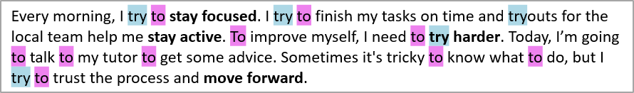

## **Overview**

This article introduces how to manage and format text in PowerPoint and OpenDocument presentations using Aspose.Slides for .NET. You’ll learn how to apply text formatting features such as font selection, size, color, highlighting, background color, spacing, and alignment. In addition, it covers working with text frames, paragraphs, formatting, and advanced layout options like custom rotation and autofit behaviors.

Whether you're generating presentations programmatically or customizing existing content, these examples will help you create clear, professional-looking text layouts that enhance your slides and improve readability.

In the examples below, we’ll use a file named "sample.pptx", which contains a single text box on the first slide with the following text:


## **Highlight Text**

The [ITextFrame.HighlightText](https://reference.aspose.com/slides/net/aspose.slides/itextframe/highlighttext/) method allows you to highlight a portion of text with a background color based on a matching text sample.

To use this method, follow these steps:

1. Instantiate the [Presentation](https://reference.aspose.com/slides/net/aspose.slides/presentation/) class with an input file (PPT, PPTX, ODP, etc.).
1. Access the desired slide using the [Slides](https://reference.aspose.com/slides/net/aspose.slides/presentation/slides/) collection.
1. Access the target shape from the [Shapes](https://reference.aspose.com/slides/net/aspose.slides/baseslide/shapes/) collection and cast it as an [IAutoShape](https://reference.aspose.com/slides/net/aspose.slides/iautoshape/).
1. Highlight the desired text using the [ITextFrame.HighlightText](https://reference.aspose.com/slides/net/aspose.slides/itextframe/highlighttext/) method by providing the sample text and color.
1. Save the presentation in your desired output format (e.g., PPT, PPTX, ODP).

The code example below highlights all occurrences of the characters **"try"** and the full word **"to"**.

```cs
using (var presentation = new Presentation("sample.pptx"))
{
    // Get the first shape from the first slide.
    var shape = (IAutoShape)presentation.Slides[0].Shapes[0];

    // Highlight the word "try" in the shape.
    shape.TextFrame.HighlightText("try", Color.LightBlue);

    var searchOptions = new TextSearchOptions()
    {
        WholeWordsOnly = true
    };

    // Highlight the word "to" in the shape.
    shape.TextFrame.HighlightText("to", Color.Violet, searchOptions, null);

    presentation.Save("highlighted_text.pptx", SaveFormat.Pptx);
}
```

The result:



{} 

Aspose provides a simple, [FREE Online PowerPoint Editor](https://products.aspose.app/slides/editor).

{} 

## **Highlight Text Using Regular Expressions**

Aspose.Slides for .NET allows you to search and highlight specific parts of text in PowerPoint slides using regular expressions. This feature is especially useful when you need to dynamically emphasize keywords, patterns, or data-driven content. The [ITextFrame.HighlightRegex](https://docs.aspose.com/slides/net/text-formatting/) method allows you to highlight parts of text with a background color using a regular expression.

The code example below highlights all words that contain **seven or more characters**:

```cs
using (var presentation = new Presentation("sample.pptx"))
{
    var shape = (IAutoShape)presentation.Slides[0].Shapes[0];

    // Highlight all words with seven or more characters.
    shape.TextFrame.HighlightRegex(@"\b[^\s]{7,}\b", Color.Yellow, null);

    presentation.Save("highlighted_text_using_regex.pptx", SaveFormat.Pptx);
}
```

The result:


## **Set Text Background Color**

Aspose.Slides for .NET enables you to apply background colors to entire paragraphs or individual text portions in PowerPoint slides. This functionality is useful when you want to highlight specific words or phrases, draw attention to key messages, or enhance the visual appeal of your presentations.

The following code example shows how to set the background color for the **entire paragraph**: 

```cs
using (var presentation = new Presentation("sample.pptx"))
{
    var autoShape = (IAutoShape)presentation.Slides[0].Shapes[0];
    var paragraph = autoShape.TextFrame.Paragraphs[0];

    // Set the highlight color for the entire paragraph.
    paragraph.ParagraphFormat.DefaultPortionFormat.HighlightColor.Color = Color.LightGray;

    presentation.Save("gray_paragraph.pptx", SaveFormat.Pptx);
}
```

The result:


The code example below demonstrates how to set the background color for **text portions with a bold font**:

```cs
using (var presentation = new Presentation("sample.pptx"))
{
    var autoShape = (IAutoShape)presentation.Slides[0].Shapes[0];
    var paragraph = autoShape.TextFrame.Paragraphs[0];

    foreach (var portion in paragraph.Portions)
    {
        if (portion.PortionFormat.GetEffective().FontBold)
        {
            // Set the highlight color for the text portion.
            portion.PortionFormat.HighlightColor.Color = Color.LightGray;
        }
    }

    presentation.Save("gray_text_portions.pptx", SaveFormat.Pptx);
}
```

The result:


## **Align Text Paragraphs**

Text alignment is a key aspect of slide formatting that affects both readability and visual appeal. In Aspose.Slides for .NET, you can precisely control paragraph alignment within text frames, ensuring your content is consistently presented—whether centered, left-aligned, right-aligned, or justified. This section explains how to apply and customize text alignment in your PowerPoint presentations.

The following code example shows how to align the paragraph to the **center**:

```cs
using (var presentation = new Presentation("sample.pptx"))
{
    var autoShape = (IAutoShape)presentation.Slides[0].Shapes[0];
    var paragraph = autoShape.TextFrame.Paragraphs[0];

    // Set the alignment of the paragraph to center.
    paragraph.ParagraphFormat.Alignment = TextAlignment.Center;

    presentation.Save("aligned_paragraph.pptx", SaveFormat.Pptx);
}
```

The result:


## **Set Transparency for Text**

Adjusting text transparency allows you to create subtle visual effects and improve slide aesthetics. Aspose.Slides for .NET provides the ability to set the transparency level of paragraphs and text portions, making it easy to blend text with backgrounds or emphasize specific elements. This section shows how to apply transparency settings to text in your presentations.

The code example below shows how to apply transparency to the **entire paragraph**:

```cs
int alpha = 50;

using (var presentation = new Presentation("sample.pptx"))
{
    var autoShape = (IAutoShape)presentation.Slides[0].Shapes[0];
    var paragraph = autoShape.TextFrame.Paragraphs[0];

    // Set the fill color of the text to transparent color.
    paragraph.ParagraphFormat.DefaultPortionFormat.FillFormat.FillType = FillType.Solid;
    paragraph.ParagraphFormat.DefaultPortionFormat.FillFormat.SolidFillColor.Color = Color.FromArgb(alpha, Color.Black);

    presentation.Save("transparent_paragraph.pptx", SaveFormat.Pptx);
}
```

The result:


The following code example shows how to apply transparency to **text portions with a bold font**:

```cs
int alpha = 50;

using (var presentation = new Presentation("sample.pptx"))
{
    var autoShape = (IAutoShape)presentation.Slides[0].Shapes[0];
    var paragraph = autoShape.TextFrame.Paragraphs[0];

    foreach (var portion in paragraph.Portions)
    {
        if (portion.PortionFormat.GetEffective().FontBold)
        {
            // Set the transparency of the text portion.
            portion.PortionFormat.FillFormat.FillType = FillType.Solid;
            portion.PortionFormat.FillFormat.SolidFillColor.Color = Color.FromArgb(alpha, Color.Black);
        }
    }

    presentation.Save("transparent_text_portions.pptx", SaveFormat.Pptx);
}
```

The result:


## **Set Character Spacing for Text**

Aspose.Slides allows you to set the spacing between letters in a text box. This lets you adjust the visual density of a line or block of text by expanding or condensing the space between characters.

The following C# code shows how to expand the character spacing in the **entire paragraph**:

```cs
using (var presentation = new Presentation("sample.pptx"))
{
    var autoShape = (IAutoShape)presentation.Slides[0].Shapes[0];
    var paragraph = autoShape.TextFrame.Paragraphs[0];

    // Note: Use negative values to compress the character spacing.
    paragraph.ParagraphFormat.DefaultPortionFormat.Spacing = 3;  // Expand character spacing.

    presentation.Save("character_spacing_in_paragraph.pptx", SaveFormat.Pptx);
}
```

The result:


The code example below shows how to expand the character spacing in **text portions with a bold font**:

```cs
using (var presentation = new Presentation("sample.pptx"))
{
    var autoShape = (IAutoShape)presentation.Slides[0].Shapes[0];
    var paragraph = autoShape.TextFrame.Paragraphs[0];

    foreach (var portion in paragraph.Portions)
    {
        if (portion.PortionFormat.GetEffective().FontBold)
        {
            // Note: Use negative values to compress the character spacing.
            portion.PortionFormat.Spacing = 3;  // Expand character spacing.
        }
    }

    presentation.Save("character_spacing_in_text_portions.pptx", SaveFormat.Pptx);
}
```

The result:


## **Manage Text Font Properties**

Aspose.Slides for .NET allows you to fine-tune font settings at both the paragraph level and for individual text portions, ensuring visual consistency and meeting your presentation design requirements. You can define font styles, sizes, and other formatting options for entire paragraphs, giving you greater control over text appearance. This section demonstrates how to manage font properties for text paragraphs in a slide.

The following code sets the font and text style for the entire paragraph: it applies font size, bold, italic, dotted underline, and the Times New Roman font to all portions in the paragraph.

```cs
using (var presentation = new Presentation("sample.pptx"))
{
    var autoShape = (IAutoShape)presentation.Slides[0].Shapes[0];
    var paragraph = autoShape.TextFrame.Paragraphs[0];

    // Set the font properties for the paragraph.
    paragraph.ParagraphFormat.DefaultPortionFormat.FontHeight = 12;
    paragraph.ParagraphFormat.DefaultPortionFormat.FontBold = NullableBool.True;
    paragraph.ParagraphFormat.DefaultPortionFormat.FontItalic = NullableBool.True;
    paragraph.ParagraphFormat.DefaultPortionFormat.FontUnderline = TextUnderlineType.Dotted;
    paragraph.ParagraphFormat.DefaultPortionFormat.LatinFont = new FontData("Times New Roman");

    presentation.Save("font_properties_for_paragraph.pptx", SaveFormat.Pptx);
}
```

The result:


The code example below applies similar properties to **text portions with a bold font**:

```cs
using (var presentation = new Presentation("sample.pptx"))
{
    var autoShape = (IAutoShape)presentation.Slides[0].Shapes[0];
    var paragraph = autoShape.TextFrame.Paragraphs[0];

    foreach (var portion in paragraph.Portions)
    {
        if (portion.PortionFormat.GetEffective().FontBold)
        {
            // Set the font properties for the text portion.
            portion.PortionFormat.FontHeight = 13;
            portion.PortionFormat.FontItalic = NullableBool.True;
            portion.PortionFormat.FontUnderline = TextUnderlineType.Dotted;
            portion.PortionFormat.LatinFont = new FontData("Times New Roman");
        }
    }

    presentation.Save("font_properties_for_text_portions.pptx", SaveFormat.Pptx);
}
```

The result:


## **Set Text Rotation**

Rotating text can enhance the layout of your slides and help emphasize specific content. With Aspose.Slides for .NET, you can easily apply rotation to text within shapes, adjusting the angle to match your design. This section demonstrates how to set and control text rotation to achieve the desired visual effect.

The following code example sets the text orientation in the shape to `Vertical270`, which rotates the text **90 degrees counterclockwise**:

```cs
using (var presentation = new Presentation("sample.pptx"))
{
    var autoShape = (IAutoShape)presentation.Slides[0].Shapes[0];

    autoShape.TextFrame.TextFrameFormat.TextVerticalType = TextVerticalType.Vertical270;

    presentation.Save("text_rotation.pptx", SaveFormat.Pptx);
}
```

The result:


## **Set Custom Rotation for Text Frames**

Setting a custom rotation angle for a `TextFrame` allows you to position text at precise angles, enabling more creative and flexible slide designs. Aspose.Slides for .NET provides full control over the rotation of text frames, making it easy to align text with other slide elements. This section guides you through applying a specific rotation angle to a `TextFrame`.

The code example below rotates the text frame by 3 degrees clockwise within the shape: 

```cs
using (var presentation = new Presentation("sample.pptx"))
{
    var autoShape = (IAutoShape)presentation.Slides[0].Shapes[0];

    autoShape.TextFrame.TextFrameFormat.RotationAngle = 3;

    presentation.Save("custom_text_rotation.pptx", SaveFormat.Pptx);
}
```

The result:


## **Set Line Spacing of Paragraphs**

Aspose.Slides provides the `SpaceAfter`, `SpaceBefore`, and `SpaceWithin` properties under the [ParagraphFormat](https://reference.aspose.com/slides/net/aspose.slides/paragraphformat/) class, allowing you to manage line spacing for a paragraph. These properties are used as follows:

* Use a positive value to specify line spacing as a percentage of the line height.
* Use a negative value to specify line spacing in points.

The following code example shows how to specify the line spacing within the paragraph:

```cs
using (var presentation = new Presentation("sample.pptx"))
{
    var autoShape = (IAutoShape)presentation.Slides[0].Shapes[0];
    var paragraph = autoShape.TextFrame.Paragraphs[0];

    paragraph.ParagraphFormat.SpaceWithin = 200;

    presentation.Save("line_spacing.pptx", SaveFormat.Pptx);
}
```

The result:


## **Set Autofit Type for Text Frames**

The AutoFitType property determines how text behaves when it exceeds the boundaries of its container. Aspose.Slides for .NET allows you to control whether the text should shrink to fit, overflow, or resize the shape automatically. This section demonstrates how to set the `AutofitType` for a `TextFrame` to manage text layout effectively within shapes.

```cs
using (var presentation = new Presentation("sample.pptx"))
{
    var autoShape = (IAutoShape)presentation.Slides[0].Shapes[0];

    autoShape.TextFrame.TextFrameFormat.AutofitType = TextAutofitType.Shape;

    presentation.Save("autofit_type.pptx", SaveFormat.Pptx);
}
```

## **Set Anchor of Text Frames**

Anchoring defines how text is positioned within a shape vertically. With Aspose.Slides for .NET, you can set the anchor type of a `TextFrame` to align text to the top, middle, or bottom of the shape. This section shows how to adjust the anchor settings to achieve the desired vertical alignment of text content.

```cs
using (var presentation = new Presentation("sample.pptx"))
{
    var autoShape = (IAutoShape)presentation.Slides[0].Shapes[0];

    autoShape.TextFrame.TextFrameFormat.AnchoringType = TextAnchorType.Bottom;

    presentation.Save("text_anchor.pptx", SaveFormat.Pptx);
}
```

## **Set Text Tabulation**

Tabulation helps organize text into well-structured layouts by adding consistent spacing between content elements. Aspose.Slides for .NET supports setting custom tab stops within text paragraphs, allowing for precise control over text positioning. This section demonstrates how to configure text tabulation for improved alignment and formatting.

```cs
using (var presentation = new Presentation("sample.pptx"))
{
    var autoShape = (IAutoShape)presentation.Slides[0].Shapes[0];
    var paragraph = autoShape.TextFrame.Paragraphs[0];

    paragraph.ParagraphFormat.DefaultTabSize = 100;
    paragraph.ParagraphFormat.Tabs.Add(30, TabAlignment.Left);

    presentation.Save("paragraph_tabs.pptx", SaveFormat.Pptx);
}
```

The result:


## **Set Proofing Language**

Aspose.Slides provides the `LanguageId` property of the [PortionFormat](https://reference.aspose.com/slides/net/aspose.slides/portionformat/) class, which allows you to set the proofing language for a PowerPoint document. The proofing language determines the language used for spelling and grammar checks in PowerPoint.

The following code example shows how to set the proofing language for a text portion:

```cs
using (var presentation = new Presentation("presentation.pptx"))
{
    var autoShape = (IAutoShape)presentation.Slides[0].Shapes[0];

    var paragraph = autoShape.TextFrame.Paragraphs[0];
    paragraph.Portions.Clear();

    var font = new FontData("SimSun");

    var textPortion = new Portion();
    textPortion.PortionFormat.ComplexScriptFont = font;
    textPortion.PortionFormat.EastAsianFont = font;
    textPortion.PortionFormat.LatinFont = font;

    // Set the Id of a proofing language.
    textPortion.PortionFormat.LanguageId = "zh-CN";

    textPortion.Text = "1。";
    paragraph.Portions.Add(textPortion);

    presentation.Save("proofing_language.pptx", SaveFormat.Pptx);
}
```

## **Set Default Language**

Specifying the default language for text ensures correct spell checking, hyphenation, and text-to-speech behavior in PowerPoint. Aspose.Slides for .NET allows you to set the language at the text portion or paragraph level. This section shows how to define the default language for your presentation text.

```cs
var loadOptions = new LoadOptions();
loadOptions.DefaultTextLanguage = "en-US";

using (var presentation = new Presentation(loadOptions))
{
    var slide = presentation.Slides[0];

    // Add a new rectangle shape with text.
    var shape = slide.Shapes.AddAutoShape(ShapeType.Rectangle, 20, 20, 150, 50);
    shape.TextFrame.Text = "Sample text";

    // Check the first portion language.
    var portion = shape.TextFrame.Paragraphs[0].Portions[0];
    Console.WriteLine(portion.PortionFormat.LanguageId);
}
```

## **Set Default Text Style**

If you need to apply the same default text formatting to all text elements in a presentation at once, you can use the `DefaultTextStyle` property of the [IPresentation](https://reference.aspose.com/slides/net/aspose.slides/ipresentation/) interface and define your preferred formatting.

The following code example shows how to set a default bold font with a 14 pt size for all text across slides in a new presentation.

```cs
using (var presentation = new Presentation())
{
    // Get the top level paragraph format.
    var paragraphFormat = presentation.DefaultTextStyle.GetLevel(0);

    if (paragraphFormat != null)
    {
        paragraphFormat.DefaultPortionFormat.FontHeight = 14;
        paragraphFormat.DefaultPortionFormat.FontBold = NullableBool.True;
    }

    presentation.Save("default_text_style.pptx", SaveFormat.Pptx);
}
```

## **Extract Text with the All-Caps Effect**

In PowerPoint, applying the **All Caps** font effect makes text appear in uppercase on the slide even when it was originally typed in lowercase. When you retrieve such a text portion with Aspose.Slides, the library returns the text exactly as it was entered. To handle this, check [TextCapType](https://reference.aspose.com/slides/net/aspose.slides/textcaptype/)—if it indicates `All`, simply convert the returned string to uppercase so that your output matches what users see on the slide.

Let’s say we have the following text box on the first slide of the sample2.pptx file.


 The code example below shows how to extract the text with the **All Caps** effect aplyied:

```cs
using (var presentation = new Presentation("sample2.pptx"))
{
    var autoShape = (IAutoShape)presentation.Slides[0].Shapes[0];
    var textPortion = autoShape.TextFrame.Paragraphs[0].Portions[0];

    Console.WriteLine($"Original text: {textPortion.Text}");

    var textFormat = textPortion.PortionFormat.GetEffective();
    if (textFormat.TextCapType == TextCapType.All)
    {
        var text = textPortion.Text.ToUpper();
        Console.WriteLine($"All-Caps effect: {text}");
    }
}
```

Output:

```text
Original text: Hello, Aspose!
All-Caps effect: HELLO, ASPOSE!
```

## **FAQ**

**How to modify text in a table on a slide?**

To modify text in a table on a slide, you need to use the [ITable](https://reference.aspose.com/slides/net/aspose.slides/itable/) object. You can iterate through all the cells in the table and change the text in each cell by accessing its `TextFrame` and `ParagraphFormat` properties within each cell.

**How to apply gradient color to text in a PowerPoint slide?**

To apply gradient color to text, use the `FillFormat` property in [PortionFormat](https://reference.aspose.com/slides/net/aspose.slides/portionformat/). Set the `FilFormat` to `Gradient`, where you can define the gradient's start and end colors, along with other properties such as direction and transparency to create the gradient effect on the text.
