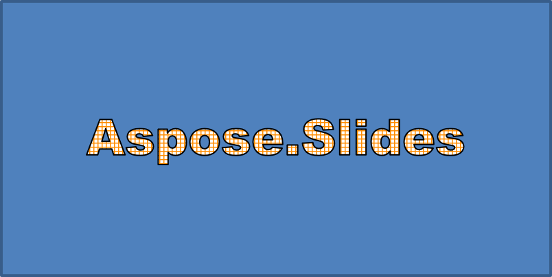
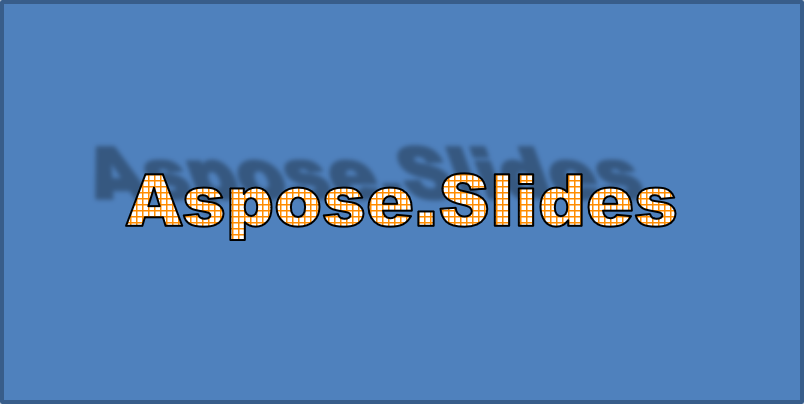
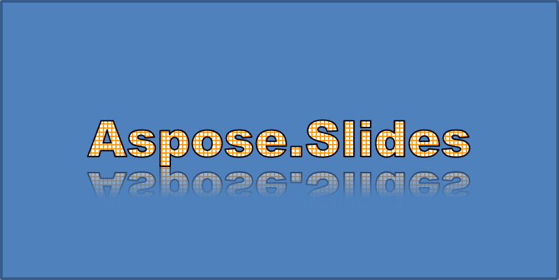
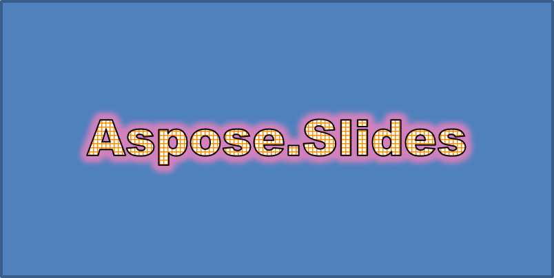
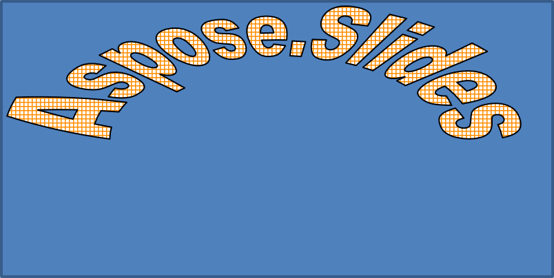
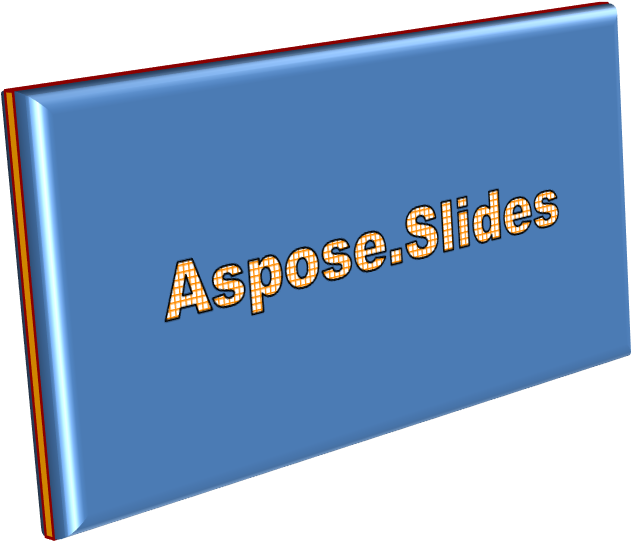
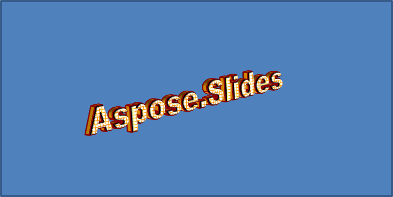

## **Overview**

WordArt effects allow you to add visually appealing, stylized text to your PowerPoint presentations. With Aspose.Slides for .NET, developers can programmatically create, customize, and manage WordArt just like in Microsoft PowerPoint—without needing Office installed. This article provides an overview of working with WordArt in .NET, including how to apply text transformations, fill styles, outlines, shadows, and other formatting options to make your presentation content more expressive and engaging. WordArt allows you to treat text as a graphical object. It consists of effects or special modifications applied to text to make it more attractive or noticeable.

## **Create a Simple WordArt Template and Apply It to Text**

In this section, we will explore how to create a simple WordArt template and apply it to text using Aspose.Slides for .NET. WordArt offers an easy way to enhance text appearance with striking visual effects and styles. By learning the basic steps of creating and using WordArt, you can readily adapt these techniques to suit any project, making your presentations more vibrant and memorable.

First, we create simple text using the following C# code:

```cs
using (Presentation presentation = new Presentation())
{
    ISlide slide = presentation.Slides[0];

    IAutoShape autoShape = slide.Shapes.AddAutoShape(ShapeType.Rectangle, 20, 20, 400, 200);
    ITextFrame textFrame = autoShape.TextFrame;

    IPortion portion = textFrame.Paragraphs[0].Portions[0];
    portion.Text = "Aspose.Slides";
}
```

Now, we set the text’s font height to a larger value to make the effect more noticeable using the following code:

```cs
    portion.PortionFormat.LatinFont = new FontData("Arial Black");
    portion.PortionFormat.FontHeight = 36;
```

Here, we apply the SmallGrid pattern fill to the text and add a black text border with a width of 1 using the following code:

```cs
    portion.PortionFormat.FillFormat.FillType = FillType.Pattern;
    portion.PortionFormat.FillFormat.PatternFormat.ForeColor.Color = Color.DarkOrange;
    portion.PortionFormat.FillFormat.PatternFormat.BackColor.Color = Color.White;
    portion.PortionFormat.FillFormat.PatternFormat.PatternStyle = PatternStyle.SmallGrid;
                
    portion.PortionFormat.LineFormat.FillFormat.FillType = FillType.Solid;
    portion.PortionFormat.LineFormat.FillFormat.SolidFillColor.Color = Color.Black;
```

The resulting text:



## **Apply Other WordArt Effects**

In addition to basic transformations, Aspose.Slides for .NET lets you apply a variety of advanced WordArt effects to enhance the appearance of your text. These include outlines, fills, shadows, reflections, and glow effects. By combining these features, you can create eye-catching text styles that stand out in your presentations. This section demonstrates how to apply these effects programmatically using simple, clean code examples.

### **Apply Outer Shadow Effects**

Outer shadow effects help text stand out by adding a shadow behind its outline, creating a sense of depth and separation from the background. Aspose.Slides for .NET allows you to easily apply and customize outer shadows on WordArt text. In this section, you’ll learn how to set shadow color, direction, distance, blur radius, and more to achieve the desired visual impact.

The following C# code snippet applies a shadow effect to the text created above.

```cs
    portion.PortionFormat.EffectFormat.EnableOuterShadowEffect();
    portion.PortionFormat.EffectFormat.OuterShadowEffect.ShadowColor.Color = Color.Black;
    portion.PortionFormat.EffectFormat.OuterShadowEffect.ScaleHorizontal = 100;
    portion.PortionFormat.EffectFormat.OuterShadowEffect.ScaleVertical = 100;
    portion.PortionFormat.EffectFormat.OuterShadowEffect.BlurRadius = 4;
    portion.PortionFormat.EffectFormat.OuterShadowEffect.Direction = 230;
    portion.PortionFormat.EffectFormat.OuterShadowEffect.Distance = 30;
    portion.PortionFormat.EffectFormat.OuterShadowEffect.SkewHorizontal = 20;
    portion.PortionFormat.EffectFormat.OuterShadowEffect.SkewVertical = 0;
    portion.PortionFormat.EffectFormat.OuterShadowEffect.ShadowColor.ColorTransform.Add(ColorTransformOperation.SetAlpha, 0.32f);
```

The resulting text:



{} 

- When OuterShadow and PresetShadow are used together, only the OuterShadow effect is applied.
- If OuterShadow and InnerShadow are used simultaneously, the resulting effect depends on the PowerPoint version. For example, in PowerPoint 2013, the effect is doubled, whereas in PowerPoint 2007, only the OuterShadow effect is applied.

{}

### **Apply Reflection Effects**

In this section, we will explore how to apply reflection effects in your slides using Aspose.Slides for .NET. Reflection effects can be an effective way to give your text or shapes a stylish and modern look, helping key elements stand out and adding depth to your presentation. By understanding the process of applying and customizing these effects, you can easily tailor them to fit your design needs and branding requirements.

Add a reflection effect to the text using this C# code example:

```cs
    portion.PortionFormat.EffectFormat.EnableReflectionEffect();
    portion.PortionFormat.EffectFormat.ReflectionEffect.BlurRadius = 0.5; 
    portion.PortionFormat.EffectFormat.ReflectionEffect.Distance = 4.72; 
    portion.PortionFormat.EffectFormat.ReflectionEffect.StartPosAlpha = 0f; 
    portion.PortionFormat.EffectFormat.ReflectionEffect.EndPosAlpha = 60f; 
    portion.PortionFormat.EffectFormat.ReflectionEffect.Direction = 90; 
    portion.PortionFormat.EffectFormat.ReflectionEffect.ScaleHorizontal = 100; 
    portion.PortionFormat.EffectFormat.ReflectionEffect.ScaleVertical = -100;
    portion.PortionFormat.EffectFormat.ReflectionEffect.StartReflectionOpacity = 60f;
    portion.PortionFormat.EffectFormat.ReflectionEffect.EndReflectionOpacity = 0.9f;
    portion.PortionFormat.EffectFormat.ReflectionEffect.RectangleAlign = RectangleAlignment.BottomLeft;   
```

The resulting text:



### **Apply Glow Effects**

In this section, we will explore how to apply a glow effect to text using Aspose.Slides for .NET. The glow effect can make your text stand out with a luminous outline, enhancing the visual appeal of your slides. By adjusting settings such as color and intensity, you can easily tailor the glow to fit your design and branding needs, ensuring that key points in your presentation capture the audience’s attention.

Apply a glow effect to the text to make it shine or stand out using the following code:

```cs
    portion.PortionFormat.EffectFormat.EnableGlowEffect();
    portion.PortionFormat.EffectFormat.GlowEffect.Color.R = 255;
    portion.PortionFormat.EffectFormat.GlowEffect.Color.ColorTransform.Add(ColorTransformOperation.SetAlpha, 0.54f);
    portion.PortionFormat.EffectFormat.GlowEffect.Radius = 7;
```

The resulting text:



### **Apply WordArt Transformations**

In this section, we will explore how to use transformations in WordArt with Aspose.Slides for .NET. Transformations allow you to bend, stretch, or warp text, creating unique and visually striking effects. By mastering these techniques, you can easily tailor text shapes and styles to suit your branding or creative vision, ensuring a compelling and polished presentation.

Use the `Transform` property (which applies to the entire block of text) using the following code:

```cs
    textFrame.TextFrameFormat.Transform = TextShapeType.ArchUpPour;
```

The resulting text:



{} 

Aspose.Slides for .NET provides a set of predefined [transformation types](https://reference.aspose.com/slides/net/aspose.slides/textshapetype/).

{} 

### **Apply 3D Effects to Shapes and Text**

Creating realistic, eye-catching visuals can significantly enhance the impact of your presentations. In this section, we’ll explore how to apply three-dimensional (3D) effects to shapes using Aspose.Slides for .NET. By manipulating parameters like depth, angle, and lighting, you can produce impressive 3D transformations that immediately catch your audience’s attention. Whether you’re aiming for subtle highlights or dramatic illusions, these features offer flexible ways to elevate your design and convey ideas in a more captivating manner.

Use the following sample code to set a 3D effect to the shape:

```cs
    autoShape.ThreeDFormat.BevelBottom.BevelType = BevelPresetType.Circle;
    autoShape.ThreeDFormat.BevelBottom.Height = 10.5;
    autoShape.ThreeDFormat.BevelBottom.Width = 10.5;

    autoShape.ThreeDFormat.BevelTop.BevelType = BevelPresetType.Circle;
    autoShape.ThreeDFormat.BevelTop.Height = 12.5;
    autoShape.ThreeDFormat.BevelTop.Width = 11;

    autoShape.ThreeDFormat.ExtrusionColor.Color = Color.Orange;
    autoShape.ThreeDFormat.ExtrusionHeight = 6;

    autoShape.ThreeDFormat.ContourColor.Color = Color.DarkRed;
    autoShape.ThreeDFormat.ContourWidth = 1.5;

    autoShape.ThreeDFormat.Depth = 3;

    autoShape.ThreeDFormat.Material = MaterialPresetType.Plastic;

    autoShape.ThreeDFormat.LightRig.Direction = LightingDirection.Top;
    autoShape.ThreeDFormat.LightRig.LightType = LightRigPresetType.Balanced;
    autoShape.ThreeDFormat.LightRig.SetRotation(0, 0, 40);

    autoShape.ThreeDFormat.Camera.CameraType = CameraPresetType.PerspectiveContrastingRightFacing;
```

The resulting shape:



Use the following sample code to set a 3D effect to the text:

```cs
    textFrame.TextFrameFormat.ThreeDFormat.BevelBottom.BevelType = BevelPresetType.Circle;
    textFrame.TextFrameFormat.ThreeDFormat.BevelBottom.Height = 3.5;
    textFrame.TextFrameFormat.ThreeDFormat.BevelBottom.Width = 3.5;

    textFrame.TextFrameFormat.ThreeDFormat.BevelTop.BevelType = BevelPresetType.Circle;
    textFrame.TextFrameFormat.ThreeDFormat.BevelTop.Height = 4;
    textFrame.TextFrameFormat.ThreeDFormat.BevelTop.Width = 4;

    textFrame.TextFrameFormat.ThreeDFormat.ExtrusionColor.Color = Color.Orange;
    textFrame.TextFrameFormat.ThreeDFormat.ExtrusionHeight= 6;

    textFrame.TextFrameFormat.ThreeDFormat.ContourColor.Color = Color.DarkRed;
    textFrame.TextFrameFormat.ThreeDFormat.ContourWidth = 1.5;

    textFrame.TextFrameFormat.ThreeDFormat.Depth= 3;

    textFrame.TextFrameFormat.ThreeDFormat.Material = MaterialPresetType.Plastic;

    textFrame.TextFrameFormat.ThreeDFormat.LightRig.Direction = LightingDirection.Top;
    textFrame.TextFrameFormat.ThreeDFormat.LightRig.LightType = LightRigPresetType.Balanced;
    textFrame.TextFrameFormat.ThreeDFormat.LightRig.SetRotation(0, 0, 40);

    textFrame.TextFrameFormat.ThreeDFormat.Camera.CameraType = CameraPresetType.PerspectiveContrastingRightFacing;
```

The resulting text:



{} 

The application of 3D effects to text or their shapes—and the interaction between these effects—is governed by specific rules. Consider a scene involving both a text and the shape containing that text. A 3D effect includes the object's 3D representation and the scene on which it is placed.

- If a scene is set for both the shape and the text, the shape’s scene takes priority and the text’s scene is ignored.
- If the shape lacks its own scene but has a 3D representation, the text’s scene is used.
- If the shape has no 3D effect at all, it is treated as flat, and the 3D effect is applied only to the text.

These behaviors relate to the [ThreeDFormat.LightRig](https://reference.aspose.com/slides/net/aspose.slides/threedformat/lightrig/) and [ThreeDFormat.Camera](https://reference.aspose.com/slides/net/aspose.slides/threedformat/camera/) properties.

{} 

## **FAQ**

**Can I use WordArt effects with different fonts or scripts (e.g., Arabic, Chinese)?**

Yes, Aspose.Slides for .NET supports Unicode and works with all major fonts and scripts. WordArt effects such as shadow, fill, and outline can be applied regardless of the language, although font availability and rendering may depend on the system fonts.

**Can I apply WordArt effects to slide master elements?**

Yes, you can apply WordArt effects to shapes on master slides, including title placeholders, footers, or background text. Changes made to the master layout will be reflected across all associated slides.

**Do WordArt effects affect presentation file size?**

Slightly. WordArt effects like shadows, glows, and gradient fills may slightly increase the file size due to added formatting metadata, but the difference is usually negligible.

**Can I preview the result of WordArt effects without saving the presentation?**

Yes, you can render slides containing WordArt to images (e.g., PNG, JPEG) using the `GetImage` method from the [IShape](https://reference.aspose.com/slides/net/aspose.slides/ishape/) or [ISlide](https://reference.aspose.com/slides/net/aspose.slides/islide/) interfaces. This lets you preview the result in-memory or on-screen before saving or exporting the full presentation.
