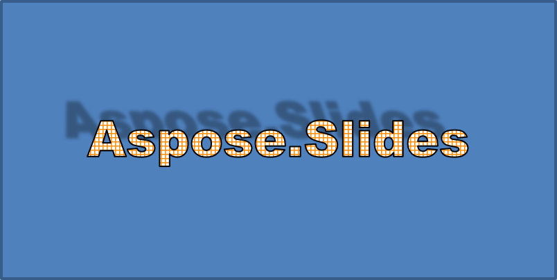

## **Overview**

WordArt effects let you style text with fills, outlines, shadows, reflections, glow, transformations, and 3D formatting. This article explains how to create and customize these effects in PowerPoint presentations using Aspose.Slides for .NET, without Microsoft Office installed.

## **Create a Simple WordArt Template and Apply It to Text**

The following examples build a simple WordArt style by setting the text, font, pattern fill, and outline.

Each example creates a new presentation and adds a rectangle to its first slide; no input file is required. The first example sets the text to "Aspose.Slides". The shape position and dimensions are measured in points:

```cs
using Aspose.Slides;

using var presentation = new Presentation();
var slide = presentation.Slides[0];

var autoShape = slide.Shapes.AddAutoShape(ShapeType.Rectangle, 20, 20, 400, 200);
var textFrame = autoShape.TextFrame;

var portion = textFrame.Paragraphs[0].Portions[0];
portion.Text = "Aspose.Slides";
```

Set the font to Arial Black at 36 points to make the formatting more noticeable:

```cs
using Aspose.Slides;

using var presentation = new Presentation();
var slide = presentation.Slides[0];

var autoShape = slide.Shapes.AddAutoShape(ShapeType.Rectangle, 20, 20, 400, 200);

var portion = autoShape.TextFrame.Paragraphs[0].Portions[0];
portion.Text = "Aspose.Slides";
portion.PortionFormat.LatinFont = new FontData("Arial Black");
portion.PortionFormat.FontHeight = 36;
```

Apply a [SmallGrid](https://reference.aspose.com/slides/net/aspose.slides/patternstyle/) pattern with a dark orange foreground and a white background, then add a black text outline with a width of 1 point:

```cs
using System.Drawing;
using Aspose.Slides;

using var presentation = new Presentation();
var slide = presentation.Slides[0];

var autoShape = slide.Shapes.AddAutoShape(ShapeType.Rectangle, 20, 20, 400, 200);

var portion = autoShape.TextFrame.Paragraphs[0].Portions[0];
portion.Text = "Aspose.Slides";
portion.PortionFormat.LatinFont = new FontData("Arial Black");
portion.PortionFormat.FontHeight = 36;

portion.PortionFormat.FillFormat.FillType = FillType.Pattern;
portion.PortionFormat.FillFormat.PatternFormat.ForeColor.Color = Color.DarkOrange;
portion.PortionFormat.FillFormat.PatternFormat.BackColor.Color = Color.White;
portion.PortionFormat.FillFormat.PatternFormat.PatternStyle = PatternStyle.SmallGrid;

portion.PortionFormat.LineFormat.Width = 1;
portion.PortionFormat.LineFormat.FillFormat.FillType = FillType.Solid;
portion.PortionFormat.LineFormat.FillFormat.SolidFillColor.Color = Color.Black;
```

The resulting text:


## **Apply Other WordArt Effects**

The following examples demonstrate how to apply shadows, reflections, glow, transformations, and 3D effects to text.

### **Apply Outer Shadow Effects**

An outer shadow adds depth by placing a shadow behind the text. You can customize its color, direction, distance, blur radius, scale, and skew.

This example calls [EnableOuterShadowEffect](https://reference.aspose.com/slides/net/aspose.slides/effectformat/enableoutershadoweffect/) and sets a black shadow with a 4-point blur radius, a 230-degree direction, and a 30-point distance. Scale values of 100 preserve the shadow size, while horizontal skew tilts it by 20 degrees. The alpha transform sets its opacity to 32%:

```cs
using System.Drawing;
using Aspose.Slides;

using var presentation = new Presentation();
var slide = presentation.Slides[0];

var autoShape = slide.Shapes.AddAutoShape(ShapeType.Rectangle, 20, 20, 400, 200);

var portion = autoShape.TextFrame.Paragraphs[0].Portions[0];
portion.Text = "Aspose.Slides";
portion.PortionFormat.LatinFont = new FontData("Arial Black");
portion.PortionFormat.FontHeight = 36;

portion.PortionFormat.EffectFormat.EnableOuterShadowEffect();
portion.PortionFormat.EffectFormat.OuterShadowEffect.ShadowColor.Color = Color.Black;
portion.PortionFormat.EffectFormat.OuterShadowEffect.ScaleHorizontal = 100;
portion.PortionFormat.EffectFormat.OuterShadowEffect.ScaleVertical = 100;
portion.PortionFormat.EffectFormat.OuterShadowEffect.BlurRadius = 4;
portion.PortionFormat.EffectFormat.OuterShadowEffect.Direction = 230;
portion.PortionFormat.EffectFormat.OuterShadowEffect.Distance = 30;
portion.PortionFormat.EffectFormat.OuterShadowEffect.SkewHorizontal = 20;
portion.PortionFormat.EffectFormat.OuterShadowEffect.SkewVertical = 0;
portion.PortionFormat.EffectFormat.OuterShadowEffect.ShadowColor.ColorTransform.Add(ColorTransformOperation.SetAlpha, 0.32f);
```

The resulting text:



{}

- When outer and preset shadows are used together, only the outer shadow is applied.
- If outer and inner shadows are used simultaneously, the resulting effect depends on the PowerPoint version. For example, in PowerPoint 2013, the effect is doubled, whereas in PowerPoint 2007, only the outer shadow is applied.

{}

### **Apply Reflection Effects**

A reflection creates a mirrored copy of the text. Adjust its position, scale, blur, and opacity to control its appearance.

This example calls [EnableReflectionEffect](https://reference.aspose.com/slides/net/aspose.slides/effectformat/enablereflectioneffect/) and flips the reflection vertically with a scale of -100%. It uses a 0.5-point blur radius and a 4.72-point distance. Opacity decreases from 60% to 0.9% between positions 0% and 60% along the reflection:

```cs
using Aspose.Slides;

using var presentation = new Presentation();
var slide = presentation.Slides[0];

var autoShape = slide.Shapes.AddAutoShape(ShapeType.Rectangle, 20, 20, 400, 200);

var portion = autoShape.TextFrame.Paragraphs[0].Portions[0];
portion.Text = "Aspose.Slides";
portion.PortionFormat.LatinFont = new FontData("Arial Black");
portion.PortionFormat.FontHeight = 36;

portion.PortionFormat.EffectFormat.EnableReflectionEffect();
portion.PortionFormat.EffectFormat.ReflectionEffect.BlurRadius = 0.5;
portion.PortionFormat.EffectFormat.ReflectionEffect.Distance = 4.72;
portion.PortionFormat.EffectFormat.ReflectionEffect.StartPosAlpha = 0f;
portion.PortionFormat.EffectFormat.ReflectionEffect.EndPosAlpha = 60f;
portion.PortionFormat.EffectFormat.ReflectionEffect.Direction = 90;
portion.PortionFormat.EffectFormat.ReflectionEffect.ScaleHorizontal = 100;
portion.PortionFormat.EffectFormat.ReflectionEffect.ScaleVertical = -100;
portion.PortionFormat.EffectFormat.ReflectionEffect.StartReflectionOpacity = 60f;
portion.PortionFormat.EffectFormat.ReflectionEffect.EndReflectionOpacity = 0.9f;
portion.PortionFormat.EffectFormat.ReflectionEffect.RectangleAlign = RectangleAlignment.BottomLeft;
```

The resulting text:


### **Apply Glow Effects**

A glow adds a soft colored outline around the text. Adjust its color, opacity, and radius to control the effect.

This example calls [EnableGlowEffect](https://reference.aspose.com/slides/net/aspose.slides/effectformat/enablegloweffect/) and applies a red glow with 54% opacity and a radius of 7 points:

```cs
using Aspose.Slides;

using var presentation = new Presentation();
var slide = presentation.Slides[0];

var autoShape = slide.Shapes.AddAutoShape(ShapeType.Rectangle, 20, 20, 400, 200);

var portion = autoShape.TextFrame.Paragraphs[0].Portions[0];
portion.Text = "Aspose.Slides";
portion.PortionFormat.LatinFont = new FontData("Arial Black");
portion.PortionFormat.FontHeight = 36;

portion.PortionFormat.EffectFormat.EnableGlowEffect();
portion.PortionFormat.EffectFormat.GlowEffect.Color.Color = System.Drawing.Color.Red;
portion.PortionFormat.EffectFormat.GlowEffect.Color.ColorTransform.Add(ColorTransformOperation.SetAlpha, 0.54f);
portion.PortionFormat.EffectFormat.GlowEffect.Radius = 7;
```

The resulting text:


### **Apply WordArt Transformations**

WordArt transformations bend, stretch, or warp a block of text.

Set [Transform](https://reference.aspose.com/slides/net/aspose.slides/textframeformat/transform/) to [ArchUpPour](https://reference.aspose.com/slides/net/aspose.slides/textshapetype/) to curve the entire text frame upward:

```cs
using Aspose.Slides;

using var presentation = new Presentation();
var slide = presentation.Slides[0];

var autoShape = slide.Shapes.AddAutoShape(ShapeType.Rectangle, 20, 20, 400, 200);

var textFrame = autoShape.TextFrame;
textFrame.Text = "Aspose.Slides";
textFrame.TextFrameFormat.Transform = TextShapeType.ArchUpPour;
```

The resulting text:


{}

Aspose.Slides for .NET provides a set of predefined [transformation types](https://reference.aspose.com/slides/net/aspose.slides/textshapetype/).

{}

### **Apply 3D Effects to Shapes and Text**

You can apply 3D effects to a shape or to its text. Bevels, extrusion, lighting, and camera settings control the resulting appearance.

The following example uses [ThreeDFormat](https://reference.aspose.com/slides/net/aspose.slides/threedformat/) to add circular bevels, orange extrusion, and a dark red contour to the rectangle. Bevel dimensions, extrusion height, contour width, and depth are measured in points. A plastic material, balanced lighting rotated by 40 degrees around the Z axis, and a perspective camera define its appearance:

```cs
using System.Drawing;
using Aspose.Slides;

using var presentation = new Presentation();
var slide = presentation.Slides[0];

var autoShape = slide.Shapes.AddAutoShape(ShapeType.Rectangle, 20, 20, 400, 200);
autoShape.TextFrame.Text = "Aspose.Slides";

autoShape.ThreeDFormat.BevelBottom.BevelType = BevelPresetType.Circle;
autoShape.ThreeDFormat.BevelBottom.Height = 10.5;
autoShape.ThreeDFormat.BevelBottom.Width = 10.5;

autoShape.ThreeDFormat.BevelTop.BevelType = BevelPresetType.Circle;
autoShape.ThreeDFormat.BevelTop.Height = 12.5;
autoShape.ThreeDFormat.BevelTop.Width = 11;

autoShape.ThreeDFormat.ExtrusionColor.Color = Color.Orange;
autoShape.ThreeDFormat.ExtrusionHeight = 6;

autoShape.ThreeDFormat.ContourColor.Color = Color.DarkRed;
autoShape.ThreeDFormat.ContourWidth = 1.5;

autoShape.ThreeDFormat.Depth = 3;

autoShape.ThreeDFormat.Material = MaterialPresetType.Plastic;

autoShape.ThreeDFormat.LightRig.Direction = LightingDirection.Top;
autoShape.ThreeDFormat.LightRig.LightType = LightRigPresetType.Balanced;
autoShape.ThreeDFormat.LightRig.SetRotation(0, 0, 40);

autoShape.ThreeDFormat.Camera.CameraType = CameraPresetType.PerspectiveContrastingRightFacing;
```

The resulting shape:


This example applies similar 3D formatting to the text through [TextFrameFormat.ThreeDFormat](https://reference.aspose.com/slides/net/aspose.slides/textframeformat/threedformat/). Smaller bevels shape the letter edges, while extrusion and lighting give the text depth:

```cs
using System.Drawing;
using Aspose.Slides;

using var presentation = new Presentation();
var slide = presentation.Slides[0];

var autoShape = slide.Shapes.AddAutoShape(ShapeType.Rectangle, 20, 20, 400, 200);
var textFrame = autoShape.TextFrame;
textFrame.Text = "Aspose.Slides";

textFrame.TextFrameFormat.ThreeDFormat.BevelBottom.BevelType = BevelPresetType.Circle;
textFrame.TextFrameFormat.ThreeDFormat.BevelBottom.Height = 3.5;
textFrame.TextFrameFormat.ThreeDFormat.BevelBottom.Width = 3.5;

textFrame.TextFrameFormat.ThreeDFormat.BevelTop.BevelType = BevelPresetType.Circle;
textFrame.TextFrameFormat.ThreeDFormat.BevelTop.Height = 4;
textFrame.TextFrameFormat.ThreeDFormat.BevelTop.Width = 4;

textFrame.TextFrameFormat.ThreeDFormat.ExtrusionColor.Color = Color.Orange;
textFrame.TextFrameFormat.ThreeDFormat.ExtrusionHeight = 6;

textFrame.TextFrameFormat.ThreeDFormat.ContourColor.Color = Color.DarkRed;
textFrame.TextFrameFormat.ThreeDFormat.ContourWidth = 1.5;

textFrame.TextFrameFormat.ThreeDFormat.Depth = 3;

textFrame.TextFrameFormat.ThreeDFormat.Material = MaterialPresetType.Plastic;

textFrame.TextFrameFormat.ThreeDFormat.LightRig.Direction = LightingDirection.Top;
textFrame.TextFrameFormat.ThreeDFormat.LightRig.LightType = LightRigPresetType.Balanced;
textFrame.TextFrameFormat.ThreeDFormat.LightRig.SetRotation(0, 0, 40);

textFrame.TextFrameFormat.ThreeDFormat.Camera.CameraType = CameraPresetType.PerspectiveContrastingRightFacing;
```

The resulting text:


{}

The application of 3D effects to text or their shapes—and the interaction between these effects—is governed by specific rules. Consider a scene involving both text and the shape containing it. A 3D effect includes the object's 3D representation and the scene in which it is placed.

- If a scene is set for both the shape and the text, the shape’s scene takes priority and the text’s scene is ignored.
- If the shape lacks its own scene but has a 3D representation, the text’s scene is used.
- If the shape has no 3D effect at all, it is treated as flat, and the 3D effect is applied only to the text.

These behaviors relate to the [ThreeDFormat.LightRig](https://reference.aspose.com/slides/net/aspose.slides/threedformat/lightrig/) and [ThreeDFormat.Camera](https://reference.aspose.com/slides/net/aspose.slides/threedformat/camera/) properties.

{}

To keep text flat and readable while retaining its shape's 3D formatting, see [Keep Text Flat on a 3D Shape](/slides/net/3d-presentation/) for a comparison of both settings and a complete C# example.

## **FAQ**

**Can I use WordArt effects with different fonts or scripts (e.g., Arabic, Chinese)?**

Yes, Aspose.Slides for .NET supports Unicode and works with all major fonts and scripts. WordArt effects such as shadow, fill, and outline can be applied regardless of the language, although font availability and rendering may depend on the system fonts.

**Can I apply WordArt effects to slide master elements?**

Yes, you can apply WordArt effects to shapes on master slides, including title placeholders, footers, or background text. Changes made to the master layout will be reflected across all associated slides.

**Do WordArt effects affect presentation file size?**

Slightly. WordArt effects like shadows, glows, and gradient fills may slightly increase the file size due to added formatting metadata, but the difference is usually negligible.

**Can I preview the result of WordArt effects without saving the presentation?**

Yes, you can render slides containing WordArt to images (e.g., PNG, JPEG) using [ISlide.GetImage](https://reference.aspose.com/slides/net/aspose.slides/islide/getimage/), or render individual shapes using [IShape.GetImage](https://reference.aspose.com/slides/net/aspose.slides/ishape/getimage/). This lets you preview the result in memory or on screen before saving or exporting the full presentation.
