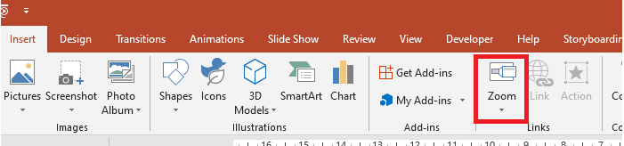
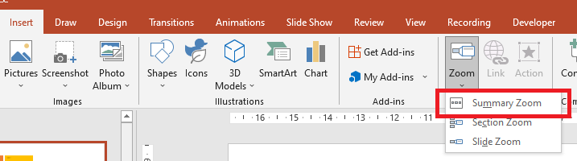

## **Overview**
Zooms in PowerPoint allow you to jump to and from specific slides, sections, and portions of a presentation. When you are presenting, this ability to navigate quickly across content might prove very useful. 



* To summarize an entire presentation on a single slide, use a [Summary Zoom](#Summary-Zoom).
* To show selected slides only, use a [Slide Zoom](#Slide-Zoom).
* To show a single section only, use a [Section Zoom](#Section-Zoom).

## **Slide Zoom**
A slide zoom can make your presentation more dynamic, allowing you to navigate freely between slides in any order you choose without interrupting the flow of your presentation. Slide zooms are great for short presentations without many sections, but you can still use them in different presentation scenarios.

Slide zooms help you drill into multiple pieces of information while you feel like you are on a single canvas. 


For slide zoom objects, Aspose.Slides provides the [ZoomImageType](https://reference.aspose.com/slides/net/aspose.slides/zoomimagetype) enumeration, the [IZoomFrame](https://reference.aspose.com/slides/net/aspose.slides/izoomframe) interface, and some methods under the [IShapeCollection](https://reference.aspose.com/slides/net/aspose.slides/ishapecollection) interface.

### **Creating Zoom Frames**

You can add a zoom frame on a slide this way:

1.	Create an instance of the [Presentation](https://reference.aspose.com/slides/net/aspose.slides/presentation) class.
2.	Create new slides to which you intend to link the zoom frames. 
3.	Add an identification text and background to the created slides.
4.  Add zoom frames (containing the references to created slides) to the first slide.
5.	Write the modified presentation as a PPTX file.

This C# code shows you how to create a zoom frame on a slide:

``` csharp 
using (Presentation pres = new Presentation())
{
    //Adds new slides to the presentation
    ISlide slide2 = pres.Slides.AddEmptySlide(pres.Slides[0].LayoutSlide);
    ISlide slide3 = pres.Slides.AddEmptySlide(pres.Slides[0].LayoutSlide);

    // Creates a background for the second slide
    slide2.Background.Type = BackgroundType.OwnBackground;
    slide2.Background.FillFormat.FillType = FillType.Solid;
    slide2.Background.FillFormat.SolidFillColor.Color = Color.Cyan;

    // Creates a text box for the second slide
    IAutoShape autoshape = slide2.Shapes.AddAutoShape(ShapeType.Rectangle, 100, 200, 500, 200);
    autoshape.TextFrame.Text = "Second Slide";

    // Creates a background for the third slide
    slide3.Background.Type = BackgroundType.OwnBackground;
    slide3.Background.FillFormat.FillType = FillType.Solid;
    slide3.Background.FillFormat.SolidFillColor.Color = Color.DarkKhaki;

    // Create a text box for the third slide
    autoshape = slide3.Shapes.AddAutoShape(ShapeType.Rectangle, 100, 200, 500, 200);
    autoshape.TextFrame.Text = "Trird Slide";

    //Adds ZoomFrame objects
    pres.Slides[0].Shapes.AddZoomFrame(20, 20, 250, 200, slide2);
    pres.Slides[0].Shapes.AddZoomFrame(200, 250, 250, 200, slide3);

    // Saves the presentation
    pres.Save("presentation.pptx", SaveFormat.Pptx);
}
```
### **Creating Zoom Frames with Custom Images**
With Aspose.Slides for .NET, you can create a zoom frame with a different slide preview image this way: 
1.	Create an instance of the [Presentation](https://reference.aspose.com/slides/net/aspose.slides/presentation) class.
2.	Create a new slide to which you intend to link the zoom frame. 
3.	Add an identification text and background to the slide.
4.  Create an [IPPImage](https://reference.aspose.com/slides/net/aspose.slides/ippimage) object by adding an image to the Images collection associated with the [Presentation](https://reference.aspose.com/slides/net/aspose.slides/presentation) object that will be used to fill the frame.
5.  Add zoom frames (containing the reference to created slide) to the first slide.
6.	Write the modified presentation as a PPTX file.

This C# code shows you how to create a zoom frame with a different image:

``` csharp 
using (Presentation pres = new Presentation())
{
    //Adds a new slide to the presentation
    ISlide slide = pres.Slides.AddEmptySlide(pres.Slides[0].LayoutSlide);

    // Creates a background for the second slide
    slide.Background.Type = BackgroundType.OwnBackground;
    slide.Background.FillFormat.FillType = FillType.Solid;
    slide.Background.FillFormat.SolidFillColor.Color = Color.Cyan;

    // Creates a text box for the third slide
    IAutoShape autoshape = slide.Shapes.AddAutoShape(ShapeType.Rectangle, 100, 200, 500, 200);
    autoshape.TextFrame.Text = "Second Slide";

    // Creates a new image for the zoom object
    IImage image = Images.FromFile("image.png");
    IPPImage ppImage = pres.Images.AddImage(image);
    image.Dispose();

    //Adds the ZoomFrame object
    pres.Slides[0].Shapes.AddZoomFrame(20, 20, 300, 200, slide, ppImage);

    // Saves the presentation
    pres.Save("presentation.pptx", SaveFormat.Pptx);
}
```
### **Formatting Zoom Frames**
In the previous sections, we showed you how to create simple zoom frames. To create more complicated zoom frames, you have to alter a simple frame's formatting. There are several formatting options you can apply to a zoom frame. 

You can control a zoom frame's formatting on a slide this way:

1.	Create an instance of the [Presentation](https://reference.aspose.com/slides/net/aspose.slides/presentation) class.
2.	Create new slides to link to which you intend to link the zoom frame. 
3.	Add some identification text and background to the created slides.
4.  Add zoom frames (containing the references to the created slides) to the first slide.
5.  Create an [IPPImage](https://reference.aspose.com/slides/net/aspose.slides/ippimage) object by adding an image to the Images collection associated with the [Presentation](https://reference.aspose.com/slides/net/aspose.slides/presentation) object that will be used to fill the frame.
6.  Set a custom image for the first zoom frame object.
7.  Change the line format for the second zoom frame object.
8.  Remove the background from an image of the second zoom frame object.
5.	Write the modified presentation as a PPTX file.

This C# code shows you how to change a zoom frame's formatting on a slide: 

``` csharp 
using (Presentation pres = new Presentation())
{
    //Adds new slides to the presentation
    ISlide slide2 = pres.Slides.AddEmptySlide(pres.Slides[0].LayoutSlide);
    ISlide slide3 = pres.Slides.AddEmptySlide(pres.Slides[0].LayoutSlide);

    // Creates a background for the second slide
    slide2.Background.Type = BackgroundType.OwnBackground;
    slide2.Background.FillFormat.FillType = FillType.Solid;
    slide2.Background.FillFormat.SolidFillColor.Color = Color.Cyan;

    // Creates a text box for the second slide
    IAutoShape autoshape = slide2.Shapes.AddAutoShape(ShapeType.Rectangle, 100, 200, 500, 200);
    autoshape.TextFrame.Text = "Second Slide";

    // Creates a background for the third slide
    slide3.Background.Type = BackgroundType.OwnBackground;
    slide3.Background.FillFormat.FillType = FillType.Solid;
    slide3.Background.FillFormat.SolidFillColor.Color = Color.DarkKhaki;

    // Creates a text box for the third slide
    autoshape = slide3.Shapes.AddAutoShape(ShapeType.Rectangle, 100, 200, 500, 200);
    autoshape.TextFrame.Text = "Trird Slide";

    //Adds ZoomFrame objects
    IZoomFrame zoomFrame1 = pres.Slides[0].Shapes.AddZoomFrame(20, 20, 250, 200, slide2);
    IZoomFrame zoomFrame2 = pres.Slides[0].Shapes.AddZoomFrame(200, 250, 250, 200, slide3);

    // Creates a new image for the zoom object
    IImage image = Images.FromFile("image.png");
    IPPImage ppImage = pres.Images.AddImage(image);
    image.Dispose();

    // Sets custom image for zoomFrame1 object
    zoomFrame1.ZoomImage = ppImage;

    // Sets a zoom frame format for the zoomFrame2 object
    zoomFrame2.LineFormat.Width = 5;
    zoomFrame2.LineFormat.FillFormat.FillType = FillType.Solid;
    zoomFrame2.LineFormat.FillFormat.SolidFillColor.Color = Color.HotPink;
    zoomFrame2.LineFormat.DashStyle = LineDashStyle.DashDot;

    // Setting for Do not show background for zoomFrame2 object
    zoomFrame2.ShowBackground = false;

    // Saves the presentation
    pres.Save("presentation.pptx", SaveFormat.Pptx);
}
```

## **Section Zoom**

A section zoom is a link to a section in your presentation. You can use section zooms to go back to sections you want to really emphasize. Or you can use them to highlight how certain pieces of your presentation connect. 


For section zoom objects, Aspose.Slides provides the [ISectionZoomFrame](https://reference.aspose.com/slides/net/aspose.slides/isectionzoomframe) interface and some methods under the [IShapeCollection](https://reference.aspose.com/slides/net/aspose.slides/ishapecollection) interface.

### **Creating Section Zoom Frames**

You can add a section zoom frame to a slide this way:

1.	Create an instance of the [Presentation](https://reference.aspose.com/slides/net/aspose.slides/presentation) class.
2.	Create a new slide. 
3.	Add an identification background to the created slide.
4.  Create a new section to which you intend to link the zoom frame. 
5.  Add a section zoom frame (containing references to the created section) to the first slide.
6.	Write the modified presentation as a PPTX file.

This C# code shows you how to create a zoom frame on a slide:

``` csharp 
using (Presentation pres = new Presentation())
{
    //Adds a new slide to the presentation
    ISlide slide = pres.Slides.AddEmptySlide(pres.Slides[0].LayoutSlide);
    slide.Background.FillFormat.FillType = FillType.Solid;
    slide.Background.FillFormat.SolidFillColor.Color = Color.YellowGreen;
    slide.Background.Type = BackgroundType.OwnBackground;

    // Adds a new Section to the presentation
    pres.Sections.AddSection("Section 1", slide);

    // Adds a SectionZoomFrame object
    ISectionZoomFrame sectionZoomFrame = pres.Slides[0].Shapes.AddSectionZoomFrame(20, 20, 300, 200, pres.Sections[1]);

    // Saves the presentation
    pres.Save("presentation.pptx", SaveFormat.Pptx);
}
```
### **Creating Section Zoom Frames with Custom Images**

Using Aspose.Slides for .NET, you can create a section zoom frame with a different slide preview image this way: 

1.	Create an instance of the [Presentation](https://reference.aspose.com/slides/net/aspose.slides/presentation) class.
2.	Create a new slide.
3.	Add an identification background to created slide.
4.	Create a new section to which you intend to link the zoom frame. 
5.  Create an [IPPImage](https://reference.aspose.com/slides/net/aspose.slides/ippimage) object by adding an image to the Images collection associated with the [Presentation](https://reference.aspose.com/slides/net/aspose.slides/presentation) object that will be used to fill the frame.
5.  Add a section zoom frame (containing a reference to the created section) to the first slide.
6.	Write the modified presentation as a PPTX file.

This C# code shows you how to create a zoom frame with a different image:

``` csharp 
using (Presentation pres = new Presentation())
{
    //Adds new slide to the presentation
    ISlide slide = pres.Slides.AddEmptySlide(pres.Slides[0].LayoutSlide);
    slide.Background.FillFormat.FillType = FillType.Solid;
    slide.Background.FillFormat.SolidFillColor.Color = Color.YellowGreen;
    slide.Background.Type = BackgroundType.OwnBackground;

    // Adds a new Section to the presentation
    pres.Sections.AddSection("Section 1", slide);

    // Creates a new image for the zoom object
    IImage image = Images.FromFile("image.png");
    IPPImage ppImage = pres.Images.AddImage(image);
    image.Dispose();

    // Adds SectionZoomFrame object
    ISectionZoomFrame sectionZoomFrame = pres.Slides[0].Shapes.AddSectionZoomFrame(20, 20, 300, 200, pres.Sections[1], ppImage);

    // Saves the presentation
    pres.Save("presentation.pptx", SaveFormat.Pptx);
}
```
### **Formatting Section Zoom Frames**

To create more complicated section zoom frames, you have to alter a simple frame's formatting. There are several formatting options you can apply to a section zoom frame. 

You can control a section zoom frame's formatting on a slide this way:

1.	Create an instance of the [Presentation](https://reference.aspose.com/slides/net/aspose.slides/presentation) class.
2.	Create a new slide.
3.	Add identification background to created slide.
4.	Create a new section to which you intend to link the zoom frame. 
5.	Add a section zoom frame (containing references to created section) to the first slide.
6.	Change the size and position for the created section zoom object.
7.	Create an [IPPImage](https://reference.aspose.com/slides/net/aspose.slides/ippimage) object by adding an image to the Images collection associated with the [Presentation](https://reference.aspose.com/slides/net/aspose.slides/presentation) object that will be used to fill the frame.
8.	Set a custom image for the created section zoom frame object.
9.	Set the *return to the original slide from the linked section* ability. 
10.	Remove the background from an image of the section zoom frame object.
11.	Change the line format for the second zoom frame object.
12.	Change the transition duration.
13.	Write the modified presentation as a PPTX file.

This C# code shows you how to change a section zoom frame's formatting:

``` csharp 
using (Presentation pres = new Presentation())
{
    //Adds a new slide to the presentation
    ISlide slide = pres.Slides.AddEmptySlide(pres.Slides[0].LayoutSlide);
    slide.Background.FillFormat.FillType = FillType.Solid;
    slide.Background.FillFormat.SolidFillColor.Color = Color.YellowGreen;
    slide.Background.Type = BackgroundType.OwnBackground;

    // Adds a new Section to the presentation
    pres.Sections.AddSection("Section 1", slide);

    // Add SectionZoomFrame object
    ISectionZoomFrame sectionZoomFrame = pres.Slides[0].Shapes.AddSectionZoomFrame(20, 20, 300, 200, pres.Sections[1]);

    // Formatting for SectionZoomFrame
    sectionZoomFrame.X = 100;
    sectionZoomFrame.Y = 300;
    sectionZoomFrame.Width = 100;
    sectionZoomFrame.Height = 75;

    IImage image = Images.FromFile("image.png");
    IPPImage ppImage = pres.Images.AddImage(image);
    image.Dispose();

    sectionZoomFrame.ZoomImage = ppImage;

    sectionZoomFrame.ReturnToParent = true;
    sectionZoomFrame.ShowBackground = false;

    sectionZoomFrame.LineFormat.FillFormat.FillType = FillType.Solid;
    sectionZoomFrame.LineFormat.FillFormat.SolidFillColor.Color = Color.Brown;
    sectionZoomFrame.LineFormat.DashStyle = LineDashStyle.DashDot;
    sectionZoomFrame.LineFormat.Width = 2.5f;

    sectionZoomFrame.TransitionDuration = 1.5f;

    // Saves the presentation
    pres.Save("presentation.pptx", SaveFormat.Pptx);
}
```


## **Summary Zoom**

A summary zoom is like a landing page where all the pieces of your presentation are displayed at once. When you're presenting, you can use the zoom to go from one place in your presentation to another in any order you like. You can get creative, skip ahead, or revisit pieces of your slide show without interrupting the flow of your presentation.



For summary zoom objects, Aspose.Slides provides the [ISummaryZoomFrame](https://reference.aspose.com/slides/net/aspose.slides/isummaryzoomframe), [ISummaryZoomFrameSection](https://reference.aspose.com/slides/net/aspose.slides/isummaryzoomsection), and [ISummaryZoomSectionCollection](https://reference.aspose.com/slides/net/aspose.slides/isummaryzoomsectioncollection) interfaces and some methods under the [IShapeCollection](https://reference.aspose.com/slides/net/aspose.slides/ishapecollection) interface.

### **Creating Summary Zoom**

You can add a summary zoom frame to a slide this way:

1.	Create an instance of the [Presentation](https://reference.aspose.com/slides/net/aspose.slides/presentation) class.
2.	Create new slides with identification background and new sections for created slides.
3.  Add the summary zoom frame to the first slide.
4.	Write the modified presentation as a PPTX file.

This C# code shows you how to create a summary zoom frame on a slide:

``` csharp 
using (Presentation pres = new Presentation())
{
    //Adds a new slide to the presentation
    ISlide slide = pres.Slides.AddEmptySlide(pres.Slides[0].LayoutSlide);
    slide.Background.FillFormat.FillType = FillType.Solid;
    slide.Background.FillFormat.SolidFillColor.Color = Color.Brown;
    slide.Background.Type = BackgroundType.OwnBackground;

    // Adds a new section to the presentation
    pres.Sections.AddSection("Section 1", slide);

    //Adds a new slide to the presentation
    slide = pres.Slides.AddEmptySlide(pres.Slides[0].LayoutSlide);
    slide.Background.FillFormat.FillType = FillType.Solid;
    slide.Background.FillFormat.SolidFillColor.Color = Color.Aqua;
    slide.Background.Type = BackgroundType.OwnBackground;

    // Adds a new section to the presentation
    pres.Sections.AddSection("Section 2", slide);

    //Adds a new slide to the presentation
    slide = pres.Slides.AddEmptySlide(pres.Slides[0].LayoutSlide);
    slide.Background.FillFormat.FillType = FillType.Solid;
    slide.Background.FillFormat.SolidFillColor.Color = Color.Chartreuse;
    slide.Background.Type = BackgroundType.OwnBackground;

    // Adds a new section to the presentation
    pres.Sections.AddSection("Section 3", slide);

    //Adds a new slide to the presentation
    slide = pres.Slides.AddEmptySlide(pres.Slides[0].LayoutSlide);
    slide.Background.FillFormat.FillType = FillType.Solid;
    slide.Background.FillFormat.SolidFillColor.Color = Color.DarkGreen;
    slide.Background.Type = BackgroundType.OwnBackground;

    // Adds a new section to the presentation
    pres.Sections.AddSection("Section 4", slide);

    // Adds a SummaryZoomFrame object
    ISummaryZoomFrame summaryZoomFrame = pres.Slides[0].Shapes.AddSummaryZoomFrame(150, 50, 300, 200);

    // Saves the presentation
    pres.Save("presentation.pptx", SaveFormat.Pptx);
}
```

### **Adding and Removing Summary Zoom Section**

All sections in a summary zoom frame are represented by [ISummaryZoomFrameSection](https://reference.aspose.com/slides/net/aspose.slides/isummaryzoomsection) objects, which are stored in the [ISummaryZoomSectionCollection](https://reference.aspose.com/slides/net/aspose.slides/isummaryzoomsectioncollection) object. You can add or remove a summary zoom section object through the [ISummaryZoomSectionCollection](https://reference.aspose.com/slides/net/aspose.slides/isummaryzoomsectioncollection) interface this way:

1.	Create an instance of the [Presentation](https://reference.aspose.com/slides/net/aspose.slides/presentation) class.
2.	Create new slides with identification background and new sections for created slides.
3.  Add a summary zoom frame into the first slide.
4.  Add a new slide and section to the presentation.
5.  Add the created section to the summary zoom frame.
6.  Remove the first section from the summary zoom frame.
7.	Write the modified presentation as a PPTX file.

This C# code shows you how to add and remove sections in a summary zoom frame:

``` csharp 
using (Presentation pres = new Presentation())
{
    //Adds a new slide to the presentation
    ISlide slide = pres.Slides.AddEmptySlide(pres.Slides[0].LayoutSlide);
    slide.Background.FillFormat.FillType = FillType.Solid;
    slide.Background.FillFormat.SolidFillColor.Color = Color.Brown;
    slide.Background.Type = BackgroundType.OwnBackground;

    // Adds a new section to the presentation
    pres.Sections.AddSection("Section 1", slide);

    //Adds a new slide to the presentation
    slide = pres.Slides.AddEmptySlide(pres.Slides[0].LayoutSlide);
    slide.Background.FillFormat.FillType = FillType.Solid;
    slide.Background.FillFormat.SolidFillColor.Color = Color.Aqua;
    slide.Background.Type = BackgroundType.OwnBackground;

    // Adds a new section to the presentation
    pres.Sections.AddSection("Section 2", slide);

    // Adds SummaryZoomFrame object
    ISummaryZoomFrame summaryZoomFrame = pres.Slides[0].Shapes.AddSummaryZoomFrame(150, 50, 300, 200);

    //Adds a new slide to the presentation
    slide = pres.Slides.AddEmptySlide(pres.Slides[0].LayoutSlide);
    slide.Background.FillFormat.FillType = FillType.Solid;
    slide.Background.FillFormat.SolidFillColor.Color = Color.Chartreuse;
    slide.Background.Type = BackgroundType.OwnBackground;

    // Adds a new section to the presentation
    ISection section3 = pres.Sections.AddSection("Section 3", slide);

    // Adds a section to the Summary Zoom
    summaryZoomFrame.SummaryZoomCollection.AddSummaryZoomSection(section3);

    // Removes section from the Summary Zoom
    summaryZoomFrame.SummaryZoomCollection.RemoveSummaryZoomSection(pres.Sections[1]);

    // Saves the presentation
    pres.Save("presentation.pptx", SaveFormat.Pptx);
}
```

### **Formatting Summary Zoom Sections**

To create more complicated summary zoom section objects, you have to alter a simple frame's formatting. There are several formatting options you can apply to a summary zoom section object. 

You can control the formatting for a summary zoom section object in a summary zoom frame this way:

1.	Create an instance of the [Presentation](https://reference.aspose.com/slides/net/aspose.slides/presentation) class.
2.	Create new slides with identification background and new sections for created slides.
3.  Add a summary zoom frame to the first slide.
4.  Get a summary zoom section object for the first object from the `ISummaryZoomSectionCollection`.
7.  Create an [IPPImage](https://reference.aspose.com/slides/net/aspose.slides/ippimage) object by adding an image to the images collection associated with the [Presentation](https://reference.aspose.com/slides/net/aspose.slides/presentation) object that will be used to fill the frame.
8.  Set a custom image for the created section zoom frame object.
9.  Set the *return to the original slide from the linked section* ability. 
11. Change the line format for the second zoom frame object.
12. Change the transition duration.
13.	Write the modified presentation as a PPTX file.

This C# code shows you how to change the formatting for a summary zoom section object:

``` csharp 
using (Presentation pres = new Presentation())
{
    //Adds a new slide to the presentation
    ISlide slide = pres.Slides.AddEmptySlide(pres.Slides[0].LayoutSlide);
    slide.Background.FillFormat.FillType = FillType.Solid;
    slide.Background.FillFormat.SolidFillColor.Color = Color.Brown;
    slide.Background.Type = BackgroundType.OwnBackground;

    // Adds a new section to the presentation
    pres.Sections.AddSection("Section 1", slide);

    //Adds a new slide to the presentation
    slide = pres.Slides.AddEmptySlide(pres.Slides[0].LayoutSlide);
    slide.Background.FillFormat.FillType = FillType.Solid;
    slide.Background.FillFormat.SolidFillColor.Color = Color.Aqua;
    slide.Background.Type = BackgroundType.OwnBackground;

    // Adds a new section to the presentation
    pres.Sections.AddSection("Section 2", slide);

    // Adds a SummaryZoomFrame object
    ISummaryZoomFrame summaryZoomFrame = pres.Slides[0].Shapes.AddSummaryZoomFrame(150, 50, 300, 200);

    // Gets the first SummaryZoomSection object
    ISummaryZoomSection summarySection = summaryZoomFrame.SummaryZoomCollection[0];

    IImage image = Images.FromFile("image.png");
    IPPImage ppImage = pres.Images.AddImage(image);
    image.Dispose();

    // Formatting for SummaryZoomSection object
    summarySection.ZoomImage = ppImage;
    summarySection.ReturnToParent = false;

    summarySection.LineFormat.FillFormat.FillType = FillType.Solid;
    summarySection.LineFormat.FillFormat.SolidFillColor.Color = Color.Black;
    summarySection.LineFormat.DashStyle = LineDashStyle.DashDot;
    summarySection.LineFormat.Width = 1.5f;

    summarySection.TransitionDuration = 1.5f;

    // Saves the presentation
    pres.Save("presentation.pptx", SaveFormat.Pptx);
}
```

## **FAQ**

**Can I control returning to the 'parent' slide after showing the target?**

Yes. The [Zoom frame](https://reference.aspose.com/slides/net/aspose.slides/zoomframe/) or [section](https://reference.aspose.com/slides/net/aspose.slides/sectionzoomframe/) has a `ReturnToParent` behavior that, when enabled, sends viewers back to the originating slide after they visit the target content.

**Can I adjust the 'speed' or duration of the Zoom transition?**

Yes. Zoom supports setting a `TransitionDuration` so you can control how long the jump animation takes.

**Are there limits on how many Zoom objects a presentation can contain?**

There is no hard API limit documented. Practical limits depend on overall presentation complexity and the viewer's performance. You can add many Zoom frames, but consider file size and rendering time.
