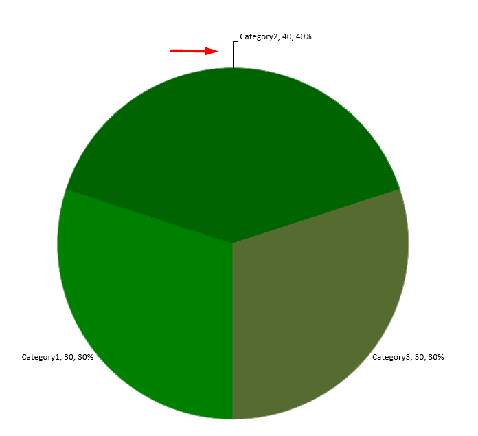

Data labels on a chart show details about the chart data series or individual data points. They allow readers to quickly identify data series and they also make charts easier to understand.

## **Set Precision of Data in Chart Data Labels**

This C# code shows you how to set the data precision in a chart data label:

```c#
using (Presentation pres = new Presentation())
{
	IChart chart = pres.Slides[0].Shapes.AddChart(ChartType.Line, 50, 50, 450, 300);
	chart.HasDataTable = true;
	chart.ChartData.Series[0].NumberFormatOfValues = "#,##0.00";

	pres.Save("PrecisionOfDatalabels_out.pptx", SaveFormat.Pptx);
}
```

## **Display Percentage as Labels**
Aspose.Slides for .NET allows you to set percentage labels on displayed charts. This C# code demonstrates the operation:

```c#
// Creates an instance of the Presentation class
Presentation presentation = new Presentation();

ISlide slide = presentation.Slides[0];
IChart chart = slide.Shapes.AddChart(ChartType.StackedColumn, 20, 20, 400, 400);
IChartSeries series = chart.ChartData.Series[0];
IChartCategory cat;
double[] total_for_Cat = new double[chart.ChartData.Categories.Count];
for (int k = 0; k < chart.ChartData.Categories.Count; k++)
{
    cat = chart.ChartData.Categories[k];

    for (int i = 0; i < chart.ChartData.Series.Count; i++)
    {
        total_for_Cat[k] = total_for_Cat[k] + Convert.ToDouble(chart.ChartData.Series[i].DataPoints[k].Value.Data);
    }
}

double dataPontPercent = 0f;

for (int x = 0; x < chart.ChartData.Series.Count; x++)
{
    series = chart.ChartData.Series[x];
    series.Labels.DefaultDataLabelFormat.ShowLegendKey = false;

    for (int j = 0; j < series.DataPoints.Count; j++)
    {
        IDataLabel lbl = series.DataPoints[j].Label;
        dataPontPercent = (Convert.ToDouble(series.DataPoints[j].Value.Data) / total_for_Cat[j]) * 100;

        IPortion port = new Portion();
        port.Text = String.Format("{0:F2} %", dataPontPercent);
        port.PortionFormat.FontHeight = 8f;
        lbl.TextFrameForOverriding.Text = "";
        IParagraph para = lbl.TextFrameForOverriding.Paragraphs[0];
        para.Portions.Add(port);

        lbl.DataLabelFormat.ShowSeriesName = false;
        lbl.DataLabelFormat.ShowPercentage = false;
        lbl.DataLabelFormat.ShowLegendKey = false;
        lbl.DataLabelFormat.ShowCategoryName = false;
        lbl.DataLabelFormat.ShowBubbleSize = false;
    }
}

// Saves the presentation containing the chart
presentation.Save("DisplayPercentageAsLabels_out.pptx", SaveFormat.Pptx);
```

## **Set Percentage Sign with Chart Data Labels**
This C# code shows you to set the percentage sign for a chart data label:

```c#
// Creates an instance of the Presentation class
Presentation presentation = new Presentation();

// Gets a slide's reference through its index
ISlide slide = presentation.Slides[0];

// Creates the PercentsStackedColumn chart on a slide
IChart chart = slide.Shapes.AddChart(ChartType.PercentsStackedColumn, 20, 20, 500, 400);

// Sets the NumberFormatLinkedToSource to false
chart.Axes.VerticalAxis.IsNumberFormatLinkedToSource = false;
chart.Axes.VerticalAxis.NumberFormat = "0.00%";

chart.ChartData.Series.Clear();
int defaultWorksheetIndex = 0;

// Gets the chart data worksheet
IChartDataWorkbook workbook = chart.ChartData.ChartDataWorkbook;

// Adds new series
IChartSeries series = chart.ChartData.Series.Add(workbook.GetCell(defaultWorksheetIndex, 0, 1, "Reds"), chart.Type);
series.DataPoints.AddDataPointForBarSeries(workbook.GetCell(defaultWorksheetIndex, 1, 1, 0.30));
series.DataPoints.AddDataPointForBarSeries(workbook.GetCell(defaultWorksheetIndex, 2, 1, 0.50));
series.DataPoints.AddDataPointForBarSeries(workbook.GetCell(defaultWorksheetIndex, 3, 1, 0.80));
series.DataPoints.AddDataPointForBarSeries(workbook.GetCell(defaultWorksheetIndex, 4, 1, 0.65));

// Sets the fill color of series
series.Format.Fill.FillType = FillType.Solid;
series.Format.Fill.SolidFillColor.Color = Color.Red;

// Sets the LabelFormat properties
series.Labels.DefaultDataLabelFormat.ShowValue = true;
series.Labels.DefaultDataLabelFormat.IsNumberFormatLinkedToSource = false;
series.Labels.DefaultDataLabelFormat.NumberFormat = "0.0%";
series.Labels.DefaultDataLabelFormat.TextFormat.PortionFormat.FontHeight = 10;
series.Labels.DefaultDataLabelFormat.TextFormat.PortionFormat.FillFormat.FillType = FillType.Solid;
series.Labels.DefaultDataLabelFormat.TextFormat.PortionFormat.FillFormat.SolidFillColor.Color = Color.White;
series.Labels.DefaultDataLabelFormat.ShowValue = true;

// Adds new series
IChartSeries series2 = chart.ChartData.Series.Add(workbook.GetCell(defaultWorksheetIndex, 0, 2, "Blues"), chart.Type);
series2.DataPoints.AddDataPointForBarSeries(workbook.GetCell(defaultWorksheetIndex, 1, 2, 0.70));
series2.DataPoints.AddDataPointForBarSeries(workbook.GetCell(defaultWorksheetIndex, 2, 2, 0.50));
series2.DataPoints.AddDataPointForBarSeries(workbook.GetCell(defaultWorksheetIndex, 3, 2, 0.20));
series2.DataPoints.AddDataPointForBarSeries(workbook.GetCell(defaultWorksheetIndex, 4, 2, 0.35));

// Sets Fill type and color
series2.Format.Fill.FillType = FillType.Solid;
series2.Format.Fill.SolidFillColor.Color = Color.Blue;
series2.Labels.DefaultDataLabelFormat.ShowValue = true;
series2.Labels.DefaultDataLabelFormat.IsNumberFormatLinkedToSource = false;
series2.Labels.DefaultDataLabelFormat.NumberFormat = "0.0%";
series2.Labels.DefaultDataLabelFormat.TextFormat.PortionFormat.FontHeight = 10;
series2.Labels.DefaultDataLabelFormat.TextFormat.PortionFormat.FillFormat.FillType = FillType.Solid;
series2.Labels.DefaultDataLabelFormat.TextFormat.PortionFormat.FillFormat.SolidFillColor.Color = Color.White;

// Writes the presentation to disk
presentation.Save("SetDataLabelsPercentageSign_out.pptx", SaveFormat.Pptx);
```

## **Set Label Distance From Axis**
This C# code shows you how to set the label distance from a category axis when you are dealing with a chart plotted from axes:

```c#
// Creates an instance of the Presentation class
Presentation presentation = new Presentation();

// Gets a slide's reference
ISlide sld = presentation.Slides[0];

// Creates a chart on the slide
IChart ch = sld.Shapes.AddChart(ChartType.ClusteredColumn, 20, 20, 500, 300);

// Sets the label distance from an axis
ch.Axes.HorizontalAxis.LabelOffset = 500;

// Writes the presentation to disk
presentation.Save("SetCategoryAxisLabelDistance_out.pptx", SaveFormat.Pptx);
```

## **Adjust Label Location**

When you create a chart that does not rely on any axis such as a pie chart, the chart's data labels may end up being too close to its edge. In such a case, you have to adjust the location of the data label so that the leader lines get displayed clearly.

This C# code shows you how to adjust the label location on a pie chart: 

```c#
using (Presentation pres = new Presentation())
{
    IChart chart = pres.Slides[0].Shapes.AddChart(ChartType.Pie, 50, 50, 200, 200);

    IChartSeriesCollection series = chart.ChartData.Series;
    IDataLabel label = series[0].Labels[0];

    label.DataLabelFormat.ShowValue = true;
    label.DataLabelFormat.Position = LegendDataLabelPosition.OutsideEnd;
    label.X = 0.71f;
    label.Y = 0.04f;

    pres.Save("pres.pptx", SaveFormat.Pptx);
}
```


