## **Overview**

This article provides a comprehensive guide on how to create and customize charts using Aspose.Slides for .NET. You will learn how to programmatically add a chart to a slide, populate it with data, and apply various formatting options to match your specific design requirements. Throughout the article, detailed code examples illustrate each step, from initializing the presentation and chart object to configuring series, axes, and legends. By following this guide, you'll gain a solid understanding of how to integrate dynamic chart generation into your .NET applications, streamlining the process of creating data-driven presentations.

## **Create a Chart**

Charts help people quickly visualize data and gain insights that may not be immediately obvious from a table or spreadsheet.

**Why Create Charts?**

Using charts, you can:

* aggregate, condense, or summarize large amounts of data on a single slide in a presentation;
* expose patterns and trends in data;
* deduce the direction and momentum of data over time or with respect to a specific unit of measurement;
* spot outliers, aberrations, deviations, errors, and nonsensical data;
* communicate or present complex data.

In PowerPoint, you can create charts through the *Insert* function, which provides templates for designing many types of charts. Using Aspose.Slides, you can create both regular charts (based on popular chart types) and custom charts.

{} 

Use the [ChartType](https://reference.aspose.com/slides/net/aspose.slides.charts/charttype/) enumeration under the [Aspose.Slides.Charts](https://reference.aspose.com/slides/net/aspose.slides.charts/) namespace. The values in this enumeration correspond to different chart types.

{} 

### **Create Clustered Column Charts**

This section explains how to create clustered column charts using Aspose.Slides for .NET. You'll learn to initialize a presentation, add a chart, and customize its elements such as title, data, series, categories, and styling. Follow the steps below to see how a standard clustered column chart is generated:

1. Create an instance of the [Presentation](https://reference.aspose.com/slides/net/aspose.slides/presentation) class.
1. Get a reference to a slide using its index.
1. Add a chart with some data and specify the `ChartType.ClusteredColumn` type.
1. Add a title to the chart.
1. Access the chart's data worksheet.
1. Clear all the default series and categories.
1. Add new series and categories.
1. Add new chart data for the chart series.
1. Apply a fill color to the chart series.
1. Add labels to the chart series.
1. Save the modified presentation as a PPTX file.

This C# code demonstrates how to create a clustered column chart:

```c#
// Instantiate the Presentation class.
using (Presentation presentation = new Presentation())
{
    // Access the first slide.
    ISlide slide = presentation.Slides[0];

    // Add a clustered column chart with its default data.
    IChart chart = slide.Shapes.AddChart(ChartType.ClusteredColumn, 20, 20, 500, 300);

    // Set the chart title.
    chart.ChartTitle.AddTextFrameForOverriding("Sample Title");
    chart.ChartTitle.TextFrameForOverriding.TextFrameFormat.CenterText = NullableBool.True;
    chart.ChartTitle.Height = 20;
    chart.HasTitle = true;

    // Set the first series to show values.
    chart.ChartData.Series[0].Labels.DefaultDataLabelFormat.ShowValue = true;

    // Set the index of the chart data sheet.
    int worksheetIndex = 0;

    // Get the chart data workbook.
    IChartDataWorkbook workbook = chart.ChartData.ChartDataWorkbook;

    // Delete the default generated series and categories.
    chart.ChartData.Series.Clear();
    chart.ChartData.Categories.Clear();

    // Add new series.
    chart.ChartData.Series.Add(workbook.GetCell(worksheetIndex, 0, 1, "Series 1"), chart.Type);
    chart.ChartData.Series.Add(workbook.GetCell(worksheetIndex, 0, 2, "Series 2"), chart.Type);

    // Add new categories.
    chart.ChartData.Categories.Add(workbook.GetCell(worksheetIndex, 1, 0, "Category 1"));
    chart.ChartData.Categories.Add(workbook.GetCell(worksheetIndex, 2, 0, "Category 2"));
    chart.ChartData.Categories.Add(workbook.GetCell(worksheetIndex, 3, 0, "Category 3"));

    // Get the first chart series.
    IChartSeries series = chart.ChartData.Series[0];

    // Populate the series data.
    series.DataPoints.AddDataPointForBarSeries(workbook.GetCell(worksheetIndex, 1, 1, 20));
    series.DataPoints.AddDataPointForBarSeries(workbook.GetCell(worksheetIndex, 2, 1, 50));
    series.DataPoints.AddDataPointForBarSeries(workbook.GetCell(worksheetIndex, 3, 1, 30));

    // Set the fill color for the series.
    series.Format.Fill.FillType = FillType.Solid;
    series.Format.Fill.SolidFillColor.Color = Color.Red;

    // Get the second chart series.
    series = chart.ChartData.Series[1];

    // Populate the series data.
    series.DataPoints.AddDataPointForBarSeries(workbook.GetCell(worksheetIndex, 1, 2, 30));
    series.DataPoints.AddDataPointForBarSeries(workbook.GetCell(worksheetIndex, 2, 2, 10));
    series.DataPoints.AddDataPointForBarSeries(workbook.GetCell(worksheetIndex, 3, 2, 60));

    // Set the fill color for the series.
    series.Format.Fill.FillType = FillType.Solid;
    series.Format.Fill.SolidFillColor.Color = Color.Green;

    // Set the first label to show the category name.
    IDataLabel label = series.DataPoints[0].Label;
    label.DataLabelFormat.ShowCategoryName = true;

    label = series.DataPoints[1].Label;
    label.DataLabelFormat.ShowSeriesName = true;

    // Set the series to show the value for the third label.
    label = series.DataPoints[2].Label;
    label.DataLabelFormat.ShowValue = true;
    label.DataLabelFormat.ShowSeriesName = true;
    label.DataLabelFormat.Separator = "/";

    // Save the presentation to disk as a PPTX file.
    presentation.Save("AsposeChart_out.pptx", SaveFormat.Pptx);
}
```

The result:

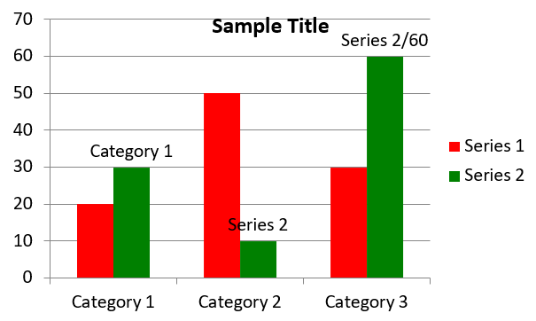

### **Create Scatter Charts**

Scatter charts (also known as scatter plots or x-y graphs) are often used to check for patterns or demonstrate correlations between two variables.

Use a scatter chart when:

* You have paired numerical data.
* You have two variables that pair well together.
* You want to determine whether the two variables are related.
* You have an independent variable that has multiple values for a dependent variable.

This C# code shows you how to create a scatter chart with a different series of markers:

```c#
// Instantiate the Presentation class.
using (Presentation presentation = new Presentation())
{
    // Access the first slide.
    ISlide slide = presentation.Slides[0];

    // Create the default scatter chart.
    IChart chart = slide.Shapes.AddChart(ChartType.ScatterWithSmoothLines, 20, 20, 500, 300);

    // Set the index of the chart data sheet.
    int worksheetIndex = 0;

    // Get the chart data workbook.
    IChartDataWorkbook workbook = chart.ChartData.ChartDataWorkbook;

    // Delete the default series.
    chart.ChartData.Series.Clear();

    // Add new series.
    chart.ChartData.Series.Add(workbook.GetCell(worksheetIndex, 1, 1, "Series 1"), chart.Type);
    chart.ChartData.Series.Add(workbook.GetCell(worksheetIndex, 1, 3, "Series 2"), chart.Type);

    // Get the first chart series.
    IChartSeries series = chart.ChartData.Series[0];

    // Add a new point (1:3) to the series.
    series.DataPoints.AddDataPointForScatterSeries(workbook.GetCell(worksheetIndex, 2, 1, 1), workbook.GetCell(worksheetIndex, 2, 2, 3));

    // Add a new point (2:10).
    series.DataPoints.AddDataPointForScatterSeries(workbook.GetCell(worksheetIndex, 3, 1, 2), workbook.GetCell(worksheetIndex, 3, 2, 10));

    // Change the series type.
    series.Type = ChartType.ScatterWithStraightLinesAndMarkers;

    // Change the chart series marker.
    series.Marker.Size = 10;
    series.Marker.Symbol = MarkerStyleType.Star;

    // Get the second chart series.
    series = chart.ChartData.Series[1];

    // Add a new point (5:2) to the chart series.
    series.DataPoints.AddDataPointForScatterSeries(workbook.GetCell(worksheetIndex, 2, 3, 5), workbook.GetCell(worksheetIndex, 2, 4, 2));

    // Add a new point (3:1).
    series.DataPoints.AddDataPointForScatterSeries(workbook.GetCell(worksheetIndex, 3, 3, 3), workbook.GetCell(worksheetIndex, 3, 4, 1));

    // Add a new point (2:2).
    series.DataPoints.AddDataPointForScatterSeries(workbook.GetCell(worksheetIndex, 4, 3, 2), workbook.GetCell(worksheetIndex, 4, 4, 2));

    // Add a new point (5:1).
    series.DataPoints.AddDataPointForScatterSeries(workbook.GetCell(worksheetIndex, 5, 3, 5), workbook.GetCell(worksheetIndex, 5, 4, 1));

    // Change the chart series marker.
    series.Marker.Size = 10;
    series.Marker.Symbol = MarkerStyleType.Circle;

    // Save the presentation to disk as a PPTX file.
    presentation.Save("AsposeChart_out.pptx", SaveFormat.Pptx);
}
```

The result:

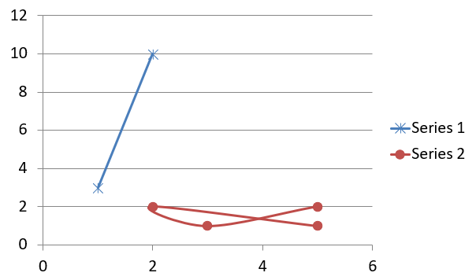

### **Create Pie Charts**

Pie charts are best used to show the part-to-whole relationship in data, especially when the data contains categorical labels with numeric values. However, if your data contains many parts or labels, you might want to consider using a bar chart instead.

1. Create an instance of the [Presentation](https://reference.aspose.com/slides/net/aspose.slides/presentation) class.
1. Get a reference to a slide using its index.
1. Add a chart with default data and specify the `ChartType.Pie` type.
1. Access the chart's data workbook ([IChartDataWorkbook](https://reference.aspose.com/slides/net/aspose.slides.charts/ichartdataworkbook/)).
1. Clear the default series and categories.
1. Add new series and categories.
1. Add new chart data for the chart series.
1. Add new points for the chart and apply custom colors to the pie chart's sectors.
1. Set labels for the series.
1. Enable leader lines for the series labels.
1. Set the rotation angle for the pie chart.
1. Save the modified presentation as a PPTX file.

This C# code shows you how to create a pie chart:

```c#
// Instantiate the Presentation class.
using (Presentation presentation = new Presentation())
{
    // Access the first slide.
    ISlide slide = presentation.Slides[0];

    // Add a chart with its default data.
    IChart chart = slide.Shapes.AddChart(ChartType.Pie, 20, 20, 500, 300);

    // Set the chart title.
    chart.ChartTitle.AddTextFrameForOverriding("Sample Title");
    chart.ChartTitle.TextFrameForOverriding.TextFrameFormat.CenterText = NullableBool.True;
    chart.ChartTitle.Height = 20;
    chart.HasTitle = true;

    // Set the first series to show values.
    chart.ChartData.Series[0].Labels.DefaultDataLabelFormat.ShowValue = true;

    // Set the index of the chart data sheet.
    int worksheetIndex = 0;

    // Get the chart data workbook.
    IChartDataWorkbook workbook = chart.ChartData.ChartDataWorkbook;

    // Delete the default generated series and categories.
    chart.ChartData.Series.Clear();
    chart.ChartData.Categories.Clear();

    // Add new categories.
    chart.ChartData.Categories.Add(workbook.GetCell(0, 1, 0, "1st Qtr"));
    chart.ChartData.Categories.Add(workbook.GetCell(0, 2, 0, "2nd Qtr"));
    chart.ChartData.Categories.Add(workbook.GetCell(0, 3, 0, "3rd Qtr"));

    // Add new series.
    IChartSeries series = chart.ChartData.Series.Add(workbook.GetCell(0, 0, 1, "Series 1"), chart.Type);

    // Populate the series data.
    series.DataPoints.AddDataPointForPieSeries(workbook.GetCell(worksheetIndex, 1, 1, 20));
    series.DataPoints.AddDataPointForPieSeries(workbook.GetCell(worksheetIndex, 2, 1, 50));
    series.DataPoints.AddDataPointForPieSeries(workbook.GetCell(worksheetIndex, 3, 1, 30));

    // Set the sector color.
    chart.ChartData.SeriesGroups[0].IsColorVaried = true;

    IChartDataPoint point = series.DataPoints[0];
    point.Format.Fill.FillType = FillType.Solid;
    point.Format.Fill.SolidFillColor.Color = Color.Cyan;

    // Set the sector border.
    point.Format.Line.FillFormat.FillType = FillType.Solid;
    point.Format.Line.FillFormat.SolidFillColor.Color = Color.Gray;
    point.Format.Line.Width = 3.0;
    point.Format.Line.Style = LineStyle.ThinThick;
    point.Format.Line.DashStyle = LineDashStyle.LargeDash;

    IChartDataPoint point1 = series.DataPoints[1];
    point1.Format.Fill.FillType = FillType.Solid;
    point1.Format.Fill.SolidFillColor.Color = Color.Brown;

    // Set the sector border.
    point1.Format.Line.FillFormat.FillType = FillType.Solid;
    point1.Format.Line.FillFormat.SolidFillColor.Color = Color.Blue;
    point1.Format.Line.Width = 3.0;
    point1.Format.Line.Style = LineStyle.Single;
    point1.Format.Line.DashStyle = LineDashStyle.LargeDashDot;

    IChartDataPoint point2 = series.DataPoints[2];
    point2.Format.Fill.FillType = FillType.Solid;
    point2.Format.Fill.SolidFillColor.Color = Color.Coral;

    // Set the sector border.
    point2.Format.Line.FillFormat.FillType = FillType.Solid;
    point2.Format.Line.FillFormat.SolidFillColor.Color = Color.Red;
    point2.Format.Line.Width = 2.0;
    point2.Format.Line.Style = LineStyle.ThinThin;
    point2.Format.Line.DashStyle = LineDashStyle.LargeDashDotDot;

    // Create custom labels for each category in the new series.
    IDataLabel label1 = series.DataPoints[0].Label;

    label1.DataLabelFormat.ShowValue = true;

    IDataLabel label2 = series.DataPoints[1].Label;
    label2.DataLabelFormat.ShowValue = true;
    label2.DataLabelFormat.ShowLegendKey = true;
    label2.DataLabelFormat.ShowPercentage = true;

    IDataLabel label3 = series.DataPoints[2].Label;
    label3.DataLabelFormat.ShowSeriesName = true;
    label3.DataLabelFormat.ShowPercentage = true;

    // Set the series to show leader lines for the chart.
    series.Labels.DefaultDataLabelFormat.ShowLeaderLines = true;

    // Set the rotation angle for the pie chart sectors.
    chart.ChartData.SeriesGroups[0].FirstSliceAngle = 180;

    // Save the presentation to disk as a PPTX file.
    presentation.Save("PieChart_out.pptx", SaveFormat.Pptx);
}
```

The result:

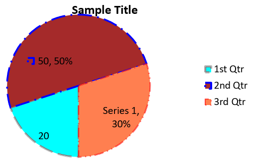

### **Create Line Charts**

Line charts (also known as line graphs) are best used in situations where you want to demonstrate changes in value over time. Using a line chart, you can compare a large amount of data at once, track changes and trends over time, highlight anomalies in data series, and more.

1. Create an instance of the [Presentation](https://reference.aspose.com/slides/net/aspose.slides/presentation) class.
1. Get a reference to a slide using its index.
1. Add a chart with default data and specify the `ChartType.Line` type.
1. Access the chart's data workbook ([IChartDataWorkbook](https://reference.aspose.com/slides/net/aspose.slides.charts/ichartdataworkbook/)).
1. Clear the default series and categories.
1. Add new series and categories.
1. Add new chart data for the chart series.
1. Save the modified presentation as a PPTX file.

This C# code shows you how to create a line chart:

```c#
using (Presentation presentation = new Presentation())
{
    IChart lineChart = presentation.Slides[0].Shapes.AddChart(ChartType.Line, 20, 20, 500, 300);

    presentation.Save("lineChart.pptx", SaveFormat.Pptx);
}
```

By default, points on a line chart are joined by straight continuous lines. If you want the points to be joined by dashes instead, you can specify your preferred dash type as follows:

```c#
foreach (IChartSeries series in lineChart.ChartData.Series)
{
    series.Format.Line.DashStyle = LineDashStyle.Dash;
}
```

The result:

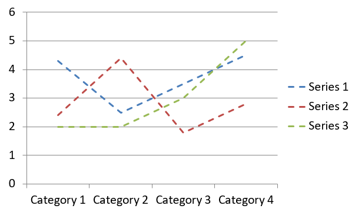

### **Create Tree Map Charts**

Tree map charts are best used for sales data when you want to show the relative size of data categories and quickly draw attention to items that are large contributors within each category.

1. Create an instance of the [Presentation](https://reference.aspose.com/slides/net/aspose.slides/presentation) class.
1. Get a reference to a slide using its index.
1. Add a chart with default data and specify the `ChartType.Treemap` type.
1. Access the chart's data workbook ([IChartDataWorkbook](https://reference.aspose.com/slides/net/aspose.slides.charts/ichartdataworkbook/)).
1. Clear the default series and categories.
1. Add new series and categories.
1. Add new chart data for the chart series.
1. Save the modified presentation as a PPTX file.

This C# code shows you how to create a tree map chart:

```c#
using (Presentation presentation = new Presentation())
{
    IChart chart = presentation.Slides[0].Shapes.AddChart(ChartType.Treemap, 20, 20, 500, 300);
    chart.ChartData.Categories.Clear();
    chart.ChartData.Series.Clear();

    IChartDataWorkbook workbook = chart.ChartData.ChartDataWorkbook;
    workbook.Clear(0);

    // Branch 1
    IChartCategory leaf = chart.ChartData.Categories.Add(workbook.GetCell(0, "C1", "Leaf1"));
    leaf.GroupingLevels.SetGroupingItem(1, "Stem1");
    leaf.GroupingLevels.SetGroupingItem(2, "Branch1");

    chart.ChartData.Categories.Add(workbook.GetCell(0, "C2", "Leaf2"));

    leaf = chart.ChartData.Categories.Add(workbook.GetCell(0, "C3", "Leaf3"));
    leaf.GroupingLevels.SetGroupingItem(1, "Stem2");

    chart.ChartData.Categories.Add(workbook.GetCell(0, "C4", "Leaf4"));

    // Branch 2
    leaf = chart.ChartData.Categories.Add(workbook.GetCell(0, "C5", "Leaf5"));
    leaf.GroupingLevels.SetGroupingItem(1, "Stem3");
    leaf.GroupingLevels.SetGroupingItem(2, "Branch2");

    chart.ChartData.Categories.Add(workbook.GetCell(0, "C6", "Leaf6"));

    leaf = chart.ChartData.Categories.Add(workbook.GetCell(0, "C7", "Leaf7"));
    leaf.GroupingLevels.SetGroupingItem(1, "Stem4");

    chart.ChartData.Categories.Add(workbook.GetCell(0, "C8", "Leaf8"));

    IChartSeries series = chart.ChartData.Series.Add(ChartType.Treemap);
    series.Labels.DefaultDataLabelFormat.ShowCategoryName = true;
    series.DataPoints.AddDataPointForTreemapSeries(workbook.GetCell(0, "D1", 4));
    series.DataPoints.AddDataPointForTreemapSeries(workbook.GetCell(0, "D2", 5));
    series.DataPoints.AddDataPointForTreemapSeries(workbook.GetCell(0, "D3", 3));
    series.DataPoints.AddDataPointForTreemapSeries(workbook.GetCell(0, "D4", 6));
    series.DataPoints.AddDataPointForTreemapSeries(workbook.GetCell(0, "D5", 9));
    series.DataPoints.AddDataPointForTreemapSeries(workbook.GetCell(0, "D6", 9));
    series.DataPoints.AddDataPointForTreemapSeries(workbook.GetCell(0, "D7", 4));
    series.DataPoints.AddDataPointForTreemapSeries(workbook.GetCell(0, "D8", 3));

    series.ParentLabelLayout = ParentLabelLayoutType.Overlapping;

    presentation.Save("Treemap.pptx", SaveFormat.Pptx);
}
```

The result:

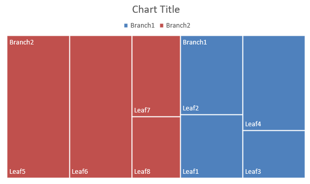

### **Create Stock Charts**

Stock charts are used to display financial data such as open, high, low, and close prices, helping analyze market trends and volatility. They offer essential insights into stock performance, aiding investors and analysts in making informed decisions.

1. Create an instance of the [Presentation](https://reference.aspose.com/slides/net/aspose.slides/presentation) class.
1. Get a reference to a slide using its index.
1. Add a chart with default data and specify the `ChartType.OpenHighLowClose` type.
1. Access the chart's data workbook ([IChartDataWorkbook](https://reference.aspose.com/slides/net/aspose.slides.charts/ichartdataworkbook/)).
1. Clear the default series and categories.
1. Add new series and categories.
1. Add new chart data for the chart series.
1. Specify the HiLowLines format.
1. Save the modified presentation as a PPTX file.

This C# code shows you how to create a stock chart:

```c#
using (Presentation presentation = new Presentation())
{
    IChart chart = presentation.Slides[0].Shapes.AddChart(ChartType.OpenHighLowClose, 20, 20, 500, 300, false);

    IChartDataWorkbook workbook = chart.ChartData.ChartDataWorkbook;

    chart.ChartData.Categories.Add(workbook.GetCell(0, 1, 0, "A"));
    chart.ChartData.Categories.Add(workbook.GetCell(0, 2, 0, "B"));
    chart.ChartData.Categories.Add(workbook.GetCell(0, 3, 0, "C"));

    chart.ChartData.Series.Add(workbook.GetCell(0, 0, 1, "Open"), chart.Type);
    chart.ChartData.Series.Add(workbook.GetCell(0, 0, 2, "High"), chart.Type);
    chart.ChartData.Series.Add(workbook.GetCell(0, 0, 3, "Low"), chart.Type);
    chart.ChartData.Series.Add(workbook.GetCell(0, 0, 4, "Close"), chart.Type);

    IChartSeries series = chart.ChartData.Series[0];
    series.DataPoints.AddDataPointForStockSeries(workbook.GetCell(0, 1, 1, 72));
    series.DataPoints.AddDataPointForStockSeries(workbook.GetCell(0, 2, 1, 25));
    series.DataPoints.AddDataPointForStockSeries(workbook.GetCell(0, 3, 1, 38));

    series = chart.ChartData.Series[1];
    series.DataPoints.AddDataPointForStockSeries(workbook.GetCell(0, 1, 2, 172));
    series.DataPoints.AddDataPointForStockSeries(workbook.GetCell(0, 2, 2, 57));
    series.DataPoints.AddDataPointForStockSeries(workbook.GetCell(0, 3, 2, 57));

    series = chart.ChartData.Series[2];
    series.DataPoints.AddDataPointForStockSeries(workbook.GetCell(0, 1, 3, 12));
    series.DataPoints.AddDataPointForStockSeries(workbook.GetCell(0, 2, 3, 12));
    series.DataPoints.AddDataPointForStockSeries(workbook.GetCell(0, 3, 3, 13));

    series = chart.ChartData.Series[3];
    series.DataPoints.AddDataPointForStockSeries(workbook.GetCell(0, 1, 4, 25));
    series.DataPoints.AddDataPointForStockSeries(workbook.GetCell(0, 2, 4, 38));
    series.DataPoints.AddDataPointForStockSeries(workbook.GetCell(0, 3, 4, 50));

    chart.ChartData.SeriesGroups[0].UpDownBars.HasUpDownBars = true;
    chart.ChartData.SeriesGroups[0].HiLowLinesFormat.Line.FillFormat.FillType = FillType.Solid;

    foreach (IChartSeries ser in chart.ChartData.Series)
    {
        ser.Format.Line.FillFormat.FillType = FillType.NoFill;
    }

    chart.Axes.VerticalAxis.MinorGridLinesFormat.Line.FillFormat.FillType = FillType.NoFill;

    presentation.Save("Stock-chart.pptx", SaveFormat.Pptx);
}
```

The result:

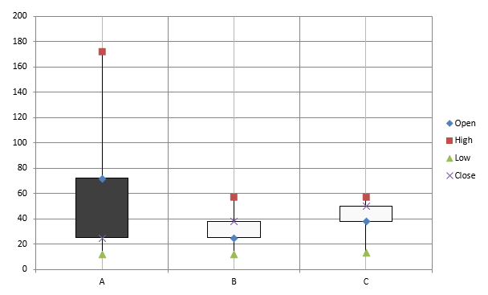

### **Create Box and Whisker Charts**

Box and Whisker charts are used to display the distribution of data by summarizing key statistical measures, such as the median, quartiles, and potential outliers. They are particularly useful in exploratory data analysis and statistical studies to quickly understand data variability and identify any anomalies.

1. Create an instance of the [Presentation](https://reference.aspose.com/slides/net/aspose.slides/presentation) class.
1. Get a reference to a slide using its index.
1. Add a chart with default data and specify the `ChartType.BoxAndWhisker` type.
1. Access the chart's data workbook ([IChartDataWorkbook](https://reference.aspose.com/slides/net/aspose.slides.charts/ichartdataworkbook/)).
1. Clear the default series and categories.
1. Add new series and categories.
1. Add new chart data for the chart series.
1. Save the modified presentation as a PPTX file.

This C# code shows you how to create a box and whisker chart:

```c#
using (Presentation presentation = new Presentation())
{
    IChart chart = presentation.Slides[0].Shapes.AddChart(ChartType.BoxAndWhisker, 20, 20, 500, 300);
    chart.ChartData.Categories.Clear();
    chart.ChartData.Series.Clear();

    IChartDataWorkbook workbook = chart.ChartData.ChartDataWorkbook;
    workbook.Clear(0);

    chart.ChartData.Categories.Add(workbook.GetCell(0, "A1", "Category 1"));
    chart.ChartData.Categories.Add(workbook.GetCell(0, "A2", "Category 2"));
    chart.ChartData.Categories.Add(workbook.GetCell(0, "A3", "Category 3"));
    chart.ChartData.Categories.Add(workbook.GetCell(0, "A4", "Category 4"));
    chart.ChartData.Categories.Add(workbook.GetCell(0, "A5", "Category 5"));
    chart.ChartData.Categories.Add(workbook.GetCell(0, "A6", "Category 6"));

    IChartSeries series = chart.ChartData.Series.Add(ChartType.BoxAndWhisker);

    series.QuartileMethod = QuartileMethodType.Exclusive;
    series.ShowMeanLine = true;
    series.ShowMeanMarkers = true;
    series.ShowInnerPoints = true;
    series.ShowOutlierPoints = true;

    series.DataPoints.AddDataPointForBoxAndWhiskerSeries(workbook.GetCell(0, "B1", 15));
    series.DataPoints.AddDataPointForBoxAndWhiskerSeries(workbook.GetCell(0, "B2", 41));
    series.DataPoints.AddDataPointForBoxAndWhiskerSeries(workbook.GetCell(0, "B3", 16));
    series.DataPoints.AddDataPointForBoxAndWhiskerSeries(workbook.GetCell(0, "B4", 10));
    series.DataPoints.AddDataPointForBoxAndWhiskerSeries(workbook.GetCell(0, "B5", 23));
    series.DataPoints.AddDataPointForBoxAndWhiskerSeries(workbook.GetCell(0, "B6", 16));

    presentation.Save("BoxAndWhisker.pptx", SaveFormat.Pptx);
}
```

### **Create Funnel Charts**

Funnel charts are used to visualize processes that involve sequential stages, where the volume of data decreases as it progresses from one step to the next. They are especially helpful for analyzing conversion rates, identifying bottlenecks, and tracking the efficiency of sales or marketing processes.

1. Create an instance of the [Presentation](https://reference.aspose.com/slides/net/aspose.slides/presentation) class.
1. Get a reference to a slide using its index.
1. Add a chart with default data and specify the `ChartType.Funnel` type.
1. Save the modified presentation as a PPTX file.

This C# code shows you how to create a funnel chart:

```c#
using (Presentation presentation = new Presentation("test.pptx"))
{
    IChart chart = presentation.Slides[0].Shapes.AddChart(ChartType.Funnel, 50, 50, 500, 400);
    chart.ChartData.Categories.Clear();
    chart.ChartData.Series.Clear();

    IChartDataWorkbook workbook = chart.ChartData.ChartDataWorkbook;
    workbook.Clear(0);

    chart.ChartData.Categories.Add(workbook.GetCell(0, "A1", "Category 1"));
    chart.ChartData.Categories.Add(workbook.GetCell(0, "A2", "Category 2"));
    chart.ChartData.Categories.Add(workbook.GetCell(0, "A3", "Category 3"));
    chart.ChartData.Categories.Add(workbook.GetCell(0, "A4", "Category 4"));
    chart.ChartData.Categories.Add(workbook.GetCell(0, "A5", "Category 5"));
    chart.ChartData.Categories.Add(workbook.GetCell(0, "A6", "Category 6"));

    IChartSeries series = chart.ChartData.Series.Add(ChartType.Funnel);

    series.DataPoints.AddDataPointForFunnelSeries(workbook.GetCell(0, "B1", 50));
    series.DataPoints.AddDataPointForFunnelSeries(workbook.GetCell(0, "B2", 100));
    series.DataPoints.AddDataPointForFunnelSeries(workbook.GetCell(0, "B3", 200));
    series.DataPoints.AddDataPointForFunnelSeries(workbook.GetCell(0, "B4", 300));
    series.DataPoints.AddDataPointForFunnelSeries(workbook.GetCell(0, "B5", 400));
    series.DataPoints.AddDataPointForFunnelSeries(workbook.GetCell(0, "B6", 500));

    presentation.Save("Funnel.pptx", SaveFormat.Pptx);
}
```

The result:

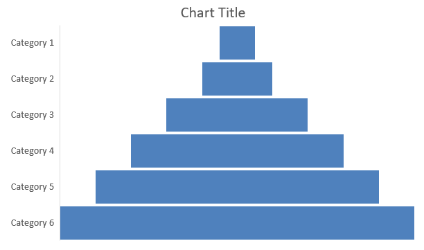

### **Create Sunburst Charts**

Sunburst charts are used to visualize hierarchical data, displaying levels as concentric rings. They help illustrate part-to-whole relationships and are ideal for representing nested categories and subcategories in a clear, compact format.

1. Create an instance of the [Presentation](https://reference.aspose.com/slides/net/aspose.slides/presentation) class.
1. Get a reference to a slide using its index.
1. Add a chart with default data and specify the `ChartType.Sunburst` type.
1. Save the modified presentation as a PPTX file.

This C# code shows you how to create a sunburst chart:

```c#
using (Presentation presentation = new Presentation())
{
    IChart chart = presentation.Slides[0].Shapes.AddChart(ChartType.Sunburst, 20, 20, 500, 300);
    chart.ChartData.Categories.Clear();
    chart.ChartData.Series.Clear();

    IChartDataWorkbook workbook = chart.ChartData.ChartDataWorkbook;
    workbook.Clear(0);

    // Branch 1
    IChartCategory leaf = chart.ChartData.Categories.Add(workbook.GetCell(0, "C1", "Leaf1"));
    leaf.GroupingLevels.SetGroupingItem(1, "Stem1");
    leaf.GroupingLevels.SetGroupingItem(2, "Branch1");

    chart.ChartData.Categories.Add(workbook.GetCell(0, "C2", "Leaf2"));

    leaf = chart.ChartData.Categories.Add(workbook.GetCell(0, "C3", "Leaf3"));
    leaf.GroupingLevels.SetGroupingItem(1, "Stem2");

    chart.ChartData.Categories.Add(workbook.GetCell(0, "C4", "Leaf4"));

    // Branch 2
    leaf = chart.ChartData.Categories.Add(workbook.GetCell(0, "C5", "Leaf5"));
    leaf.GroupingLevels.SetGroupingItem(1, "Stem3");
    leaf.GroupingLevels.SetGroupingItem(2, "Branch2");

    chart.ChartData.Categories.Add(workbook.GetCell(0, "C6", "Leaf6"));

    leaf = chart.ChartData.Categories.Add(workbook.GetCell(0, "C7", "Leaf7"));
    leaf.GroupingLevels.SetGroupingItem(1, "Stem4");

    chart.ChartData.Categories.Add(workbook.GetCell(0, "C8", "Leaf8"));

    IChartSeries series = chart.ChartData.Series.Add(ChartType.Sunburst);
    series.Labels.DefaultDataLabelFormat.ShowCategoryName = true;
    series.DataPoints.AddDataPointForSunburstSeries(workbook.GetCell(0, "D1", 4));
    series.DataPoints.AddDataPointForSunburstSeries(workbook.GetCell(0, "D2", 5));
    series.DataPoints.AddDataPointForSunburstSeries(workbook.GetCell(0, "D3", 3));
    series.DataPoints.AddDataPointForSunburstSeries(workbook.GetCell(0, "D4", 6));
    series.DataPoints.AddDataPointForSunburstSeries(workbook.GetCell(0, "D5", 9));
    series.DataPoints.AddDataPointForSunburstSeries(workbook.GetCell(0, "D6", 9));
    series.DataPoints.AddDataPointForSunburstSeries(workbook.GetCell(0, "D7", 4));
    series.DataPoints.AddDataPointForSunburstSeries(workbook.GetCell(0, "D8", 3));

    presentation.Save("Sunburst.pptx", SaveFormat.Pptx);
}
```

The result:

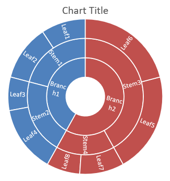

### **Create Histogram Charts**

Histogram charts are used to represent the distribution of numerical data by grouping values into ranges or bins. They are particularly useful for identifying data patterns such as frequency, skewness, and spread, and for detecting outliers in a dataset.

1. Create an instance of the [Presentation](https://reference.aspose.com/slides/net/aspose.slides/presentation) class.
1. Get a reference to a slide using its index.
1. Add a chart with some data and specify the `ChartType.Histogram` type.
1. Access the chart data workbook ([IChartDataWorkbook](https://reference.aspose.com/slides/net/aspose.slides.charts/ichartdataworkbook/)).
1. Clear the default series and categories.
1. Add new series and categories.
1. Save the modified presentation as a PPTX file.

This C# code shows you how to create a histogram chart:

```c#
using (Presentation presentation = new Presentation())
{
    IChart chart = presentation.Slides[0].Shapes.AddChart(ChartType.Histogram, 20, 20, 500, 300);
    chart.ChartData.Categories.Clear();
    chart.ChartData.Series.Clear();

    IChartDataWorkbook workbook = chart.ChartData.ChartDataWorkbook;
    workbook.Clear(0);

    IChartSeries series = chart.ChartData.Series.Add(ChartType.Histogram);
    series.DataPoints.AddDataPointForHistogramSeries(workbook.GetCell(0, "A1", 15));
    series.DataPoints.AddDataPointForHistogramSeries(workbook.GetCell(0, "A2", -41));
    series.DataPoints.AddDataPointForHistogramSeries(workbook.GetCell(0, "A3", 16));
    series.DataPoints.AddDataPointForHistogramSeries(workbook.GetCell(0, "A4", 10));
    series.DataPoints.AddDataPointForHistogramSeries(workbook.GetCell(0, "A5", -23));
    series.DataPoints.AddDataPointForHistogramSeries(workbook.GetCell(0, "A6", 16));

    chart.Axes.HorizontalAxis.AggregationType = AxisAggregationType.Automatic;

    presentation.Save("Histogram.pptx", SaveFormat.Pptx);
}
```

The result:

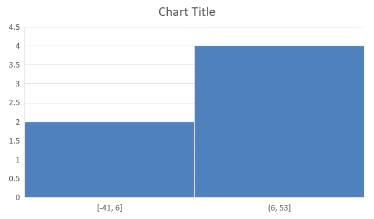

### **Create Radar Charts**

Radar charts are used to display multivariate data in a two-dimensional format, allowing for easy comparison of several variables simultaneously. They are particularly useful for identifying patterns, strengths, and weaknesses across multiple performance metrics or attributes.

1. Create an instance of the [Presentation](https://reference.aspose.com/slides/net/aspose.slides/presentation) class.
1. Get a reference to a slide using its index.
1. Add a chart with some data and specify the `ChartType.Radar` type.
1. Save the modified presentation as a PPTX file.

This C# code shows you how to create a radar chart:

```c#
using (Presentation presentation = new Presentation())
{
    presentation.Slides[0].Shapes.AddChart(ChartType.Radar, 20, 20, 500, 300);
    presentation.Save("Radar-chart.pptx", SaveFormat.Pptx);
}
```

The result:

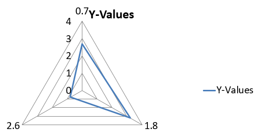

### **Create Multi Category Charts**

Multi Category charts are used to display data that involves more than one categorical grouping, allowing you to compare values across multiple dimensions simultaneously. They are particularly helpful when you need to analyze trends and relationships within complex, multi-layered datasets.

1. Create an instance of the [Presentation](https://reference.aspose.com/slides/net/aspose.slides/presentation) class.
1. Get a reference to a slide using its index.
1. Add a chart with default data and specify the `ChartType.ClusteredColumn` type.
1. Access the chart's data workbook ([IChartDataWorkbook](https://reference.aspose.com/slides/net/aspose.slides.charts/ichartdataworkbook/)).
1. Clear the default series and categories.
1. Add new series and categories.
1. Add new chart data for the chart series.
1. Save the modified presentation as a PPTX file.

This C# code shows you how to create a multicategory chart:

```c#
using (Presentation presentation = new Presentation())
{
    ISlide slide = presentation.Slides[0];

    IChart chart = presentation.Slides[0].Shapes.AddChart(ChartType.ClusteredColumn, 20, 20, 500, 300);
    chart.ChartData.Series.Clear();
    chart.ChartData.Categories.Clear();

    IChartDataWorkbook workbook = chart.ChartData.ChartDataWorkbook;
    workbook.Clear(0);

    int worksheetIndex = 0;

    IChartCategory category = chart.ChartData.Categories.Add(workbook.GetCell(0, "c2", "A"));
    category.GroupingLevels.SetGroupingItem(1, "Group1");
    category = chart.ChartData.Categories.Add(workbook.GetCell(0, "c3", "B"));

    category = chart.ChartData.Categories.Add(workbook.GetCell(0, "c4", "C"));
    category.GroupingLevels.SetGroupingItem(1, "Group2");
    category = chart.ChartData.Categories.Add(workbook.GetCell(0, "c5", "D"));

    category = chart.ChartData.Categories.Add(workbook.GetCell(0, "c6", "E"));
    category.GroupingLevels.SetGroupingItem(1, "Group3");
    category = chart.ChartData.Categories.Add(workbook.GetCell(0, "c7", "F"));

    category = chart.ChartData.Categories.Add(workbook.GetCell(0, "c8", "G"));
    category.GroupingLevels.SetGroupingItem(1, "Group4");
    category = chart.ChartData.Categories.Add(workbook.GetCell(0, "c9", "H"));

    // Add a series.
    IChartSeries series = chart.ChartData.Series.Add(workbook.GetCell(0, "D1", "Series 1"), ChartType.ClusteredColumn);

    series.DataPoints.AddDataPointForBarSeries(workbook.GetCell(worksheetIndex, "D2", 10));
    series.DataPoints.AddDataPointForBarSeries(workbook.GetCell(worksheetIndex, "D3", 20));
    series.DataPoints.AddDataPointForBarSeries(workbook.GetCell(worksheetIndex, "D4", 30));
    series.DataPoints.AddDataPointForBarSeries(workbook.GetCell(worksheetIndex, "D5", 40));
    series.DataPoints.AddDataPointForBarSeries(workbook.GetCell(worksheetIndex, "D6", 50));
    series.DataPoints.AddDataPointForBarSeries(workbook.GetCell(worksheetIndex, "D7", 60));
    series.DataPoints.AddDataPointForBarSeries(workbook.GetCell(worksheetIndex, "D8", 70));
    series.DataPoints.AddDataPointForBarSeries(workbook.GetCell(worksheetIndex, "D9", 80));

    // Save the presentation with the chart.
    presentation.Save("AsposeChart_out.pptx", SaveFormat.Pptx);
}
```

The result:

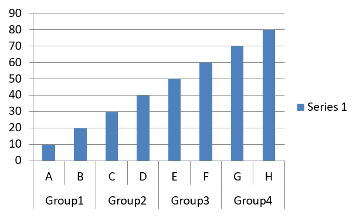

### **Create Map Charts**

Map charts are used to visualize geographical data by mapping information to specific locations such as countries, states, or cities. They are particularly useful for analyzing regional trends, demographic data, and spatial distributions in a clear, visually engaging manner.

This C# code shows you how to create a map chart:

```c#
using (Presentation presentation = new Presentation())
{
    IChart chart = presentation.Slides[0].Shapes.AddChart(ChartType.Map, 20, 20, 500, 300);
    presentation.Save("mapChart.pptx", SaveFormat.Pptx);
}
```

The result:

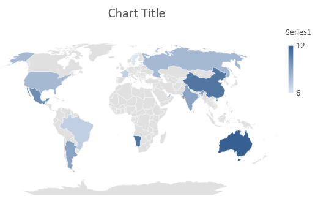

### **Create Combination Charts**

A combination chart (or combo chart) is a chart that combines two or more chart types into a single graph. This type of chart allows you to highlight, compare, or review differences between two or more sets of data, enabling you to identify any relationships between them.

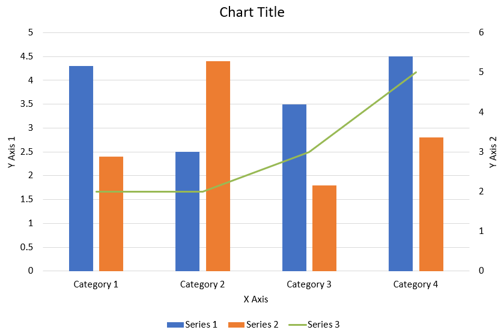

This C# code shows you how to create a combination chart in a PowerPoint presentation:

```c#
private static void CreateComboChart()
{
    using (Presentation presentation = new Presentation())
    {
        IChart chart = CreateChart(presentation.Slides[0]);

        AddFirstSeriesToChart(chart);
        AddSecondSeriesToChart(chart);

        presentation.Save("combo-chart.pptx", SaveFormat.Pptx);
    }
}

private static IChart CreateChart(ISlide slide)
{
    IChart chart = slide.Shapes.AddChart(ChartType.ClusteredColumn, 50, 50, 500, 400);
    chart.ChartData.Series.Clear();
    chart.ChartData.Categories.Clear();

    IChartDataWorkbook workbook = chart.ChartData.ChartDataWorkbook;
    const int worksheetIndex = 0;
    
    chart.ChartData.Series.Add(workbook.GetCell(worksheetIndex, 0, 1, "Series 1"), chart.Type);
    chart.ChartData.Series.Add(workbook.GetCell(worksheetIndex, 0, 2, "Series 2"), chart.Type);
    
    chart.ChartData.Categories.Add(workbook.GetCell(worksheetIndex, 1, 0, "Category 1"));
    chart.ChartData.Categories.Add(workbook.GetCell(worksheetIndex, 2, 0, "Category 2"));
    chart.ChartData.Categories.Add(workbook.GetCell(worksheetIndex, 3, 0, "Category 3"));

    IChartSeries series = chart.ChartData.Series[0];

    series.DataPoints.AddDataPointForBarSeries(workbook.GetCell(worksheetIndex, 1, 1, 20));
    series.DataPoints.AddDataPointForBarSeries(workbook.GetCell(worksheetIndex, 2, 1, 50));
    series.DataPoints.AddDataPointForBarSeries(workbook.GetCell(worksheetIndex, 3, 1, 30));
    
    series = chart.ChartData.Series[1];
    
    series.DataPoints.AddDataPointForBarSeries(workbook.GetCell(worksheetIndex, 1, 2, 30));
    series.DataPoints.AddDataPointForBarSeries(workbook.GetCell(worksheetIndex, 2, 2, 10));
    series.DataPoints.AddDataPointForBarSeries(workbook.GetCell(worksheetIndex, 3, 2, 60));

    return chart;
}

private static void AddFirstSeriesToChart(IChart chart)
{
    IChartDataWorkbook workbook = chart.ChartData.ChartDataWorkbook;
    const int worksheetIndex = 0;
    
    IChartSeries series = chart.ChartData.Series.Add(
		workbook.GetCell(worksheetIndex, 0, 3, "Series 3"), 
		ChartType.ScatterWithSmoothLines);

    series.DataPoints.AddDataPointForScatterSeries(
        workbook.GetCell(worksheetIndex, 0, 1, 3),
        workbook.GetCell(worksheetIndex, 0, 2, 5));
    
    series.DataPoints.AddDataPointForScatterSeries(
        workbook.GetCell(worksheetIndex, 1, 3, 10),
        workbook.GetCell(worksheetIndex, 1, 4, 13));

    series.DataPoints.AddDataPointForScatterSeries(
        workbook.GetCell(worksheetIndex, 2, 3, 20),
        workbook.GetCell(worksheetIndex, 2, 4, 15));

    series.PlotOnSecondAxis = true;
}

private static void AddSecondSeriesToChart(IChart chart)
{
    IChartDataWorkbook workbook = chart.ChartData.ChartDataWorkbook;
    const int worksheetIndex = 0;
    
    IChartSeries series = chart.ChartData.Series.Add(
		workbook.GetCell(worksheetIndex, 0, 5, "Series 4"),
        ChartType.ScatterWithStraightLinesAndMarkers);

    series.DataPoints.AddDataPointForScatterSeries(
        workbook.GetCell(worksheetIndex, 1, 3, 5),
        workbook.GetCell(worksheetIndex, 1, 4, 2));
    
    series.DataPoints.AddDataPointForScatterSeries(
        workbook.GetCell(worksheetIndex, 1, 5, 10),
        workbook.GetCell(worksheetIndex, 1, 6, 7));

    series.DataPoints.AddDataPointForScatterSeries(
        workbook.GetCell(worksheetIndex, 2, 5, 15),
        workbook.GetCell(worksheetIndex, 2, 6, 12));

    series.DataPoints.AddDataPointForScatterSeries(
        workbook.GetCell(worksheetIndex, 3, 5, 12),
        workbook.GetCell(worksheetIndex, 3, 6, 9));
    
    series.PlotOnSecondAxis = true;
}
```

## **Update Charts**

Aspose.Slides for .NET enables you to update PowerPoint charts by modifying chart data, formatting, and styling. This functionality simplifies the process of keeping presentations up-to-date with dynamic content and ensures that charts accurately reflect current data and visual standards.

1. Instantiate the [Presentation](https://reference.aspose.com/slides/net/aspose.slides/presentation) class that represents the presentation containing a chart.
1. Get a reference to a slide using its index.
1. Traverse through all shapes to find the chart.
1. Access the chart's data worksheet.
1. Modify the chart data series by changing the series values.
1. Add a new series and populate its data.
1. Save the modified presentation as a PPTX file.

This C# code shows you how to update a chart:

```c#
const string chartName = "My chart";

// Instantiate the Presentation class that represents a PPTX file.
using (Presentation presentation = new Presentation("ExistingChart.pptx"))
{
    // Access the first slide.
    ISlide slide = presentation.Slides[0];

    foreach (IShape shape in slide.Shapes)
    {
        if (shape is IChart chart && chart.Name == chartName)
        {
            // Set the index of the chart data sheet.
            int worksheetIndex = 0;

            // Get the chart data workbook.
            IChartDataWorkbook workbook = chart.ChartData.ChartDataWorkbook;

            // Change the chart category names.
            workbook.GetCell(worksheetIndex, 1, 0, "Modified Category 1");
            workbook.GetCell(worksheetIndex, 2, 0, "Modified Category 2");

            // Get the first chart series.
            IChartSeries series = chart.ChartData.Series[0];

            // Update the series data.
            workbook.GetCell(worksheetIndex, 0, 1, "New_Series 1"); // Modifying the series name.
            series.DataPoints[0].Value.Data = 90;
            series.DataPoints[1].Value.Data = 123;
            series.DataPoints[2].Value.Data = 44;

            // Get the second chart series.
            series = chart.ChartData.Series[1];

            // Update the series data.
            workbook.GetCell(worksheetIndex, 0, 2, "New_Series 2"); // Modifying the series name.
            series.DataPoints[0].Value.Data = 23;
            series.DataPoints[1].Value.Data = 67;
            series.DataPoints[2].Value.Data = 99;

            // Add a new series.
            series = chart.ChartData.Series.Add(workbook.GetCell(worksheetIndex, 0, 3, "Series 3"), chart.Type);

            // Populate the series data.
            series.DataPoints.AddDataPointForBarSeries(workbook.GetCell(worksheetIndex, 1, 3, 20));
            series.DataPoints.AddDataPointForBarSeries(workbook.GetCell(worksheetIndex, 2, 3, 50));
            series.DataPoints.AddDataPointForBarSeries(workbook.GetCell(worksheetIndex, 3, 3, 30));

            chart.Type = ChartType.ClusteredCylinder;
        }
    }

    // Save the presentation with the chart.
    presentation.Save("AsposeChartModified_out.pptx", SaveFormat.Pptx);
}
```

## **Set Data Range for Charts**

Aspose.Slides for .NET provides the flexibility to define a specific data range from a worksheet as the source for your chart’s data. This means you can directly map a portion of your worksheet to the chart, allowing you to control which cells contribute to the chart's series and categories. As a result, you can easily update and synchronize your charts with the latest data changes in your worksheet, ensuring that your PowerPoint presentations reflect current and accurate information.

1. Instantiate the [Presentation](https://reference.aspose.com/slides/net/aspose.slides/presentation) class that represents the presentation containing a chart.
1. Get a reference to a slide using its index.
1. Traverse through all shapes to find the chart.
1. Access the chart data and set the range.
1. Save the modified presentation as a PPTX file.

This C# code shows you how to set the data range for a chart:

```c#
const string chartName = "My chart";

// Instantiate the Presentation class that represents a PPTX file.
using (Presentation presentation = new Presentation("ExistingChart.pptx"))
{
    // Access the first slide.
    ISlide slide = presentation.Slides[0];

    foreach (IShape shape in slide.Shapes)
    {
        if (shape is IChart chart && chart.Name == chartName)
        {
            chart.ChartData.SetRange("Sheet1!A1:B4");
        }
    }

    presentation.Save("SetDataRange_out.pptx", SaveFormat.Pptx);
}
```

## **Use Default Markers in Charts**

When you use default markers in charts, each chart series gets a different default marker symbol automatically.

This C# code shows you how to set a chart series marker automatically:

```c#
using (Presentation presentation = new Presentation())
{
    ISlide slide = presentation.Slides[0];
    IChart chart = slide.Shapes.AddChart(ChartType.LineWithMarkers, 10, 10, 400, 400);

    chart.ChartData.Series.Clear();
    chart.ChartData.Categories.Clear();

    IChartDataWorkbook workbook = chart.ChartData.ChartDataWorkbook;

    IChartSeries series = chart.ChartData.Series.Add(workbook.GetCell(0, 0, 1, "Series 1"), chart.Type);

    chart.ChartData.Categories.Add(workbook.GetCell(0, 1, 0, "C1"));
    series.DataPoints.AddDataPointForLineSeries(workbook.GetCell(0, 1, 1, 24));

    chart.ChartData.Categories.Add(workbook.GetCell(0, 2, 0, "C2"));
    series.DataPoints.AddDataPointForLineSeries(workbook.GetCell(0, 2, 1, 23));

    chart.ChartData.Categories.Add(workbook.GetCell(0, 3, 0, "C3"));
    series.DataPoints.AddDataPointForLineSeries(workbook.GetCell(0, 3, 1, -10));

    chart.ChartData.Categories.Add(workbook.GetCell(0, 4, 0, "C4"));
    series.DataPoints.AddDataPointForLineSeries(workbook.GetCell(0, 4, 1, null));

    IChartSeries series2 = chart.ChartData.Series.Add(workbook.GetCell(0, 0, 2, "Series 2"), chart.Type);

    // Populate the series data.
    series2.DataPoints.AddDataPointForLineSeries(workbook.GetCell(0, 1, 2, 30));
    series2.DataPoints.AddDataPointForLineSeries(workbook.GetCell(0, 2, 2, 10));
    series2.DataPoints.AddDataPointForLineSeries(workbook.GetCell(0, 3, 2, 60));
    series2.DataPoints.AddDataPointForLineSeries(workbook.GetCell(0, 4, 2, 40));

    chart.HasLegend = true;
    chart.Legend.Overlay = false;

    presentation.Save("DefaultMarkersInChart.pptx", SaveFormat.Pptx);
}
```

## **FAQs**

**What chart types are supported by Aspose.Slides for .NET?**

Aspose.Slides for .NET supports a wide range of chart types, including bar, line, pie, area, scatter, histogram, radar, and many more. This flexibility allows you to choose the most appropriate chart type for your data visualization needs.

**How do I add a new chart to a slide?**

To add a chart, you first create an instance of the [Presentation](https://reference.aspose.com/slides/net/aspose.slides/presentation) class, retrieve the desired slide using its index, and then call the method to add a chart, specifying the chart type and initial data. This process integrates the chart directly into your presentation.

**How can I update the data displayed in a chart?**

You can update a chart’s data by accessing its data workbook ([IChartDataWorkbook](https://reference.aspose.com/slides/net/aspose.slides.charts/ichartdataworkbook/)), clearing any default series and categories, and then adding your custom data. This allows you to programmatically refresh the chart to reflect the latest data.

**Is it possible to customize the appearance of the chart?**

Yes, Aspose.Slides for .NET provides extensive customization options. You can modify colors, fonts, labels, legends, and other formatting elements to tailor the chart’s appearance to your specific design requirements.
