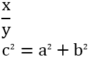
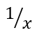
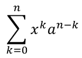
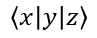

## **Overview**

In PowerPoint, you can write a math equation or formula and display it in your presentation. Various mathematical symbols are available and can be added to text or equations. The math equations constructor is used to create complex formulas like:

- Math fraction
- Math radical
- Math function
- Limits and log functions
- N-ary operations
- Matrix
- Large operators
- Sin, cos functions

To add a mathematical equation in PowerPoint, the *Insert -> Equation* menu is used:


This will create a mathematical text in XML that can be displayed in PowerPoint as following: 


PowerPoint supports a wide range of mathematical symbols for creating equations. However, generating complex math equations in PowerPoint often doesn't yield a polished, professional result. As a result, users who frequently create mathematical presentations often turn to third-party solutions for better-looking math formulas.

Using the [**Aspose.Slides API**](https://products.aspose.com/slides/net/), you can work with math equations in PowerPoint presentations programmatically in C#. Create new math expressions or edit previously created ones. Partial support is available for exporting mathematical structures as images.

## **How to Create a Mathematical Equation**

Mathematical elements are used to build any mathematical construction, regardless of nesting level. A linear collection of these elements forms a mathematical block, represented by the [MathBlock](https://reference.aspose.com/slides/net/aspose.slides.mathtext/mathblock) class. The [MathBlock](https://reference.aspose.com/slides/net/aspose.slides.mathtext/mathblock) class represents a standalone mathematical expression, formula, or equation. [MathPortion](https://reference.aspose.com/slides/net/aspose.slides.mathtext/mathportion) is used to hold mathematical text (distinct from the regular [Portion](https://reference.aspose.com/slides/net/aspose.slides/portion) class), while [MathParagraph](https://reference.aspose.com/slides/net/aspose.slides.mathtext/mathparagraph) allows you to manipulate a set of [MathBlock](https://reference.aspose.com/slides/net/aspose.slides.mathtext/mathblock) objects. These classes are essential for working with PowerPoint math equations via the Aspose.Slides API.

Let's see how we can create the following mathematical equation using the Aspose.Slides API:



To add a mathematical expression to the slide, first add a shape that will contain the mathematical text:

```cs
using (var presentation = new Presentation())
{
    var mathShape = presentation.Slides[0].Shapes.AddMathShape(0, 0, 720, 150);
}
```

After creating the shape, it already contains one paragraph with a mathematical portion by default. The [MathPortion](https://reference.aspose.com/slides/net/aspose.slides.mathtext/mathportion) class represents a portion that contains mathematical text. To access the mathematical content inside a [MathPortion](https://reference.aspose.com/slides/net/aspose.slides.mathtext/mathportion), refer to the [MathParagraph](https://reference.aspose.com/slides/net/aspose.slides.mathtext/mathparagraph) variable:

```cs
var mathParagraph = (mathShape.TextFrame.Paragraphs[0].Portions[0] as MathPortion).MathParagraph;
```

The [MathParagraph](https://reference.aspose.com/slides/net/aspose.slides.mathtext/mathparagraph) class lets you read, add, edit, and delete math blocks ([MathBlock](https://reference.aspose.com/slides/net/aspose.slides.mathtext/mathblock)), which consist of a combination of mathematical elements. For example, create a fraction and place it in the presentation:

```cs
var fraction = new MathematicalText("x").Divide("y");

mathParagraph.Add(new MathBlock(fraction));
```

Each mathematical element is represented by a class that implements the [IMathElement](https://reference.aspose.com/slides/net/aspose.slides.mathtext/imathelement) interface. This interface provides numerous methods to easily create mathematical expressions, enabling you to construct fairly complex equations with just a single line of code. For example, the Pythagorean theorem would look like this:

```cs
var mathBlock = new MathematicalText("c")
    .SetSuperscript("2")
    .Join("=")
    .Join(new MathematicalText("a").SetSuperscript("2"))
    .Join("+")
    .Join(new MathematicalText("b").SetSuperscript("2"));
```

Operations of the [IMathElement](https://reference.aspose.com/slides/net/aspose.slides.mathtext/imathelement) interface are implemented in every type of element, including the [MathBlock](https://reference.aspose.com/slides/net/aspose.slides.mathtext/mathblock) class.

Below is the full source code sample:

```cs
using (var presentation = new Presentation())
{
    var mathShape = presentation.Slides[0].Shapes.AddMathShape(0, 0, 720, 150);
    var mathParagraph = (mathShape.TextFrame.Paragraphs[0].Portions[0] as MathPortion).MathParagraph;

    var fraction = new MathematicalText("x").Divide("y");

    mathParagraph.Add(new MathBlock(fraction));

    var mathBlock = new MathematicalText("c")
        .SetSuperscript("2")
        .Join("=")
        .Join(new MathematicalText("a").SetSuperscript("2"))
        .Join("+")
        .Join(new MathematicalText("b").SetSuperscript("2"));

    mathParagraph.Add(mathBlock);

    presentation.Save("math.pptx", SaveFormat.Pptx);
}
```

## **Mathematical Element Types**

Mathematical expressions are composed of sequences of mathematical elements. A mathematical block represents such a sequence, and the arguments of these elements form a nested, tree-like structure.

There are many types of mathematical elements that can be used to construct a mathematical block. Each of these elements can be aggregated within another, forming a tree-like structure. The simplest type of element is one that does not contain any other mathematical text elements.

Each type of math element implements the [IMathElement](https://reference.aspose.com/slides/net/aspose.slides.mathtext/imathelement) interface, allowing you to use a common set of math operations on different types of math elements.

### **MathematicalText class**

The [MathematicalText](https://reference.aspose.com/slides/net/aspose.slides.mathtext/mathematicaltext) class represents a mathematical text—the underlying element of all mathematical constructions. Mathematical text may represent operands and operators, variables, or any other linear text.

Example: 𝑎=𝑏+𝑐

### **MathFraction class**

The [MathFraction](https://reference.aspose.com/slides/net/aspose.slides.mathtext/mathfraction) class specifies a fraction object consisting of a numerator and denominator separated by a fraction bar. The fraction bar can be horizontal or diagonal, depending on the fraction properties. The fraction object is also used to represent the stack function, which places one element above another without a fraction bar.

Example:



### **MathRadical class**

The [MathRadical](https://reference.aspose.com/slides/net/aspose.slides.mathtext/mathradical) class specifies the radical function (mathematical root), consisting of a base and an optional degree.

Example:


### **MathFunction class**

The [MathFunction](https://reference.aspose.com/slides/net/aspose.slides.mathtext/mathfunction) class specifies a function of an argument. It contains properties such as [Name](https://reference.aspose.com/slides/net/aspose.slides.mathtext/mathfunction/properties/name), which represents the function name, and [Base](https://reference.aspose.com/slides/net/aspose.slides.mathtext/mathfunction/properties/base), which represents the function argument.

Example:


### **MathNaryOperator class**

The [MathNaryOperator](https://reference.aspose.com/slides/net/aspose.slides.mathtext/mathnaryoperator) class specifies an N-ary mathematical object, such as a Summation or Integral. It consists of an operator, a base (or operand), and optional upper and lower limits. Examples of N-ary operators are Summation, Union, Intersection, and Integral. for a couple of seconds
The MathNaryOperator class specifies an N-ary mathematical object, such as Summation and Integral. It consists of an operator, a base (or operand), and optional upper and lower limits. Examples of N-ary operators include Summation, Union, Intersection, and Integral.

This class does not include simple operators such as addition, subtraction, and so on. They are represented by a single text [MathematicalText](https://reference.aspose.com/slides/net/aspose.slides.mathtext/mathematicaltext).

Example:



### **MathLimit class**

The [MathLimit](https://reference.aspose.com/slides/net/aspose.slides.mathtext/mathlimit) class creates the upper or lower limit. It specifies the limit object, consisting of text on the baseline and reduced-size text immediately above or below it. This element does not include the word "lim", but allows you to place text at the top or bottom of the expression. So, the expression 


is created using a combination of [MathFunction](https://reference.aspose.com/slides/net/aspose.slides.mathtext/mathfunction) and [MathLimit](https://reference.aspose.com/slides/net/aspose.slides.mathtext/mathlimit) elements this way:

```cs
var funcName = new MathLimit(new MathematicalText("lim"), new MathematicalText("𝑥→∞"));
var mathFunc = new MathFunction(funcName, new MathematicalText("𝑥"));
```

### **MathSubscriptElement, MathSuperscriptElement, MathRightSubSuperscriptElement, MathLeftSubSuperscriptElement classes**

- [MathSubscriptElement](https://reference.aspose.com/slides/net/aspose.slides.mathtext/mathsubscriptelement)
- [MathSuperscriptElement](https://reference.aspose.com/slides/net/aspose.slides.mathtext/mathsuperscriptelement)
- [MathRightSubSuperscriptElement](https://reference.aspose.com/slides/net/aspose.slides.mathtext/mathrightsubsuperscriptelement)
- [MathLeftSubSuperscriptElement](https://reference.aspose.com/slides/net/aspose.slides.mathtext/mathleftsubsuperscriptelement)

These classes specify a lower index or an upper index. You can set both subscript and superscript simultaneously on the left or right side of an argument, but a single subscript or superscript is supported only on the right side. The [MathSubscriptElement](https://reference.aspose.com/slides/net/aspose.slides.mathtext/mathsubscriptelement) can also be used to set the mathematical degree of a number.

Example:


### **MathMatrix class**

The [MathMatrix](https://reference.aspose.com/slides/net/aspose.slides.mathtext/mathmatrix) class specifies the Matrix object, which consists of child elements arranged in one or more rows and columns. It is important to note that matrices do not have built-in delimiters. To enclose the matrix in brackets, use the delimiter object [IMathDelimiter](https://reference.aspose.com/slides/net/aspose.slides.mathtext/imathdelimiter). Null arguments can be used to create gaps in matrices.

Example: 


### **MathArray class**

The [MathArray](https://reference.aspose.com/slides/net/aspose.slides.mathtext/matharray) class specifies a vertical array of equations or any mathematical objects.

Example: 


### **Formatting Mathematical Elements**

- [MathBorderBox](https://reference.aspose.com/slides/net/aspose.slides.mathtext/mathborderbox) class: Draws a rectangular or alternative border around the [IMathElement](https://reference.aspose.com/slides/net/aspose.slides.mathtext/imathelement).
  
Example: 


- [MathBox](https://reference.aspose.com/slides/net/aspose.slides.mathtext/mathbox) class: Specifies the logical boxing (packaging) of a mathematical element. A boxed object can serve as an operator emulator—with or without an alignment point—function as a line breakpoint, or be grouped to prevent line breaks within. For example, the "==" operator should be boxed to prevent line breaks.

- [MathDelimiter](https://reference.aspose.com/slides/net/aspose.slides.mathtext/mathdelimiter) class: Specifies the delimiter object, which consists of opening and closing characters (such as parentheses, braces, brackets, or vertical bars) and one or more mathematical elements inside, separated by a specified character. Examples include: (𝑥2); [𝑥2|𝑦2].

Example: 



- [MathAccent](https://reference.aspose.com/slides/net/aspose.slides.mathtext/mathaccent) class: Specifies the accent function, which consists of a base and a combining diacritical mark.

Example: 𝑎́.

- [MathBar](https://reference.aspose.com/slides/net/aspose.slides.mathtext/MathBar) class: Specifies the bar function, which consists of a base argument and an overbar or underbar.
  
Example: 


- [MathGroupingCharacter](https://reference.aspose.com/slides/net/aspose.slides.mathtext/MathGroupingCharacter) class: Specifies a grouping symbol placed above or below an expression, typically to highlight the relationships between elements.

Example: 


## **Mathematical Operations**

Each mathematical element and each mathematical expression (via [MathBlock](https://reference.aspose.com/slides/net/aspose.slides.mathtext/mathblock)) implements the [IMathElement](https://reference.aspose.com/slides/net/aspose.slides.mathtext/IMathElement) interface. This allows you to perform operations on the existing structure and form more complex mathematical expressions. All operations have two sets of parameters: either [IMathElement](https://reference.aspose.com/slides/net/aspose.slides.mathtext/IMathElement) or string arguments. Instances of the [MathematicalText](https://reference.aspose.com/slides/net/aspose.slides.mathtext/MathematicalText) class are implicitly created from specified strings when string arguments are used. Math operations available in Aspose.Slides are listed below.

### **Join method**

- [Join(String)](https://reference.aspose.com/slides/net/aspose.slides.mathtext.imathelement/join/methods/1)
- [Join(IMathElement)](https://reference.aspose.com/slides/net/aspose.slides.mathtext/imathelement/methods/join)

These methods join a mathematical element and forms a mathematical block. For example:

```cs
IMathElement element1 = new MathematicalText("x");
IMathElement element2 = new MathematicalText("y");

IMathBlock block = element1.Join(element2);
```

### **Divide method**

- [Divide(String)](https://reference.aspose.com/slides/net/aspose.slides.mathtext.imathelement/divide/methods/2)
- [Divide(IMathElement)](https://reference.aspose.com/slides/net/aspose.slides.mathtext/imathelement/methods/divide)
- [Divide(String, MathFractionTypes)](https://reference.aspose.com/slides/net/aspose.slides.mathtext.imathelement/divide/methods/3)
- [Divide(IMathElement, MathFractionTypes)](https://reference.aspose.com/slides/net/aspose.slides.mathtext.imathelement/divide/methods/1)

These methods create a fraction of the specified type with a numerator and specified denominator. For example:

```cs
IMathElement numerator = new MathematicalText("x");
IMathFraction fraction = numerator.Divide("y", MathFractionTypes.Linear);
```
### **Enclose method**

- [Enclose()](https://reference.aspose.com/slides/net/aspose.slides.mathtext/imathelement/methods/enclose)
- [Enclose(Char, Char)](https://reference.aspose.com/slides/net/aspose.slides.mathtext.imathelement/enclose/methods/1)

These methods enclose the element in specified characters, such as parentheses or other framing characters. For example:

```cs
IMathDelimiter delimiter = new MathematicalText("x"). Enclose('[', ']');
IMathDelimiter delimiter2 = new MathematicalText("elem1").Join("elem2").Enclose();
```
### **Function method**

- [Function(String)](https://reference.aspose.com/slides/net/aspose.slides.mathtext.imathelement/function/methods/1)
- [Function(IMathElement)](https://reference.aspose.com/slides/net/aspose.slides.mathtext/imathelement/methods/function)

These methods take a function of an argument using the current object as the function name. For example:

```cs
IMathFunction func = new MathematicalText("sin").Function("x");
```

### **AsArgumentOfFunction method**

- [AsArgumentOfFunction(String)](https://reference.aspose.com/slides/net/aspose.slides.mathtext.imathelement/asargumentoffunction/methods/4)
- [AsArgumentOfFunction(IMathElement)](https://reference.aspose.com/slides/net/aspose.slides.mathtext/imathelement/methods/asargumentoffunction)
- [AsArgumentOfFunction(MathFunctionsOfOneArgument)](https://reference.aspose.com/slides/net/aspose.slides.mathtext.imathelement/asargumentoffunction/methods/1)
- [AsArgumentOfFunction(MathFunctionsOfTwoArguments, IMathElement)](https://reference.aspose.com/slides/net/aspose.slides.mathtext.imathelement/asargumentoffunction/methods/2)
- [AsArgumentOfFunction(MathFunctionsOfTwoArguments, String)](https://reference.aspose.com/slides/net/aspose.slides.mathtext.imathelement/asargumentoffunction/methods/3)

These methods take the specified function using the current instance as the argument. You can:

- specify a string as the function name, for example "cos";
- select one of the predefined values of the enumerations [MathFunctionsOfOneArgument](https://reference.aspose.com/slides/net/aspose.slides.mathtext/mathfunctionsofoneargument) or [MathFunctionsOfTwoArguments](https://reference.aspose.com/slides/net/aspose.slides.mathtext/mathfunctionsoftwoarguments), for example `MathFunctionsOfOneArgument.ArcSin`;
- select the instance of the [IMathElement](https://reference.aspose.com/slides/net/aspose.slides.mathtext/IMathElement).

For example:

```cs
var funcName = new MathLimit(new MathematicalText("lim"), new MathematicalText("𝑛→∞"));
var func1 = new MathematicalText("2x").AsArgumentOfFunction(funcName);
var func2 = new MathematicalText("x").AsArgumentOfFunction("sin");
var func3 = new MathematicalText("x").AsArgumentOfFunction(MathFunctionsOfOneArgument.Sin);
var func4 = new MathematicalText("x").AsArgumentOfFunction(MathFunctionsOfTwoArguments.Log, "3")
```

### **SetSubscript, SetSuperscript, SetSubSuperscriptOnTheRight, SetSubSuperscriptOnTheLeft methods**

- [SetSubscript(String)](https://reference.aspose.com/slides/net/aspose.slides.mathtext.imathelement/setsubscript/methods/1)
- [SetSubscript(IMathElement)](https://reference.aspose.com/slides/net/aspose.slides.mathtext/imathelement/methods/setsubscript)
- [SetSuperscript(String)](https://reference.aspose.com/slides/net/aspose.slides.mathtext.imathelement/setsuperscript/methods/1)
- [SetSuperscript(IMathElement)](https://reference.aspose.com/slides/net/aspose.slides.mathtext/imathelement/methods/setsuperscript)
- [SetSubSuperscriptOnTheRight(String, String)](https://reference.aspose.com/slides/net/aspose.slides.mathtext.imathelement/setsubsuperscriptontheright/methods/1)
- [SetSubSuperscriptOnTheRight(IMathElement, IMathElement)](https://reference.aspose.com/slides/net/aspose.slides.mathtext/imathelement/methods/setsubsuperscriptontheright)
- [SetSubSuperscriptOnTheLeft(String, String)](https://reference.aspose.com/slides/net/aspose.slides.mathtext.imathelement/setsubsuperscriptontheleft/methods/1)
- [SetSubSuperscriptOnTheLeft(IMathElement, IMathElement)](https://reference.aspose.com/slides/net/aspose.slides.mathtext/imathelement/methods/setsubsuperscriptontheleft)

These methods set subscript and superscript. You can set both simultaneously on either the left or right side of the argument; however, a single subscript or superscript is supported only on the right side. The **Superscript** can also be used to set the mathematical degree of a number.

Example:

```cs
var script = new MathematicalText("y").SetSubSuperscriptOnTheLeft("2x", "3z");
```

### **Radical method**

- [Radical(String)](https://reference.aspose.com/slides/net/aspose.slides.mathtext.imathelement/radical/methods/1)
- [Radical(IMathElement)](https://reference.aspose.com/slides/net/aspose.slides.mathtext/imathelement/methods/radical)

These methods specify the mathematical root of the given degree based on the specified argument.

Example:

```cs
var radical = new MathematicalText("x").Radical("3");
```

### **SetUpperLimit and SetLowerLimit methods**

- [SetUpperLimit(String)](https://reference.aspose.com/slides/net/aspose.slides.mathtext.imathelement/setupperlimit/methods/1)
- [SetUpperLimit(IMathElement)](https://reference.aspose.com/slides/net/aspose.slides.mathtext/imathelement/methods/setupperlimit)
- [SetLowerLimit(String)](https://reference.aspose.com/slides/net/aspose.slides.mathtext.imathelement/setlowerlimit/methods/1)
- [SetLowerLimit(IMathElement)](https://reference.aspose.com/slides/net/aspose.slides.mathtext/imathelement/methods/setlowerlimit)

These methods take an upper or lower limit, where "upper" and "lower" indicate the position of the argument relative to the base.

Let's consider an expression: 


Such expressions can be created through a combination of the [MathFunction](https://reference.aspose.com/slides/net/aspose.slides.mathtext/MathFunction) and [MathLimit](https://reference.aspose.com/slides/net/aspose.slides.mathtext/MathLimit) classes, along with operations of the [IMathElement](https://reference.aspose.com/slides/net/aspose.slides.mathtext/IMathElement) interface, as follows:

```cs
var mathExpression = MathText.Create("lim").SetLowerLimit("x→∞").Function("x");
```

### **Nary and Integral methods**

- [Nary(MathNaryOperatorTypes, IMathElement, IMathElement)](https://reference.aspose.com/slides/net/aspose.slides.mathtext/imathelement/methods/nary)
- [Nary(MathNaryOperatorTypes, String, String)](https://reference.aspose.com/slides/net/aspose.slides.mathtext.imathelement/nary/methods/1)
- [Integral(MathIntegralTypes)](https://reference.aspose.com/slides/net/aspose.slides.mathtext/imathelement/methods/integral)
- [Integral(MathIntegralTypes, IMathElement, IMathElement)](https://reference.aspose.com/slides/net/aspose.slides.mathtext.imathelement/integral/methods/1)
- [Integral(MathIntegralTypes, String, String)](https://reference.aspose.com/slides/net/aspose.slides.mathtext.imathelement/integral/methods/3)
- [Integral(MathIntegralTypes, IMathElement, IMathElement, MathLimitLocations)](https://reference.aspose.com/slides/net/aspose.slides.mathtext.imathelement/integral/methods/2)
- [Integral(MathIntegralTypes, String, String, MathLimitLocations)](https://reference.aspose.com/slides/net/aspose.slides.mathtext.imathelement/integral/methods/4)

Both **Nary** and **Integral** methods create and return the N-ary operator represented by the [INaryOperator](https://reference.aspose.com/slides/net/aspose.slides.mathtext/imathnaryoperator) type. In the Nary method, the [MathNaryOperatorTypes](https://reference.aspose.com/slides/net/aspose.slides.mathtext/mathnaryoperatortypes) enumeration specifies the type of operator—such as summation or union—excluding integrals. In the Integral method, a specialized operation for integrals is provided, using the [MathIntegralTypes](https://reference.aspose.com/slides/net/aspose.slides.mathtext/mathintegraltypes) enumeration.

Example:

```cs
IMathBlock baseArg = new MathematicalText("x").Join(new MathematicalText("dx").ToBox());
IMathNaryOperator integral = baseArg.Integral(MathIntegralTypes.Simple, "0", "1");
```

### **ToMathArray method**

[ToMathArray](https://reference.aspose.com/slides/net/aspose.slides.mathtext/imathelement/methods/tomatharray) puts elements into a vertical array. If this operation is called on a [MathBlock](https://reference.aspose.com/slides/net/aspose.slides.mathtext/mathblock) instance, all its child elements will be placed in the returned array.

Example:

```cs
var arrayFunction = new MathematicalText("x").Join("y").ToMathArray();
```

### **Formatting operations: Accent, Overbar, Underbar, Group, ToBorderBox, ToBox**

- [Accent](https://reference.aspose.com/slides/net/aspose.slides.mathtext/imathelement/methods/accent) method sets an accent mark (a character on the top of the element).
- [Overbar](https://reference.aspose.com/slides/net/aspose.slides.mathtext/imathelement/methods/overbar) and [Underbar](https://reference.aspose.com/slides/net/aspose.slides.mathtext/imathelement/methods/underbar) methods set a bar on the top or bottom.
- [Group](https://reference.aspose.com/slides/net/aspose.slides.mathtext/imathelement/methods/group) method places in a group using a grouping character such as a bottom curly bracket or another.
- [ToBorderBox](https://reference.aspose.com/slides/net/aspose.slides.mathtext/imathelement/methods/toborderbox) method places in a border-box.
- [ToBox](https://reference.aspose.com/slides/net/aspose.slides.mathtext/imathelement/methods/tobox) method places in a non-visual box (logical grouping).

Examples:

```cs
var accent = new MathematicalText("x").Accent('\u0303');
var bar = new MathematicalText("x").Overbar();
var groupChr = new MathematicalText("x").Join("y").Join("z").Group('\u23E1', MathTopBotPositions.Bottom, MathTopBotPositions.Top);
var borderBox = new MathematicalText("x+y+z").ToBorderBox();
var boxedOperator = new MathematicalText(":=").ToBox();
```

## **FAQ**

**How can I add a mathematical equation to a PowerPoint slide?**

To add a mathematical equation, you need to create a `MathShape` object, which automatically contains a mathematical portion. Then, you retrieve the `MathParagraph` from the `MathPortion` and add `MathBlock` objects to it.

**Is it possible to create complex nested mathematical expressions?**

Yes, Aspose.Slides allows you to create complex mathematical expressions by nesting MathBlocks. Each mathematical element implements the `IMathElement` interface, which allows you to apply operations (Join, Divide, Enclose, etc.) to combine elements into more complex structures.

**How can I update or modify an existing mathematical equation?**

To update an equation, you need to access the existing MathBlocks through the `MathParagraph`. Then, by using methods such as Join, Divide, Enclose, and others, you can modify individual elements of the equation. After editing, save the presentation to apply the changes.
