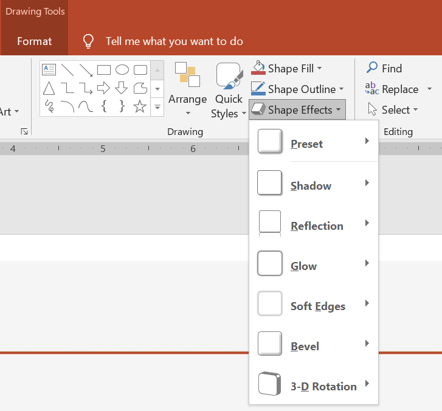

## **Overview**

While effects in PowerPoint can be used to make a shape stand out, they differ from [fills](/slides/net/shape-formatting/#gradient-fill) or outlines. Using PowerPoint effects, you can create convincing reflections on a shape, spread a shape's glow, etc.



PowerPoint provides six effects that can be applied to shapes. You can apply one or more effects to a shape.

Some combinations of effects look better than others. For this reason, PowerPoint has options under **Preset**. The Preset options are essentially a known good-looking combination of two or more effects. This way, by selecting a preset, you won't have to waste time testing or combining different effects to find a nice combination.

Aspose.Slides provides properties and methods under the [EffectFormat](https://reference.aspose.com/slides/net/aspose.slides/effectformat/) class that allow you to apply the same effects to shapes in PowerPoint presentations.

## **Apply Shadow Effect**

To apply a shadow effect to a shape in Aspose.Slides for .NET, you can easily adjust parameters like color, blur radius, and direction. This gives your shapes a more dynamic and professional appearance, adding depth and focus. By using simple code snippets, you can apply these effects across multiple shapes, enhancing the overall visual appeal of your presentations.

This C# code shows how to apply the [outer shadow effect](https://reference.aspose.com/slides/net/aspose.slides/effectformat/outershadoweffect/) to a rectangle:

```c#
using var presentation = new Presentation();
var slide = presentation.Slides[0];

var shape = slide.Shapes.AddAutoShape(ShapeType.RoundCornerRectangle, 20, 20, 200, 100);

shape.EffectFormat.EnableOuterShadowEffect();
shape.EffectFormat.OuterShadowEffect.ShadowColor.Color = Color.DarkGray;
shape.EffectFormat.OuterShadowEffect.Distance = 10;
shape.EffectFormat.OuterShadowEffect.Direction = 45;

presentation.Save("shadow_effect.pptx", SaveFormat.Pptx);
```


## **Apply Reflection Effect**

To apply a reflection effect in Aspose.Slides for .NET, you can add a mirror-like reflection to shapes, adjusting parameters such as distance, transparency, and size. This effect enhances the aesthetic of your presentations by giving shapes a more polished and sophisticated look. It’s easy to implement with simple code, enabling quick application across multiple elements for a consistent design.

This C# code shows how to apply the [reflection effect](https://reference.aspose.com/slides/net/aspose.slides/effectformat/reflectioneffect/) to a shape:

```c#
using var presentation = new Presentation();
var slide = presentation.Slides[0];

var shape = slide.Shapes.AddAutoShape(ShapeType.RoundCornerRectangle, 20, 20, 200, 100);

shape.EffectFormat.EnableReflectionEffect();
shape.EffectFormat.ReflectionEffect.RectangleAlign = RectangleAlignment.Bottom;
shape.EffectFormat.ReflectionEffect.Direction = 90;
shape.EffectFormat.ReflectionEffect.Distance = 40;
shape.EffectFormat.ReflectionEffect.BlurRadius = 2;

presentation.Save("reflection_effect.pptx", SaveFormat.Pptx);
```


## **Apply Glow Effect**

To apply a glow effect to a shape in Aspose.Slides for .NET, you can add a soft, luminous aura around shapes, adjusting properties like color and size. This effect helps make shapes stand out and adds an attractive, eye-catching visual element to your presentation. It's easy to implement with minimal code, enhancing the overall look of your slides.

This C# code shows how to apply the [glow effect](https://reference.aspose.com/slides/net/aspose.slides/effectformat/gloweffect/) to a shape:

```c#
using var presentation = new Presentation();
var slide = presentation.Slides[0];

var shape = slide.Shapes.AddAutoShape(ShapeType.RoundCornerRectangle, 20, 20, 200, 100);

shape.EffectFormat.EnableGlowEffect();
shape.EffectFormat.GlowEffect.Color.Color = Color.Magenta;
shape.EffectFormat.GlowEffect.Radius = 15;

presentation.Save("glow_effect.pptx", SaveFormat.Pptx);
```


## **Apply Soft Edges Effect**

To apply a soft edges effect in Aspose.Slides for .NET, you can create a smooth, blurred transition around the edges of a shape. This effect adds a more subtle and refined look, perfect for designs that need a gentle, softer appearance. You can easily adjust parameters like radius to achieve the desired effect across various shapes in your presentation.

This C# code shows how to apply the [soft edges](https://reference.aspose.com/slides/net/aspose.slides/effectformat/softedgeeffect/) to a shape:

```c#
using var presentation = new Presentation();
var slide = presentation.Slides[0];

var shape = slide.Shapes.AddAutoShape(ShapeType.RoundCornerRectangle, 20, 20, 200, 150);

shape.EffectFormat.EnableSoftEdgeEffect();
shape.EffectFormat.SoftEdgeEffect.Radius = 8;

presentation.Save("soft_edges_effect.pptx", SaveFormat.Pptx);
```


## **FAQs**

**1. Can I apply multiple effects to the same shape?**

Yes, you can combine different effects, such as shadow, reflection, and glow, on a single shape to create a more dynamic appearance.

**2. What shapes can I apply effects to?**

You can apply effects to various shapes, including autoshapes, charts, tables, pictures, SmartArt objects, OLE objects, and more.

**3. Can I apply effects to grouped shapes?**

Yes, you can apply effects to grouped shapes. The effect will apply to the entire group.
