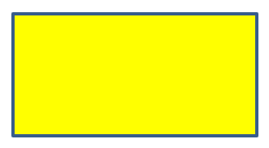
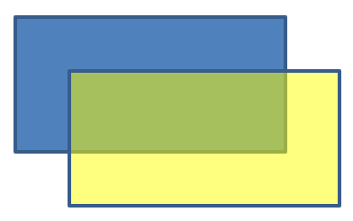

## **Overview**

In PowerPoint, you can add shapes to slides. Since shapes are made up of lines, you can format them by modifying or applying effects to their outlines. Additionally, you can format shapes by specifying settings that control how their interiors are filled.


Aspose.Slides for .NET provides interfaces and properties that allow you to format shapes using the same options available in PowerPoint.

## **Format Lines**

Using Aspose.Slides, you can specify a custom line style for a shape. The following steps outline the procedure:

1. Create an instance of the [Presentation](https://reference.aspose.com/slides/net/aspose.slides/presentation/) class.
1. Get a reference to a slide by its index.
1. Add an [IAutoShape](https://reference.aspose.com/slides/net/aspose.slides/iautoshape/) to the slide.
1. Set the [line style](https://reference.aspose.com/slides/net/aspose.slides/linestyle/) of the shape.
1. Set the line width.
1. Set the [dash style](https://reference.aspose.com/slides/net/aspose.slides/linedashstyle/) of the line.
1. Set the line color for the shape.
1. Save the modified presentation as a PPTX file.

The following C# code demonstrates how to format a rectangle `AutoShape`:

```c#
// Instantiate the Presentation class that represents a presentation file.
using (Presentation presentation = new Presentation())
{
    // Get the first slide.
    ISlide slide = presentation.Slides[0];

    // Add an auto shape of the Rectangle type.
    IAutoShape shape = slide.Shapes.AddAutoShape(ShapeType.Rectangle, 50, 50, 150, 75);

    // Set the fill color for the rectangle shape.
    shape.FillFormat.FillType = FillType.NoFill;

    // Apply formatting to the rectangle's lines.
    shape.LineFormat.Style = LineStyle.ThickThin;
    shape.LineFormat.Width = 7;
    shape.LineFormat.DashStyle = LineDashStyle.Dash;

    // Set the color for the rectangle's line.
    shape.LineFormat.FillFormat.FillType = FillType.Solid;
    shape.LineFormat.FillFormat.SolidFillColor.Color = Color.Blue;

    // Save the PPTX file to disk.
    presentation.Save("formatted_lines.pptx", SaveFormat.Pptx);
}
```

The result:


## **Format Join Styles**

Here are the three join type options:

* Round
* Miter
* Bevel

By default, when PowerPoint joins two lines at an angle (such as at a shape’s corner), it uses the **Round** setting. However, if you're drawing a shape with sharp angles, you may prefer the **Miter** option.


The following C# code demonstrates how three rectangles (as shown in the image above) were created using the Miter, Bevel, and Round join type settings:

```c#
// Instantiate the Presentation class that represents a presentation file.
using (Presentation presentation = new Presentation())
{
    // Get the first slide.
    ISlide slide = presentation.Slides[0];

    // Add three auto shapes of the Rectangle type.
    IAutoShape shape1 = slide.Shapes.AddAutoShape(ShapeType.Rectangle, 20, 20, 150, 75);
    IAutoShape shape2 = slide.Shapes.AddAutoShape(ShapeType.Rectangle, 210, 20, 150, 75);
    IAutoShape shape3 = slide.Shapes.AddAutoShape(ShapeType.Rectangle, 20, 135, 150, 75);

    // Set the fill color for each rectangle shape.
    shape1.FillFormat.FillType = FillType.Solid;
    shape1.FillFormat.SolidFillColor.Color = Color.Black;
    shape2.FillFormat.FillType = FillType.Solid;
    shape2.FillFormat.SolidFillColor.Color = Color.Black;
    shape3.FillFormat.FillType = FillType.Solid;
    shape3.FillFormat.SolidFillColor.Color = Color.Black;

    // Set the line width.
    shape1.LineFormat.Width = 15;
    shape2.LineFormat.Width = 15;
    shape3.LineFormat.Width = 15;

    // Set the color for each rectangle's line.
    shape1.LineFormat.FillFormat.FillType = FillType.Solid;
    shape1.LineFormat.FillFormat.SolidFillColor.Color = Color.Blue;
    shape2.LineFormat.FillFormat.FillType = FillType.Solid;
    shape2.LineFormat.FillFormat.SolidFillColor.Color = Color.Blue;
    shape3.LineFormat.FillFormat.FillType = FillType.Solid;
    shape3.LineFormat.FillFormat.SolidFillColor.Color = Color.Blue;

    // Set the join style.
    shape1.LineFormat.JoinStyle = LineJoinStyle.Miter;
    shape2.LineFormat.JoinStyle = LineJoinStyle.Bevel;
    shape3.LineFormat.JoinStyle = LineJoinStyle.Round;

    // Add text to each rectangle.
    shape1.TextFrame.Text = "Miter Join Style";
    shape2.TextFrame.Text = "Bevel Join Style";
    shape3.TextFrame.Text = "Round Join Style";

    // Save the PPTX file to disk.
    presentation.Save("join_styles.pptx", SaveFormat.Pptx);
}
```

## **Gradient Fill**

In PowerPoint, Gradient Fill is a formatting option that allows you to apply a continuous blend of colors to a shape. For example, you can apply two or more colors in a way that one gradually fades into another.

Here’s how to apply a gradient fill to a shape using Aspose.Slides:

1. Create an instance of the [Presentation](https://reference.aspose.com/slides/net/aspose.slides/presentation/) class.
1. Get a reference to a slide by its index.
1. Add an [IAutoShape](https://reference.aspose.com/slides/net/aspose.slides/iautoshape/) to the slide.
1. Set the shape's [FillType](https://reference.aspose.com/slides/net/aspose.slides/filltype/) to `Gradient`.
1. Add your two preferred colors with defined positions using the `Add` methods of the gradient stop collection exposed by the [IGradientFormat](https://reference.aspose.com/slides/net/aspose.slides/igradientformat/) interface.
1. Save the modified presentation as a PPTX file.

The following C# code demonstrates how to apply a gradient fill effect to an ellipse:

```c#
// Instantiate the Presentation class that represents a presentation file.
using (Presentation presentation = new Presentation())
{
    // Get the first slide.
    ISlide slide = presentation.Slides[0];

    // Add an auto shape of the Ellipse type.
    IAutoShape shape = slide.Shapes.AddAutoShape(ShapeType.Ellipse, 50, 50, 150, 75);

    // Apply gradient formatting to the ellipse.
    shape.FillFormat.FillType = FillType.Gradient;
    shape.FillFormat.GradientFormat.GradientShape = GradientShape.Linear;

    // Set the direction of the gradient.
    shape.FillFormat.GradientFormat.GradientDirection = GradientDirection.FromCorner2;

    // Add two gradient stops.
    shape.FillFormat.GradientFormat.GradientStops.Add(1.0f, PresetColor.Purple);
    shape.FillFormat.GradientFormat.GradientStops.Add(0.0f, PresetColor.Red);

    // Save the PPTX file to disk.
    presentation.Save("gradient_fill.pptx", SaveFormat.Pptx);
}
```

The result:


## **Pattern Fill**

In PowerPoint, Pattern Fill is a formatting option that lets you apply a two-color design—such as dots, stripes, crosshatches, or checks—to a shape. You can choose custom colors for the pattern’s foreground and background.

Aspose.Slides provides over 45 predefined pattern styles that you can apply to shapes to enhance the visual appeal of your presentations. Even after selecting a predefined pattern, you can still specify the exact colors it should use.

Here's how to apply a pattern fill to a shape using Aspose.Slides:

1. Create an instance of the [Presentation](https://reference.aspose.com/slides/net/aspose.slides/presentation/) class.
1. Get a reference to a slide by its index.
1. Add an [IAutoShape](https://reference.aspose.com/slides/net/aspose.slides/iautoshape/) to the slide.
1. Set the shape’s [FillType](https://reference.aspose.com/slides/net/aspose.slides/filltype/) to `Pattern`.
1. Choose a pattern style from the predefined options.
1. Set the [Background Color](https://reference.aspose.com/slides/net/aspose.slides/ipatternformat/backcolor/) of the pattern.
1. Set the [Foreground Color](https://reference.aspose.com/slides/net/aspose.slides/ipatternformat/forecolor/) of the pattern.
1. Save the modified presentation as a PPTX file.

The following C# code demonstrates how to apply a pattern fill to a rectangle:

```c#
// Instantiate the Presentation class that represents a presentation file.
using (Presentation presentation = new Presentation())
{
    // Get the first slide.
    ISlide slide = presentation.Slides[0];

    // Add an auto shape of the Rectangle type.
    IAutoShape shape = slide.Shapes.AddAutoShape(ShapeType.Rectangle, 50, 50, 150, 75);

    // Set the fill type to Pattern.
    shape.FillFormat.FillType = FillType.Pattern;

    // Set the pattern style.
    shape.FillFormat.PatternFormat.PatternStyle = PatternStyle.Trellis;

    // Set the pattern background and foreground colors.
    shape.FillFormat.PatternFormat.BackColor.Color = Color.LightGray;
    shape.FillFormat.PatternFormat.ForeColor.Color = Color.Yellow;

    // Save the PPTX file to disk.
    presentation.Save("pattern_fill.pptx", SaveFormat.Pptx);
}
```

The result:


## **Picture Fill**

In PowerPoint, Picture Fill is a formatting option that allows you to insert an image inside a shape—effectively using the image as the shape's background.

Here’s how to use Aspose.Slides to apply a picture fill to a shape:

1. Create an instance of the [Presentation](https://reference.aspose.com/slides/net/aspose.slides/presentation/) class.
1. Get a reference to a slide by its index.
1. Add an [IAutoShape](https://reference.aspose.com/slides/net/aspose.slides/iautoshape/) to the slide.
1. Set the shape's [FillType](https://reference.aspose.com/slides/net/aspose.slides/filltype/) to `Picture`.
1. Set the picture fill mode to `Tile` (or another preferred mode).
1. Create an [IPPImage](https://reference.aspose.com/slides/net/aspose.slides/ippimage/) object from the image you want to use.
1. Assign this image to the `Picture.Image` property of the shape’s `PictureFillFormat`.
1. Save the modified presentation as a PPTX file.

Let's say we have a "lotus.png" file with the following picture:


The following C# code demonstrates how to fill a shape with the picture:

```c#
// Instantiate the Presentation class that represents a presentation file.
using (Presentation presentation = new Presentation())
{
    // Get the first slide.
    ISlide slide = presentation.Slides[0];

    // Add an auto shape of the Rectangle type.
    IAutoShape shape = slide.Shapes.AddAutoShape(ShapeType.Rectangle, 50, 50, 255, 130);

    // Set the fill type to Picture.
    shape.FillFormat.FillType = FillType.Picture;

    // Set the picture fill mode.
    shape.FillFormat.PictureFillFormat.PictureFillMode = PictureFillMode.Tile;

    // Load an image and add it to the presentation resources.
    IImage image = Images.FromFile("lotus.png");
    IPPImage presentationImage = presentation.Images.AddImage(image);
    image.Dispose();

    // Set the picture.
    shape.FillFormat.PictureFillFormat.Picture.Image = presentationImage;

    // Save the PPTX file to disk.
    presentation.Save("picture_fill.pptx", SaveFormat.Pptx);
}
```

The result:


### **Tile Picture As Texture**

If you want to set a tiled picture as a texture and customize the tiling behavior, you can use the following properties of the [IPictureFillFormat](https://reference.aspose.com/slides/net/aspose.slides/ipicturefillformat/) interface and [PictureFillFormat](https://reference.aspose.com/slides/net/aspose.slides/picturefillformat/) class:

- [PictureFillMode](https://reference.aspose.com/slides/net/aspose.slides/ipicturefillformat/picturefillmode/): Sets the picture fill mode—either `Tile` or `Stretch`.
- [TileAlignment](https://reference.aspose.com/slides/net/aspose.slides/ipicturefillformat/tilealignment/): Specifies the alignment of the tiles within the shape.
- [TileFlip](https://reference.aspose.com/slides/net/aspose.slides/ipicturefillformat/tileflip/): Controls whether the tile is flipped horizontally, vertically, or both.
- [TileOffsetX](https://reference.aspose.com/slides/net/aspose.slides/ipicturefillformat/tileoffsetx/): Sets the horizontal offset of the tile (in points) from the shape’s origin.
- [TileOffsetY](https://reference.aspose.com/slides/net/aspose.slides/ipicturefillformat/tileoffsety/): Sets the vertical offset of the tile (in points) from the shape’s origin.
- [TileScaleX](https://reference.aspose.com/slides/net/aspose.slides/ipicturefillformat/tilescalex/): Defines the horizontal scale of the tile as a percentage.
- [TileScaleY](https://reference.aspose.com/slides/net/aspose.slides/ipicturefillformat/tilescaley/): Defines the vertical scale of the tile as a percentage.

The following code sample shows how to add a rectangle shape with a tiled picture fill and configure tile options:

```c#
// Instantiate the Presentation class that represents a presentation file.
using (Presentation presentation = new Presentation())
{
    // Get the first slide.
    ISlide firstSlide = presentation.Slides[0];

    // Add a rectangle auto shape.
    IAutoShape shape = firstSlide.Shapes.AddAutoShape(ShapeType.Rectangle, 50, 50, 190, 95);

    // Set the fill type of the shape to Picture.
    shape.FillFormat.FillType = FillType.Picture;

    // Load the image and add it to the presentation resources.
    IPPImage presentationImage;
    using (IImage sourceImage = Images.FromFile("lotus.png"))
        presentationImage = presentation.Images.AddImage(sourceImage);

    // Assign the image to the shape.
    IPictureFillFormat pictureFillFormat = shape.FillFormat.PictureFillFormat;
    pictureFillFormat.Picture.Image = presentationImage;

    // Configure the picture fill mode and tiling properties.
    pictureFillFormat.PictureFillMode = PictureFillMode.Tile;
    pictureFillFormat.TileOffsetX = -32;
    pictureFillFormat.TileOffsetY = -32;
    pictureFillFormat.TileScaleX = 50;
    pictureFillFormat.TileScaleY = 50;
    pictureFillFormat.TileAlignment = RectangleAlignment.BottomRight;
    pictureFillFormat.TileFlip = TileFlip.FlipBoth;

    // Save the PPTX file to disk.
    presentation.Save("tile.pptx", SaveFormat.Pptx);
}
```

The result:


## **Solid Color Fill**

In PowerPoint, Solid Color Fill is a formatting option that fills a shape with a single, uniform color. This plain background color is applied without any gradients, textures, or patterns.

To apply a solid color fill to a shape using Aspose.Slides, follow these steps:

1. Create an instance of the [Presentation](https://reference.aspose.com/slides/net/aspose.slides/presentation/) class.
1. Get a reference to a slide by its index.
1. Add an [IAutoShape](https://reference.aspose.com/slides/net/aspose.slides/iautoshape/) to the slide.
1. Set the shape’s [FillType](https://reference.aspose.com/slides/net/aspose.slides/filltype/) to `Solid`.
1. Assign your preferred fill color to the shape.
1. Save the modified presentation as a PPTX file.

The following C# code demonstrates how to apply a solid color fill to a rectangle in a PowerPoint slide:

```c#
// Instantiate the Presentation class that represents a presentation file.
using (Presentation presentation = new Presentation())
{
    // Get the first slide.
    ISlide slide = presentation.Slides[0];

    // Add an auto shape of the Rectangle type.
    IAutoShape shape = slide.Shapes.AddAutoShape(ShapeType.Rectangle, 50, 50, 150, 75);

    // Set the fill type to Solid.
    shape.FillFormat.FillType = FillType.Solid;

    // Set the fill color.
    shape.FillFormat.SolidFillColor.Color = Color.Yellow;

    // Save the PPTX file to disk.
    presentation.Save("solid_color_fill.pptx", SaveFormat.Pptx);
}
```

The result:



## **Set Transparency**

In PowerPoint, when you apply a solid color, gradient, picture, or texture fill to shapes, you can also set a transparency level to control the opacity of the fill. A higher transparency value makes the shape more see-through, allowing the background or underlying objects to be partially visible.

Aspose.Slides lets you set the transparency level by adjusting the alpha value in the color used for the fill. Here’s how to do it:

1. Create an instance of the [Presentation](https://reference.aspose.com/slides/net/aspose.slides/presentation/) class.
1. Get a reference to a slide by its index.
1. Add an [IAutoShape](https://reference.aspose.com/slides/net/aspose.slides/iautoshape/) to the slide.
1. Set the [FillType](https://reference.aspose.com/slides/net/aspose.slides/filltype/) to `Solid`.
1. Use `Color.FromArgb(alpha, baseColor)` to define a color with transparency (the `alpha` component controls transparency).
1. Save the presentation.

The following C# code demonstrates how to apply a transparent fill color to a rectangle:

```c#
const int alpha = 128;

// Instantiate the Presentation class that represents a presentation file.
using (Presentation presentation = new Presentation())
{
    // Get the first slide.
    ISlide slide = presentation.Slides[0];

    // Add a solid rectangle auto shape.
    IAutoShape solidShape = slide.Shapes.AddAutoShape(ShapeType.Rectangle, 50, 50, 150, 75);

    // Add a transparent rectangle auto shape over the solid shape.
    IAutoShape transparentShape = slide.Shapes.AddAutoShape(ShapeType.Rectangle, 80, 80, 150, 75);
    transparentShape.FillFormat.FillType = FillType.Solid;
    transparentShape.FillFormat.SolidFillColor.Color = Color.FromArgb(alpha, Color.Yellow);

    // Save the PPTX file to disk.
    presentation.Save("shape_transparency.pptx", SaveFormat.Pptx);
}
```

The result:



## **Rotate Shapes**

Aspose.Slides lets you rotate shapes in PowerPoint presentations. This can be useful when positioning visual elements with specific alignment or design needs.

To rotate a shape on a slide, follow these steps:

1. Create an instance of the [Presentation](https://reference.aspose.com/slides/net/aspose.slides/presentation/) class.
1. Get a reference to a slide by its index.
1. Add an [IAutoShape](https://reference.aspose.com/slides/net/aspose.slides/iautoshape/) to the slide.
1. Set the shape’s `Rotation` property to the desired angle.
1. Save the presentation.

The following C# code demonstrates how to rotate a shape by 5 degrees:

```c#
// Instantiate the Presentation class that represents a presentation file.
using (Presentation presentation = new Presentation())
{
    // Get the first slide.
    ISlide slide = presentation.Slides[0];

    // Add an auto shape of the Rectangle type.
    IAutoShape shape = slide.Shapes.AddAutoShape(ShapeType.Rectangle, 50, 50, 150, 75);

    // Rotate the shape by 5 degrees.
    shape.Rotation = 5;

    // Save the PPTX file to disk.
    presentation.Save("shape_rotation.pptx", SaveFormat.Pptx);
}
```

The result:


## **Add 3D Bevel Effects**

Aspose.Slides allows you to apply 3D bevel effects to shapes by configuring their [ThreeDFormat](https://reference.aspose.com/slides/net/aspose.slides/threedformat/) properties.

To add 3D bevel effects to a shape, follow these steps:

1. Instantiate the [Presentation](https://reference.aspose.com/slides/net/aspose.slides/presentation/) class.
1. Get a reference to a slide by its index.
1. Add an [IAutoShape](https://reference.aspose.com/slides/net/aspose.slides/iautoshape/) to the slide.
1. Configure the shape’s [ThreeDFormat](https://reference.aspose.com/slides/net/aspose.slides/threedformat/) to define bevel settings.
1. Save the presentation.

The following C# code shows how to apply 3D bevel effects to a shape:

```c#
// Create an instance of the Presentation class.
using (Presentation presentation = new Presentation())
{
    ISlide slide = presentation.Slides[0];

    // Add a shape to the slide.
    IAutoShape shape = slide.Shapes.AddAutoShape(ShapeType.Ellipse, 50, 50, 100, 100);
    shape.FillFormat.FillType = FillType.Solid;
    shape.FillFormat.SolidFillColor.Color = Color.Green;
    shape.LineFormat.FillFormat.FillType = FillType.Solid;
    shape.LineFormat.FillFormat.SolidFillColor.Color = Color.Orange;
    shape.LineFormat.Width = 2.0;

    // Set the shape's ThreeDFormat properties.
    shape.ThreeDFormat.Depth = 4;
    shape.ThreeDFormat.BevelTop.BevelType = BevelPresetType.Circle;
    shape.ThreeDFormat.BevelTop.Height = 6;
    shape.ThreeDFormat.BevelTop.Width = 6;
    shape.ThreeDFormat.Camera.CameraType = CameraPresetType.OrthographicFront;
    shape.ThreeDFormat.LightRig.LightType = LightRigPresetType.ThreePt;
    shape.ThreeDFormat.LightRig.Direction = LightingDirection.Top;

    // Save the presentation as a PPTX file.
    presentation.Save("3D_bevel_effect.pptx", SaveFormat.Pptx);
}
```

The result:


## **Add 3D Rotation Effects**

Aspose.Slides allows you to apply 3D rotation effects to shapes by configuring their [ThreeDFormat](https://reference.aspose.com/slides/net/aspose.slides/threedformat/) properties.

To apply 3D rotation to a shape:

1. Create an instance of the [Presentation](https://reference.aspose.com/slides/net/aspose.slides/presentation/) class.
1. Get a reference to a slide by its index.
1. Add an [IAutoShape](https://reference.aspose.com/slides/net/aspose.slides/iautoshape/) to the slide.
1. Set the shape's [CameraType](https://reference.aspose.com/slides/net/aspose.slides/icamera/cameratype/) and [LightType](https://reference.aspose.com/slides/net/aspose.slides/ilightrig/lighttype/) to define the 3D rotation.
1. Save the presentation.

The following C# code demonstrates how to apply 3D rotation effects to a shape:

```c#
// Create an instance of the Presentation class.
using (Presentation presentation = new Presentation())
{
    ISlide slide = presentation.Slides[0];

    IAutoShape autoShape = slide.Shapes.AddAutoShape(ShapeType.Rectangle, 50, 50, 150, 75);
    autoShape.TextFrame.Text = "Hello, Aspose!";

    autoShape.ThreeDFormat.Depth = 6;
    autoShape.ThreeDFormat.Camera.SetRotation(40, 35, 20);
    autoShape.ThreeDFormat.Camera.CameraType = CameraPresetType.IsometricLeftUp;
    autoShape.ThreeDFormat.LightRig.LightType = LightRigPresetType.Balanced;

    // Save the presentation as a PPTX file.
    presentation.Save("3D_rotation_effect.pptx", SaveFormat.Pptx);
}
```

The result:


## **Reset Formatting**

The following C# code shows how to reset the formatting of a slide and revert the position, size, and formatting of all shapes with placeholders on the [LayoutSlide](https://reference.aspose.com/slides/net/aspose.slides/layoutslide/) to their default settings:

```c#
using (Presentation presentation = new Presentation("sample.pptx"))
{
    foreach (ISlide slide in presentation.Slides)
    {
        // Reset each shape on the slide that has a placeholder on the layout.
        slide.Reset();
    }

    presentation.Save("reset_formatting.pptx", SaveFormat.Pptx);
}
```

## **FAQ**

**Does shape formatting affect the final presentation file size?**

Only minimally. Embedded images and media occupy most of the file space, while shape parameters such as colors, effects, and gradients are stored as metadata and add virtually no extra size.

**How can I detect shapes on a slide that share identical formatting so I can group them?**

Compare each shape’s key formatting properties—fill, line, and effect settings. If all corresponding values match, treat their styles as identical and logically group those shapes, which simplifies later style management.

**Can I save a set of custom shape styles to a separate file for reuse in other presentations?**

Yes. Store sample shapes with the desired styles in a template slide deck or a .POTX template file. When creating a new presentation, open the template, clone the styled shapes you need, and re‑apply their formatting wherever required.
