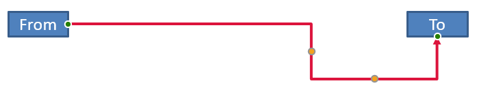

## **Overview**

A connector is a line that can remain attached to two shapes when either shape moves. Its ends attach to connection sites, represented by green dots in PowerPoint. Some bent and curved connectors also expose adjustment points, represented by orange dots, that control the position of individual connector segments.

Aspose.Slides represents connectors through the [IConnector](https://reference.aspose.com/slides/net/aspose.slides/iconnector/) interface. You can create them, attach their ends to shapes, choose connection sites, reroute them, and modify the geometry of connectors that have adjustment points.

## **Connector Types**

The [ShapeType](https://reference.aspose.com/slides/net/aspose.slides/shapetype/) enumeration includes straight, bent, and curved connector presets. The following table shows the available connector geometries and the number of adjustment points defined by each preset.

| Connector | Image | Number of adjustment points |
|---|---|---|
| `ShapeType.Line` |  | 0 |
| `ShapeType.StraightConnector1` |  | 0 |
| `ShapeType.BentConnector2` |  | 0 |
| `ShapeType.BentConnector3` |  | 1 |
| `ShapeType.BentConnector4` |  | 2 |
| `ShapeType.BentConnector5` |  | 3 |
| `ShapeType.CurvedConnector2` |  | 0 |
| `ShapeType.CurvedConnector3` |  | 1 |
| `ShapeType.CurvedConnector4` |  | 2 |
| `ShapeType.CurvedConnector5` |  | 3 |

The number and meaning of adjustment points are part of the selected connector preset. Do not assume that two different connector types expose the same collection layout.

## **Connect Two Shapes**

Use [IShapeCollection.AddConnector](https://reference.aspose.com/slides/net/aspose.slides/ishapecollection/addconnector/) to add a connector, and assign its [StartShapeConnectedTo](https://reference.aspose.com/slides/net/aspose.slides/connector/startshapeconnectedto/) and [EndShapeConnectedTo](https://reference.aspose.com/slides/net/aspose.slides/connector/endshapeconnectedto/) properties. After both ends are attached, [IConnector.Reroute](https://reference.aspose.com/slides/net/aspose.slides/iconnector/reroute/) selects a short route between the shapes.

The following example connects an ellipse and a rectangle with a bent connector:

```csharp
using Aspose.Slides;
using Aspose.Slides.Export;

using var presentation = new Presentation();
var slide = presentation.Slides[0];

var ellipse = slide.Shapes.AddAutoShape(ShapeType.Ellipse, 40, 80, 120, 80);
var rectangle = slide.Shapes.AddAutoShape(ShapeType.Rectangle, 320, 240, 140, 80);
var connector = slide.Shapes.AddConnector(ShapeType.BentConnector2, 0, 0, 10, 10);

connector.StartShapeConnectedTo = ellipse;
connector.EndShapeConnectedTo = rectangle;
connector.Reroute();

presentation.Save("connected-shapes.pptx", SaveFormat.Pptx);
```

{}

Calling `Reroute` can change the [StartShapeConnectionSiteIndex](https://reference.aspose.com/slides/net/aspose.slides/connector/startshapeconnectionsiteindex/) and [EndShapeConnectionSiteIndex](https://reference.aspose.com/slides/net/aspose.slides/connector/endshapeconnectionsiteindex/) values. Assign specific connection sites after rerouting if those sites must remain fixed.

{}

## **Choose a Connection Site**

Each connectable shape reports its number of sites through [ConnectionSiteCount](https://reference.aspose.com/slides/net/aspose.slides/shape/connectionsitecount/). Validate a preferred zero-based site index before assigning it to a connector end; site counts vary by shape geometry.

This example attaches the connector to a particular site on the ellipse when that site exists:

```csharp
using System;
using Aspose.Slides;
using Aspose.Slides.Export;

using var presentation = new Presentation();
var slide = presentation.Slides[0];

var ellipse = slide.Shapes.AddAutoShape(ShapeType.Ellipse, 40, 80, 120, 80);
var rectangle = slide.Shapes.AddAutoShape(ShapeType.Rectangle, 320, 240, 140, 80);
var connector = slide.Shapes.AddConnector(ShapeType.BentConnector3, 0, 0, 10, 10);

connector.StartShapeConnectedTo = ellipse;
connector.EndShapeConnectedTo = rectangle;

uint preferredSiteIndex = 2;
if (preferredSiteIndex < ellipse.ConnectionSiteCount)
{
    connector.StartShapeConnectionSiteIndex = preferredSiteIndex;
}
else
{
    Console.WriteLine($"The ellipse has only {ellipse.ConnectionSiteCount} connection sites.");
}

presentation.Save("specific-connection-site.pptx", SaveFormat.Pptx);
```

## **Adjust a Connector Point**

Connectors with adjustment points expose them through [IGeometryShape.Adjustments](https://reference.aspose.com/slides/net/aspose.slides/igeometryshape/adjustments/). Inspect every [IAdjustValue](https://reference.aspose.com/slides/net/aspose.slides/iadjustvalue/) and check its [Type](https://reference.aspose.com/slides/net/aspose.slides/adjustvalue/type/) before changing its [RawValue](https://reference.aspose.com/slides/net/aspose.slides/adjustvalue/rawvalue/). The general rules for identifying preset shape adjustments are described in [Shape Manipulation](/slides/net/shape-manipulations/).

The number, order, meaning, and valid value range of connector adjustments depend on the connector preset. The `Type` property is read-only, while the adjustment value is writable. The read-only [Name](https://reference.aspose.com/slides/net/aspose.slides/adjustvalue/name/) property provides additional identification when a connector contains more than one adjustment of the same semantic type.

### **Route Around an Obstacle**

In the following layout, a `BentConnector5` connector between two shapes passes through a third shape:


This code creates the obstructed connector:

```csharp
using System.Drawing;
using Aspose.Slides;
using Aspose.Slides.Export;

using var presentation = new Presentation();
var slide = presentation.Slides[0];

slide.Shapes.AddAutoShape(ShapeType.Rectangle, 300, 150, 150, 75);
var sourceShape = slide.Shapes.AddAutoShape(ShapeType.Rectangle, 500, 400, 100, 50);
var targetShape = slide.Shapes.AddAutoShape(ShapeType.Rectangle, 100, 100, 70, 30);
var connector = slide.Shapes.AddConnector(ShapeType.BentConnector5, 20, 20, 400, 300);

connector.LineFormat.EndArrowheadStyle = LineArrowheadStyle.Triangle;
connector.LineFormat.FillFormat.FillType = FillType.Solid;
connector.LineFormat.FillFormat.SolidFillColor.Color = Color.Black;
connector.StartShapeConnectedTo = sourceShape;
connector.EndShapeConnectedTo = targetShape;
connector.StartShapeConnectionSiteIndex = 2;

presentation.Save("connector-obstruction.pptx", SaveFormat.Pptx);
```

Moving the vertical bend changes the route so that the connector bypasses the obstacle:


Instead of assuming that collection index `1` always represents the vertical bend, this example searches for `ConnectorBendPositionY` and changes it only when the expected semantic type is present:

```csharp
using System;
using System.Drawing;
using Aspose.Slides;
using Aspose.Slides.Export;

using var presentation = new Presentation();
var slide = presentation.Slides[0];

slide.Shapes.AddAutoShape(ShapeType.Rectangle, 300, 150, 150, 75);
var sourceShape = slide.Shapes.AddAutoShape(ShapeType.Rectangle, 500, 400, 100, 50);
var targetShape = slide.Shapes.AddAutoShape(ShapeType.Rectangle, 100, 100, 70, 30);
var connector = slide.Shapes.AddConnector(ShapeType.BentConnector5, 20, 20, 400, 300);

connector.LineFormat.EndArrowheadStyle = LineArrowheadStyle.Triangle;
connector.LineFormat.FillFormat.FillType = FillType.Solid;
connector.LineFormat.FillFormat.SolidFillColor.Color = Color.Black;
connector.StartShapeConnectedTo = sourceShape;
connector.EndShapeConnectedTo = targetShape;
connector.StartShapeConnectionSiteIndex = 2;

IAdjustValue? verticalBend = null;
for (var adjustmentIndex = 0; adjustmentIndex < connector.Adjustments.Count; adjustmentIndex++)
{
    var adjustment = connector.Adjustments[adjustmentIndex];
    Console.WriteLine($"{adjustment.Name}: {adjustment.Type}, raw value = {adjustment.RawValue}");
    if (adjustment.Type == ShapeAdjustmentType.ConnectorBendPositionY)
    {
        verticalBend = adjustment;
        break;
    }
}

if (verticalBend is null)
{
    Console.WriteLine("The connector does not expose a vertical bend adjustment.");
}
else
{
    verticalBend.RawValue = 60000;
    presentation.Save("connector-obstruction-fixed.pptx", SaveFormat.Pptx);
}
```

A `BentConnector5` has two `ConnectorBendPositionX` adjustments and one `ConnectorBendPositionY` adjustment. If the type you need occurs more than once, inspect `Name` and the known geometry of that preset before selecting one. If an adjustment reports `ShapeAdjustmentType.Custom`, treat its meaning and range as preset-specific and do not change it until that contract is known.

## **Relate Adjustment Values to Connector Geometry**

For bent connectors, adjustment values can be used to estimate the positions of individual segments. These calculations are specific to the connector preset:

- `BentConnector4` normally exposes one `ConnectorBendPositionX` and one `ConnectorBendPositionY` adjustment.
- For these bend positions, `RawValue / 100000f` produces the fraction of the connector frame width or height used by the examples below.
- A connector frame can be rotated or flipped, so frame coordinates must be transformed before they are compared with slide coordinates.

The following examples use `Type` to identify the adjustments first. They do not treat collection indexes as portable identifiers.

### **Unrotated Connector**

The initial layout contains two text shapes connected by a `BentConnector4`:


This example inspects the connector and obtains its horizontal and vertical bend adjustments:

```csharp
using System;
using System.Drawing;
using Aspose.Slides;

using var presentation = new Presentation();
var slide = presentation.Slides[0];

var sourceShape = slide.Shapes.AddAutoShape(ShapeType.Rectangle, 100, 100, 60, 25);
sourceShape.TextFrame.Text = "From";
var targetShape = slide.Shapes.AddAutoShape(ShapeType.Rectangle, 500, 100, 60, 25);
targetShape.TextFrame.Text = "To";
var connector = slide.Shapes.AddConnector(ShapeType.BentConnector4, 20, 20, 400, 300);

connector.LineFormat.EndArrowheadStyle = LineArrowheadStyle.Triangle;
connector.LineFormat.FillFormat.FillType = FillType.Solid;
connector.LineFormat.FillFormat.SolidFillColor.Color = Color.Crimson;
connector.LineFormat.Width = 3;
connector.StartShapeConnectedTo = sourceShape;
connector.StartShapeConnectionSiteIndex = 3;
connector.EndShapeConnectedTo = targetShape;
connector.EndShapeConnectionSiteIndex = 2;

for (var adjustmentIndex = 0; adjustmentIndex < connector.Adjustments.Count; adjustmentIndex++)
{
    var adjustment = connector.Adjustments[adjustmentIndex];
    Console.WriteLine($"{adjustment.Name}: {adjustment.Type}, raw value = {adjustment.RawValue}");
}
```

To change both bends, locate each expected type and modify the values only after both have been found:

```csharp
using System;
using Aspose.Slides;
using Aspose.Slides.Export;

using var presentation = new Presentation();
var slide = presentation.Slides[0];

var sourceShape = slide.Shapes.AddAutoShape(ShapeType.Rectangle, 100, 100, 60, 25);
var targetShape = slide.Shapes.AddAutoShape(ShapeType.Rectangle, 500, 100, 60, 25);
var connector = slide.Shapes.AddConnector(ShapeType.BentConnector4, 20, 20, 400, 300);
connector.StartShapeConnectedTo = sourceShape;
connector.StartShapeConnectionSiteIndex = 3;
connector.EndShapeConnectedTo = targetShape;
connector.EndShapeConnectionSiteIndex = 2;

IAdjustValue? horizontalBend = null;
IAdjustValue? verticalBend = null;
for (var adjustmentIndex = 0; adjustmentIndex < connector.Adjustments.Count; adjustmentIndex++)
{
    var adjustment = connector.Adjustments[adjustmentIndex];
    if (adjustment.Type == ShapeAdjustmentType.ConnectorBendPositionX)
    {
        horizontalBend = adjustment;
    }
    else if (adjustment.Type == ShapeAdjustmentType.ConnectorBendPositionY)
    {
        verticalBend = adjustment;
    }
}

if (horizontalBend is null || verticalBend is null)
{
    Console.WriteLine("The connector does not expose the expected bend adjustments.");
}
else
{
    horizontalBend.RawValue += 20000;
    verticalBend.RawValue += 200000;
    presentation.Save("connector-adjusted.pptx", SaveFormat.Pptx);
}
```

The result is a connector whose horizontal and vertical segments have moved:



Once the semantic types are known, their values can be converted into connector-frame coordinates. This example draws a thin rectangle over the vertical segment controlled by the two bend adjustments:

```csharp
using System;
using Aspose.Slides;
using Aspose.Slides.Export;

using var presentation = new Presentation();
var slide = presentation.Slides[0];

var sourceShape = slide.Shapes.AddAutoShape(ShapeType.Rectangle, 100, 100, 60, 25);
var targetShape = slide.Shapes.AddAutoShape(ShapeType.Rectangle, 500, 100, 60, 25);
var connector = slide.Shapes.AddConnector(ShapeType.BentConnector4, 20, 20, 400, 300);
connector.StartShapeConnectedTo = sourceShape;
connector.StartShapeConnectionSiteIndex = 3;
connector.EndShapeConnectedTo = targetShape;
connector.EndShapeConnectionSiteIndex = 2;

IAdjustValue? horizontalBend = null;
IAdjustValue? verticalBend = null;
for (var adjustmentIndex = 0; adjustmentIndex < connector.Adjustments.Count; adjustmentIndex++)
{
    var adjustment = connector.Adjustments[adjustmentIndex];
    if (adjustment.Type == ShapeAdjustmentType.ConnectorBendPositionX)
    {
        horizontalBend = adjustment;
    }
    else if (adjustment.Type == ShapeAdjustmentType.ConnectorBendPositionY)
    {
        verticalBend = adjustment;
    }
}

if (horizontalBend is null || verticalBend is null)
{
    Console.WriteLine("The connector does not expose the expected bend adjustments.");
}
else
{
    var x = connector.X + connector.Width * horizontalBend.RawValue / 100000f;
    var y = connector.Y;
    var height = connector.Height * verticalBend.RawValue / 100000f;
    slide.Shapes.AddAutoShape(ShapeType.Rectangle, x, y, 1, height);
    presentation.Save("connector-segment-guide.pptx", SaveFormat.Pptx);
}
```

The guide shape marks the calculated segment:


### **Rotated or Flipped Connector**

When the same connector geometry is oriented vertically, its [Frame](https://reference.aspose.com/slides/net/aspose.slides/ishape/frame/), [FlipH](https://reference.aspose.com/slides/net/aspose.slides/shapeframe/fliph/), and [FlipV](https://reference.aspose.com/slides/net/aspose.slides/shapeframe/flipv/) values affect the conversion from connector-frame coordinates to slide coordinates.

This example creates and adjusts the vertically oriented connector:

```csharp
using System;
using System.Drawing;
using Aspose.Slides;
using Aspose.Slides.Export;

using var presentation = new Presentation();
var slide = presentation.Slides[0];

var sourceShape = slide.Shapes.AddAutoShape(ShapeType.Rectangle, 100, 100, 60, 25);
sourceShape.TextFrame.Text = "From";
var targetShape = slide.Shapes.AddAutoShape(ShapeType.Rectangle, 100, 400, 60, 25);
targetShape.TextFrame.Text = "To 1";
var connector = slide.Shapes.AddConnector(ShapeType.BentConnector4, 20, 20, 400, 300);

connector.LineFormat.EndArrowheadStyle = LineArrowheadStyle.Triangle;
connector.LineFormat.FillFormat.FillType = FillType.Solid;
connector.LineFormat.FillFormat.SolidFillColor.Color = Color.MediumAquamarine;
connector.LineFormat.Width = 3;
connector.StartShapeConnectedTo = sourceShape;
connector.StartShapeConnectionSiteIndex = 2;
connector.EndShapeConnectedTo = targetShape;
connector.EndShapeConnectionSiteIndex = 3;

for (var adjustmentIndex = 0; adjustmentIndex < connector.Adjustments.Count; adjustmentIndex++)
{
    var adjustment = connector.Adjustments[adjustmentIndex];
    if (adjustment.Type == ShapeAdjustmentType.ConnectorBendPositionX)
    {
        adjustment.RawValue += 20000;
    }
    else if (adjustment.Type == ShapeAdjustmentType.ConnectorBendPositionY)
    {
        adjustment.RawValue += 200000;
    }
}

presentation.Save("vertical-connector-adjusted.pptx", SaveFormat.Pptx);
```

The adjusted connector appears vertically between the shapes:


For an arbitrary rotation angle `alpha`, rotate a connector-frame point `(x, y)` around the frame center `(x0, y0)`:

`X = (x - x0) * cos(alpha) - (y - y0) * sin(alpha) + x0`

`Y = (x - x0) * sin(alpha) + (y - y0) * cos(alpha) + y0`

The following code handles the 90-degree orientation used in this example and draws a red guide over the corresponding connector segment:

```csharp
using System;
using System.Drawing;
using Aspose.Slides;
using Aspose.Slides.Export;

using var presentation = new Presentation();
var slide = presentation.Slides[0];

var sourceShape = slide.Shapes.AddAutoShape(ShapeType.Rectangle, 100, 100, 60, 25);
var targetShape = slide.Shapes.AddAutoShape(ShapeType.Rectangle, 100, 400, 60, 25);
var connector = slide.Shapes.AddConnector(ShapeType.BentConnector4, 20, 20, 400, 300);
connector.StartShapeConnectedTo = sourceShape;
connector.StartShapeConnectionSiteIndex = 2;
connector.EndShapeConnectedTo = targetShape;
connector.EndShapeConnectionSiteIndex = 3;

IAdjustValue? horizontalBend = null;
IAdjustValue? verticalBend = null;
for (var adjustmentIndex = 0; adjustmentIndex < connector.Adjustments.Count; adjustmentIndex++)
{
    var adjustment = connector.Adjustments[adjustmentIndex];
    if (adjustment.Type == ShapeAdjustmentType.ConnectorBendPositionX)
    {
        horizontalBend = adjustment;
    }
    else if (adjustment.Type == ShapeAdjustmentType.ConnectorBendPositionY)
    {
        verticalBend = adjustment;
    }
}

if (horizontalBend is null || verticalBend is null)
{
    Console.WriteLine("The connector does not expose the expected bend adjustments.");
}
else
{
    horizontalBend.RawValue += 20000;
    verticalBend.RawValue += 200000;

    var x = connector.X;
    var y = connector.Y;
    if (connector.Frame.FlipH == NullableBool.True)
    {
        x += connector.Width;
    }
    if (connector.Frame.FlipV == NullableBool.True)
    {
        y += connector.Height;
    }

    x += connector.Width * horizontalBend.RawValue / 100000f;
    var rotatedX = connector.Frame.CenterX - y + connector.Frame.CenterY;
    var rotatedY = x - connector.Frame.CenterX + connector.Frame.CenterY;
    var segmentWidth = connector.Height * verticalBend.RawValue / 100000f;
    var guide = slide.Shapes.AddAutoShape(ShapeType.Rectangle, rotatedX, rotatedY, segmentWidth, 1);
    guide.LineFormat.FillFormat.FillType = FillType.Solid;
    guide.LineFormat.FillFormat.SolidFillColor.Color = Color.Red;

    presentation.Save("rotated-connector-segment-guide.pptx", SaveFormat.Pptx);
}
```

The red guide marks the calculated segment after the coordinate transformation:


These formulas describe the presets used in the examples, not a universal connector model. Validate the adjustment types, frame orientation, and value ranges before applying the same calculation to a different preset.

## **Find a Connector Direction Angle**

The direction of a straight connector can be calculated from its width and height, with horizontal and vertical flips applied. The following example reports the clockwise angle from the positive horizontal axis in slide coordinates:

```csharp
using System;
using Aspose.Slides;

using var presentation = new Presentation();
var slide = presentation.Slides[0];
var connector = slide.Shapes.AddConnector(ShapeType.StraightConnector1, 100, 100, 200, 100);

var flipH = connector.Frame.FlipH == NullableBool.True;
var flipV = connector.Frame.FlipV == NullableBool.True;
var deltaX = connector.Width * (flipH ? -1 : 1);
var deltaY = connector.Height * (flipV ? -1 : 1);
var angle = Math.Atan2(deltaY, deltaX) * 180.0 / Math.PI;

if (angle < 0)
{
    angle += 360;
}

Console.WriteLine($"Connector direction: {angle:F2} degrees");
```

## **FAQ**

**How can I tell whether a connector can attach to a shape?**

Check the shape's `ConnectionSiteCount`. A positive count means the shape exposes connection sites. Validate the selected site index before assigning it to either connector end.

**Can I identify a connector adjustment by its collection index?**

An index is meaningful only for a known connector preset and collection layout. Check `IAdjustValue.Type` before modifying a value, and use `IAdjustValue.Name` as additional information when the same semantic type occurs more than once.

**What happens when a connected shape is deleted?**

The corresponding connector end becomes detached. The connector remains on the slide and can be deleted, positioned as a free line, or attached to another shape.

**Are connector bindings preserved when a slide is copied?**

Bindings are generally preserved when the connected shapes are copied with the slide. If a connector is copied without one of its target shapes, the affected end must be attached again.
