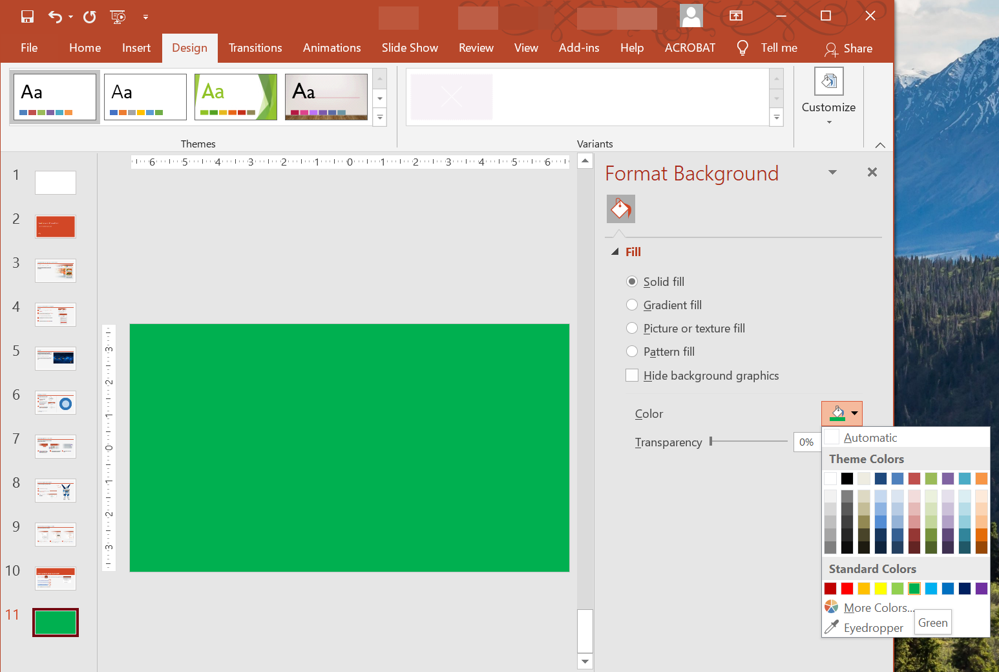

## **Overview**

Solid colors, gradients, and images are commonly used for slide backgrounds. You can set the background for a **normal slide** (a single slide) or a **master slide** (applies to multiple slides at once).



## **Set a Solid Color Background for a Normal Slide**

Aspose.Slides allows you to set a solid color as the background for a specific slide in a presentation—even if the presentation uses a master slide. The change applies only to the selected slide.

1. Create an instance of the [Presentation](https://reference.aspose.com/slides/net/aspose.slides/presentation/) class.
2. Set the slide’s [BackgroundType](https://reference.aspose.com/slides/net/aspose.slides/backgroundtype/) to `OwnBackground`.
3. Set the slide background [FillType](https://reference.aspose.com/slides/net/aspose.slides/filltype/) to `Solid`.
4. Use the [SolidFillColor](https://reference.aspose.com/slides/net/aspose.slides/fillformat/solidfillcolor/) property on [FillFormat](https://reference.aspose.com/slides/net/aspose.slides/fillformat/) to specify the solid background color.
5. Save the modified presentation.

The following C# example shows how to set a blue solid color as the background for a normal slide:

```cs
// Create an instance of the Presentation class.
using (Presentation presentation = new Presentation())
{
    ISlide slide = presentation.Slides[0];

    // Set the background color of the slide to blue.
    slide.Background.Type = BackgroundType.OwnBackground;
    slide.Background.FillFormat.FillType = FillType.Solid;
    slide.Background.FillFormat.SolidFillColor.Color = Color.Blue;

    // Save the presentation to disk.
    presentation.Save("SolidColorBackground.pptx", SaveFormat.Pptx);
}
```

## **Set a Solid Color Background for a Master Slide**

Aspose.Slides allows you to set a solid color as the background for the master slide in a presentation. The master slide acts as a template that controls formatting for all slides, so when you choose a solid color for the master slide’s background, it applies to every slide.

1. Create an instance of the [Presentation](https://reference.aspose.com/slides/net/aspose.slides/presentation/) class.
2. Set the master slide’s [BackgroundType](https://reference.aspose.com/slides/net/aspose.slides/backgroundtype/) (via `masters`) to `OwnBackground`.
3. Set the master slide background [FillType](https://reference.aspose.com/slides/net/aspose.slides/filltype/) to `Solid`.
4. Use the [SolidFillColor](https://reference.aspose.com/slides/net/aspose.slides/fillformat/solidfillcolor/) to specify the solid background color.
5. Save the modified presentation.

The following C# example shows how to set a solid color (forest green) as the background for a master slide:

```cs
// Create an instance of the Presentation class.
using (Presentation presentation = new Presentation())
{
    IMasterSlide masterSlide = presentation.Masters[0];

    // Set the background color for the Master slide to Forest Green.
    masterSlide.Background.Type = BackgroundType.OwnBackground;
    masterSlide.Background.FillFormat.FillType = FillType.Solid;
    masterSlide.Background.FillFormat.SolidFillColor.Color = Color.ForestGreen;

    // Save the presentation to disk.
    presentation.Save("MasterSlideBackground.pptx", SaveFormat.Pptx);
}
```

## **Set a Gradient Background for a Slide**

A gradient is a graphical effect created by a gradual change in color. When used as a slide background, gradients can make presentations look more artistic and professional. Aspose.Slides allows you to set a gradient color as the background for slides.

1. Create an instance of the [Presentation](https://reference.aspose.com/slides/net/aspose.slides/presentation/) class.
2. Set the slide’s [BackgroundType](https://reference.aspose.com/slides/net/aspose.slides/backgroundtype/) to `OwnBackground`.
3. Set the slide background [FillType](https://reference.aspose.com/slides/net/aspose.slides/filltype/) to `Gradient`.
4. Use the [GradientFormat](https://reference.aspose.com/slides/net/aspose.slides/fillformat/gradientformat/) property on [FillFormat](https://reference.aspose.com/slides/net/aspose.slides/fillformat/) to configure your preferred gradient settings.
5. Save the modified presentation.

The following C# example shows how to set a gradient color as the background for a slide:

```cs
// Create an instance of the Presentation class.
using (Presentation presentation = new Presentation())
{
    ISlide slide = presentation.Slides[0];

    // Apply a gradient effect to the background.
    slide.Background.Type = BackgroundType.OwnBackground;
    slide.Background.FillFormat.FillType = FillType.Gradient;
    slide.Background.FillFormat.GradientFormat.TileFlip = TileFlip.FlipBoth;

    // Save the presentation to disk.
    presentation.Save("GradientBackground.pptx", SaveFormat.Pptx);
}
```

## **Set an Image as a Slide Background**

In addition to solid and gradient fills, Aspose.Slides allows you to use images as slide backgrounds.

1. Create an instance of the [Presentation](https://reference.aspose.com/slides/net/aspose.slides/presentation/) class.
2. Set the slide’s [BackgroundType](https://reference.aspose.com/slides/net/aspose.slides/backgroundtype/) to `OwnBackground`.
3. Set the slide background [FillType](https://reference.aspose.com/slides/net/aspose.slides/filltype/) to `Picture`.
4. Load the image you want to use as the slide background.
5. Add the image to the presentation’s image collection.
6. Use the [PictureFillFormat](https://reference.aspose.com/slides/net/aspose.slides/fillformat/picturefillformat/) property on [FillFormat](https://reference.aspose.com/slides/net/aspose.slides/fillformat/) to assign the image as the background.
7. Save the modified presentation.

The following C# example shows how to set an image as the background for a slide:

```c#
// Create an instance of the Presentation class.
using (Presentation presentation = new Presentation())
{
    ISlide slide = presentation.Slides[0];

    // Set background image properties.
    slide.Background.Type = BackgroundType.OwnBackground;
    slide.Background.FillFormat.FillType = FillType.Picture;
    slide.Background.FillFormat.PictureFillFormat.PictureFillMode = PictureFillMode.Stretch;

    // Load the image.
    IImage image = Images.FromFile("Tulips.jpg");
    // Add the image to the presentation's image collection.
    IPPImage ppImage = presentation.Images.AddImage(image);
    image.Dispose();

    slide.Background.FillFormat.PictureFillFormat.Picture.Image = ppImage;

    // Save the presentation to disk.
    presentation.Save("ImageAsBackground.pptx", SaveFormat.Pptx);
}
```

The following code sample shows how to set the background fill type to a tiled picture and modify the tiling properties:

```cs
using (Presentation presentation = new Presentation())
{
    ISlide firstSlide = presentation.Slides[0];

    IBackground background = firstSlide.Background;

    background.Type = BackgroundType.OwnBackground;
    background.FillFormat.FillType = FillType.Picture;

    IPPImage ppImage;
    using (IImage newImage = Aspose.Slides.Images.FromFile("image.png"))
        ppImage = presentation.Images.AddImage(newImage);

    // Set the image used for the background fill.
    IPictureFillFormat backPictureFillFormat = background.FillFormat.PictureFillFormat;
    backPictureFillFormat.Picture.Image = ppImage;

    // Set the picture fill mode to Tile and adjust the tile properties.
    backPictureFillFormat.PictureFillMode = PictureFillMode.Tile;
    backPictureFillFormat.TileOffsetX = 15f;
    backPictureFillFormat.TileOffsetY = 15f;
    backPictureFillFormat.TileScaleX = 46f;
    backPictureFillFormat.TileScaleY = 87f;
    backPictureFillFormat.TileAlignment = RectangleAlignment.Center;
    backPictureFillFormat.TileFlip = TileFlip.FlipY;

    presentation.Save("TileBackground.pptx", SaveFormat.Pptx);
}
```

{}

Read more: [**Tile Picture As Texture**](/slides/net/shape-formatting/#tile-picture-as-texture).

{}

### **Change the Background Image Transparency**

You may want to adjust the transparency of a slide's background image to make the contents of the slide stand out. The following C# code shows you how to change the transparency for a slide background image:

```cs
var transparencyValue = 30; // For example.

// Get the collection of picture transform operations.
var imageTransform = slide.Background.FillFormat.PictureFillFormat.Picture.ImageTransform;

// Find an existing fixed-percentage transparency effect.
var transparencyOperation = null as IAlphaModulateFixed;
foreach (var operation in imageTransform)
{
    if (operation is IAlphaModulateFixed alphaModulateFixed)
    {
        transparencyOperation = alphaModulateFixed;
        break;
    }
}

// Set the new transparency value.
if (transparencyOperation == null)
{
    imageTransform.AddAlphaModulateFixedEffect(100 - transparencyValue);
}
else
{
    transparencyOperation.Amount = (100 - transparencyValue);
}
```

## **Get the Slide Background Value**

Aspose.Slides provides the [IBackgroundEffectiveData](https://reference.aspose.com/slides/net/aspose.slides/ibackgroundeffectivedata/) interface for retrieving a slide’s effective background values. This interface exposes the effective [FillFormat](https://reference.aspose.com/slides/net/aspose.slides/ibackgroundeffectivedata/fillformat/) and [EffectFormat](https://reference.aspose.com/slides/net/aspose.slides/ibackgroundeffectivedata/effectformat/).

Using the [BaseSlide](https://reference.aspose.com/slides/net/aspose.slides/baseslide/) class’s `background` property, you can obtain the effective background for a slide.

The following C# example shows how to get a slide’s effective background value:

```cs
// Create an instance of the Presentation class.
using (Presentation presentation = new Presentation("Sample.pptx"))
{
    ISlide slide = presentation.Slides[0];  

    // Retrieve the effective background, taking into account master, layout, and theme.
    IBackgroundEffectiveData effBackground = slide.Background.GetEffective();

    if (effBackground.FillFormat.FillType == FillType.Solid)
        Console.WriteLine("Fill color: " + effBackground.FillFormat.SolidFillColor);
    else
        Console.WriteLine("Fill type: " + effBackground.FillFormat.FillType);
}
```

## **FAQ**

**Can I reset a custom background and restore the theme/layout background?**

Yes. Remove the slide’s custom fill, and the background will be inherited again from the corresponding [layout](/slides/net/slide-layout/)/[master](/slides/net/slide-master/) slide (i.e., the [theme background](/slides/net/presentation-theme/)).

**What happens to the background if I change the presentation’s theme later?**

If a slide has its own fill, it will remain unchanged. If the background is inherited from the [layout](/slides/net/slide-layout/)/[master](/slides/net/slide-master/), it will update to match the [new theme](/slides/net/presentation-theme/).
