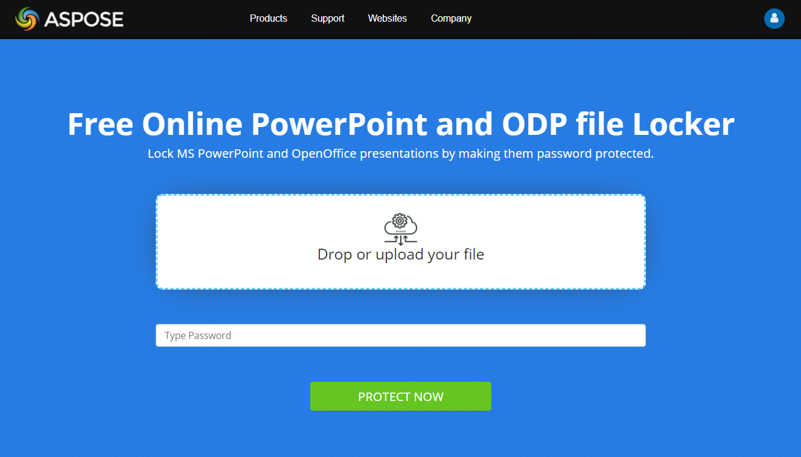

## **Overview**

When you password protect a presentation, it means you are setting a password that enforces certain restrictions on the presentation. To remove the restrictions, the password has to be entered. A password-protected presentation is considered a locked presentation.

Typically, you can set a password to enforce these restrictions on a presentation:

- **Modification**

If you want only certain users to modify your presentation, you can set a modification restriction. The restriction here prevents people from modifying, changing, or copying things in your presentation (unless they provide the password). 

However, in this case, even without the password, a user will be able to access your document and open it. In this read-only mode, the user can view the contents or things—hyperlinks, animations, effects, and others—inside your presentation, but they cannot copy items or save the presentation. 

- **Opening**

If you want only certain users to open your presentation, you can set an opening restriction. The restriction here prevents people from even viewing the contents of your presentation (unless they provide the password).

Technically, the opening restriction also prevents users from modifying your presentations: When people cannot open a presentation, they cannot make modify or make changes to it. 
  
**Note** that when you password protect a presentation to prevent opening, the presentation file becomes encrypted.

## **Password Protection in Aspose.Slides**

**Supported formats**

Aspose.Slides supports password protection, encryption, and similar operations for presentations in these formats: 

- PPTX and PPT - Microsoft PowerPoint Presentation 
- ODP - OpenDocument Presentation 
- OTP -  OpenDocument Presentation Template 

**Supported operations**

Aspose.Slides allows you to use password protection on presentations to prevent modifications in these ways:

- Encrypting a presentation
- Setting a write protection to a presentation

**Other operations**

Aspose.Slides allows you to perform other tasks involving password protection and encryption in these ways:

- Decrypting a presentation; opening an encrypted presentation
- Removing encryption; disabling password protection
- Removing write protection from a presentation
- Getting the properties of an encrypted presentation
- Checking whether a presentation is password protected before loading it
- Checking whether a presentation is encrypted
- Checking whether a presentation is password protected.

## **Protect a Presentation with a Password**

You can encrypt a presentation by setting a password. Then, to modify the locked presentation, a user has to provide the password. 

To encrypt or password protect a presentation, you have to use the encrypt method (from [ProtectionManager](https://reference.aspose.com/slides/net/aspose.slides/protectionmanager)) to set a password for the presentation. You pass the password to the encrypt method and use the save method to save the now encrypted presentation. 

This sample code shows you how to encrypt a presentation:

```c#
using (Presentation presentation = new Presentation("pres.pptx"))
{
    presentation.ProtectionManager.Encrypt("123123");
    presentation.Save("encrypted-pres.pptx", SaveFormat.Pptx);
}
```

## **Set Write Protection on a Presentation** 

You can add a mark stating “Do not modify” to a presentation. This way, you get to tell users that you do not want them to make changes to the presentation.  

**Note** that the write protection process does not encrypt the presentation. Therefore, users—if they actually want to—can modify the presentation, but to save the changes, they will have to create a presentation with a different name. 

To set a write protection, you have to use the setWriteProtection method. This sample code shows you how to set a write protection to a presentation:

```c#
using (Presentation presentation = new Presentation("pres.pptx"))
{
    presentation.ProtectionManager.SetWriteProtection("123123");
    presentation.Save("write-protected-pres.pptx", SaveFormat.Pptx);
}
```

## **Load an Encrypted Presentation**

Aspose.Slides allow you to load an encrypted file by passing its password. To decrypt a presentation, you have to call the [RemoveEncryption](https://reference.aspose.com/slides/net/aspose.slides/protectionmanager/methods/removeencryption) method with no parameters. You will then have to enter the correct password to load the presentation. 

This sample code shows you how to decrypt a presentation: 

```c#
LoadOptions loadOptions = new LoadOptions {Password = "123123"};
using (Presentation presentation = new Presentation("pres.pptx", loadOptions))
{
  // work with decrypted presentation
}
```

## **Remove Encryption from a Presentation**

You can remove the encryption or password protection on a presentation. This way, users become able to access or modify the presentation without restrictions. 

To remove encryption or password protection, you have to call the [RemoveEncryption](https://reference.aspose.com/slides/net/aspose.slides/protectionmanager/methods/removeencryption) method. This sample code shows you to remove encryption from a presentation:

```c#
LoadOptions loadOptions = new LoadOptions {Password = "123123"};
using (Presentation presentation = new Presentation("pres.pptx", loadOptions))
{
    presentation.ProtectionManager.RemoveEncryption();
    presentation.Save("encryption-removed.pptx", SaveFormat.Pptx);
}
```

## **Remove Write Protection from a Presentation**

You can use Aspose.Slides to remove the write protection used on a presentation file. This way, users get to modify as they like—and they get no warnings when they perform such tasks.

You can remove the write protection from a presentation by using the [RemoveWriteProtection](https://reference.aspose.com/slides/net/aspose.slides/protectionmanager/methods/removewriteprotection) method. This sample code shows you to remove the write protection from a presentation:

```c#
using (Presentation presentation = new Presentation("pres.pptx"))
{
    presentation.ProtectionManager.RemoveWriteProtection();
    presentation.Save("write-protection-removed.pptx", SaveFormat.Pptx);
}
```

## **Get Properties of an Encrypted Presentation**

Typically, users struggle to get the document properties of an encrypted or password-protected presentation. Aspose.Slides, however, offers a mechanism that allows you to password protect a presentation while retaining the means for users to access the properties of that presentation.

**Note** that when Aspose.Slides encrypts a presentation, the presentation’s document properties get password protected too by default. But if you need to make the presentation’s properties accessible (even after the presentation gets encrypted), Aspose.Slides allows you to do precisely that. 

If you want users to retain the ability to access the properties of a presentation you encrypted, you can set the [EncryptDocumentProperties](https://reference.aspose.com/slides/net/aspose.slides/protectionmanager/properties/encryptdocumentproperties) property to `true`. This sample code shows you how to encrypt a presentation while providing the means for users to access its document properties:

```c#
using (Presentation presentation = new Presentation("pres.pptx"))
{
    presentation.ProtectionManager.EncryptDocumentProperties = true;
    presentation.ProtectionManager.Encrypt("123123");
}
```

## **Check whether a Presentation Is Password Protected**

Before you load a presentation, you might want to check and confirm that the presentation has not been protected with a password. This way, you get to avoid errors and similar issues, which come up when a password protected presentation is loaded without its password.

This C# code shows you how to examine a presentation to see if it is password protected (without loading the presentation itself):

```c#
var presentationInfo = PresentationFactory.Instance.GetPresentationInfo("example.pptx");
Console.WriteLine("The presentation is password protected: " + presentationInfo.IsPasswordProtected);
```

## **Check whether a Presentation Is Encrypted**

Aspose.Slides allows you to check whether a presentation is encrypted. To perform this task, you can use the [IsEncrypted](https://reference.aspose.com/slides/net/aspose.slides/protectionmanager/properties/isencrypted) property, which returns `true` if the presentation is encrypted or `false` if the presentation isn't encrypted. 

This sample code shows you how to check whether a presentation is encrypted:

```c#
using (Presentation presentation = new Presentation("pres.pptx"))
{
    bool isEncrypted = presentation.ProtectionManager.IsEncrypted;
}
```

## **Check whether a Presentation Is Write Protected**

Aspose.Slides allows you to check whether a presentation is write-protected. To perform this task, you can use the [IsWriteProtected](https://reference.aspose.com/slides/net/aspose.slides/protectionmanager/properties/iswriteprotected) property, which returns `true` if the presentation is encrypted or `false` if the presentation isn't encrypted. 

This sample code shows you how to check whether a presentation is write-protected:

```c#
using (Presentation presentation = new Presentation("pres.pptx"))
{
    bool isEncrypted = presentation.ProtectionManager.IsWriteProtected;
}
```

## **Verify Presentation Password Usage**

You may want to check and confirm that a specific password has been used to protect a presentation document. Aspose.Slides provides the means for you to validate a password. 

This sample code shows you how to validate a password:

```c#
using (IPresentation pres = new Presentation("pres.pptx"))
{
    // check if "pass" is matched with
    bool isWriteProtected = pres.ProtectionManager.CheckWriteProtection("my_password");
}
```

It returns `true` if the presentation has been encrypted with the specified password. Otherwise, it returns `false`. 

{} 
- [Digital Signature in PowerPoint](/slides/net/digital-signature-in-powerpoint/)
{}

## **Password Protect a Presentation Online**

1. Go to our [**Aspose.Slides Lock**](https://products.aspose.app/slides/lock) page. 
1. Click **Drop or upload your files**.
1. Select the file you want to password protect on your computer. 
1. Input your preferred password for edit protection; Input your preferred password for view protection. 
1. If you want users to see your presentation as the final copy, tick the **Mark as final** checkbox.
1. Click **PROTECT NOW.** 
1. Click **DOWNLOAD NOW.**



## **FAQs**
