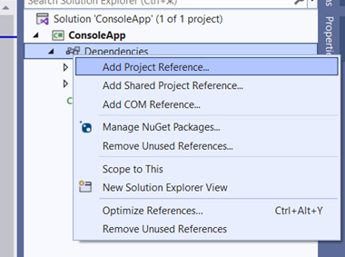

{}

Aspose.Slides for .NET 6 Cross-Platform is also available from [NuGet](https://www.nuget.org/packages/Aspose.Slides.NET6.CrossPlatform).

{}

## **Using the Cross-Platform Aspose.Slides from a ZIP Package**

1. Download the ZIP package of the latest Aspose.Slides from the [Release Page](https://releases.aspose.com/slides/net/). 

2. Unpack the files from *Aspose.Slides.zip\Aspose.Slides\net6.0\crossplatform* and place them in the folder that will be used for dependencies in your project.

3. Add a reference to Aspose.Slides.dll.

   

   In our example (below), the libraries are located in the project folder along this path: *ConsoleApp\libs\Aspose.Slides\net6.0\crossplatform\...*

   

4. Place the remaining files (that Aspose.Slides depend on) in the output directory by adding instructions to the csproj project file this way:

```xml
<ItemGroup>

   <None Update="libs\Aspose.Slides\net6.0\crossplatform\aspose.slides.drawing.capi_vc14x64.dll">
         <CopyToOutputDirectory>PreserveNewest</CopyToOutputDirectory>
         <TargetPath>aspose.slides.drawing.capi_vc14x64.dll</TargetPath>
   </None>

   <None Update="libs\Aspose.Slides\net6.0\crossplatform\aspose.slides.drawing.capi_vc14x86.dll">
         <CopyToOutputDirectory>PreserveNewest</CopyToOutputDirectory>
         <TargetPath>aspose.slides.drawing.capi_vc14x86.dll</TargetPath>
   </None>

   <None Update="libs\Aspose.Slides\net6.0\crossplatform\Aspose.Slides.xml">
         <CopyToOutputDirectory>PreserveNewest</CopyToOutputDirectory>
         <TargetPath>Aspose.Slides.xml</TargetPath>
   </None>

   <None Update="libs\Aspose.Slides\net6.0\crossplatform\libaspose.slides.drawing.capi_appleclang_x86_64.dylib">
         <CopyToOutputDirectory>PreserveNewest</CopyToOutputDirectory>
         <TargetPath>libaspose.slides.drawing.capi_appleclang_x86_64.dylib</TargetPath>
   </None>

   <None Update="libs\Aspose.Slides\net6.0\crossplatform\libaspose.slides.drawing.capi_appleclang_arm64.dylib">
         <CopyToOutputDirectory>PreserveNewest</CopyToOutputDirectory>
         <TargetPath>libaspose.slides.drawing.capi_appleclang_arm64.dylib</TargetPath>
   </None>

   <None Update="libs\Aspose.Slides\net6.0\crossplatform\libaspose.slides.drawing.capi_x86_64_libstdcpp_libc2.23.so">
         <CopyToOutputDirectory>PreserveNewest</CopyToOutputDirectory>
         <TargetPath>libaspose.slides.drawing.capi_x86_64_libstdcpp_libc2.23.so</TargetPath>
   </None>

</ItemGroup>
```

5. Pay attention to `TargetPath`. 

   By default, `<CopyToOutputDirectory>` copies files while preserving their relative path, but we need the dependent libraries to go to the same folder where the output is generated (Aspose.Slides.dll location).

## **Notes**

### **Proprietary Graphics Subsystem**

Aspose.Slides cross-platform is a collection of libraries:

| Aspose.Slides.dll                                          | Main .NET Assembly Responsible for All Aspose.Slides Logic                 |
| ---------------------------------------------------------- | -------------------------------------------------------------------------- |
| aspose.slides.drawing.capi_vc14x64.dll                     | Dependency: graphics subsystem implementation for Win x64                  |
| aspose.slides.drawing.capi_vc14x86.dll                     | Dependency: graphics subsystem implementation for Win x64                  |
| libaspose.slides.drawing.capi_x86_64_libstdcpp_libc2.23.so | Dependency: graphics subsystem implementation for Linux (x86/x64)          |
| libaspose.slides.drawing.capi_appleclang_x86_64.dylib      | Dependency: graphics subsystem implementation for macOS AMD64 (x86-64/x64) |
| libaspose.slides.drawing.capi_appleclang_arm64.dylib       | Dependency: graphics subsystem implementation for macOS ARM64 (AArch64)    |

Aspose.Slides.dll uses the library that the system it is running on requires. The libraries are usually located in the same location as Aspose.Slides.dll in any file system.

### **ZIP Package Structure**

The ZIP package contains the following folder structure:

  Aspose.Slides

  ├─── net6.0

  │  ├─── crossplatform

  │  └─── default

  ├─── net20

  ├─── net462

  └─── netstandard2.0

* Each folder contains assemblies for their corresponding .NET version. There are two versions for net6.0: default and crossplatform. The latter contains the cross-platform Aspose.Slides.dll and all its dependencies. The unpacked contents of this folder can be used as a dependency addition in a project for cross-platform development and other Aspose.Slides use instances.

## **See Also**

- [System Requirements](/slides/net/system-requirements/)
