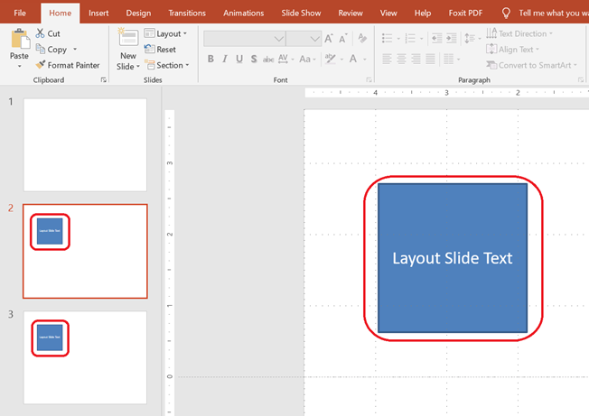

This article demonstrates how to work with **Layout Slides** in Aspose.Slides for .NET. A layout slide defines the design and formatting inherited by normal slides. You can add, access, clone, and remove layout slides, as well as clean up unused ones to reduce presentation size.

## Add a Layout Slide

You can create a custom layout slide to define reusable formatting. For example, you might add a text box that appears on all slides using this layout.

```csharp
static void Add_Layout_Slide()
{
    using var pres = new Presentation();
    
    // Create a layout slide with a blank layout type and a custom name
    var layoutSlide = pres.LayoutSlides.Add(pres.Masters[0], SlideLayoutType.Blank, "Main layout");

    // Add a text box to the layout slide
    var layoutTextBox = layoutSlide.Shapes.AddAutoShape(ShapeType.Rectangle, x: 75, y: 75, width: 150, height: 150);
    layoutTextBox.TextFrame.Text = "Layout Slide Text";

    // Add two slides using this layout; both will inherit the text from the layout
    pres.Slides.AddEmptySlide(layoutSlide);
    pres.Slides.AddEmptySlide(layoutSlide);
}
````

> 💡 **Tip 1:** Layout slides act as templates for individual slides. You can define common elements once and reuse them across many slides.

> 💡 **Tip 2:** When you add shapes or text to a layout slide, all slides based on that layout will display this shared content automatically.
> The screenshot below shows two slides, each inheriting a text box from the same layout slide.




## Access a Layout Slide

Layout slides can be accessed by index or by layout type (e.g., `Blank`, `Title`, `SectionHeader`, etc.).

```csharp
static void Access_Layout_Slide()
{
    using var pres = new Presentation();
    
    // Access by index
    var firstLayoutSlide = pres.LayoutSlides[0];
    
    // Access by layout type
    var blankLayoutSlide = pres.LayoutSlides.GetByType(SlideLayoutType.Blank);
}
```

## Remove a Layout Slide

You can remove a specific layout slide if it's no longer needed.

```csharp
static void Remove_Layout_Slide()
{
    using var pres = new Presentation();
    
    // Get a layout slide by type and remove it
    var blankLayoutSlide = pres.LayoutSlides.GetByType(SlideLayoutType.Blank);
    pres.LayoutSlides.Remove(blankLayoutSlide);
}
```

## Remove Unused Layout Slides

To reduce the presentation size, you may want to remove layout slides that are not used by any normal slides.

```csharp
static void RemoveUnused_Layout_Slides()
{
    using var pres = new Presentation();
    
    // Automatically removes all layout slides not referenced by any slide
    pres.LayoutSlides.RemoveUnused();
}
```

## Clone a Layout Slide

You can duplicate a layout slide using the `AddClone` method.

```csharp
static void Clone_Layout_Slides()
{
    using var pres = new Presentation();
    
    // Get an existing layout slide by type
    var blankLayoutSlide = pres.LayoutSlides.GetByType(SlideLayoutType.Blank);
    
    // Clone the layout slide to the end of the layout slide collection
    var clonedLayoutSlide = pres.LayoutSlides.AddClone(blankLayoutSlide);
}
```

> ✅ **Summary:** Layout slides are powerful tools for managing consistent formatting across slides. Aspose.Slides allows full control over creating, managing, and optimizing layout slides.