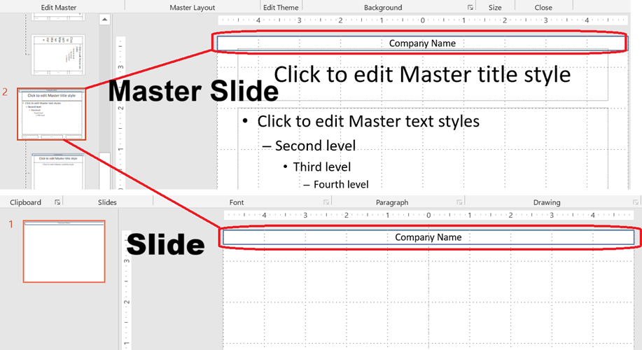

Master slides form the top level of the slide inheritance hierarchy in PowerPoint. A **master slide** defines common design elements such as backgrounds, logos, and text formatting. **Layout slides** inherit from master slides, and **normal slides** inherit from layout slides.

This article demonstrates how to create, modify, and manage master slides using Aspose.Slides for .NET.

## **Add a Master Slide**

This example shows how to create a new master slide by cloning the default one. It then adds a company name banner to all slides through layout inheritance.

```csharp
static void Add_Master_Slide()
{
    using var pres = new Presentation();

    // Clone the default master slide
    var defaultMasterSlide = pres.Masters[0];
    var newMaster = pres.Masters.AddClone(defaultMasterSlide);

    // Add a banner with company name to the top of the master slide
    var textBox = newMaster.Shapes.AddAutoShape(ShapeType.Rectangle, x: 0, y: 0, width: 720, height: 25);
    textBox.TextFrame.Text = "Company Name";
    textBox.TextFrame.Paragraphs[0].ParagraphFormat.DefaultPortionFormat.FillFormat.FillType = FillType.Solid;
    textBox.TextFrame.Paragraphs[0].ParagraphFormat.DefaultPortionFormat.FillFormat.SolidFillColor.Color = Color.Black;
    textBox.FillFormat.FillType = FillType.NoFill;

    // Assign the new master slide to a layout slide
    var layoutSlide = pres.LayoutSlides[0];
    layoutSlide.MasterSlide = newMaster;

    // Assign the layout slide to the first slide in the presentation
    pres.Slides[0].LayoutSlide = layoutSlide;
}
````

> 💡 **Tip 1:** Master slides provide a way to apply consistent branding or shared design elements across all slides. Any changes made to the master will automatically reflect on dependent layout and normal slides.

> 💡 **Tip 2:** Any shapes or formatting added to a master slide are inherited by layout slides and, in turn, all normal slides using those layouts.
> The image below illustrates how a text box added on a master slide is automatically rendered on the final slide.



## **Access a Master Slide**

You can access master slides using the `Presentation.Masters` collection. Here’s how to retrieve and work with them:

```csharp
static void Access_Master_Slide()
{
    using var pres = new Presentation();

    // Access the first master slide
    var firstMasterSlide = pres.Masters[0];

    // Change the background type
    firstMasterSlide.Background.Type = BackgroundType.OwnBackground;
}
```

## **Remove a Master Slide**

Master slides can be removed either by index or by reference.

```csharp
static void Remove_Master_Slide()
{
    using var pres = new Presentation();

    // Remove by index
    pres.Masters.RemoveAt(0);

    // Or remove by reference
    var firstMasterSlide = pres.Masters[0];
    pres.Masters.Remove(firstMasterSlide);
}
```

## **Remove Unused Master Slides**

Some presentations contain master slides that are not in use. Removing these slides can help reduce file size.

```csharp
static void RemoveUnused_Master_Slide()
{
    using var pres = new Presentation();

    // Remove all unused master slides (even those marked as Preserve)
    pres.Masters.RemoveUnused(ignorePreserveField: true);
}
```

> ⚙️ **Tip:** Use `RemoveUnused(true)` to clean up unused master slides and minimize the presentation size.
