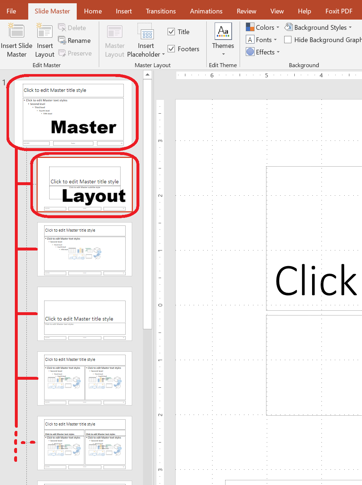

This article provides a series of examples that demonstrate how to work with slides using **Aspose.Slides for .NET**. You’ll learn how to add, access, clone, reorder, and remove slides using the `Presentation` class.

Each example below includes a brief explanation followed by a code snippet in C#.

## Add a Slide

To add a new slide, you must first select a layout. In this example, we use the `Blank` layout and add an empty slide to the presentation.

```csharp
static void Add_Slide()
{
    using var pres = new Presentation();

    // Each slide is based on a layout, which itself is based on a master slide.
    // Use the Blank layout to create a new slide.
    var blankLayout = pres.LayoutSlides.GetByType(SlideLayoutType.Blank);

    // Add a new empty slide using the selected layout
    pres.Slides.AddEmptySlide(layout: blankLayout);
}
````

> 💡 **Tip:** Each slide layout is derived from a master slide, which defines the overall design and placeholder structure. The image below illustrates how master slides and their associated layouts are organized in PowerPoint.



## Access Slides by Index

You can access slides using their index, or find a slide’s index based on a reference. This is useful for iterating through or modifying specific slides.

```csharp
static void Access_Slide()
{
    // By default, a presentation is created with one empty slide
    using var pres = new Presentation();

    // Add another empty slide
    pres.Slides.AddEmptySlide(layout: pres.LayoutSlides.GetByType(SlideLayoutType.Blank));

    // Access slides by index
    var firstSlide = pres.Slides[0];
    var secondSlide = pres.Slides[1];

    // Get slide index from a reference, then access it by index
    var secondSlideIndex = pres.Slides.IndexOf(secondSlide);
    var secondSlideByIndex = pres.Slides[secondSlideIndex];
}
```

## Clone a Slide

This example demonstrates how to clone an existing slide. The cloned slide is automatically added to the end of the slide collection.

```csharp
static void Clone_Slide()
{
    // By default, the presentation contains one empty slide
    using var pres = new Presentation();

    // Clone the first slide; it will be added at the end of the presentation
    var clonedSlide = pres.Slides.AddClone(sourceSlide: pres.Slides[0]);

    // The cloned slide index is 1 (second slide in the presentation)
    var clonedSlideIndex = pres.Slides.IndexOf(clonedSlide);
}
```

## Reorder Slides

You can change the order of slides by moving one to a new index. In this case, we move a cloned slide to the first position.

```csharp
static void ReOrder_Slide()
{
    using var pres = new Presentation();

    // Add a clone of the first slide (created by default)
    var clonedSlide = pres.Slides.AddClone(pres.Slides[0]);

    // Move the cloned slide to the first position (others shift down)
    pres.Slides.Reorder(index: 0, clonedSlide);
}
```

## Remove a Slide

To remove a slide, simply reference it and call `Remove`. This example adds a second slide and then removes the original, leaving only the new one.

```csharp
static void Remove_Slide()
{
    using var pres = new Presentation();

    // Add a new empty slide in addition to the default first slide
    var secondSlide = pres.Slides.AddEmptySlide(layout: pres.LayoutSlides.GetByType(SlideLayoutType.Blank));

    // Remove the first slide; only the newly added slide will remain
    var firstSlide = pres.Slides[0];
    pres.Slides.Remove(firstSlide);
}
```