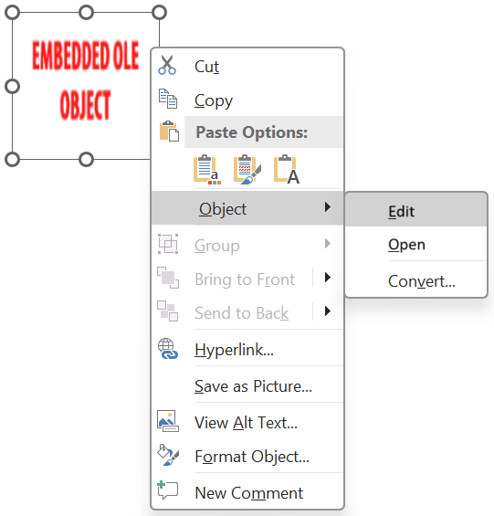
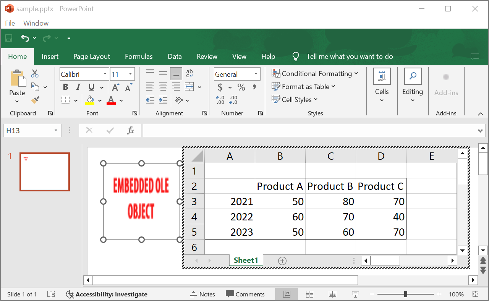
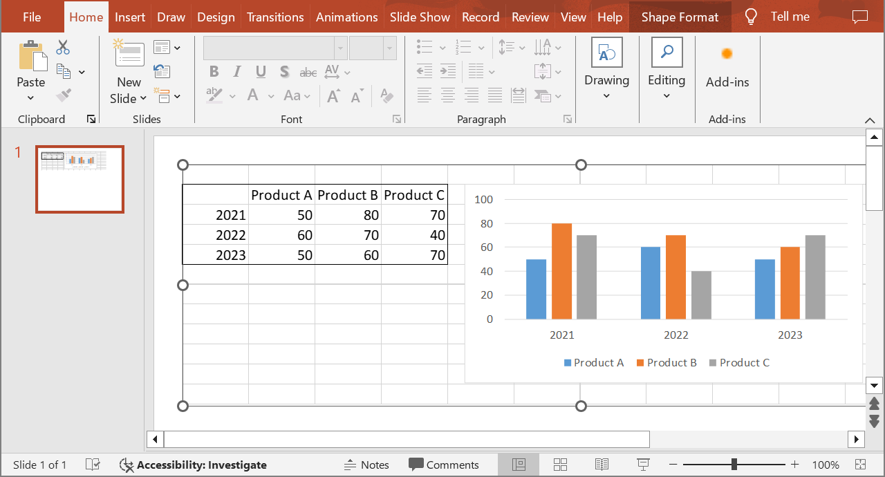

## **Introduction**

Using Aspose.Slides for Java, when you add [OleObjectFrame](https://reference.aspose.com/slides/nodejs-java/aspose.slides/oleobjectframe/) to a slide, an "EMBEDDED OLE OBJECT" message is shown on the output slide. This message is intentional and NOT a bug.

For more information on working with OLE objects, see [Manage OLE](/slides/nodejs-java/manage-ole/). 

## **Explanation and Solution**

Aspose.Slides displays the "EMBEDDED OLE OBJECT" message to notify you that the OLE object has been changed and the preview image has to be updated. 

For example, if you add a Microsoft Excel сhart as an [OleObjectFrame](https://reference.aspose.com/slides/nodejs-java/aspose.slides/oleobjectframe/) to a slide (for more details, see the "Manage OLE" article) and then open the presentation in the Microsoft PowerPoint, you will see this image on the slide:


If you want to check and confirm that your OLE object was added to the slide, you have to double-click on the "EMBEDDED OLE OBJECT" message, or you can right-click on it and go through **Object > Edit** option.



PowerPoint then opens the embedded OLE object.



The slide may retain the "EMBEDDED OLE OBJECT" message. Once you click the OLE object, the slide preview gets updated and the "EMBEDDED OLE OBJECT" message is replaced by the actual image for the OLE object. 



Now, you may want to save your presentation to ensure the image for the OLE Object gets updated correctly. This way, after saving the presentation, when you open the presentation again, you will NOT see the "EMBEDDED OLE OBJECT" message. 

## **Other Solutions**

### **Solution 1: Replace the "Embedded OLE Object" Message with an Image**

If you do not want to remove the "EMBEDDED OLE OBJECT" message by opening the presentation in PowerPoint and then saving it, you can replace the message with your preferred preview image. These lines of code demonstrate the process:

```javascript
const presentation = new aspose.slides.Presentation("embeddedOLE.pptx");
try {
    const slide = presentation.getSlides().get_Item(0);
    const oleFrame = slide.getShapes().get_Item(0);

    // Add an image to presentation resources.
    const image = aspose.slides.Images.fromFile("myImage.png");
    const oleImage = presentation.getImages().addImage(image);

    // Set a title and the image for the OLE object preview.
    oleFrame.setSubstitutePictureTitle("My title");
    oleFrame.getSubstitutePictureFormat().getPicture().setImage(oleImage);
    oleFrame.setObjectIcon(false);

    presentation.save("embeddedOLE-newImage.pptx", aspose.slides.SaveFormat.Pptx);
} finally {
    if (presentation != null) presentation.dispose();
}
```

The slide containing the `OleObjectFrame` then changes to this:


### **Solution 2: Create an Add-On for PowerPoint**

You can also create an add-on for Microsoft PowerPoint that updates all OLE objects when you open presentations in the program.
