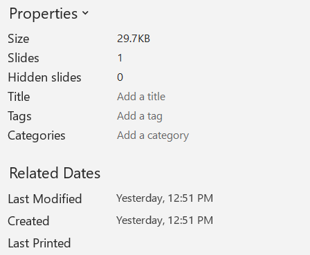

Aspose.Slides for Node.js via Java allows you to examine a presentation to find out its properties and understand its behavior.

{} 

The [PresentationInfo](https://reference.aspose.com/slides/nodejs-java/aspose.slides/PresentationInfo) and [DocumentProperties](https://reference.aspose.com/slides/nodejs-java/aspose.slides/documentproperties/) classes contain the properties and methods used in operations here.

{} 

## **Check a Presentation Format**

Before working on a presentation, you may want to find out what format (PPT, PPTX, ODP, and others) the presentation is in at the moment.

You can check a presentation's format without loading the presentation. See this JavaScript code:

```javascript
var info = aspose.slides.PresentationFactory.getInstance().getPresentationInfo("pres.pptx");
console.log(info.getLoadFormat());// PPTX
var info2 = aspose.slides.PresentationFactory.getInstance().getPresentationInfo("pres.ppt");
console.log(info2.getLoadFormat());// PPT
var info3 = aspose.slides.PresentationFactory.getInstance().getPresentationInfo("pres.odp");
console.log(info3.getLoadFormat());// ODP
```

## **Get Presentation Properties**

his JavaScript code shows you how to get presentation properties (information about the presentation):

```javascript
var info = aspose.slides.PresentationFactory.getInstance().getPresentationInfo("pres.pptx");
var props = info.readDocumentProperties();
console.log(props.getCreatedTime());
console.log(props.getSubject());
console.log(props.getTitle());
// ..
```

You may want to see the [properties under the DocumentProperties](https://reference.aspose.com/slides/nodejs-java/aspose.slides/documentproperties/#DocumentProperties--) class.

## **Update Presentation Properties**

Aspose.Slides provides the [PresentationInfo.updateDocumentProperties](https://reference.aspose.com/slides/nodejs-java/aspose.slides/PresentationInfo#updateDocumentProperties-aspose.slides.IDocumentProperties-) method that allows you to make changes to presentation properties.

Let's say we have a PowerPoint presentation with the document properties shown below.



This code example shows you how to edit some presentation properties:

```javascript
let fileName = "sample.pptx";

let info = aspose.slides.PresentationFactory.getInstance().getPresentationInfo(fileName);

let properties = info.readDocumentProperties();
properties.setTitle("My title");
properties.setLastSavedTime(java.newInstanceSync("java.util.Date"));

info.updateDocumentProperties(properties);
info.writeBindedPresentation(fileName);
```

The results of changing the document properties are shown below.


### **Useful Links**

To get more information about a presentation and its security attributes, you may find these links useful:

- [Checking whether a Presentation is Encrypted](https://docs.aspose.com/slides/nodejs-java/password-protected-presentation/#checking-whether-a-presentation-is-encrypted)
- [Checking whether a Presentation is Write Protected (read-only)](https://docs.aspose.com/slides/nodejs-java/password-protected-presentation/#checking-whether-a-presentation-is-write-protected)
- [Checking whether a Presentation is Password Protected Before Loading it](https://docs.aspose.com/slides/nodejs-java/password-protected-presentation/#checking-whether-a-presentation-is-password-protected-before-loading-it)
- [Confirming the Password Used to Protect a Presentation](https://docs.aspose.com/slides/nodejs-java/password-protected-presentation/#validating-or-confirming-that-a-specific-password-has-been-used-to-protect-a-presentation).
