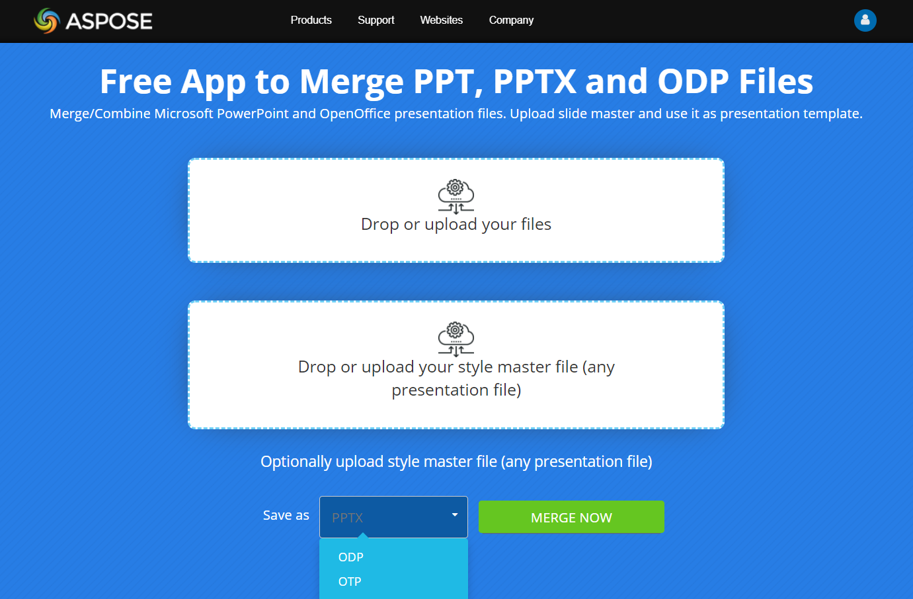

## **Presentation Merging**

When you merge one presentation to another, you are effectively combining their slides in a single presentation to obtain one file. 

{}

Most presentation programs (PowerPoint or OpenOffice) lack functions that allow users to combine presentations in such manner. 

[**Aspose.Slides for Node.js via Java**](https://products.aspose.com/slides/nodejs-java/), however, allows you merge to presentations in different ways. You get to merge presentations with all their shapes, styles, texts, formatting, comments, animations, etc. without having to worry about loss of quality or data.

**See also**

[Clone Slides](https://docs.aspose.com/slides/nodejs-java/clone-slides/).

{}

### **What Can Be Merged**

With Aspose.Slides, you can merge 

* entire presentations. All the slides from the presentations end up in one presentation
* specific slides. Selected slides end up in one presentation
* presentations in one format (PPT to PPT, PPTX to PPTX, etc) and in different formats (PPT to PPTX, PPTX to ODP, etc) to one another. 

### **Merging Options**

You can apply options that determine whether

* each slide in the output presentation retains a unique style
* a specific style is used for all the slides in the output presentation. 

To merge presentations, Aspose.Slides provides [addClone](https://reference.aspose.com/slides/nodejs-java/aspose.slides/SlideCollection#addClone-aspose.slides.ISlide-) methods (from the [SlideCollection](https://reference.aspose.com/slides/nodejs-java/aspose.slides/SlideCollection) class). There are several implementations of the `addClone` methods that define the presentation merging process parameters. Every Presentation object has a [Slides](https://reference.aspose.com/slides/nodejs-java/aspose.slides/Presentation#getSlides--) collection, so you can call a `addClone` method from the presentation to which you want to merge slides.

The `addClone` method returns an `Slide` object, which is a clone of the source slide. The slides in an output presentation are simply a copy of the slides from the source. Therefore, you can make changes the resulting slides (for example, apply styles or formatting options or layouts) without worrying about the source presentations becoming affected. 

## **Merge Presentations** 

Aspose.Slides provides the [**AddClone(ISlide)**](https://reference.aspose.com/slides/nodejs-java/aspose.slides/SlideCollection#addClone-aspose.slides.ISlide-) method that allows you to combine slides while the slides retain their layouts and styles (default parameters).

This JavaScript code shows you how to merge presentations:

```javascript
let pres1 = new aspose.slides.Presentation("pres1.pptx");
try {
    let pres2 = new aspose.slides.Presentation("pres2.pptx");
    try {
        for (let i = 0; i < pres2.getSlides().size(); i++) {
            let slide = pres2.getSlides().get_Item(i);
            pres1.getSlides().addClone(slide);
        }
    } finally {
        if (pres2 != null) {
            pres2.dispose();
        }
    }
    pres1.save("combined.pptx", aspose.slides.SaveFormat.Pptx);
} finally {
    if (pres1 != null) {
        pres1.dispose();
    }
}
```

## **Merge Presentations with Slide Master**

Aspose.Slides provides the [**AddClone(ISlide, IMasterSlide, boolean)**](https://reference.aspose.com/slides/nodejs-java/aspose.slides/SlideCollection#addClone-aspose.slides.ISlide-aspose.slides.IMasterSlide-boolean-) method that allows you to combine slides while applying a slide master presentation template. This way, if necessary, you get to change the style for slides in the output presentation.

This code in JavaScript demonstrates the described operation:

```javascript
let pres1 = new aspose.slides.Presentation("pres1.pptx");
try {
    let pres2 = new aspose.slides.Presentation("pres2.pptx");
    try {
        for (let i = 0; i < pres2.getSlides().size(); i++) {
            let slide = pres2.getSlides().get_Item(i);
            pres1.getSlides().addClone(slide, pres2.getMasters().get_Item(0), true);
        }
    } finally {
        if (pres2 != null) {
            pres2.dispose();
        }
    }
    pres1.save("combined.pptx", aspose.slides.SaveFormat.Pptx);
} finally {
    if (pres1 != null) {
        pres1.dispose();
    }
}
```

{} 

The slide layout for the slide master is determined automatically. When an appropriate layout can't be determined, if the `allowCloneMissingLayout` boolean parameter of the `addClone` method is set to true, the layout for the source slide is used. Otherwise, [PptxEditException](https://reference.aspose.com/slides/nodejs-java/aspose.slides/PptxEditException) will be thrown.

{}

If you want the slides in the output presentation to have a different slide layout, use the [addClone(ISlide, ILayoutSlide)](https://reference.aspose.com/slides/nodejs-java/aspose.slides/SlideCollection#addClone-aspose.slides.ISlide-aspose.slides.ILayoutSlide-) method instead when merging.

## **Merge Specific Slides From Presentations**

Merging specific slides from multiple presentations is useful for creating custom slide decks. Aspose.Slides for Node.js via Java allows you to select and import only the slides you need. The API preserves formatting, layout, and design of the original slides.

The following JavaScript code creates a new presentation, adds title slides from two other presentations, and saves the result to a file:

```js
function getTitleSlide(presentation) {
  for (let i = 0; i < presentation.getSlides().size(); i++) {
    let slide = presentation.getSlides().get_Item(i);
    if (slide.getLayoutSlide().getLayoutType() == aspose.slides.SlideLayoutType.Title) {
      return slide;
    }
  }
  return null;
}
```
```js
let presentation = new aspose.slides.Presentation();
let presentation1 = new aspose.slides.Presentation("presentation1.pptx");
let presentation2 = new aspose.slides.Presentation("presentation2.pptx");
try {
    presentation.getSlides().removeAt(0);
    
    let slide1 = getTitleSlide(presentation1);

    if (slide1 != null)
        presentation.getSlides().addClone(slide1);

    let slide2 = getTitleSlide(presentation2);

    if (slide2 != null)
        presentation.getSlides().addClone(slide2);

    presentation.save("combined.pptx", aspose.slides.SaveFormat.Pptx);
} finally {
    presentation2.dispose();
    presentation1.dispose();
    presentation.dispose();
}
```

## **Merge Presentations With Slide Layout**

This JavaScript code shows you how to combine slides from presentations while applying your preferred slide layout to them to get one output presentation:

```javascript
let pres1 = new aspose.slides.Presentation("pres1.pptx");
try {
    let pres2 = new aspose.slides.Presentation("pres2.pptx");
    try {
        for (let i = 0; i < pres2.getSlides().size(); i++) {
            let slide = pres2.getSlides().get_Item(i);
            pres1.getSlides().addClone(slide, pres2.getLayoutSlides().get_Item(0));
        }
    } finally {
        if (pres2 != null) {
            pres2.dispose();
        }
    }
    pres1.save("combined.pptx", aspose.slides.SaveFormat.Pptx);
} finally {
    if (pres1 != null) {
        pres1.dispose();
    }
}
```

## **Merge Presentations With Different Slide Sizes**

{} 

You cannot merge presentations with different slide sizes. 

{}

To merge 2 presentations with different slide sizes, you have to resize one of the presentations to make its size match that of the other presentation. 

This sample code demonstrates the described operation:

```javascript
let pres1 = new aspose.slides.Presentation("pres1.pptx");
try {
    let pres2 = new aspose.slides.Presentation("pres2.pptx");
    try {
        pres2.getSlideSize().setSize(pres1.getSlideSize().getSize().getWidth(), pres1.getSlideSize().getSize().getHeight(), aspose.slides.SlideSizeScaleType.EnsureFit);
        for (let i = 0; i < pres2.getSlides().size(); i++) {
            let slide = pres2.getSlides().get_Item(i);
            pres1.getSlides().addClone(slide);
        }
    } finally {
        if (pres2 != null) {
            pres2.dispose();
        }
    }
    pres1.save("combined.pptx", aspose.slides.SaveFormat.Pptx);
} finally {
    if (pres1 != null) {
        pres1.dispose();
    }
}
```

## **Merge Slides to Presentation Section**

This JavaScript code shows you how to merge a specific slide to a section in a presentation:

```javascript
let pres1 = new aspose.slides.Presentation("pres1.pptx");
try {
    let pres2 = new aspose.slides.Presentation("pres2.pptx");
    try {
        for (let i = 0; i < pres2.getSlides().size(); i++) {
            let slide = pres2.getSlides().get_Item(i);
            pres1.getSlides().addClone(slide, pres1.getSections().get_Item(0));
        }
    } finally {
        if (pres2 != null) {
            pres2.dispose();
        }
    }
    pres1.save("combined.pptx", aspose.slides.SaveFormat.Pptx);
} finally {
    if (pres1 != null) {
        pres1.dispose();
    }
}
```

The slide is added at the end of the section. 

## **FAQ**

**Are speaker notes preserved during merge?**

Yes. When cloning slides, Aspose.Slides carries over all slide elements, including notes, formatting, and animations.

**Are comments and their authors transferred?**

Comments, as part of slide content, are copied with the slide. Comment author labels are preserved as comment objects in the resulting presentation.

**What if the source presentation is password-protected?**

It must be [opened with the password](/slides/nodejs-java/password-protected-presentation/) via [LoadOptions.setPassword](https://reference.aspose.com/slides/nodejs-java/aspose.slides/loadoptions/setpassword/); after loading, those slides can be safely cloned into an unprotected target file (or a protected one as well).

**How thread-safe is the merge operation?**

Do not use the same [Presentation](https://reference.aspose.com/slides/nodejs-java/aspose.slides/presentation/) instance from [multiple threads](/slides/nodejs-java/multithreading/). The recommended rule is "one document — one thread"; different files can be processed in parallel in separate threads.

## **See Also**

Aspose provides a [FREE Online Collage Maker](https://products.aspose.app/slides/collage). Using this online service, you can merge [JPG to JPG](https://products.aspose.app/slides/collage/jpg) or PNG to PNG images, create [photo grids](https://products.aspose.app/slides/collage/photo-grid), and more.

Check out the [Aspose FREE Online Merger](https://products.aspose.app/slides/merger). It allows you to merge PowerPoint presentations in the same format (e.g., PPT to PPT, PPTX to PPTX) or across different formats (e.g., PPT to PPTX, PPTX to ODP).

[](https://products.aspose.app/slides/merger)

