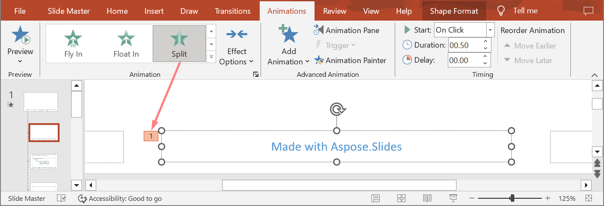

Animations are visual effects that can be applied to texts, images, shapes, or [charts](/slides/nodejs-java/animated-charts/). They give life to presentations or its constituents.

## **Why Use Animations in Presentations?**

Using animations, you can 

* control the flow of information
* emphasize important points
* increase interest or participation among your audience
* make content easier to read or assimilate or process
* draw your readers or viewers attention to important parts in a presentation

PowerPoint provides many options and tools for animations and animation effects across the **entrance**, **exit**, **emphasis**, and **motion paths** categories. 

## **Animations in Aspose.Slides**

* Aspose.Slides provides the classes and types you need to work with animations under the `Aspose.Slides.Animation` namespace,
* Aspose.Slides provides over **150 animation effects** under the [EffectType](https://reference.aspose.com/slides/nodejs-java/aspose.slides/effecttype) enumeration. These effects are essentially the same (or equivalent) effects used in PowerPoint.

## **Apply Animation to TextBox**

Aspose.Slides for Node.js via Java allows you to apply animation to the text in a shape.

1. Create an instance of the [Presentation](https://reference.aspose.com/slides/nodejs-java/aspose.slides/Presentation) class.
2. Obtain a slide reference through its index.
3. Add a `rectangle` [AutoShape](https://reference.aspose.com/slides/nodejs-java/aspose.slides/autoshape).
4. Add text using [AutoShape.addTextFrame](https://reference.aspose.com/slides/nodejs-java/aspose.slides/AutoShape#addTextFrame-java.lang.String-).
5. Get a main sequence of effects.
6. Add an animation effect to [AutoShape](https://reference.aspose.com/slides/nodejs-java/aspose.slides/autoshape).
7. Call the `TextAnimation.setBuildType` method with the value from `BuildType` enumeration.
8. Write the presentation to disk as a PPTX file.

This Javascript code shows you how to apply the `Fade` effect to AutoShape and set the text animation to *By 1st Level Paragraphs* value:

```javascript
// Instantiates a presentation class that represents a presentation file.
var pres = new aspose.slides.Presentation();
try {
    var sld = pres.getSlides().get_Item(0);
    // Adds new AutoShape with text
    var autoShape = sld.getShapes().addAutoShape(aspose.slides.ShapeType.Rectangle, 20, 20, 150, 100);
    var textFrame = autoShape.getTextFrame();
    textFrame.setText("First paragraph \nSecond paragraph \n Third paragraph");
    // Gets the main sequence of the slide.
    var sequence = sld.getTimeline().getMainSequence();
    // Adds Fade animation effect to shape
    var effect = sequence.addEffect(autoShape, aspose.slides.EffectType.Fade, aspose.slides.EffectSubtype.None, aspose.slides.EffectTriggerType.OnClick);
    // Animates shape text by 1st level paragraphs
    effect.getTextAnimation().setBuildType(aspose.slides.BuildType.ByLevelParagraphs1);
    // Save the PPTX file to disk
    pres.save(path + "AnimText_out.pptx", aspose.slides.SaveFormat.Pptx);
} finally {
    if (pres != null) {
        pres.dispose();
    }
}
```

{} 

Besides applying animations to text, you can also apply animations to a single [Paragraph](https://reference.aspose.com/slides/nodejs-java/aspose.slides/paragraph). See [**Animated Text**](/slides/nodejs-java/animated-text/).

{} 

## **Apply Animation to PictureFrame**

1. Create an instance of the [Presentation](https://reference.aspose.com/slides/nodejs-java/aspose.slides/Presentation) class.
2. Get a slide's reference through its index.
3. Add or get a [PictureFrame](https://reference.aspose.com/slides/nodejs-java/aspose.slides/pictureframe) on the slide.
4. Get the main sequence of effects.
5. Add an animation effect to [PictureFrame](https://reference.aspose.com/slides/nodejs-java/aspose.slides/pictureframe).
6. Write the presentation to disk as a PPTX file.

This Javascript code shows you how to apply the `Fly` effect to a picture frame:

```javascript
// Instantiates a presentation class that represents a presentation file.
var pres = new aspose.slides.Presentation();
try {
    // Load Image to be added in presentaiton image collection
    var picture;
    var image = aspose.slides.Images.fromFile("aspose-logo.jpg");
    try {
        picture = pres.getImages().addImage(image);
    } finally {
        if (image != null) {
            image.dispose();
        }
    }
    // Adds picture frame to slide
    var picFrame = pres.getSlides().get_Item(0).getShapes().addPictureFrame(aspose.slides.ShapeType.Rectangle, 50, 50, 100, 100, picture);
    // Gets the main sequence of the slide.
    var sequence = pres.getSlides().get_Item(0).getTimeline().getMainSequence();
    // Adds Fly from Left animation effect to picture frame
    var effect = sequence.addEffect(picFrame, aspose.slides.EffectType.Fly, aspose.slides.EffectSubtype.Left, aspose.slides.EffectTriggerType.OnClick);
    // Save the PPTX file to disk
    pres.save(path + "AnimImage_out.pptx", aspose.slides.SaveFormat.Pptx);
} catch (e) {console.log(e);
} finally {
    if (pres != null) {
        pres.dispose();
    }
}
```

## **Apply Animation to Shape**

1. Create an instance of the [Presentation](https://reference.aspose.com/slides/nodejs-java/aspose.slides/Presentation) class.
2. Get a slide's reference through its index.
3. Add a `rectangle` [AutoShape](https://reference.aspose.com/slides/nodejs-java/aspose.slides/autoshape).
4. Add a `Bevel` [AutoShape](https://reference.aspose.com/slides/nodejs-java/aspose.slides/autoshape) (when this object is clicked, the animation gets played).
5. Create a sequence of effects on the bevel shape.
6. Create a custom `UserPath`.
7. Add commands for moving to the `UserPath`.
8. Write the presentation to disk as a PPTX file.

This Javascript code shows you how to apply the `PathFootball` (path football) effect to a shape:

```javascript
// Instantiate a Presentation class that represents a PPTX file.
var pres = new aspose.slides.Presentation();
try {
    var sld = pres.getSlides().get_Item(0);
    // Creates PathFootball effect for existing shape from scratch.
    var ashp = sld.getShapes().addAutoShape(aspose.slides.ShapeType.Rectangle, 150, 150, 250, 25);
    ashp.addTextFrame("Animated TextBox");
    // Adds the PathFootBall animation effect
    pres.getSlides().get_Item(0).getTimeline().getMainSequence().addEffect(ashp, aspose.slides.EffectType.PathFootball, aspose.slides.EffectSubtype.None, aspose.slides.EffectTriggerType.AfterPrevious);
    // Creates some kind of "button".
    var shapeTrigger = pres.getSlides().get_Item(0).getShapes().addAutoShape(aspose.slides.ShapeType.Bevel, 10, 10, 20, 20);
    // Creates a sequence of effects for this button.
    var seqInter = pres.getSlides().get_Item(0).getTimeline().getInteractiveSequences().add(shapeTrigger);
    // Creates a custom user path. Our object will be moved only after the button is clicked.
    var fxUserPath = seqInter.addEffect(ashp, aspose.slides.EffectType.PathUser, aspose.slides.EffectSubtype.None, aspose.slides.EffectTriggerType.OnClick);
    // Adds commands for moving since created path is empty.
    var motionBhv = fxUserPath.getBehaviors().get_Item(0);
    var pts = java.newArray("com.aspose.slides.Point2DFloat", [java.newInstanceSync("com.aspose.slides.Point2DFloat", 0.076, 0.59)]);
    motionBhv.getPath().add(aspose.slides.MotionCommandPathType.LineTo, pts, aspose.slides.MotionPathPointsType.Auto, true);
    pts[0] = java.newInstanceSync("com.aspose.slides.Point2DFloat", java.newFloat(-0.076), java.newFloat(-0.59));
    motionBhv.getPath().add(aspose.slides.MotionCommandPathType.LineTo, pts, aspose.slides.MotionPathPointsType.Auto, false);
    motionBhv.getPath().add(aspose.slides.MotionCommandPathType.End, null, aspose.slides.MotionPathPointsType.Auto, false);
    // Writes the PPTX file to disk
    pres.save("AnimExample_out.pptx", aspose.slides.SaveFormat.Pptx);
} finally {
    if (pres != null) {
        pres.dispose();
    }
}
```

## **Get the Animation Effects Applied to Shape**

The following examples show you how to use the `getEffectsByShape` method from the [Sequence](https://reference.aspose.com/slides/nodejs-java/aspose.slides/sequence/) class to get all animation effects applied to a shape.

**Example 1: Get animation effects applied to a shape on a normal slide**

Previously, you learned how to add animation effects to shapes in PowerPoint presentations. The following sample code shows you how to get the effects applied to the first shape on the first normal slide in the presentation `AnimExample_out.pptx`.

```javascript
var presentation = new aspose.slides.Presentation("AnimExample_out.pptx");
try {
    var firstSlide = presentation.getSlides().get_Item(0);

    // Gets the main animation sequence of the slide.
    var sequence = firstSlide.getTimeline().getMainSequence();

    // Gets the first shape on the first slide.
    var shape = firstSlide.getShapes().get_Item(0);

    // Gets animation effects applied to the shape.
    var shapeEffects = sequence.getEffectsByShape(shape);

    if (shapeEffects.length > 0) {
        console.log("The shape", shape.getName(), "has", shapeEffects.length, "animation effects.");
    }
} finally {
    if (presentation != null) {
        presentation.dispose();
    }
}
```

**Example 2: Get all animation effects, including those inherited from placeholders**

If a shape on a normal slide has placeholders that are on the layout slide and/or master slide, and animation effects have been added to these placeholders, then all effects of the shape will be played during the slide show, including those inherited from the placeholders.

Let's say we have a PowerPoint presentation file `sample.pptx` with one slide containg only a footer shape with the text "Made with Aspose.Slides" and the **Random Bars** effect is applied to the shape.


Let's also assume that the **Split** effect is applied to the footer placeholder on the **layout** slide.



And finally, the **Fly In** effect is applied to the footer placeholder on the **master** slide.


The following sample code shows you how to use the `getBasePlaceholder` method from the [Shape](https://reference.aspose.com/slides/nodejs-java/aspose.slides/shape/) class to access the shape placeholders and get the animation effects applied to the footer shape, including those inherited from placeholders located on the layout and master slides.

```js
var presentation = new aspose.slides.Presentation("sample.pptx");

var slide = presentation.getSlides().get_Item(0);

// Get animation effects of the shape on the normal slide.
var shape = slide.getShapes().get_Item(0);
var shapeEffects = slide.getTimeline().getMainSequence().getEffectsByShape(shape);

// Get animation effects of the placeholder on the layout slide.
var layoutShape = shape.getBasePlaceholder();
var layoutShapeEffects = slide.getLayoutSlide().getTimeline().getMainSequence().getEffectsByShape(layoutShape);

// Get animation effects of the placeholder on the master slide.
var masterShape = layoutShape.getBasePlaceholder();
var masterShapeEffects = slide.getLayoutSlide().getMasterSlide().getTimeline().getMainSequence().getEffectsByShape(masterShape);

console.log("Main sequence of shape effects:");
printEffects(masterShapeEffects);
printEffects(layoutShapeEffects);
printEffects(shapeEffects);

presentation.dispose();
```
```js
function printEffects(effects) {
    for (const effect of effects) {
        console.log("Type:", effect.getType() + ", subtype:", effect.getSubtype());
    }
}
```

Output:
```text
Main sequence of shape effects:
Type: 47, subtype: 2              // Fly, Bottom
Type: 134, subtype: 45            // Split, VerticalIn
Type: 126, subtype: 22            // RandomBars, Horizontal
```

## **Change Animation Effect Timing Properties**

Aspose.Slides for Node.js via Java allows you to change the Timing properties of an animation effect.

This is the Animation Timing pane in Microsoft PowerPoint:


These are the correspondences between PowerPoint Timing and [Effect.Timing](https://reference.aspose.com/slides/nodejs-java/aspose.slides/Effect#getTiming--) properties:

- PowerPoint Timing **Start** drop-down list matches the [Effect.Timing.TriggerType](https://reference.aspose.com/slides/nodejs-java/aspose.slides/Timing#getTriggerType--) property.
- PowerPoint Timing **Duration** matches the [Effect.Timing.Duration](https://reference.aspose.com/slides/nodejs-java/aspose.slides/Timing#getDuration--) property. The duration of an animation (in seconds) is the total time it takes the animation to complete one cycle.
- PowerPoint Timing **Delay** matches the [Effect.Timing.TriggerDelayTime](https://reference.aspose.com/slides/nodejs-java/aspose.slides/Timing#getTriggerDelayTime--) property.

This is how you change the Effect Timing properties:

1. [Apply](#apply-animation-to-shape) or get the animation effect.
2. Set new values for the [Effect.Timing](https://reference.aspose.com/slides/nodejs-java/aspose.slides/Effect#getTiming--) properties you need.
3. Save the modified PPTX file.

This Javascript code demonstrates the operation:

```javascript
// Instantiates a presentation class that represents a presentation file.
var pres = new aspose.slides.Presentation("AnimExample_out.pptx");
try {
    // Gets the main sequence of the slide.
    var sequence = pres.getSlides().get_Item(0).getTimeline().getMainSequence();
    // Gets the first effect of main sequence.
    var effect = sequence.get_Item(0);
    // Changes effect TriggerType to start on click
    effect.getTiming().setTriggerType(aspose.slides.EffectTriggerType.OnClick);
    // Changes effect Duration
    effect.getTiming().setDuration(3.0);
    // Changes effect TriggerDelayTime
    effect.getTiming().setTriggerDelayTime(0.5);
    // Saves the PPTX file to disk
    pres.save("AnimExample_changed.pptx", aspose.slides.SaveFormat.Pptx);
} finally {
    if (pres != null) {
        pres.dispose();
    }
}
```

## **Animation Effect Sound**

Aspose.Slides provides these properties to allow you to work with sounds in animation effects: 

- [setSound(IAudio value)](https://reference.aspose.com/slides/nodejs-java/aspose.slides/effect/#setSound-aspose.slides.IAudio-)
- [setStopPreviousSound(boolean value)](https://reference.aspose.com/slides/nodejs-java/aspose.slides/effect/#setStopPreviousSound-boolean-)

### **Add Animation Effect Sound**

This Javascript code shows you how to add an animation effect sound and stop it when the next effect starts:

```javascript
var pres = new aspose.slides.Presentation("AnimExample_out.pptx");
try {
    // Adds audio to presentation audio collection
    var effectSound = pres.getAudios().addAudio(java.newInstanceSync("java.io.FileInputStream", java.newInstanceSync("java.io.File", "sampleaudio.wav")));
    var firstSlide = pres.getSlides().get_Item(0);
    // Gets the main sequence of the slide.
    var sequence = firstSlide.getTimeline().getMainSequence();
    // Gets the first effect of the main sequence
    var firstEffect = sequence.get_Item(0);
    // Сhecks the effect for "No Sound"
    if ((!firstEffect.getStopPreviousSound()) && (firstEffect.getSound() == null)) {
        // Adds sound for the first effect
        firstEffect.setSound(effectSound);
    }
    // Gets the first interactive sequence of the slide.
    var interactiveSequence = firstSlide.getTimeline().getInteractiveSequences().get_Item(0);
    // Sets the effect "Stop previous sound" flag
    interactiveSequence.get_Item(0).setStopPreviousSound(true);
    // Writes the PPTX file to disk
    pres.save("AnimExample_Sound_out.pptx", aspose.slides.SaveFormat.Pptx);
} finally {
    if (pres != null) {
        pres.dispose();
    }
}
```

### **Extract Animation Effect Sound**

1. Create an instance of the [Presentation](https://reference.aspose.com/slides/nodejs-java/aspose.slides/presentation/) class.
2. Get a slide’s reference through its index. 
3. Get the main sequence of effects. 
4. Extract the [setSound(IAudio value)](https://reference.aspose.com/slides/nodejs-java/aspose.slides/effect/#setSound-aspose.slides.IAudio-) embedded to each animation effect.

This Javascript code shows you how to extract the sound embedded in an animation effect:

```javascript
// Instantiates a presentation class that represents a presentation file.
var presentation = new aspose.slides.Presentation("EffectSound.pptx");
try {
    var slide = presentation.getSlides().get_Item(0);
    // Gets the main sequence of the slide.
    var sequence = slide.getTimeline().getMainSequence();
    for (var i = 0; i < sequence.getCount(); i++) {
        var effect = sequence.get_Item(i);
        if (effect.getSound() == null) {
            continue;
        }
        // Extracts the effect sound in byte array
        var audio = effect.getSound().getBinaryData();
    }
} finally {
    if (presentation != null) {
        presentation.dispose();
    }
}
```

## **After Animation**

Aspose.Slides for Node.js via Java allows you to change the After animation property of an animation effect.

This is the Animation Effect pane and extended menu in Microsoft PowerPoint:


PowerPoint Effect **After animation** drop-down list matches these properties: 

- [setAfterAnimationType(int value)](https://reference.aspose.com/slides/nodejs-java/aspose.slides/effect/#setAfterAnimationType-int-) method which describes the After animation type;
  * PowerPoint **More Colors** matches the [AfterAnimationType.Color](https://reference.aspose.com/slides/nodejs-java/aspose.slides/afteranimationtype/#Color) type;
  * PowerPoint **Don't Dim** list item matches the [AfterAnimationType.DoNotDim](https://reference.aspose.com/slides/nodejs-java/aspose.slides/afteranimationtype/#DoNotDim) type (default after animation type);
  * PowerPoint **Hide After Animation** item matches the [AfterAnimationType.HideAfterAnimation](https://reference.aspose.com/slides/nodejs-java/aspose.slides/afteranimationtype/#HideAfterAnimation) type;
  * PowerPoint **Hide on Next Mouse Click** item matches the [AfterAnimationType.HideOnNextMouseClick](https://reference.aspose.com/slides/nodejs-java/aspose.slides/afteranimationtype/#HideOnNextMouseClick) type;
- [setAfterAnimationColor(IColorFormat value)](https://reference.aspose.com/slides/nodejs-java/aspose.slides/effect/#setAfterAnimationColor-aspose.slides.IColorFormat-) method which defines an after animation color format. This method works in conjunction with the [AfterAnimationType.Color](https://reference.aspose.com/slides/nodejs-java/aspose.slides/afteranimationtype/#Color) type. If you change the type to another, the after animation color will be cleared.

This Javascript code shows you how to change an after animation effect:

```javascript
// Instantiates a presentation class that represents a presentation file
var pres = new aspose.slides.Presentation("AnimImage_out.pptx");
try {
    var firstSlide = pres.getSlides().get_Item(0);
    // Gets the first effect of the main sequence
    var firstEffect = firstSlide.getTimeline().getMainSequence().get_Item(0);
    // Changes the after animation type to Color
    firstEffect.setAfterAnimationType(aspose.slides.AfterAnimationType.Color);
    // Sets the after animation dim color
    firstEffect.getAfterAnimationColor().setColor(java.getStaticFieldValue("java.awt.Color", "BLUE"));
    // Writes the PPTX file to disk
    pres.save("AnimImage_AfterAnimation.pptx", aspose.slides.SaveFormat.Pptx);
} finally {
    if (pres != null) {
        pres.dispose();
    }
}
```

## **Animate Text**

Aspose.Slides provides these properties to allow you to work with an animation effect's *Animate text* block:

- [setAnimateTextType(int value)](https://reference.aspose.com/slides/nodejs-java/aspose.slides/effect/#setAnimateTextType-int-) which describes an animate text type of the effect. The shape text can be animated:
  - All at once ([AnimateTextType.AllAtOnce](https://reference.aspose.com/slides/nodejs-java/aspose.slides/animatetexttype/#AllAtOnce) type)
  - By word ([AnimateTextType.ByWord](https://reference.aspose.com/slides/nodejs-java/aspose.slides/animatetexttype/#ByWord) type)
  - By letter ([AnimateTextType.ByLetter](https://reference.aspose.com/slides/nodejs-java/aspose.slides/animatetexttype/#ByLetter) type)
- [setDelayBetweenTextParts(float value)](https://reference.aspose.com/slides/nodejs-java/aspose.slides/effect/#setDelayBetweenTextParts-float-) sets a delay between the animated text parts (words or letters). A positive value specifies the percentage of effect duration. A negative value specifies the delay in seconds.

This is how you can change the Effect Animate text properties:

1. [Apply](#apply-animation-to-shape) or get the animation effect.
2. Set the [setBuildType(int value)](https://reference.aspose.com/slides/nodejs-java/aspose.slides/textanimation/#setBuildType-int-) method to [BuildType.AsOneObject](https://reference.aspose.com/slides/nodejs-java/aspose.slides/buildtype/#AsOneObject) value to turn off the *By Paragraphs* animation mode.
3. Set new values for the [setAnimateTextType(int value)](https://reference.aspose.com/slides/nodejs-java/aspose.slides/effect/#setAnimateTextType-int-) and [setDelayBetweenTextParts(float value)](https://reference.aspose.com/slides/nodejs-java/aspose.slides/effect/#setDelayBetweenTextParts-float-) properties.
4. Save the modified PPTX file.

This Javascript code demonstrates the operation:

```javascript
// Instantiates a presentation class that represents a presentation file.
var pres = new aspose.slides.Presentation("AnimTextBox_out.pptx");
try {
    var firstSlide = pres.getSlides().get_Item(0);
    // Gets the first effect of the main sequence
    var firstEffect = firstSlide.getTimeline().getMainSequence().get_Item(0);
    // Changes the effect Text animation type to "As One Object"
    firstEffect.getTextAnimation().setBuildType(aspose.slides.BuildType.AsOneObject);
    // Changes the effect Animate text type to "By word"
    firstEffect.setAnimateTextType(aspose.slides.AnimateTextType.ByWord);
    // Sets the delay between words to 20% of effect duration
    firstEffect.setDelayBetweenTextParts(20.0);
    // Writes the PPTX file to disk
    pres.save("AnimTextBox_AnimateText.pptx", aspose.slides.SaveFormat.Pptx);
} finally {
    if (pres != null) {
        pres.dispose();
    }
}
```

## **FAQ**

**How can I ensure animations are preserved when publishing the presentation to the web?**

[Export to HTML5](/slides/nodejs-java/export-to-html5/) and enable the [options](https://reference.aspose.com/slides/nodejs-java/aspose.slides/html5options/) responsible for [shape](https://reference.aspose.com/slides/nodejs-java/aspose.slides/html5options/setanimateshapes/) and [transition](https://reference.aspose.com/slides/nodejs-java/aspose.slides/html5options/setanimatetransitions/) animations. Plain HTML does not play slide animations, whereas HTML5 does.

**How does changing the z-order (layer order) of shapes affect animation?**

Animation and drawing order are independent: an effect controls the timing and type of appearing/disappearing, while [z-order](https://reference.aspose.com/slides/nodejs-java/aspose.slides/shape/getzorderposition/) determines what covers what. The visible result is defined by their combination. (This is the general PowerPoint behavior; the Aspose.Slides effects-and-shapes model follows the same logic.)

**Are there limitations when converting animations to video for certain effects?**

In general, [animations are supported](/slides/nodejs-java/convert-powerpoint-to-video/), but rare cases or specific effects may be rendered differently. It is recommended to test with the effects you use and with the library version.
