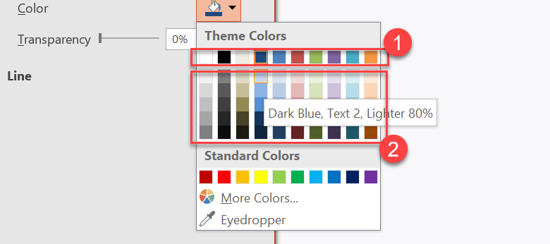
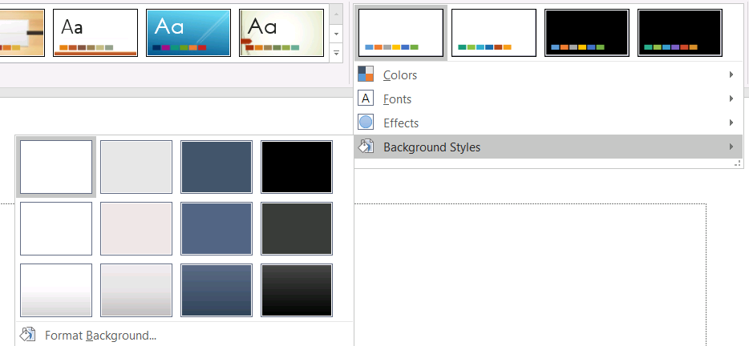

A presentation theme defines the properties of design elements. When you select a presentation theme, you are essentially choosing a specific set of visual elements and their properties.

In PowerPoint, a theme comprises colors, [fonts](/slides/nodejs-java/powerpoint-fonts/), [background styles](/slides/nodejs-java/presentation-background/), and effects.


## **Change Theme Color**

A PowerPoint theme uses a specific set of colors for different elements on a slide. If you don't like the colors, you change them colors by applying new colors for the theme. To allow you select a new theme color, Aspose.Slides provides values under the [SchemeColor](https://reference.aspose.com/slides/nodejs-java/aspose.slides/SchemeColor) enumeration.

This JavaScript code shows you how to change the accent color for a theme:

```javascript
var pres = new aspose.slides.Presentation();
try {
    var shape = pres.getSlides().get_Item(0).getShapes().addAutoShape(aspose.slides.ShapeType.Rectangle, 10, 10, 100, 100);
    shape.getFillFormat().setFillType(java.newByte(aspose.slides.FillType.Solid));
    shape.getFillFormat().getSolidFillColor().setSchemeColor(aspose.slides.SchemeColor.Accent4);
} finally {
    if (pres != null) {
        pres.dispose();
    }
}
```

You can determine the resulting color's effective value this way:

```javascript
var fillEffective = shape.getFillFormat().getEffective();
var effectiveColor = fillEffective.getSolidFillColor();
console.log(java.callStaticMethodSync("java.lang.String", "format", "Color [A=%d, R=%d, G=%d, B=%d]", effectiveColor.getAlpha(), effectiveColor.getRed(), effectiveColor.getGreen(), effectiveColor.getBlue()));
```

To further demonstrate the color change operation, we create another element and assign the accent color (from the initial operation) to it. Then we change the color in the theme:

```javascript
var otherShape = pres.getSlides().get_Item(0).getShapes().addAutoShape(aspose.slides.ShapeType.Rectangle, 10, 120, 100, 100);
otherShape.getFillFormat().setFillType(java.newByte(aspose.slides.FillType.Solid));
otherShape.getFillFormat().getSolidFillColor().setSchemeColor(aspose.slides.SchemeColor.Accent4);
pres.getMasterTheme().getColorScheme().getAccent4().setColor(java.getStaticFieldValue("java.awt.Color", "RED"));
```

The new color is applied automatically on both elements.

### **Set Theme Color from Additional Palette**

When you apply luminance transformations to the main theme color(1), colors from the additional palette(2) are formed. You can then set and get those theme colors. 



**1** - Main theme colors

**2** - Colors from the additional palette.

This JavaScript code demonstrates an operation where additional palette colors are obtained from the main theme color and then used in shapes:

```javascript
var presentation = new aspose.slides.Presentation();
try {
    var slide = presentation.getSlides().get_Item(0);
    // Accent 4
    var shape1 = slide.getShapes().addAutoShape(aspose.slides.ShapeType.Rectangle, 10, 10, 50, 50);
    shape1.getFillFormat().setFillType(java.newByte(aspose.slides.FillType.Solid));
    shape1.getFillFormat().getSolidFillColor().setSchemeColor(aspose.slides.SchemeColor.Accent4);
    // Accent 4, Lighter 80%
    var shape2 = slide.getShapes().addAutoShape(aspose.slides.ShapeType.Rectangle, 10, 70, 50, 50);
    shape2.getFillFormat().setFillType(java.newByte(aspose.slides.FillType.Solid));
    shape2.getFillFormat().getSolidFillColor().setSchemeColor(aspose.slides.SchemeColor.Accent4);
    shape2.getFillFormat().getSolidFillColor().getColorTransform().add(aspose.slides.ColorTransformOperation.MultiplyLuminance, 0.2);
    shape2.getFillFormat().getSolidFillColor().getColorTransform().add(aspose.slides.ColorTransformOperation.AddLuminance, 0.8);
    // Accent 4, Lighter 60%
    var shape3 = slide.getShapes().addAutoShape(aspose.slides.ShapeType.Rectangle, 10, 130, 50, 50);
    shape3.getFillFormat().setFillType(java.newByte(aspose.slides.FillType.Solid));
    shape3.getFillFormat().getSolidFillColor().setSchemeColor(aspose.slides.SchemeColor.Accent4);
    shape3.getFillFormat().getSolidFillColor().getColorTransform().add(aspose.slides.ColorTransformOperation.MultiplyLuminance, 0.4);
    shape3.getFillFormat().getSolidFillColor().getColorTransform().add(aspose.slides.ColorTransformOperation.AddLuminance, 0.6);
    // Accent 4, Lighter 40%
    var shape4 = slide.getShapes().addAutoShape(aspose.slides.ShapeType.Rectangle, 10, 190, 50, 50);
    shape4.getFillFormat().setFillType(java.newByte(aspose.slides.FillType.Solid));
    shape4.getFillFormat().getSolidFillColor().setSchemeColor(aspose.slides.SchemeColor.Accent4);
    shape4.getFillFormat().getSolidFillColor().getColorTransform().add(aspose.slides.ColorTransformOperation.MultiplyLuminance, 0.6);
    shape4.getFillFormat().getSolidFillColor().getColorTransform().add(aspose.slides.ColorTransformOperation.AddLuminance, 0.4);
    // Accent 4, Darker 25%
    var shape5 = slide.getShapes().addAutoShape(aspose.slides.ShapeType.Rectangle, 10, 250, 50, 50);
    shape5.getFillFormat().setFillType(java.newByte(aspose.slides.FillType.Solid));
    shape5.getFillFormat().getSolidFillColor().setSchemeColor(aspose.slides.SchemeColor.Accent4);
    shape5.getFillFormat().getSolidFillColor().getColorTransform().add(aspose.slides.ColorTransformOperation.MultiplyLuminance, 0.75);
    // Accent 4, Darker 50%
    var shape6 = slide.getShapes().addAutoShape(aspose.slides.ShapeType.Rectangle, 10, 310, 50, 50);
    shape6.getFillFormat().setFillType(java.newByte(aspose.slides.FillType.Solid));
    shape6.getFillFormat().getSolidFillColor().setSchemeColor(aspose.slides.SchemeColor.Accent4);
    shape6.getFillFormat().getSolidFillColor().getColorTransform().add(aspose.slides.ColorTransformOperation.MultiplyLuminance, 0.5);
    presentation.save(path + "example_accent4.pptx", aspose.slides.SaveFormat.Pptx);
} finally {
    if (presentation != null) {
        presentation.dispose();
    }
}
```

## **Change Theme Font**

To allow you select fonts for themes and other purposes, Aspose.Slides uses these special identifiers (similar to those used in PowerPoint):

* **+mn-lt** - Body Font Latin (Minor Latin Font)
* **+mj-lt** -Heading Font Latin (Major Latin Font)
* **+mn-ea** - Body Font East Asian (Minor East Asian Font)
* **+mj-ea** - Body Font East Asian (Major East Asian Font)

This JavaScript code shows you how to assign the Latin font to a theme element:

```javascript
var shape = pres.getSlides().get_Item(0).getShapes().addAutoShape(aspose.slides.ShapeType.Rectangle, 10, 10, 100, 100);
var paragraph = new aspose.slides.Paragraph();
var portion = new aspose.slides.Portion("Theme text format");
paragraph.getPortions().add(portion);
shape.getTextFrame().getParagraphs().add(paragraph);
portion.getPortionFormat().setLatinFont(new aspose.slides.FontData("+mn-lt"));
```

This JavaScript code shows you how to change the presentation theme font:

```javascript
pres.getMasterTheme().getFontScheme().getMinor().setLatinFont(new aspose.slides.FontData("Arial"));
```

The font in all text boxes will be updated.

{} 

You may want to see [PowerPoint fonts](/slides/nodejs-java/powerpoint-fonts/).

{}

## **Change Theme Background Style**

By default, the PowerPoint app provides 12 predefined backgrounds but only 3 from those 12 backgrounds are saved in a typical presentation. 



For example, after you save a presentation in the PowerPoint app, you can run this JavaScript code to find out the number of predefined backgrounds in the presentation:

```javascript
var pres = new aspose.slides.Presentation("pres.pptx");
try {
    var numberOfBackgroundFills = pres.getMasterTheme().getFormatScheme().getBackgroundFillStyles().size();
    console.log("Number of background fill styles for theme is " + numberOfBackgroundFills);
} finally {
    if (pres != null) {
        pres.dispose();
    }
}
```

{} 

Using the [BackgroundFillStyles](https://reference.aspose.com/slides/nodejs-java/aspose.slides/FormatScheme#getBackgroundFillStyles--) property from the [FormatScheme](https://reference.aspose.com/slides/nodejs-java/aspose.slides/FormatScheme) class, you can add or access the background style in a PowerPoint theme.

{} 

This JavaScript code shows you how to set the background for a presentation:

```javascript
pres.getMasters().get_Item(0).getBackground().setStyleIndex(2);
```

**Index guide**: 0 is used for no fill. The index starts from 1.

{} 

You may want to see [PowerPoint Background](/slides/nodejs-java/presentation-background/).

{}

## **Change Theme Effect**

A PowerPoint theme usually contains 3 values for each style array. Those arrays are combined into these 3 effects: subtle, moderate, and intense. For example, this is the outcome when the effects are applied to a specific shape:


Using 3 properties ([FillStyles](https://reference.aspose.com/slides/nodejs-java/aspose.slides/FormatScheme#getFillStyles--), [LineStyles](https://reference.aspose.com/slides/nodejs-java/aspose.slides/FormatScheme#getLineStyles--), [EffectStyles](https://reference.aspose.com/slides/nodejs-java/aspose.slides/FormatScheme#getEffectStyles--)) from the  [FormatScheme](https://reference.aspose.com/slides/nodejs-java/aspose.slides/FormatScheme) class you can change the elements in a theme (even more flexibly than the options in PowerPoint).

This JavaScript code shows you how to change a theme effect by altering parts of elements:

```javascript
var pres = new aspose.slides.Presentation("Subtle_Moderate_Intense.pptx");
try {
    pres.getMasterTheme().getFormatScheme().getLineStyles().get_Item(0).getFillFormat().getSolidFillColor().setColor(java.getStaticFieldValue("java.awt.Color", "RED"));
    pres.getMasterTheme().getFormatScheme().getFillStyles().get_Item(2).setFillType(java.newByte(aspose.slides.FillType.Solid));
    pres.getMasterTheme().getFormatScheme().getFillStyles().get_Item(2).getSolidFillColor().setColor(java.getStaticFieldValue("java.awt.Color", "GREEN"));
    pres.getMasterTheme().getFormatScheme().getEffectStyles().get_Item(2).getEffectFormat().getOuterShadowEffect().setDistance(10.0);
    pres.save("Design_04_Subtle_Moderate_Intense-out.pptx", aspose.slides.SaveFormat.Pptx);
} finally {
    if (pres != null) {
        pres.dispose();
    }
}
```

The resulting changes in fill color, fill type, shadow effect, etc:


## **FAQ**

**Can I apply a theme to a single slide without changing the master?**

Yes. Aspose.Slides support slide-level theme overrides, so you can apply a local theme to just that slide while keeping the master theme intact (via the [SlideThemeManager](https://reference.aspose.com/slides/nodejs-java/aspose.slides/slidethememanager/)).

**What’s the safest way to carry a theme from one presentation to another?**

[Clone slides](/slides/nodejs-java/clone-slides/) together with their master into the target presentation. This preserves the original master, layouts, and the associated theme so the appearance remains consistent.

**How can I see the "effective" values after all inheritance and overrides?**

Use the API’s ["effective" views](/slides/nodejs-java/shape-effective-properties/) for theme/color/font/effect. These return the resolved, final properties after applying the master plus any local overrides.
