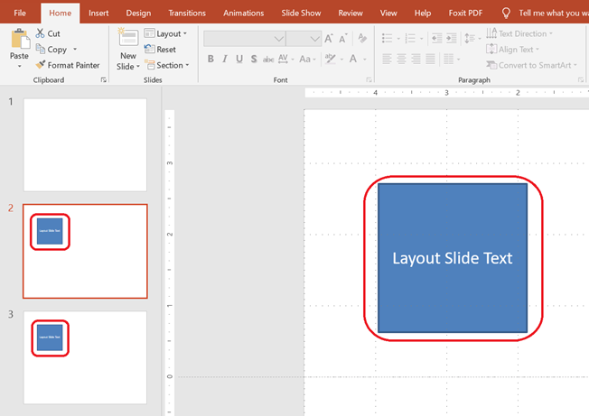

This article demonstrates how to work with **Layout Slides** in Aspose.Slides for Node.js via Java. A layout slide defines the design and formatting inherited by normal slides. You can add, access, clone, and remove layout slides, as well as clean up unused ones to reduce presentation size.

## **Add a Layout Slide**

You can create a custom layout slide to define reusable formatting.

```js
function addLayoutSlide() {
    let presentation = new aspose.slides.Presentation();
    try {
        let masterSlide = presentation.getMasters().get_Item(0);

        // Create a layout slide with a blank layout type and a custom name.
        let layoutType = java.newByte(aspose.slides.SlideLayoutType.Blank);
        let layoutSlide = presentation.getLayoutSlides().add(masterSlide, layoutType, "Main layout");

        presentation.save("layout_slide.pptx", aspose.slides.SaveFormat.Pptx);
    } finally {
        presentation.dispose();
    }
}
```

> 💡 **Note 1:** Layout slides act as templates for individual slides. You can define common elements once and reuse them across many slides.

> 💡 **Note 2:** When you add shapes or text to a layout slide, all slides based on that layout will display this shared content automatically.
> The screenshot below shows two slides, each inheriting a text box from the same layout slide.



## **Access a Layout Slide**

Layout slides can be accessed by index or by layout type (e.g., `Blank`, `Title`, `SectionHeader`, etc.).

```js
function accessLayoutSlide() {
    let presentation = new aspose.slides.Presentation("layout_slide.pptx");
    try {
        // Access a layout slide by index.
        let firstLayoutSlide = presentation.getLayoutSlides().get_Item(0);

        // Access a layout slide by type.
        let layoutType = java.newByte(aspose.slides.SlideLayoutType.Blank);
        let layoutSlide = presentation.getLayoutSlides().getByType(layoutType);
    } finally {
        presentation.dispose();
    }
}
```

## **Remove a Layout Slide**

You can remove a specific layout slide if it's no longer needed.

```js
function removeLayoutSlide() {
    let presentation = new aspose.slides.Presentation("layout_slide.pptx");
    try {
        // Get a layout slide by type and remove it.
        let layoutType = java.newByte(aspose.slides.SlideLayoutType.Custom);
        let layoutSlide = presentation.getLayoutSlides().getByType(layoutType);
        presentation.getLayoutSlides().remove(layoutSlide);

        presentation.save("layout_slide_removed.pptx", aspose.slides.SaveFormat.Pptx);
    } finally {
        presentation.dispose();
    }
}
```

## **Remove Unused Layout Slides**

To reduce the presentation size, you may want to remove layout slides that are not used by any normal slides.

```js
function removeUnusedLayoutSlides() {
    let presentation = new aspose.slides.Presentation();
    try {
        // Automatically removes all layout slides not referenced by any slide.
        presentation.getLayoutSlides().removeUnused();

        presentation.save("unused_layout_slides_removed.pptx", aspose.slides.SaveFormat.Pptx);
    } finally {
        presentation.dispose();
    }
}
```

## **Clone a Layout Slide**

You can duplicate a layout slide using the `addClone` method.

```js
function cloneLayoutSlide() {
    let presentation = new aspose.slides.Presentation("layout_slide.pptx");
    try {
        // Get an existing layout slide by type.
        let layoutType = java.newByte(aspose.slides.SlideLayoutType.Title);
        let layoutSlide = presentation.getLayoutSlides().getByType(layoutType);

        // Clone the layout slide to the end of the layout slide collection.
        let clonedLayoutSlide = presentation.getLayoutSlides().addClone(layoutSlide);

        presentation.save("layout_slide_cloned.pptx", aspose.slides.SaveFormat.Pptx);
    } finally {
        presentation.dispose();
    }
}
```

> ✅ **Summary:** Layout slides are powerful tools for managing consistent formatting across slides. Aspose.Slides allows full control over creating, managing, and optimizing layout slides.
