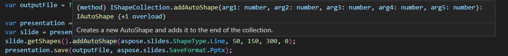

We're thrilled to announce **native TypeScript support** for [Aspose.Slides for Node.js via Java](https://www.npmjs.com/package/aspose.slides.via.java)! This major enhancement brings modern development workflows to PowerPoint automation in Node.js.

## **Key Benefits**

- **Full API discoverability**: Get intelligent code completion for all methods
- **Type safety**: Catch errors at compile time
- **Zero-config**: Works out of the box with included `.d.ts` definitions
- **Java parity**: All public methods from the Java package are properly typed

## **Technical Implementation**

The type definitions are automatically loaded via `package.json`:

```json
"types": "lib/aspose.slides.d.ts"
```

## **Developer Experience**

### **Before (Plain JavaScript)**
```javascript
import * as AsposeSlides from 'aspose.slides.via.java';

// No autocompletion or type checking
const pres = new AsposeSlides.??? // Flying blind
```

### **After (TypeScript)**
```typescript
import * as AsposeSlides from 'aspose.slides.via.java';

const pres = new AsposeSlides.Presentation(); // Full autocompletion
const slide = pres.getSlides().get_Item(0); // Proper method signatures
```

  


## **Getting Started**

1. Update to the latest version:
```bash
npm install aspose.slides.via.java@latest
```

2. If you're using TypeScript, no additional configuration is needed!
