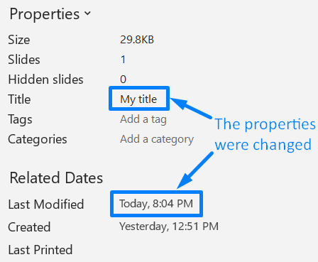

Aspose.Slides for PHP via Java allows you to examine a presentation to find out its properties and understand its behavior.

{} 

The [PresentationInfo](https://reference.aspose.com/slides/php-java/aspose.slides/PresentationInfo) and [DocumentProperties](https://reference.aspose.com/slides/php-java/aspose.slides/documentproperties/) classes contain the properties and methods used in operations here.

{} 

## **Check a Presentation Format**

Before working on a presentation, you may want to find out what format (PPT, PPTX, ODP, and others) the presentation is in at the moment.

You can check a presentation's format without loading the presentation. See this PHP code:

```php
  $info = PresentationFactory->getInstance()->getPresentationInfo("pres.pptx");
  echo($info->getLoadFormat());// PPTX

  $info2 = PresentationFactory->getInstance()->getPresentationInfo("pres.ppt");
  echo($info2->getLoadFormat());// PPT

  $info3 = PresentationFactory->getInstance()->getPresentationInfo("pres.odp");
  echo($info3->getLoadFormat());// ODP


```

## **Get Presentation Properties**

This PHP code shows you how to get presentation properties (information about the presentation):

```php
  $info = PresentationFactory->getInstance()->getPresentationInfo("pres.pptx");
  $props = $info->readDocumentProperties();
  echo($props->getCreatedTime());
  echo($props->getSubject());
  echo($props->getTitle());
  # ..

```

You may want to see the [properties under the DocumentProperties](https://reference.aspose.com/slides/php-java/aspose.slides/documentproperties/#DocumentProperties--) class.

## **Update Presentation Properties**

Aspose.Slides provides the [PresentationInfo.updateDocumentProperties](https://reference.aspose.com/slides/php-java/aspose.slides/PresentationInfo#updateDocumentProperties-com.aspose.slides.IDocumentProperties-) method that allows you to make changes to presentation properties.

Let's say we have a PowerPoint presentation with the document properties shown below.


This code example shows you how to edit some presentation properties:

```php
$fileName = "sample.pptx";

$info = PresentationFactory::getInstance()->getPresentationInfo($fileName);

$properties = $info->readDocumentProperties();
$properties->setTitle("My title");
$properties->setLastSavedTime(new Java("java.util.Date"));

$info->updateDocumentProperties($properties);
$info->writeBindedPresentation($fileName);
```

The results of changing the document properties are shown below.



## **Useful Links**

To get more information about a presentation and its security attributes, you may find these links useful:

- [Checking whether a Presentation is Encrypted](https://docs.aspose.com/slides/php-java/password-protected-presentation/#checking-whether-a-presentation-is-encrypted)
- [Checking whether a Presentation is Write Protected (read-only)](https://docs.aspose.com/slides/php-java/password-protected-presentation/#checking-whether-a-presentation-is-write-protected)
- [Checking whether a Presentation is Password Protected Before Loading it](https://docs.aspose.com/slides/php-java/password-protected-presentation/#checking-whether-a-presentation-is-password-protected-before-loading-it)
- [Confirming the Password Used to Protect a Presentation](https://docs.aspose.com/slides/php-java/password-protected-presentation/#validating-or-confirming-that-a-specific-password-has-been-used-to-protect-a-presentation).
