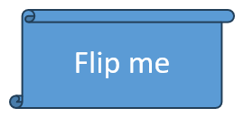

## **Find a Shape on a Slide**
This topic will describe a simple technique to make it easier for developers to find a specific shape on a slide without using its internal Id. It is important to know that PowerPoint Presentation files do not have any way to identify shapes on a slide except an internal unique Id. It seems to be difficult for developers to find a shape using its internal unique Id. All shapes added to the slides have some Alt Text. We suggest developers to use alternative text for finding a specific shape. You can use MS PowerPoint to define the alternative text for objects which you are planning to change in the future.

After setting the alternative text of any desired shape, you can then open that presentation using Aspose.Slides for PHP via Java and iterate through all shapes added to a slide. During each iteration, you can check the alternative text of the shape and the shape with the matching alternative text would be the shape required by you. To demonstrate this technique in a better way, we have created a method, [findShape](https://reference.aspose.com/slides/php-java/aspose.slides/SlideUtil#findShape-com.aspose.slides.IBaseSlide-java.lang.String-) that does the trick to find a specific shape in a slide and then simply returns that shape.

```php
  # Instantiate a Presentation class that represents the presentation file
  $pres = new Presentation("FindingShapeInSlide.pptx");
  try {
    $slide = $pres->getSlides()->get_Item(0);
    # Alternative text of the shape to be found
    $shape = findShape($slide, "Shape1");
    if (!java_is_null($shape)) {
      echo("Shape Name: " . $shape->getName());
    }
  } finally {
    if (!java_is_null($pres)) {
      $pres->dispose();
    }
  }
```
```php

```

## **Clone a Shape**
To clone a shape to a slide using Aspose.Slides for PHP via Java:

1. Create an instance of the [Presentation](https://reference.aspose.com/slides/php-java/aspose.slides/Presentation) class.
1. Obtain the reference of a slide by using its index.
1. Access the source slide shape collection.
1. Add new slide to the presentation.
1. Clone shapes from the source slide shape collection to the new slide.
1. Save the modified presentation as a PPTX file.

The example below adds a group shape to a slide.

```php
  # Instantiate Presentation class
  $pres = new Presentation("Source Frame.pptx");
  try {
    $sourceShapes = $pres->getSlides()->get_Item(0)->getShapes();
    $blankLayout = $pres->getMasters()->get_Item(0)->getLayoutSlides()->getByType(SlideLayoutType::Blank);
    $destSlide = $pres->getSlides()->addEmptySlide($blankLayout);
    $destShapes = $destSlide->getShapes();
    $destShapes->addClone($sourceShapes->get_Item(1), 50, 150 + $sourceShapes->get_Item(0)->getHeight());
    $destShapes->addClone($sourceShapes->get_Item(2));
    $destShapes->insertClone(0, $sourceShapes->get_Item(0), 50, 150);
    # Write the PPTX file to disk
    $pres->save("CloneShape_out.pptx", SaveFormat::Pptx);
  } finally {
    if (!java_is_null($pres)) {
      $pres->dispose();
    }
  }
```

## **Remove a Shape**
Aspose.Slides for PHP via Java allows developers to remove any shape. To remove the shape from any slide, please follow the steps below:

1. Create an instance of [Presentation](https://reference.aspose.com/slides/php-java/aspose.slides/Presentation) class.
1. Access the first slide.
1. Find the shape with specific AlternativeText.
1. Remove the shape.
1. Save file to disk.

```php
  # Create Presentation object
  $pres = new Presentation();
  try {
    # Get the first slide
    $sld = $pres->getSlides()->get_Item(0);
    # Add autoshape of rectangle type
    $sld->getShapes()->addAutoShape(ShapeType::Rectangle, 50, 40, 150, 50);
    $sld->getShapes()->addAutoShape(ShapeType::Moon, 160, 40, 150, 50);
    $altText = "User Defined";
    $iCount = $sld->getShapes()->size();
    for($i = 0; $i < java_values($iCount) ; $i++) {
      $ashp = $sld->getShapes()->get_Item(0);
      if ($alttext->equals($ashp->getAlternativeText())) {
        $sld->getShapes()->remove($ashp);
      }
    }
    # Save presentation to disk
    $pres->save("RemoveShape_out.pptx", SaveFormat::Pptx);
  } finally {
    if (!java_is_null($pres)) {
      $pres->dispose();
    }
  }
```

## **Hide a Shape**
Aspose.Slides for PHP via Java allows developers to hide any shape. To hide the shape from any slide, please follow the steps below:

1. Create an instance of [Presentation](https://reference.aspose.com/slides/php-java/aspose.slides/Presentation) class.
1. Access the first slide.
1. Find the shape with specific AlternativeText.
1. Hide the shape.
1. Save file to disk.

```php
  # Instantiate Presentation class that represents the PPTX
  $pres = new Presentation();
  try {
    # Get the first slide
    $sld = $pres->getSlides()->get_Item(0);
    # Add autoshape of rectangle type
    $sld->getShapes()->addAutoShape(ShapeType::Rectangle, 50, 40, 150, 50);
    $sld->getShapes()->addAutoShape(ShapeType::Moon, 160, 40, 150, 50);
    $alttext = "User Defined";
    $iCount = $sld->getShapes()->size();
    for($i = 0; $i < java_values($iCount) ; $i++) {
      $ashp = $sld->getShapes()->get_Item($i);
      if ($alttext->equals($ashp->getAlternativeText())) {
        $ashp->setHidden(true);
      }
    }
    # Save presentation to disk
    $pres->save("Hiding_Shapes_out.pptx", SaveFormat::Pptx);
  } finally {
    if (!java_is_null($pres)) {
      $pres->dispose();
    }
  }
```

## **Change Shape Order**
Aspose.Slides for PHP via Java allows developers to reorder the shapes. Reordering the shape specifies which shape is on the front or which shape is at the back. To reorder the shape from any slide, please follow the steps below:

1. Create an instance of [Presentation](https://reference.aspose.com/slides/php-java/aspose.slides/Presentation) class.
1. Access the first slide.
1. Add a shape.
1. Add some text in shape's text frame.
1. Add another shape with the same co-ordinates.
1. Reorder the shapes.
1. Save file to disk.

```php
  $pres = new Presentation("ChangeShapeOrder.pptx");
  try {
    $slide = $pres->getSlides()->get_Item(0);
    $shp3 = $slide->getShapes()->addAutoShape(ShapeType::Rectangle, 200, 365, 400, 150);
    $shp3->getFillFormat()->setFillType(FillType::NoFill);
    $shp3->addTextFrame(" ");
    $para = $shp3->getTextFrame()->getParagraphs()->get_Item(0);
    $portion = $para->getPortions()->get_Item(0);
    $portion->setText("Watermark Text Watermark Text Watermark Text");
    $shp3 = $slide->getShapes()->addAutoShape(ShapeType::Triangle, 200, 365, 400, 150);
    $slide->getShapes()->reorder(2, $shp3);
    $pres->save("Reshape_out.pptx", SaveFormat::Pptx);
  } finally {
    if (!java_is_null($pres)) {
      $pres->dispose();
    }
  }
```

## **Get the Interop Shape ID**
Aspose.Slides for PHP via Java allows developers to get a unique shape identifier in slide scope in contrast to the [getUniqueId](https://reference.aspose.com/slides/php-java/aspose.slides/shape/getuniqueid/) method, which allows obtaining a unique identifier in presentation scope. Method [getOfficeInteropShapeId](https://reference.aspose.com/slides/php-java/aspose.slides/shape/getofficeinteropshapeid/) was added to [Shape](https://reference.aspose.com/slides/php-java/aspose.slides/shape/) class respectively. The value returned by [getOfficeInteropShapeId](https://reference.aspose.com/slides/php-java/aspose.slides/shape/getofficeinteropshapeid/) method corresponds to the value of the Id of the Microsoft.Office.Interop.PowerPoint.Shape object. Below is a sample code is given.

```php
  $pres = new Presentation("Presentation.pptx");
  try {
    # Getting unique shape identifier in slide scope
    $officeInteropShapeId = $pres->getSlides()->get_Item(0)->getShapes()->get_Item(0)->getOfficeInteropShapeId();
  } finally {
    if (!java_is_null($pres)) {
      $pres->dispose();
    }
  }
```

## **Set Alternative Text for a Shape**
Aspose.Slides for PHP via Java allows developers to set AlternateText of any shape.
Shapes in a presentation could be distinguished by the Alternative Text or [shape name](https://reference.aspose.com/slides/php-java/aspose.slides/shape/setname/) method.
[setAlternativeText](https://reference.aspose.com/slides/php-java/aspose.slides/shape/setalternativetext/) and [getAlternativeText](https://reference.aspose.com/slides/php-java/aspose.slides/shape/getalternativetext/) methods could be read or set by using Aspose.Slides as well as Microsoft PowerPoint.
By using this method, you can tag a shape and can perform different operations as Removing a shape,
Hiding a shape or Reordering shapes on a slide.
To set the AlternateText of a shape, please follow the steps below:

1. Create an instance of [Presentation](https://reference.aspose.com/slides/php-java/aspose.slides/Presentation) class.
1. Access the first slide.
1. Add any shape to the slide.
1. Do some work with the newly added shape.
1. Traverse through shapes to find a shape.
1. Set the AlternativeText.
1. Save file to disk.

```php
  # Instantiate Presentation class that represents the PPTX
  $pres = new Presentation();
  try {
    # Get the first slide
    $sld = $pres->getSlides()->get_Item(0);
    # Add autoshape of rectangle type
    $shp1 = $sld->getShapes()->addAutoShape(ShapeType::Rectangle, 50, 40, 150, 50);
    $shp2 = $sld->getShapes()->addAutoShape(ShapeType::Moon, 160, 40, 150, 50);
    $shp2->getFillFormat()->setFillType(FillType::Solid);
    $shp2->getFillFormat()->getSolidFillColor()->setColor(java("java.awt.Color")->GRAY);
    for($i = 0; $i < java_values($sld->getShapes()->size()) ; $i++) {
      $shape = $sld->getShapes()->get_Item($i);
      if (!java_is_null($shape)) {
        $shape->setAlternativeText("User Defined");
      }
    }
    # Save presentation to disk
    $pres->save("Set_AlternativeText_out.pptx", SaveFormat::Pptx);
  } finally {
    if (!java_is_null($pres)) {
      $pres->dispose();
    }
  }
```

## **Access Layout Formats for a Shape**
Aspose.Slides for PHP via Java provides a simple API to access layout formats for a shape. This article demonstrates how you can access layout formats.

Below sample code is given.

```php
  $pres = new Presentation("pres.pptx");
  try {
    foreach($pres->getLayoutSlides() as $layoutSlide) {
      foreach($layoutSlide->getShapes() as $shape) {
        $fillFormats = $shape->getFillFormat();
        $lineFormats = $shape->getLineFormat();
      }
    }
  } finally {
    if (!java_is_null($pres)) {
      $pres->dispose();
    }
  }
```

## **Render a Shape as SVG**
Now Aspose.Slides for PHP via Java support for rendering a shape as svg. Method [writeAsSvg](https://reference.aspose.com/slides/php-java/aspose.slides/shape/writeassvg/) (and its overload) has been added to [Shape](https://reference.aspose.com/slides/php-java/aspose.slides/shape/) class. This method allows to save content of the shape as an SVG file. Code snippet below shows how to export slide's shape to an SVG file.

```php
  $pres = new Presentation("TestExportShapeToSvg.pptx");
  try {
    $stream = new Java("java.io.FileOutputStream", "SingleShape.svg");
    try {
      $pres->getSlides()->get_Item(0)->getShapes()->get_Item(0)->writeAsSvg($stream);
    } finally {
      if (!java_is_null($stream)) {
        $stream->close();
      }
    }
  } catch (JavaException $e) {
  } finally {
    if (!java_is_null($pres)) {
      $pres->dispose();
    }
  }
```

## **Align a Shape**
Aspose.Slides allows to align shapes either relative to the slide margins or relative to each other. For this purpose, overloaded method [SlidesUtil::alignShapes](https://reference.aspose.com/slides/php-java/aspose.slides/slideutil/alignshapes/) has been added. The [ShapesAlignmentType](https://reference.aspose.com/slides/php-java/aspose.slides/shapesalignmenttype/) enumeration defines possible alignment options.

**Example 1**

Source code below aligns shapes with indices 1,2 and 4 along the top border of the slide.

```php
  $pres = new Presentation("example.pptx");
  try {
    $slide = $pres->getSlides()->get_Item(0);
    $shape1 = $slide->getShapes()->get_Item(1);
    $shape2 = $slide->getShapes()->get_Item(2);
    $shape3 = $slide->getShapes()->get_Item(4);
    SlideUtil->alignShapes(ShapesAlignmentType::AlignTop, true, $pres->getSlides()->get_Item(0), array($slide->getShapes()->indexOf($shape1), $slide->getShapes()->indexOf($shape2), $slide->getShapes()->indexOf($shape3) ));
  } finally {
    if (!java_is_null($pres)) {
      $pres->dispose();
    }
  }
```

**Example 2**

The example below shows how to align the entire collection of shapes relative to the very bottom shape in the collection.

```php
  $pres = new Presentation("example.pptx");
  try {
    SlideUtil->alignShapes(ShapesAlignmentType::AlignBottom, false, $pres->getSlides()->get_Item(0));
  } finally {
    if (!java_is_null($pres)) {
      $pres->dispose();
    }
  }
```

## **Flip Properties**

In Aspose.Slides, the [ShapeFrame](https://reference.aspose.com/slides/php-java/aspose.slides/shapeframe/) class provides control over horizontal and vertical mirroring of shapes via its `flipH` and `flipV` properties. Both properties are of type [NullableBool](https://reference.aspose.com/slides/php-java/aspose.slides/nullablebool/), allowing values of `True` to indicate a flip, `False` for no flip, or `NotDefined` to use default behavior. These values are accessible from a shape’s [Frame](https://reference.aspose.com/slides/php-java/aspose.slides/shape/#getFrame).

To modify the flip settings, a new [ShapeFrame](https://reference.aspose.com/slides/php-java/aspose.slides/shapeframe/) instance is constructed with the shape’s current position and size, the desired values for `flipH` and `flipV`, and the rotation angle. Assigning this instance to the shape’s [Frame](https://reference.aspose.com/slides/php-java/aspose.slides/shape/#getFrame) and saving the presentation applies the mirror transformations and commits them to the output file.

Let’s say we have a sample.pptx file in which the first slide contains a single shape with default flip settings, as shown below.



The following code example retrieves the shape’s current flip properties and flips it both horizontally and vertically.

```php
$presentation = new Presentation("sample.pptx");
try {
    $slide = $presentation->getSlides()->get_Item(0);
    $shape = $slide->getShapes()->get_Item(0);

    // Retrieve the horizontal flip property of the shape.
    $horizontalFlip = $shape->getFrame()->getFlipH();
    echo "Horizontal flip: ", $horizontalFlip, "\n";

    // Retrieve the vertical flip property of the shape.
    $verticalFlip = $shape->getFrame()->getFlipV();
    echo "Vertical flip: ", $verticalFlip, "\n";

    $x = $shape->getFrame()->getX();
    $y = $shape->getFrame()->getY();
    $width = $shape->getFrame()->getWidth();
    $height = $shape->getFrame()->getHeight();
    $flipH = NullableBool::True; // Flip horizontally.
    $flipV = NullableBool::True; // Flip horizontally.
    $rotation = $shape->getFrame()->getRotation();

    $shape->setFrame(new ShapeFrame($x, $y, $width, $height, $flipH, $flipV, $rotation));

    $presentation->save("output.pptx", SaveFormat::Pptx);
} finally {
    $presentation->dispose();
}
```

The result:


## **FAQ**

**Can I combine shapes (union/intersect/subtract) on a slide like in a desktop editor?**

There isn’t a built-in Boolean operation API. You can approximate it by constructing the desired outline yourself—e.g., compute the resulting geometry (via [GeometryPath](https://reference.aspose.com/slides/php-java/aspose.slides/geometrypath/)) and create a new shape with that contour, optionally removing the originals.

**How can I control the stacking order (z-order) so a shape always stays "on top"?**

Change the insertion/move order within the slide’s [shapes](https://reference.aspose.com/slides/php-java/aspose.slides/baseslide/#getShapes) collection. For predictable results, finalize the z-order after all other slide modifications.

**Can I "lock" a shape to prevent users from editing it in PowerPoint?**

Yes. Set [shape-level protection flags](/slides/php-java/applying-protection-to-presentation/) (e.g., lock selection, movement, resizing, text edits). If needed, mirror restrictions on the master or layout. Note this is UI-level protection, not a security feature; for stronger protection, combine with file-level restrictions like [read-only recommendations or passwords](/slides/php-java/password-protected-presentation/).
