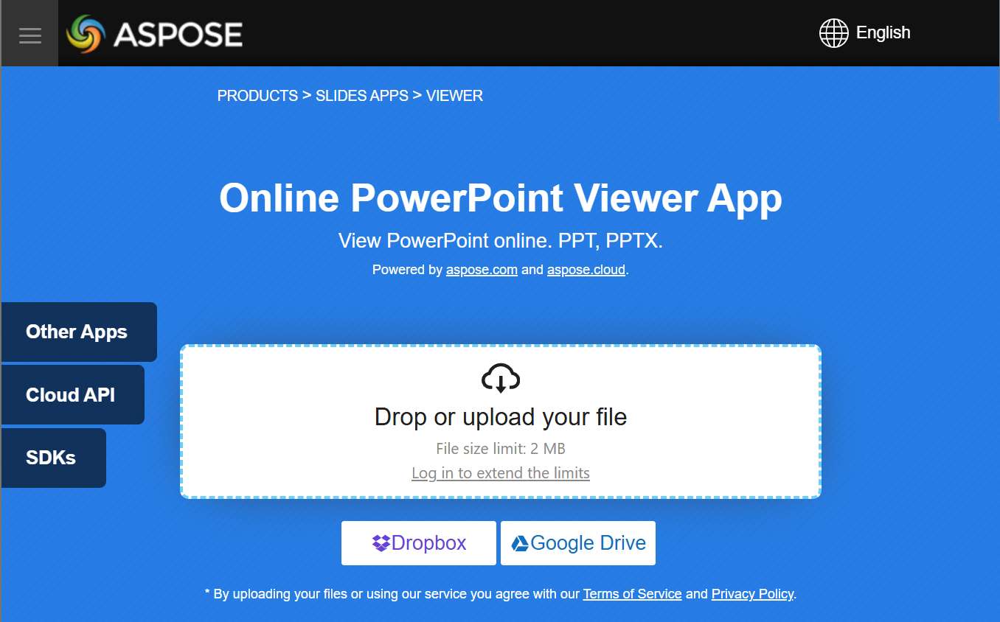

Aspose.Slides for PHP via Java is used to create presentation files with slides. These slides can be viewed by opening presentations in Microsoft PowerPoint, for example. However, sometimes developers may need to view slides as images in their preferred image viewer or create their own presentation viewer. In such cases, Aspose.Slides allows you to export an individual slide as an image. This article describes how to do it.

## **Generate an SVG Image from a Slide**

To generate an SVG image from a presentation slide with Aspose.Slides, please follow the steps below:

1. Create an instance of the [Presentation](https://reference.aspose.com/slides/php-java/aspose.slides/presentation/) class.
1. Get the slide reference by its index.
1. Open a file stream.
1. Save the slide as an SVG image to the file stream.

```php
$slideIndex = 0;

$presentation = new Presentation("sample.pptx");
$slide = $presentation->getSlides()->get_Item($slideIndex);

$svgStream = new Java("java.io.FileOutputStream", "output.svg");
$slide->writeAsSvg($svgStream);
$svgStream->close();

$presentation->dispose();
```

## **Generate an SVG with a Custom Shape ID**

Aspose.Slides can be used to generate an [SVG](https://docs.fileformat.com/page-description-language/svg/) from a slide with a custom shape ID. To do this, use the `setId` method from [SvgShape](https://reference.aspose.com/slides/php-java/aspose.slides/svgshape/). `CustomSvgShapeFormattingController` can be used to set the shape ID.

```php
class CustomSvgShapeFormattingController {
    private $m_shapeIndex;

    function __construct() {
        $this->m_shapeIndex = 0;
    }

    function __construct($shapeStartIndex) {
        $this->m_shapeIndex = $shapeStartIndex;
    }

    function formatShape($svgShape, $shape) {
        $svgShape->setId(sprintf("shape-%d", $m_shapeIndex++));
    }
}
```
```php
$slideIndex = 0;

$presentation = new Presentation("sample.pptx");
$slide = $presentation->getSlides()->get_Item($slideIndex);

$shapeFormattingController = java_closure(new CustomSvgShapeFormattingController(), null, java("com.aspose.slides.ISvgShapeFormattingController"));

$svgOptions = new SVGOptions();
$svgOptions->setShapeFormattingController($shapeFormattingController);

$svgStream = new Java("java.io.FileOutputStream", "output.svg");
$slide->writeAsSvg($svgStream, $svgOptions);
$svgStream->close();

$presentation->dispose();
```

## **Create a Slide Thumbnail Image**

Aspose.Slides helps you generate thumbnail images of slides. To generate a thumbnail of a slide using Aspose.Slides, please follow the steps below:

1. Create an instance of the [Presentation](https://reference.aspose.com/slides/php-java/aspose.slides/presentation/) class.
1. Get the slide reference by its index.
1. Get the thumbnail image of the referenced slide at a defined scale.
1. Save the thumbnail image in any desired image format.

```php
$slideIndex = 0;
$scaleX = 1.0;
$scaleY = $scaleX;

$presentation = new Presentation("sample.pptx");
$slide = $presentation->getSlides()->get_Item($slideIndex);

$image = $slide->getImage($scaleX, $scaleY);
$image->save("output.jpg", ImageFormat::Jpeg);
$image->dispose();

$presentation->dispose();
```

## **Create a Slide Thumbnail with User Defined Dimensions**

To create a slide thumbnail image with user defined dimensions, please follow the steps below:

1. Create an instance of the [Presentation](https://reference.aspose.com/slides/php-java/aspose.slides/presentation/) class.
1. Get the slide reference by its index.
1. Get the thumbnail image of the referenced slide with the defined dimensions.
1. Save the thumbnail image in any desired image format.

```php
$slideIndex = 0;
$slideSize = new Java("java.awt.Dimension", 1200, 800);

$presentation = new Presentation("sample.pptx");
$slide = $presentation->getSlides()->get_Item($slideIndex);

$image = $slide->getImage($slideSize);
$image->save("output.jpg", ImageFormat::Jpeg);
$image->dispose();

$presentation->dispose();
```

## **Create a Slide Thumbnail with Speaker Notes**

To generate the thumbnail of a slide with speaker notes using Aspose.Slides, please follow the steps below:

1. Create an instance of the [RenderingOptions](https://reference.aspose.com/slides/php-java/aspose.slides/renderingoptions/) class.
1. Use the `RenderingOptions.setSlidesLayoutOptions` method to set the position of speaker notes.
1. Create an instance of the [Presentation](https://reference.aspose.com/slides/php-java/aspose.slides/presentation/) class.
1. Get the slide reference by its index.
1. Get the thumbnail image of the referenced slide with the rendering options.
1. Save the thumbnail image in any desired image format.

```php
$slideIndex = 0;

$layoutingOptions = new NotesCommentsLayoutingOptions();
$layoutingOptions->setNotesPosition(NotesPositions::BottomTruncated);

$renderingOptions = new RenderingOptions();
$renderingOptions->setSlidesLayoutOptions($layoutingOptions);

$presentation = new Presentation("sample.pptx");
$slide = $presentation->getSlides()->get_Item($slideIndex);

$image = $slide->getImage($renderingOptions);
$image->save("output.png", ImageFormat::Png);
$image->dispose();

$presentation->dispose();
```

## **Live Example**

You can try [**Aspose.Slides Viewer**](https://products.aspose.app/slides/viewer/) free app to see what you can implement with Aspose.Slides API:


