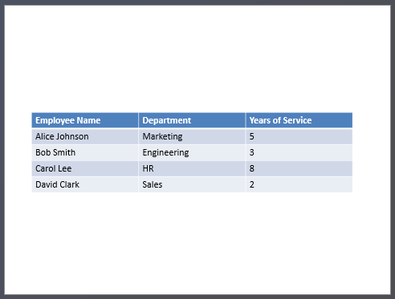

## **Introduction**

PowerPoint presentations are a powerful way to display and communicate information. They are often used in conjunction with Excel workbooks, where Excel serves as an excellent source of structured data and PowerPoint excels at visualizing that data for an audience.

There are many practical scenarios where combining Excel and PowerPoint is essential: mail merges, populating data tables, generating one slide per data record (batch slide generation), creating training materials, and consolidating multiple Excel reports into a single presentation, to name a few.

Until now, implementing such features with the Aspose.Slides API required relying on third-party solutions like Aspose.Cells. While these tools are robust, they can be overly complex and costly for users who only need basic data integration functionality.

## **How It Works**

To make working with Excel data easier and more streamlined, Aspose.Slides has introduced new classes for reading data from Excel workbooks and importing content into a presentation. This feature opens up powerful new possibilities for API users who want to leverage Excel as a data source within their presentation workflows.

The new functionality is designed for general-purpose data access and is not integrated into the Presentation Document Object Model (DOM). That means *it does not allow editing or saving Excel files* — its sole purpose is to open workbooks and navigate through their content to retrieve cell data.

At the core of this feature is the new [ExcelDataWorkbook](https://reference.aspose.com/slides/php-java/aspose.slides/exceldataworkbook/) class. This class allows you to load an Excel workbook from a local file or a stream. Once loaded, it provides several overloads of the [getCell](https://reference.aspose.com/slides/php-java/aspose.slides/exceldataworkbook/#getCell) method, which you can use to retrieve specific cells by their position (e.g., row and column indices or named ranges).

Each call to [getCell](https://reference.aspose.com/slides/php-java/aspose.slides/exceldataworkbook/#getCell) returns an instance of the [ExcelDataCell](https://reference.aspose.com/slides/php-java/aspose.slides/exceldatacell/) class. This object represents a single cell in the Excel workbook and gives you access to its value in a simple and intuitive way.

#### **Import an Excel Chart**

The next step to extend functionality is the [ExcelWorkbookImporter](https://reference.aspose.com/slides/php-java/aspose.slides/excelworkbookimporter/) class. This utility class provides functionality for importing content from an Excel workbook into a presentation. It contains several overloads of the [addChartFromWorkbook](https://reference.aspose.com/slides/php-java/aspose.slides/excelworkbookimporter/#addChartFromWorkbook) method, which help you to retrieve the selected chart from the specified Excel workbook and add it to the end of the given shape collection at the specified coordinates.

In short, it's a lightweight and straightforward API for reading Excel data — exactly what many developers need without the overhead of a full spreadsheet processing library.

## **Let's Code**

### **Mail Merge Scenario Example**

In the following example, we'll implement a simple Mail Merge scenario by generating multiple presentations based on data stored in an Excel workbook.

To get started, we need two things:
1. An Excel workbook containing the data


2.  PowerPoint presentation template


```php
// Load the Excel workbook with employee data.
$workbook = new ExcelDataWorkbook("TemplateData.xlsx");
$worksheetIndex = 0;

// Load the presentation template.
$templatePresentation = new Presentation("PresentationTemplate.pptx");

try {
    // Loop through Excel rows (excluding header at row 0).
    for ($rowIndex = 1; $rowIndex <= 4; $rowIndex++) {

        // Create a new presentation for each employee record.
        $employeePresentation = new Presentation();

        try {
            // Remove the default blank slide.
            $employeePresentation->getSlides()->removeAt(0);

            // Clone the template slide into the new presentation.
            $slide = $employeePresentation->getSlides()->addClone($templatePresentation->getSlides()->get_Item(0));

            // Get paragraphs from the target shape (assumes shape index 1 is used).
            $paragraphs = $slide->getShapes()->get_Item(1)->getTextFrame()->getParagraphs();

            // Replace the placeholders with data from Excel.
            $employeeName = $workbook->getCell($worksheetIndex, $rowIndex, 0)->getValue()->toString();
            $namePortion = $paragraphs->get_Item(0)->getPortions()->get_Item(0);
            $namePortion->setText($namePortion->getText()->replace("{{EmployeeName}}", $employeeName));

            $department = $workbook->getCell($worksheetIndex, $rowIndex, 1)->getValue()->toString();
            $departmentPortion = $paragraphs->get_Item(1)->getPortions()->get_Item(0);
            $departmentPortion->setText($departmentPortion->getText()->replace("{{Department}}", $department));

            $yearsOfService = $workbook->getCell($worksheetIndex, $rowIndex, 2)->getValue()->toString();
            $yearsPortion = $paragraphs->get_Item(2)->getPortions()->get_Item(0);
            $yearsPortion->setText($yearsPortion->getText()->replace("{{YearsOfService}}", $yearsOfService));

            // Save the personalized presentation to a separate file.
            $employeePresentation->save(sprintf("%s Report.pptx", $employeeName), SaveFormat::Pptx);
        } finally {
            $employeePresentation->dispose();
        }
    }
} finally {
    $templatePresentation->dispose();
}
```


### **Excel Table Example**

In the second example, we simply copy data from an Excel table and display it on a PowerPoint slide in a more visually appealing format.

In this example, we reuse the same Excel workbook from the first example, which contains a simple employee table.

```php
// Load the Excel workbook containing the employee data.
$workbook = new ExcelDataWorkbook("TemplateData.xlsx");
$worksheetIndex = 0;

// Create a new PowerPoint presentation.
$presentation = new Presentation();

try {
    // Add a table shape to the first slide.
    $table = $presentation->getSlides()->get_Item(0)->getShapes()->addTable(
            50, 200,
            array(200, 200, 200),
            array(30, 30, 30, 30, 30)
    );

    // Fill the PowerPoint table with data from the Excel workbook.
    for ($rowIndex = 0; $rowIndex < 5; $rowIndex++) {
        for ($columnIndex = 0; $columnIndex < 3; $columnIndex++) {
            $cellValue = $workbook->getCell($worksheetIndex, $rowIndex, $columnIndex)->getValue()->toString();
            $table->getColumns()->get_Item($columnIndex)->get_Item($rowIndex)->getTextFrame()->setText($cellValue);
        }
    }

    // Save the resulting presentation to a file.
    $presentation->save("Table.pptx", SaveFormat::Pptx);
} finally {
    $presentation->dispose();
}
```



### **Import an Excel Chart Example**

In this example, we import a chart from the first worksheet of the Excel workbook used in the previous example. The chart will link to the external workbook in the resulting presentation.

First, we add a Pie chart to the Excel workbook based on the employees table.


```php
// Create a new PowerPoint presentation.
$presentation = new Presentation();
try {
    // Get the shapes collection of the first slide.
    $shapes = $presentation->getSlides()->get_Item(0)->getShapes();

    // Import the chart named "Chart 1" from the first sheet of the workbook and add it to the shapes collection.
    ExcelWorkbookImporter::addChartFromWorkbook($shapes, 10, 10, "TemplateData.xlsx", "Sheet1", "Chart 1", false);

    // Save the resulting presentation to a file.
    $presentation->save("Chart.pptx", SaveFormat::Pptx);
} finally {
    $presentation->dispose();
}
```


### **Import All Excel Charts Example**

Let's imagine you have an Excel workbook full of charts and you need to import them all into a presentation. Each chart should be placed on a new slide.

The following code iterates through all worksheets in the source Excel file, extracts the charts from each worksheet, and adds each chart to a separate slide using a blank slide layout. In the resulting presentation, only the chart data will be embedded, not the entire workbook.

```php
// Load the Excel workbook containing the employee data.
$workbook = new ExcelDataWorkbook("ExcelWithCharts.xlsx");

// Create a new PowerPoint presentation.
$presentation = new Presentation();
try {
    // Retrieve the blank slide layout.
    $blankLayout = $presentation->getLayoutSlides()->getByType(SlideLayoutType::Blank);

    // Get the names of all worksheets contained in the Excel workbook.
    $worksheetNames = $workbook->getWorksheetNames()->iterator();

    while (java_values($worksheetNames->hasNext())) {
        $name = $worksheetNames->next();
        // Retrieve a map that maps chart indexes to chart names for the worksheet.
        $worksheetCharts = $workbook->getChartsFromWorksheet($name)->iterator();

        while (java_values($worksheetCharts->hasNext())) {
            $chart = $worksheetCharts->next();
            // Add a new slide using the blank layout.
            $slide = $presentation->getSlides()->addEmptySlide($blankLayout);

            // Import the specified chart from the Excel workbook into the slide's shapes collection.
            ExcelWorkbookImporter::addChartFromWorkbook(
                    $slide->getShapes(), 10, 10, $workbook, $name, $chart->getKey(), false);
        }
    }

    // Save the resulting presentation to a file.
    $presentation->save("Charts.pptx", SaveFormat::Pptx);
} finally {
    $presentation->dispose();
}
```

## **Summary**

This mechanism, available directly in Aspose.Slides, combines working with Excel data and presentations in one place. It allows you to create slides with visual charts and data presented as Excel tables - without any additional libraries or complex integrations.
