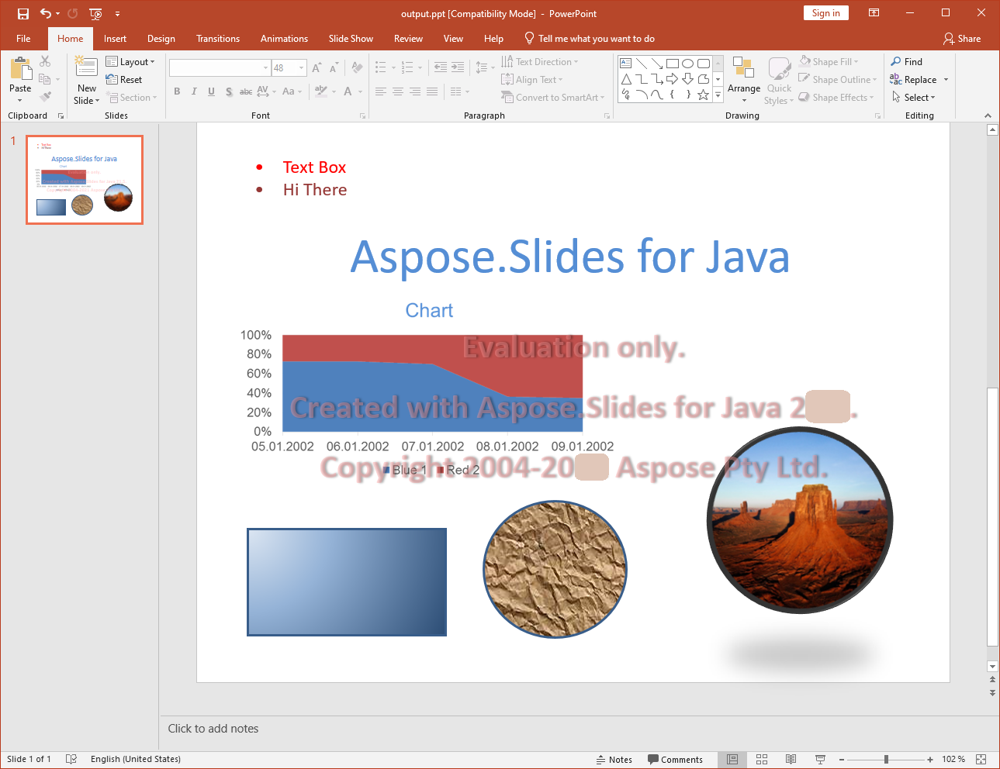

{} 

[PPT](https://en.wikipedia.org/wiki/Microsoft_PowerPoint) is the presentation document file format that can be created, read, manipulated and written by different versions of Microsoft PowerPoint. This is the binary format for presentation documents developed by Microsoft.

{} 

## **PPT in Aspose.Slides for PHP via Java**
Aspose.Slides for PHP via Java can read PPT files created by the software listed below.

- Microsoft PowerPoint 97
- Microsoft PowerPoint 2000
- Microsoft PowerPoint XP
- Microsoft PowerPoint 2003

Similarly, PPT files created by Aspose.Slides for PHP via Java can be read by the above set of software.

## **Comprehensive Support for PPT**
Aspose.Slides for PHP via Java provides support for almost all the features supported by the PPT document file format. It not only covers the basic and advanced features provided by different Microsoft PowerPoint versions for PPT document manipulations, but also features that are not even supported by Microsoft PowerPoint. The main advantage of using the Aspose.Slides for PHP via Java API library is the ease of use for handling such features.

In addition to the basic tasks related to creating, reading and writing PPT document files, there are several features that are provided by Aspose.Slides for PHP via Java:

- Import other Microsoft Office file formats as [OLE objects into PPT documents](/slides/php-java/manage-ole/).
- [Export PPT documents to PDF](/slides/php-java/convert-powerpoint-to-pdf/).
- Export slides in the PPT documents to SVG formats.
- Render slides to any image format supported by the Java Framework.
- Set the size of slides in PPT documents.
- Manage animations on shapes.
- Manage slide shows.
- [Format text on slides](/slides/php-java/text-formatting/).
- Extract text from PPT documents.
- [Handle tables on slides](/slides/php-java/powerpoint-table/).
- Automatically copy masters using [the cloning feature](/slides/php-java/clone-slides/).

**A PPT file generated by Aspose.Slides for PHP via Java and opened in Microsoft PowerPoint**

