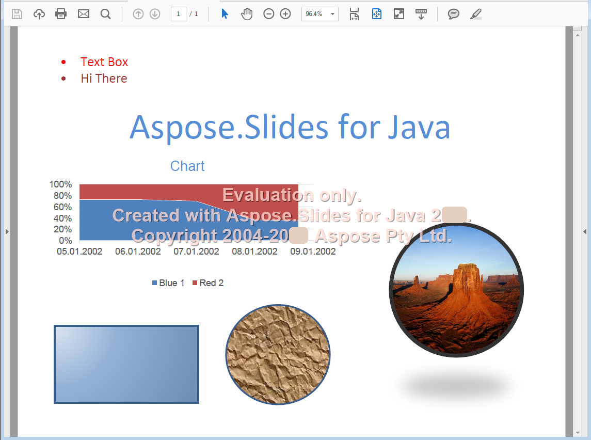

{} 

The [Portable Document Format](https://en.wikipedia.org/wiki/PDF) is a file format created by Adobe Systems for exchanging documents between organizations. The purpose of the format was to keep content and layout the same, regardless of the platform it was viewed on. Aspose.Slides for PHP via Java lets you convert presentation files to PDF.

{} 

## **PDF in Aspose.Slides for PHP via Java**
Any presentation that can be loaded into Aspose.Slides for PHP via Java can be converted to a PDF that conforms to [PDF 1.5](https://en.wikipedia.org/wiki/PDF/A), [PDF/A-1a](https://en.wikipedia.org/wiki/PDF/A), [PDF/A-1b](https://en.wikipedia.org/wiki/PDF/A) or [PDF/UA](https://en.wikipedia.org/wiki/PDF/UA) depending on your choice. Aspose.Slides for PHP via Java exports presentations to PDF and in most cases, the output PDF looks exactly like the original presentation.

Aspose.Slides supports the following presentation features when converting to PDF:

- Images, text boxes and other shapes.
- Text and formatting.
- Paragraphs and formatting.
- Hyperlinks.
- Headers and footers.
- Bullets.
- Tables.

You can export presentations to PDFs directly using Aspose.Slides for PHP via Java: you do not need any other component. Further, you can customize the presentation to PDF export with various options as explained in [Converting to PDF](/slides/php-java/converting-a-presentation/).

**The input presentation** 

**A presentation converted to PDF using Aspose.Slides for PHP via Java**

