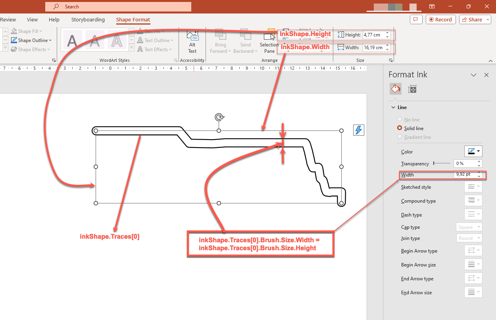

## **Introduction**

PowerPoint provides an ink feature that allows you to draw freeform strokes. Ink can be used to highlight other objects, show connections and processes, and draw attention to specific items on a slide.

Aspose.Slides provides the types needed to work with ink objects. For example, the [Ink](https://reference.aspose.com/slides/python-java/aspose.slides/ink/) class represents an ink object on a slide.

## **Differences between Regular Objects and Ink Objects**

Objects on a PowerPoint slide are typically represented by shape objects. In its simplest form, a shape is a container that defines the area of the object itself (its frame) along with properties such as the container size, shape, and background. For more information, see [Shape Layout Format](/slides/python-java/shape-manipulations/#access-layout-formats-for-shape).

However, when PowerPoint handles an ink object, it ignores all properties of the object frame (container) except its size. The size of the container area is determined by the standard [Shape.getWidth](https://reference.aspose.com/slides/python-java/aspose.slides/shape/#getWidth) and [Shape.getHeight](https://reference.aspose.com/slides/python-java/aspose.slides/shape/#getHeight) methods:


## **Ink Traces**

An ink trace is a basic element used to record the trajectory of a pen as a user writes digital ink. A trace stores a sequence of connected points.

The simplest form of encoding specifies the X and Y coordinates of each sample point. When all connected points are rendered, they produce an image like this:


## **Brush Properties for Drawing**

A brush is used to draw lines that connect the points of an ink trace. The brush has its own color and size, represented by the [InkBrush.getColor](https://reference.aspose.com/slides/python-java/aspose.slides/inkbrush/#getColor) and [InkBrush.getSize](https://reference.aspose.com/slides/python-java/aspose.slides/inkbrush/#getSize) methods.

### **Set Ink Brush Color**

This Python code shows how to set the color of an ink brush:

```python
import jpype
import asposeslides

if not jpype.isJVMStarted():
    jpype.startJVM()

from asposeslides.api import Presentation, Ink

Color = jpype.JClass("java.awt.Color")

presentation = Presentation("pres.pptx")
try:
    slide = presentation.getSlides().get_Item(0)
    ink = slide.getShapes().get_Item(0)
    if isinstance(ink, Ink):
        traces = ink.getTraces()
        if len(traces) > 0:
            brush = traces[0].getBrush()
            brush.setColor(Color.RED)
        else:
            print("The ink object has no traces.")
    else:
        print("The first shape is not an ink object.")
finally:
    presentation.dispose()
```

### **Set Ink Brush Size**

This Python code shows how to set the size of an ink brush:

```python
import jpype
import asposeslides

if not jpype.isJVMStarted():
    jpype.startJVM()

from asposeslides.api import Presentation, Ink

Dimension = jpype.JClass("java.awt.Dimension")

presentation = Presentation("pres.pptx")
try:
    slide = presentation.getSlides().get_Item(0)
    ink = slide.getShapes().get_Item(0)
    if isinstance(ink, Ink):
        traces = ink.getTraces()
        if len(traces) > 0:
            brush = traces[0].getBrush()
            brush_size = Dimension(5, 10)
            brush.setSize(brush_size)
        else:
            print("The ink object has no traces.")
    else:
        print("The first shape is not an ink object.")
finally:
    presentation.dispose()
```

Generally, a brush's width and height do not match, so PowerPoint does not display the brush size (the corresponding data section is grayed out). When the brush width and height match, PowerPoint displays its size this way:


For clarity, let's increase the height of the ink object and review the important dimensions:



The container (frame) does not account for the size of the brushes—it always assumes that the line thickness is zero (see the previous image).

Therefore, to determine the visible area of the entire ink object, the brush size of its traces must be taken into account. Here, the target object (the handwritten text trace) has been scaled to the size of the container (frame). When the size of the container changes, the brush size remains constant, and vice versa.


PowerPoint uses similar behavior for text objects:


## **Control Ink Appearance During Export and Rendering**

Aspose.Slides provides the [InkOptions](https://reference.aspose.com/slides/python-java/aspose.slides/inkoptions/) class to control how ink objects appear in exported or rendered output. You can use its properties to hide ink completely or change how ink brush mask operations are interpreted.

Ink options are available through the export or rendering options for several output types:

| Output | Ink options property |
| --- | --- |
| PDF | [PdfOptions.getInkOptions](https://reference.aspose.com/slides/python-java/aspose.slides/pdfoptions/#getInkOptions) |
| HTML | [HtmlOptions.getInkOptions](https://reference.aspose.com/slides/python-java/aspose.slides/htmloptions/#getInkOptions) |
| SVG | [SVGOptions.getInkOptions](https://reference.aspose.com/slides/python-java/aspose.slides/svgoptions/#getInkOptions) |
| TIFF | [TiffOptions.getInkOptions](https://reference.aspose.com/slides/python-java/aspose.slides/tiffoptions/#getInkOptions) |
| Slide image | [RenderingOptions.getInkOptions](https://reference.aspose.com/slides/python-java/aspose.slides/renderingoptions/#getInkOptions) |

The following [InkOptions](https://reference.aspose.com/slides/python-java/aspose.slides/inkoptions/) methods expose the same two settings:

- [getHideInk](https://reference.aspose.com/slides/python-java/aspose.slides/inkoptions/#getHideInk) determines whether ink objects are included in the output. Its default value is `False`.
- [getInterpretMaskOpAsOpacity](https://reference.aspose.com/slides/python-java/aspose.slides/inkoptions/#getInterpretMaskOpAsOpacity) determines whether a mask operation is interpreted as opacity when rendering an ink brush. Its default value is `True`; call [setInterpretMaskOpAsOpacity](https://reference.aspose.com/slides/python-java/aspose.slides/inkoptions/#setInterpretMaskOpAsOpacity) with `False` to use the ROP operation instead.

### **Hide Ink Objects in PDF Output**

By default, ink objects remain visible during export. To create a clean output without handwritten annotations or other ink content, call [InkOptions.setHideInk](https://reference.aspose.com/slides/python-java/aspose.slides/inkoptions/#setHideInk) with `True`.

The following Python example exports a presentation to PDF while hiding all ink objects:

```python
import jpype
import asposeslides

if not jpype.isJVMStarted():
    jpype.startJVM()

from asposeslides.api import Presentation, PdfOptions, SaveFormat

presentation = Presentation("presentation.pptx")
try:
    pdf_options = PdfOptions()
    pdf_options.getInkOptions().setHideInk(True)

    presentation.save("presentation_without_ink.pdf", SaveFormat.Pdf, pdf_options)
finally:
    presentation.dispose()
```

### **Hide Ink Objects When Rendering a Slide as an Image**

To hide ink objects when rendering slides as bitmap images, configure [RenderingOptions.getInkOptions](https://reference.aspose.com/slides/python-java/aspose.slides/renderingoptions/#getInkOptions) and pass the rendering options to [Slide.getImage](https://reference.aspose.com/slides/python-java/aspose.slides/slide/#getImage).

The following Python example renders the first slide as a PNG image without ink objects:

```python
import jpype
import asposeslides

if not jpype.isJVMStarted():
    jpype.startJVM()

from asposeslides.api import Presentation, RenderingOptions, ImageFormat

presentation = Presentation("presentation.pptx")
try:
    rendering_options = RenderingOptions()
    rendering_options.getInkOptions().setHideInk(True)

    slide = presentation.getSlides().get_Item(0)
    image = slide.getImage(rendering_options)
    try:
        image.save("slide_without_ink.png", ImageFormat.Png)
    finally:
        image.dispose()
finally:
    presentation.dispose()
```

### **Control Ink Mask Rendering**

The [InkOptions.getInterpretMaskOpAsOpacity](https://reference.aspose.com/slides/python-java/aspose.slides/inkoptions/#getInterpretMaskOpAsOpacity) setting controls how mask operations are interpreted when rendering ink brushes. The default value is `True`, which uses opacity. To use the ROP operation instead, call [InkOptions.setInterpretMaskOpAsOpacity](https://reference.aspose.com/slides/python-java/aspose.slides/inkoptions/#setInterpretMaskOpAsOpacity) with `False`.

The following Python example exports a slide to SVG and uses ROP-based rendering for ink mask operations:

```python
import jpype
import asposeslides

if not jpype.isJVMStarted():
    jpype.startJVM()

from asposeslides.api import Presentation, SVGOptions

FileOutputStream = jpype.JClass("java.io.FileOutputStream")

presentation = Presentation("presentation.pptx")
try:
    svg_options = SVGOptions()
    svg_options.getInkOptions().setInterpretMaskOpAsOpacity(False)

    stream = FileOutputStream("slide.svg")
    try:
        slide = presentation.getSlides().get_Item(0)
        slide.writeAsSvg(stream, svg_options)
    finally:
        stream.close()
finally:
    presentation.dispose()
```

The same setting can be applied through [TiffOptions.getInkOptions](https://reference.aspose.com/slides/python-java/aspose.slides/tiffoptions/#getInkOptions) when exporting a presentation or rendering a slide to TIFF.

### **Choose Whether to Hide or Preserve Ink**

When you need a clean version of an annotated presentation for distribution without review marks, call [InkOptions.setHideInk](https://reference.aspose.com/slides/python-java/aspose.slides/inkoptions/#setHideInk) with `True` during export.

Leave [InkOptions.getHideInk](https://reference.aspose.com/slides/python-java/aspose.slides/inkoptions/#getHideInk) at its default value of `False` when ink annotations are part of the intended content, such as review comments, handwritten notes, highlights, or drawings that should remain visible in the exported result. This allows applications to generate separate review and final outputs from the same presentation without modifying the source ink objects.

## **FAQ**

**Can I change the color or size of an existing ink stroke?**

Yes. Get the trace from [Ink.getTraces](https://reference.aspose.com/slides/python-java/aspose.slides/ink/#getTraces), then change its [InkTrace.getBrush](https://reference.aspose.com/slides/python-java/aspose.slides/inktrace/#getBrush). Call [InkBrush.setColor](https://reference.aspose.com/slides/python-java/aspose.slides/inkbrush/#setColor) or [InkBrush.setSize](https://reference.aspose.com/slides/python-java/aspose.slides/inkbrush/#setSize) to change the brush.

**Does hiding ink change the source presentation?**

No. Calling [InkOptions.setHideInk](https://reference.aspose.com/slides/python-java/aspose.slides/inkoptions/#setHideInk) affects only the rendered or exported result; it does not remove or modify ink objects in the source presentation.

**Which export formats support ink options?**

You can configure ink options for PDF, HTML, SVG, TIFF, and bitmap slide images through the corresponding export or rendering options shown above.

**Further reading**

* To read about shapes in general, see the [PowerPoint Shapes](/slides/python-java/powerpoint-shapes/) section.
* For more information on effective values, see [Shape Effective Properties](/slides/python-java/shape-effective-properties/#get-effective-font-height-value).
* For details on PDF export, see [Convert PPT and PPTX to PDF](/slides/python-java/convert-powerpoint-to-pdf/).
* For details on HTML export, see [Convert PowerPoint Presentations to HTML](/slides/python-java/convert-powerpoint-to-html/).
* For details on SVG export, see [Render Presentation Slides as SVG Images](/slides/python-java/render-a-slide-as-an-svg-image/).
* For details on TIFF export, see [Convert PowerPoint Presentations to TIFF](/slides/python-java/convert-powerpoint-to-tiff/).
* For details on slide-to-image rendering, see [Convert Presentation Slides to Images](/slides/python-java/convert-slide/).
